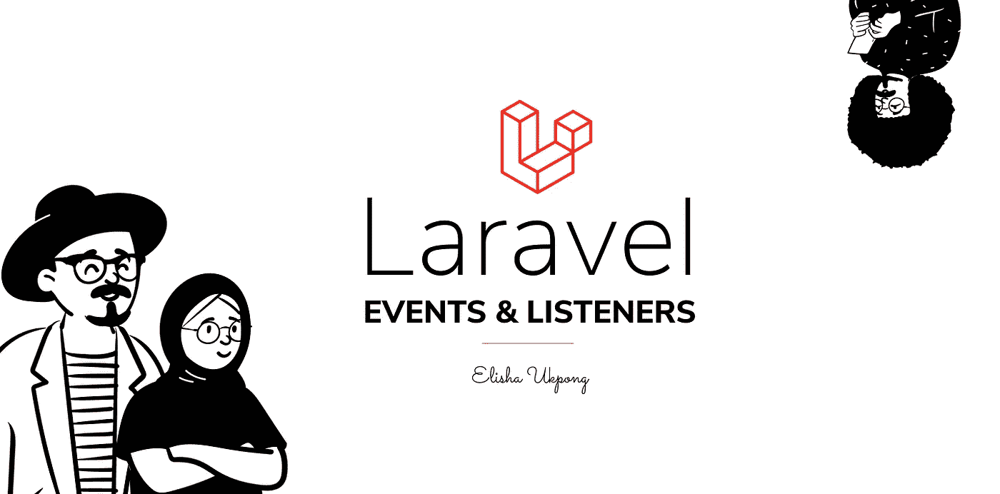

# Laravel 事件和侦听器

> 原文：<https://blog.devgenius.io/laravel-events-and-listeners-5965b5cadcef?source=collection_archive---------1----------------------->



以前，我写过关于 Laravel 观察者的文章，并提到它是我喜欢的 Laravel 框架的一个特性，因为我偶然发现了它。

> 在这里阅读[这里](https://medium.com/@elishaukpongson/introducing-laravel-observers-8f0198c6c9c)

今天，我将阐明 Laravel 框架中另一个我也感兴趣的部分，事件和听众。

事件只是提醒您的应用程序某个动作已经发生的方式，事件可以在您的应用程序、控制器、模型、中间件的任何位置被分派，甚至在刀片文件中(您不应该这样做，但您明白我的意思)。

顾名思义，侦听器侦听应用程序中发生的事件，但它们不只是侦听任何事件，每个侦听器都必须映射到一个事件，然后才能侦听该事件。

对于响应调度事件的侦听器，侦听器类必须映射到特定的事件类。这些映射发生在 EventServiceProvider 类中，该类可以在 *app\Providers* 文件夹中找到。

一个事件可以有多个侦听器映射到它，当调度它时，所有侦听器类将按照它映射的顺序被连续触发。

```
//Default EventServiceProvider Class <?php

namespace App\Providers;

use Illuminate\Auth\Events\Registered;
use Illuminate\Auth\Listeners\SendEmailVerificationNotification;
use Illuminate\Foundation\Support\Providers\EventServiceProvider as ServiceProvider;
use Illuminate\Support\Facades\Event;

class EventServiceProvider extends *ServiceProvider* {
    */**
     * The event listener mappings for the application.
     *
     ** ***@var*** *array
     */* protected $listen = [
        Registered::class => [
            SendEmailVerificationNotification::class,
        ],
    ];

    */**
     * Register any events for your application.
     *
     ** ***@return*** *void
     */* public function boot()
    {
        parent::*boot*();

        //
    }
}
```

# 创建事件和侦听器类

要创建一个事件类，使用***make:event***artisan 命令:

> php 工匠制作:事件

该命令将在应用程序的 *app\Events* 文件夹中创建一个新类，这就是创建事件类所需的全部内容。

要创建一个监听器类，使用***make:listener***artisan 命令:

> php artisan make:listener

与事件创建中一样，该命令将在应用程序的 *app\Listeners* 文件夹中创建一个新类，这就是创建侦听器类所需的全部内容。

创建事件和侦听器的另一种方法，甚至可以说比前面提到的方法更简单，就是在 EventServiceProvider 类中注册事件和侦听器，然后运行:

> php artisan 事件:生成

该命令将扫描 EventServiceProvider 类，并根据注册生成缺少的事件和侦听器。

您可能已经在想如何注册一个事件并将一个侦听器映射到它，是吗？为此，请遵循以下模式:

```
*//Event Service Provider Class**/**
 * The event listener mappings for the application.
 *
 ** ***@var*** *array
 */* protected $listen = [
    'Event Class' => [
        'Listener Class',
        'Another Listener Class',
        'Yet Another Listener Class',
    ],
];
```

就像我前面说过的，您可以将多个侦听器映射到一个特定的事件，它将按照它们被映射的顺序被连续处理。

# 调度事件

在撰写本文时，我知道有两种方法可以分派您的事件并触发侦听器:

*   event(new event class())；
*   event class::dispatch()；

> 如果您的事件使用了`*Illuminate\Foundation\Events\Dispatchable*`特征，您可以在事件上调用静态的`*dispatch*`方法。传递给`*dispatch*`方法的任何参数都将被传递给事件的构造函数。

您应该注意到，在事件类中声明的**公共**属性可以在映射到它的监听器类中访问。

```
//Registered Event using in register controller.<?php

namespace Illuminate\Auth\Events;

use Illuminate\Queue\SerializesModels;

class Registered
{
    use SerializesModels;

    */**
     * The authenticated user.
     *
     ** ***@var*** *\Illuminate\Contracts\Auth\Authenticatable
     */* public $user;

    */**
     * Create a new event instance.
     *
     ** ***@param*** *\Illuminate\Contracts\Auth\Authenticatable  $user
     ** ***@return*** *void
     */* public function __construct($user)
    {
        $this->user = $user;
    }
}
```

```
<?php

namespace App\Listeners;

use Illuminate\Contracts\Queue\ShouldQueue;
use Illuminate\Queue\InteractsWithQueue;

class RegisteredListener
{
    */**
     * Create the event listener.
     *
     ** ***@return*** *void
     */* public function __construct()
    {
        //
    }

    */**
     * Handle the event.
     *
     ** ***@param*** *object  $event
     ** ***@return*** *void
     */* public function handle($event)
    {
        $event->user 
        //this will have the content of the user property from the             event class
    }
}
```

# 用例

事件和侦听器的一个非常简单的用例是 Laravel 框架上的默认用户创建流。

对于许多应用程序来说，在用户创建后可能会有许多进程，在控制器方法中包含所有这些逻辑，可能不仅仅是聚集控制器方法，而是在用户注册我的应用程序后，我想采取的每个额外的进程。

我将不得不回到那个方法，做一些违背 S.O.L.I.D 原则的打开/关闭和单一责任原则的编辑，事件和监听器来拯救。

> **什么是 S.O.L.I.D 原则？**
> 
> 南 O.L.I.D 是一个首字母缩写词，代表面向对象编程和代码设计的五个原则，由我们敬爱的 Bob 叔叔(Robert C. Martin)在 2000 年提出理论。作者 Michael Feathers 创造了这个缩写词:
> 
> **【S】**单一责任原则
> **【O】**笔/闭原则
> **【L】**伊斯科夫替代原则
> **【I】**界面分离原则
> **【D】**依赖倒置原则
> 
> **单一责任原则(SRP)** —一个类应该有且只有一个改变的理由。
> 
> 打开/关闭原则(OCP) —你应该能够扩展一个类的行为，而不用修改它。
> 
> 节选自:[https://medium . com/@ mari _ aze vedo/s-o-l-I-d-principles-what-them-and-why-projects-should-use-them-50 b 85 E4 aa 8 b 6](https://medium.com/@mari_azevedo/s-o-l-i-d-principles-what-are-they-and-why-projects-should-use-them-50b85e4aa8b6)

在默认的 Register 控制器上，您会看到使用了一个名为 RegisterUsers 的特性，它包含了用户创建的大部分逻辑。在特征内部，有一个注册方法，这将是我们所关心的。

```
*/**
 * Handle a registration request for the application.
 *
 ** ***@param*** *\Illuminate\Http\Request  $request
 ** ***@return*** *\Illuminate\Http\Response
 */* public function register(Request $request)
{
    $this->validator($request->all())->validate();

    **event(new Registered($user = $this->create($request->all())));**

    $this->guard()->login($user);

    if ($response = $this->registered($request, $user)) {
        return $response;
    }

    return $request->wantsJson()
                ? new Response('', 201)
                : redirect($this->redirectPath());
}
```

在上面的代码片段中，请注意加粗的代码行，这将调度一个名为 Registered 的事件，每次用户在您的应用程序上注册时，都可以通过创建一个侦听器类并将其映射到 EventServiceProvider 中的事件来侦听。

假设我正在构建一个学生门户，当学生注册后，我必须:

*   给学生分配一个班级
*   给学生分配班级中的一个座位
*   给学生分配一个实验搭档
*   给学生发一张借书证，这样的例子不胜枚举。

一种典型的方法是将所有逻辑转储到寄存器控制器方法中，如下所示:

```
*/**
 * Handle a registration request for the application.
 *
 ** ***@param*** *\Illuminate\Http\Request  $request
 ** ***@return*** *\Illuminate\Http\Response
 */* public function register(Request $request)
{
    $this->validator($request->all())->validate();

    event(new Registered($user = $this->create($request->all()))); //Assign the student a class
   //Assign the student a seat in the class
   //Assign the student a lab partner
   //Assign the student a library card
   //more $this->guard()->login($user);

    if ($response = $this->registered($request, $user)) {
        return $response;
    }

    return $request->wantsJson()
                ? new Response('', 201)
                : redirect($this->redirectPath());
}
```

虽然这可能行得通，但它打破了前面提到的不止一个原则。解决这个问题的一种方法是创建侦听器，并将其映射到注册的事件。

```
*//Event Service Provider Class**/**
 * The event listener mappings for the application.
 *
 ** ***@var*** *array
 */* protected $listen = [
    Registered::class => [
        AssignClassToStudent::class,
        AssignSeatToStudent::class,
        AssignLabPartnerToStudent::class,
        AssignLibraryCardToStudent::class,
    ],
];
```

有了我们的提供者提供的上述内容， *php artisan event:generate* 命令将在 *app\Listener* 文件夹中生成 4 个监听器类，但是为了简洁起见，我将继续使用一个类 assignClassToStudent 监听器

```
<?php

namespace App\Listeners;

use Illuminate\Contracts\Queue\ShouldQueue;
use Illuminate\Queue\InteractsWithQueue;

class assignClassToStudent
{
    */**
     * Create the event listener.
     *
     ** ***@return*** *void
     */* public function __construct()
    {
        //
    }

    */**
     * Handle the event.
     *
     ** ***@param*** *object  $event
     ** ***@return*** *void
     */* public function handle($event)
    {
        $event->user->assignClassToStudentLogic();
    }
}
```

遵循这种模式意味着，如果在用户注册后有更多的逻辑要做，您不需要编辑 register 方法，您只需要启动一个新的侦听器并将其映射到事件。这样，register 方法只处理学生注册，其他侦听器处理其他职责。

结束了。

喜欢吗？拍手和朋友分享。

在推特上关注我:https://twitter.com/drumzminister