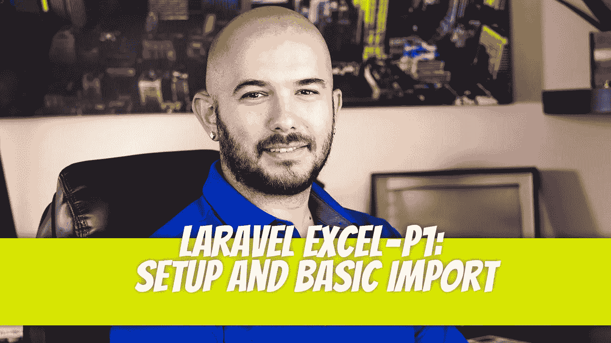
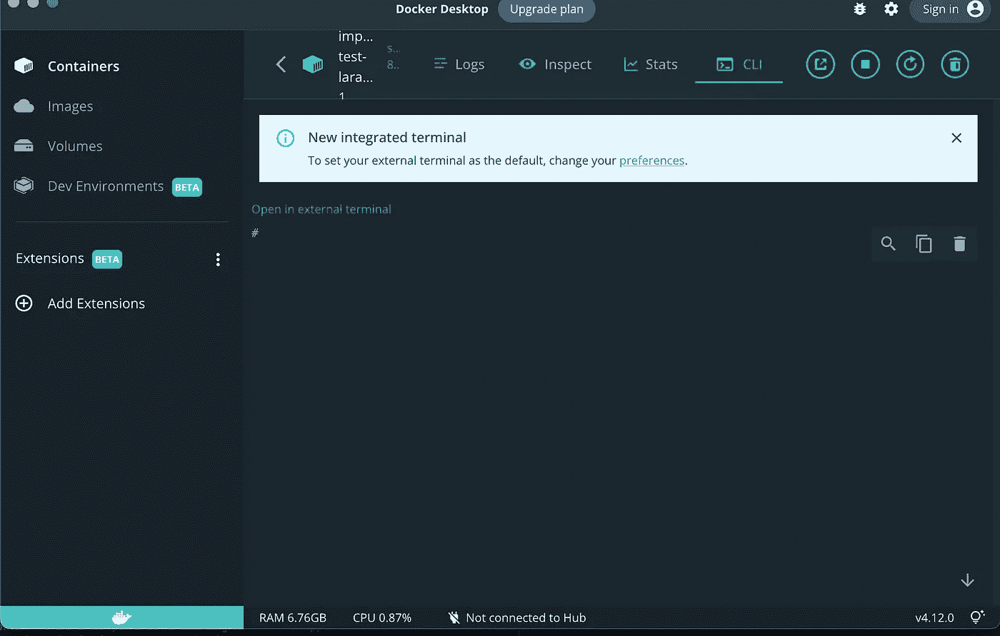
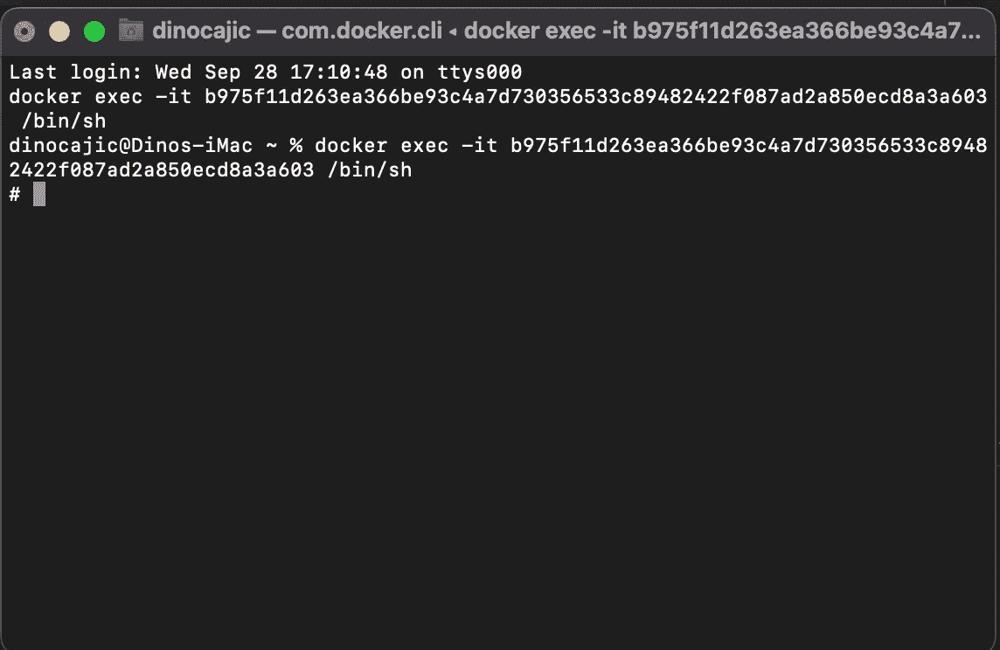

# laravel-Excel-P1:设置和基本导入

> 原文：<https://blog.devgenius.io/laravel-excel-p1-setup-and-basic-import-1b3ddf9d9b8c?source=collection_archive---------3----------------------->



在本文中，我们将讨论可以在[laravel-excel.com](https://laravel-excel.com)上找到的 [laravel-excel](https://github.com/maatwebsite/Laravel-Excel) 包。这是大多数开发人员面临的任务。如何将 excel 表格或 CSV 文件导入数据库？如果你有很多供应商，每个供应商都为你提供一种特定的格式，那该怎么办？这就是数据导入器的亮点。

# 手动导入 Excel 文件

这永远是一种选择。你知道数据库结构是什么样子的。您确切地知道表中有哪些列，哪些数据类型是必需的，只要您有这种数据类型格式，就可以轻松地导入新的表数据。值得庆幸的是，我们有技术，我们可以在相对较短的时间内旋转爬虫，让我们远离这个重复的过程。

# 使用 PHP 将 Excel 文件导入数据库

这是另一种选择。打开一个文件并逐行读取条目也是一种选择，但是我们想要更复杂的东西。当我们可以得到一个已经为我们提供了功能的包时，为什么还要重新创建功能呢？这就是 Laravel Excel 的闪光点。有人已经经历了创建所有我们可以利用的功能的麻烦。

# 设置您的 Laravel 项目

如果你正在阅读这篇文章，我相信你知道如何创建一个 Laravel 项目，但是如果你不知道，请仔细阅读官方文档，如果你使用的是 Mac，请运行下面的命令。

```
curl -s "https://laravel.build/your-app-name" | bash
```

我们将拥有的另一个先决条件是，我们将使用 Docker 做任何事情。

运行您的迁移，因为这将自动创建我们的`users`表，我们将使用它作为示例的一部分。

```
php artisan migrate
```

# 设置 Laravel Excel

一旦你运行了 Laravel，进入你的 Laravel 容器。如果您正在使用 Docker，只需打开您的容器，单击应用程序名称(在我的例子中是 import-laravel-test.test ),然后单击 Cli 按钮。



你可以随时点击“在外部终端打开”链接，打开原生终端应用，我个人还是比较喜欢的。



一旦进入，就应该运行下面一行代码来安装 laravel-excel 包。

```
composer require maatwebsite/excel
```

您可能会得到以下错误:

```
PHP Fatal error:  Declaration of Maatwebsite\Excel\Cache\MemoryCache::get($key, $default = null) must be compatible with Psr\SimpleCache\CacheInterface::get(string $key, mixed $default = null): mixed in /var/www/html/vendor/maatwebsite/excel/src/Cache/MemoryCache.php on line 62**Symfony\Component\ErrorHandler\Error\FatalError****Declaration of Maatwebsite\Excel\Cache\MemoryCache::get($key, $default = null) must be compatible with Psr\SimpleCache\CacheInterface::get(string $key, mixed $default = null): mixed**at vendor/maatwebsite/excel/src/Cache/MemoryCache.php:6258▕59▕ */***60▕ *     * {@inheritdoc}*61▕ *     */***➜ * 62***▕ **public function get($key, $default = null)**63▕ **    {**64▕ **        if ($this->has($key)) {**65▕ **            return $this->cache[$key];**66▕ **        }**
```

如果你这样做了，打开你的`composer.json`文件并添加修改后的`php`版本到:

```
"require": {
    "php": "^7.3 || ^8.0",
    "guzzlehttp/guzzle": "^7.2",
    "laravel/framework": "^9.19",
    "laravel/sanctum": "^3.0",
    "laravel/tinker": "^2.7",
    "maatwebsite/excel": "^3.1"
},
```

修改后你需要运行`composer update`。

就是这样。已经安装好了。

# 创建您的第一个进口商

运行以下命令创建您的第一个导入程序:

```
php artisan make:import UsersImport --model=User
```

这个命令将在`app/Imports/UsersImport.php`中创建你的`UsersImport`类。

## 模拟数据

在我们开始修改这段代码之前，让我们看看将要导入的 excel 表。将`MOCK_DATA.csv`放到你的`public`文件夹中。

这些数据是在[https://www.mockaroo.com/](https://www.mockaroo.com/)产生的。这是假数据。

## 用户模型

我们还需要知道我们将要导入数据的`users`表是什么样子的。每一行将被视为一个数据数组。如果我们将第一行看作一个数组，我们将得到如下结果:

```
$row = [
    'Patrick',
    'Spinnace',
    'pspinnace0@nsw.gov.au',
    'xGH4RNx',
];
```

让我们看看我们的`users`迁移，看看我们得到了什么。

我们的`User`模型将以下字段定义为`fillable`。

```
protected $fillable = [
    'name',
    'email',
    'password',
];
```

## UsersImport

我们现在可以对`UsersImport`进行修改，以便导入这些数据。我们尚未定义 CSV 文件的导入位置；我们接下来会这么做。

下面的代码说明了什么？

*   我们将接受一行数据。
*   查看我们的$row 数组，我们知道`$row[0] = first_name`、`$row[1] = last_name`、`$row[2] = email`和`$row[3] = password`。
*   我们创建一个`new User`并传递给它`name`、`email`和`password`字段。这将数据插入到`users`表中。

太好了。我们有骨气。但是这个`$row`从何而来？我们需要创建一个`route`来触发这个导入，并创建一个`Controller`来获取 CSV 文件。

## 用户控制器

`UserController`还不存在，所以让我们创建它。

```
php artisan make:controller UserController
```

接下来，我们将创建我们的`import`函数。

当`import`方法被调用时，`Excel`类调用它的`import`方法，我们给它传递两个参数:

*   我们想要使用的导入器类，
*   以及我们正在使用的文件的位置。

我们的`MOCK_DATA.csv`位于`public/MOCK_DATA.csv`。

`Excel::import`方法会将每一行传递给我们的`UsersImport`类，以便对其进行处理。一旦整个事情完成，我们可以重定向用户到一个成功的消息。

剩下的就是创建一条路线，这样我们就可以调用我们的`UserController::import`方法。

## 定义路线

```
Route::get('/import-users', [UserController::class, 'import']);
```

仅此而已。导航到您的浏览器并观察导入过程。

# 检查导入的数据

通过进入您的`mysql`容器并执行以下命令来检查导入的数据。

```
sh-4.4# mysql -u sail -p password
sh-4.4# USE laravel;
sh-4.4# SELECT * FROM users;
```

您可能已经注意到，导入的第一行是我们的标题。我们需要移除它，但是怎么做呢？使用 Laravel-Excel 非常简单。

# 从导入中删除第一行

我们需要使用`WithHeadingRow`关注点，将整数索引值改为基于键的值。

这意味着`WithHeadingRow`创建了下面的`$row`数组:

```
$row = [
    first_name => 'Patrick',
    last_name  => 'Spinnace',
    email      => 'pspinnace0@nsw.gov.au',
    password   => 'xGH4RNx',
];
```

如果您现在查看您的 users 表，您会看到第一行不见了。

[](https://github.com/dinocajic/package-laravel-excel) [## GitHub-dinocajic/package-Laravel-Excel:显示了 Laravel Excel 的示例功能

### Laravel 是一个 web 应用程序框架，具有丰富、优雅的语法。我们相信发展必须是令人愉快的…

github.com](https://github.com/dinocajic/package-laravel-excel) 

迪诺·卡希奇目前是 [LSBio(寿命生物科学公司)](https://www.lsbio.com/)、[绝对抗体](https://absoluteantibody.com/)、 [Kerafast](https://www.kerafast.com/) 、[珠穆朗玛生物科技](https://everestbiotech.com/)、[北欧 MUbio](https://www.nordicmubio.com/) 和 [Exalpha](https://www.exalpha.com/) 的 IT 负责人。他还担任我的自动系统的首席执行官。他有十多年的软件工程经验。他拥有计算机科学学士学位，辅修生物学。他的背景包括创建企业级电子商务应用程序、执行基于研究的软件开发，以及通过写作促进知识的传播。

你可以在 [LinkedIn](https://www.linkedin.com/in/dinocajic/) 上联系他，在 [Instagram](https://instagram.com/think.dino) 上关注他，或者[订阅他的媒体出版物](https://dinocajic.medium.com/subscribe)。

阅读 Dino Cajic(以及 Medium 上成千上万的其他作家)的每一个故事。你的会员费直接支持迪诺·卡吉克和你阅读的其他作家。你也可以在媒体上看到所有的故事。