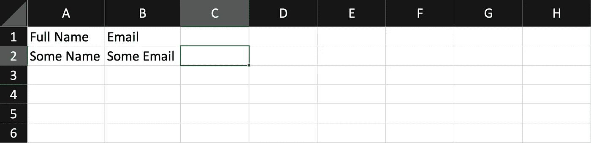
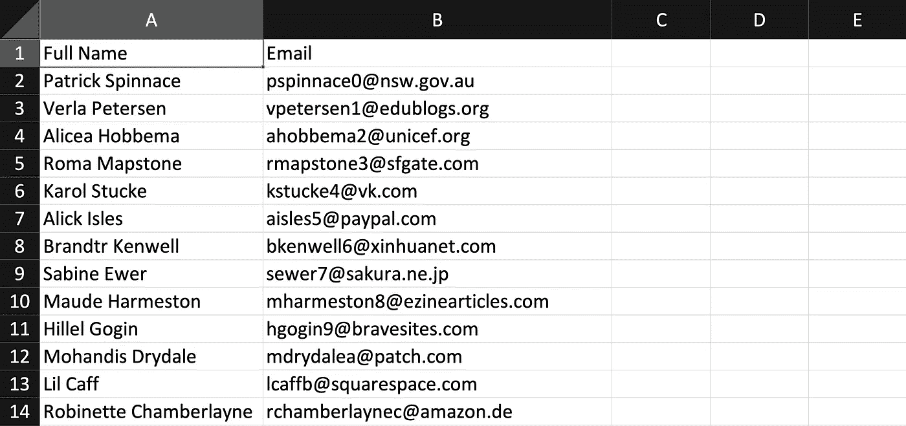
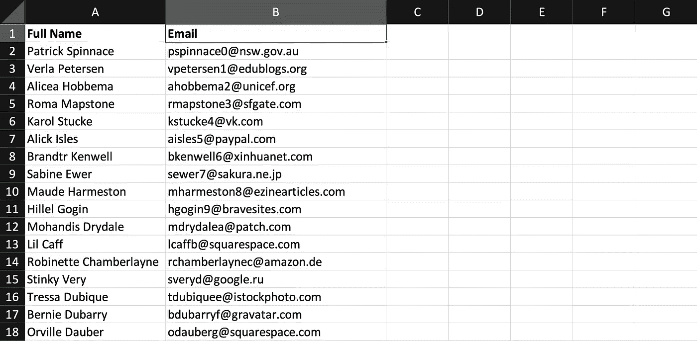

# Laravel-Excel — P10:从视图导出

> 原文：<https://blog.devgenius.io/laravel-excel-p10-export-from-view-7fca03cc0d4?source=collection_archive---------1----------------------->


我们讨论了将项目从数据库表导出到工作表，但是我们还没有真正讨论如何定制工作表。

[](https://dinocajic.medium.com/laravel-excel-p9-exports-bff04e5c2c14) [## P9:出口

### 我认为在前 8 篇文章中，我们已经很好地了解了进口。是时候切换到导出数据了…

dinocajic.medium.com](https://dinocajic.medium.com/laravel-excel-p9-exports-bff04e5c2c14) 

我们想做的是创建一种独特的方式来显示内容，甚至可能注入一些没有存储在数据库中的项目。这涉及到在 Laravel 中使用刀片组件。

一步一步来。首先，我们需要创建我们的出口商。

```
php artisan make:export ViewExporter --model=User
```

这是该命令生成的内容。

但是我们需要实现`FromView`，而不是实现`FromCollection`。`FromView`问题需要`view`方法。它会返回一个`View`。

接下来，我们需要一个视图。创建视图的方式与您通常创建视图的方式完全相同。我将在`views`下一个名为`exports`的子目录中创建一个名为`users.blade.php`的视图。

```
project_name/resources/views/exports/users.blade.php
```

在视图内部，我们需要一个`table`。该表将被转换成我们的 Excel 表中的数据。将标题数据添加到表格的`thead`组件中。细胞数据将进入我们的`tbody`。

要调用`view`，将下面的代码片段添加到您的导出器中:

```
return view('exports.users');
```

我们只需要创建一个对我们的`ViewExporter`的调用来启动下载。

我们得到的结果如下。



要获得实际的用户数据来显示，我们只需使用我们的 Laravel 知识并将`User`数据作为参数传递给视图。然后，我们可以使用 blade 指令遍历数据。

再次调用路由会产生以下文件。



如果我们用`strong`标签包装我们的头会怎么样？

我们有粗体标题。



享受这个实验的乐趣。


迪诺·卡伊奇目前是 [LSBio(生命周期生物科学公司)](https://www.lsbio.com/)、[绝对抗体](https://absoluteantibody.com/)、 [Kerafast](https://www.kerafast.com/) 、[珠穆朗玛生物](https://everestbiotech.com/)、[北欧 MUbio](https://www.nordicmubio.com/) 和 [Exalpha](https://www.exalpha.com/) 的 IT 主管。他还担任我的自动系统的首席执行官。他有十多年的软件工程经验。他拥有计算机科学学士学位，辅修生物学。他的背景包括创建企业级电子商务应用程序、执行基于研究的软件开发，以及通过写作促进知识的传播。

你可以在 [LinkedIn](https://www.linkedin.com/in/dinocajic/) 上联系他，在 [Instagram](https://instagram.com/think.dino) 上关注他，或者[订阅他的媒体出版物](https://dinocajic.medium.com/subscribe)。

[*阅读迪诺·卡吉克(以及媒体上成千上万其他作家)的每一个故事。你的会员费直接支持迪诺·卡吉克和你阅读的其他作家。你也可以在媒体上看到所有的故事。*](https://dinocajic.medium.com/membership)