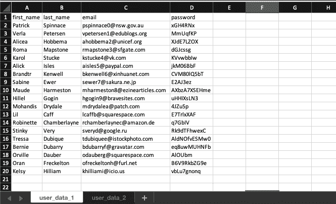
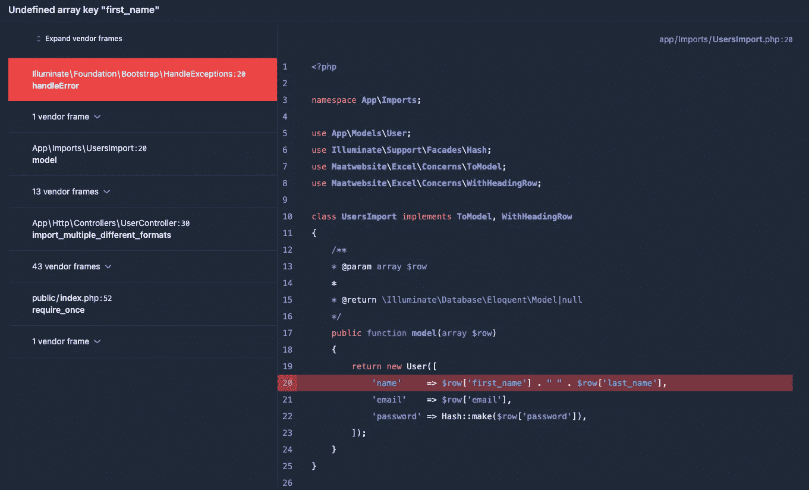

# P2:导入多张工作表基础知识

> 原文：<https://blog.devgenius.io/laravel-excel-p2-importing-multiple-sheets-basics-2d20994770b?source=collection_archive---------4----------------------->


Excel 表将自动用 Laravel-Excel 导入。板材`1`至`N`的处理方式与板材`0`完全相同。我们可以指定如何处理多个工作表，我们将在本文中这样做。

[](/laravel-excel-p1-setup-and-basic-import-1b3ddf9d9b8c) [## laravel-Excel-P1:设置和基本导入

### 在本文中，我们将讨论 laravel-excel.com 上的 laravel-excel 包。这是一项任务…

blog.devgenius.io](/laravel-excel-p1-setup-and-basic-import-1b3ddf9d9b8c) 

# 导入多张格式相同的表单

我们将使用上一篇文章中的用户模拟数据，并创建几个 excel 表来存储用户数据。我们现在有`user_data_1`和`user_data_2`床单。每个工作表都存储完全相同类型的数据，都有标题(`first_name`、`last_name`、`email`、`password`)和 19 行用户数据。`MOCK_DATA.xlsx`文件放在我们的`public`目录中。



我们将使用 laravel-excel 命令创建导入程序:

```
php artisan make:import MultiSheetSingleFormatImport --model=User
```

我们现在需要我们的控制器。我们在上一篇文章中制作了控制器，所以我们将继续使用我们的`UserController`并添加我们的方法，以便它可以调用我们的`MultiSheetSingleFormatImport`导入器。

我们现在只需要我们的路线，我们就可以开始测试了。

打开浏览器，输入路线，让我们看看结果。

我们得到了我们期待的结果。Laravel-Excel 从第一个工作表中读取数据并导入 19 行。自从我们添加了`WithHeadingRow`关注点后，它跳过了第一行。一旦完成导入，它就转到下一个工作表。它再次假设第一行是标题，并从 sheet 2 中读取 19 行。

# 导入多张不同格式的表单

如果每个工作表都有不同的格式会怎样？例如，假设工作表 1 有以下标题:

```
first_name | last_name | email | password
```

表 2 的格式略有不同

```
email | password | first_name | last_name | phone_number | dob
```

我们的进口商还能工作吗？答案是……是的！我们的导入器正在使用`WithHeadingRow`关注点，所以它知道从哪一列选择数据。

如果工作表 2 在标题中有不同的名称会怎样？

```
email_address | pass | name_first | name_last
```

尝试运行导入，您会看到您得到一个错误。



由于标题行的命名不同，我们需要指定如何处理每张工作表。我们需要创建三个不同的导入。第一个导入只是在两个表之间进行选择并调用适当的导入器，另外两个导入器将处理每一个表。让我们现在就创建这三个。

```
php artisan make:import MultiSheetSelector
php artisan make:import FirstSheetImporter --model=User
php artisan make:import SecondSheetImporter --model=User
```

让我们先配置我们的`FirstSheetImporter`和`SecondSheetImporter`。

注意，我们为`$row`指定了不同的键来匹配每张表的标题。

接下来，我们需要实现我们的多表选择器。Laravel-Excel 要求`WithMultipleSheets`关注点与`sheets()`方法一起实现。

`sheets()`方法返回一个导入器数组。顺序很重要。我们知道`FirstSheetImporter`链接到第一个 Excel 表，而`SecondSheetImporter`链接到第二个 Excel 表。

我们也可以删除`collection()`方法和`ToCollection`关注点，因为我们不会用这个类处理任何东西。它只是在两种进口商品中进行选择。

我们只需要向我们的`UserController`添加一个方法，并创建一个调用该方法的路由，我们就可以开始测试了。

考验和成功的时刻到了。我们能够导入具有不同标题的两个工作表。您可以想象，如果工作表 2 需要一些额外的清理，这可以在`SecondSheetImporter`中完成。

# 明确说明要导入哪些工作表

有各种各样的可能性，其中之一是，有几个表，你想导入，但其他人，你不想导入。假设我们的 Excel 文档中有 5 张工作表。

*   `user_data_1`
*   `user_data_1_salary`
*   `user_data_2`
*   `user_data_2_salary`
*   `salary_totals`

我们只想从`user_data_1`和`user_data_2`工作表中提取数据。但是，如果我们使用现有的导入器，它将尝试从`user_data_1`和`user_data_1_salary`导入数据。

我们需要指定的唯一修改是使用哪些工作表。这可以通过纸张编号或纸张名称来完成。编号系统从`0`开始。

如果需要，我们也可以使用工作表名称，用工作表名称替换索引。

[](https://github.com/dinocajic/package-laravel-excel) [## GitHub-dinocajic/package-Laravel-Excel:显示了 Laravel Excel 的示例功能

### Laravel 是一个 web 应用程序框架，具有丰富、优雅的语法。我们相信发展必须是令人愉快的…

github.com](https://github.com/dinocajic/package-laravel-excel) 

迪诺·卡伊奇目前是 [LSBio(生命周期生物科学公司)](https://www.lsbio.com/)、[绝对抗体](https://absoluteantibody.com/)、 [Kerafast](https://www.kerafast.com/) 、[珠穆朗玛生物](https://everestbiotech.com/)、[北欧 MUbio](https://www.nordicmubio.com/) 和 [Exalpha](https://www.exalpha.com/) 的 IT 主管。他还担任我的自动系统的首席执行官。他有十多年的软件工程经验。他拥有计算机科学学士学位，辅修生物学。他的背景包括创建企业级电子商务应用程序、执行基于研究的软件开发，以及通过写作促进知识的传播。

你可以在 [LinkedIn](https://www.linkedin.com/in/dinocajic/) 上联系他，在 [Instagram](https://instagram.com/think.dino) 上关注他，或者[订阅他的媒体出版物](https://dinocajic.medium.com/subscribe)。

[*阅读迪诺·卡吉克(以及媒体上成千上万其他作家)的每一个故事。你的会员费直接支持迪诺·卡吉克和你阅读的其他作家。你也可以在媒体上看到所有的故事。*](https://dinocajic.medium.com/membership)