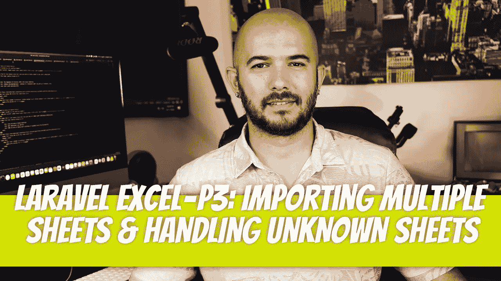
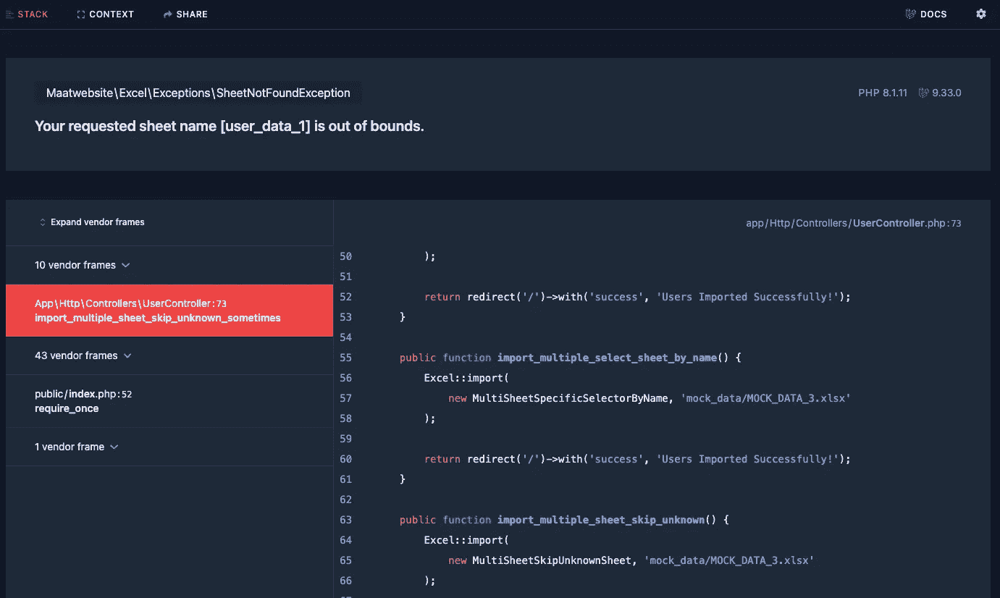

# P3:导入多个工作表并处理未知的已定义工作表

> 原文：<https://blog.devgenius.io/laravel-excel-p3-importing-multiple-sheets-and-handling-unknown-defined-sheets-749dbc1ec089?source=collection_archive---------10----------------------->



理想情况下，您会收到格式正确的 Excel 表，创建导入脚本是小菜一碟，但什么时候会这样呢？你总是有怪癖，你必须想出办法来处理这些怪癖。幸运的是，Laravel-Excel 已经想到了相当多的这些怪癖，并提供了处理它们的好方法。这是多页基础的延续。

[](/laravel-excel-p2-importing-multiple-sheets-basics-2d20994770b) [## P2:导入多张工作表基础知识

### Excel 表将自动用 Laravel-Excel 导入。第 1 页到第 N 页将以完全相同的方式处理…

blog.devgenius.io](/laravel-excel-p2-importing-multiple-sheets-basics-2d20994770b) 

# 跳过未知工作表

当您收到一个包含多个工作表的 Excel 工作簿时，您可能会为每个工作表设计导入功能，但是如果您需要知道其中一个工作表何时丢失，该怎么办呢？您是希望整个导入崩溃，还是希望更优雅地处理它，而只是得到一个通知，说您期望的工作表不在那里？

Laravel-Excel 具有`SkipsUnknownSheets`关注点，允许您实现`onUnknownSheet`方法。将`$sheetName`传递给该方法，以便您可以记录它。

对于本例，我们的工作簿将包含以下工作表。

*   `user_data_1`
*   `user_data_2`

我们的进口商将认识到这些，并能够进口它们。

为了实现已定义但缺失的表的日志功能，我们需要实现`SkipsUnknownSheets`关注点。

在本例中，我们定义了一个`user_data_3`工作表，但是在我们的工作簿中，我们没有列出它。我们的`onUnknownSheet`方法将识别并记录该错误。让我们创建我们的路由并向我们的`UserController`类添加一个方法，然后运行导入并检查`app/storage/logs/laravel.log`中的日志文件。

在我们调用该路由后，我们记录了以下错误，这是我们所期望的，因为我们的 Excel 工作簿不包含 user_data_3 表。

```
[2022-10-03 20:08:21] *local.ERROR*: Sheet user_data_3 was skipped from import.
```

# 跳过特定的工作表，让其他工作表不及格

如果有些床单比其他的更重要呢？换句话说，您希望在某些表失败时停止代码执行，并静默处理其他不太重要的表。Laravel-Excel 再次覆盖了您。

在前面的例子中，我们在多表选择器类上实现了`SkipsUnknownSheets`关注点，但是这次我们将在一个特定的导入上实现它。

我们将创建一个新的多页选择器。这一次，它不会有`SkipsUnknownSheets`的顾虑。

我们还需要创建我们的`ThirdSheetImporter`类。这个进口商会有`SkipsUnknownSheets`顾虑。而`FirstSheetImporter`和`SecondSheetImporter`不会。

如果我们现在运行此代码，并且`user_data_1`或`user_data_2`页丢失，代码将会中断。如果`user_data_3`丢失，Laravel-Excel 将用`onUnknownSheet`方法处理它并记录到文件中。是时候在我们的`UserController`中创建新的路线、方法和测试了。

如果我们省略`user_data_3`，我们会得到同样的错误消息。

```
[2022-10-03 20:44:31] *local.ERROR*: Sheet user_data_3 was skipped from import.
```

如果`user_data_1`丢失，我们抛出`out of bounds`异常。



迪诺·卡希奇目前是 [LSBio(寿命生物科学公司)](https://www.lsbio.com/)、[绝对抗体](https://absoluteantibody.com/)、 [Kerafast](https://www.kerafast.com/) 、[珠穆朗玛生物科技](https://everestbiotech.com/)、[北欧 MUbio](https://www.nordicmubio.com/) 和 [Exalpha](https://www.exalpha.com/) 的 IT 主管。他还担任我的自动系统的首席执行官。他有十多年的软件工程经验。他拥有计算机科学学士学位，辅修生物学。他的背景包括创建企业级电子商务应用程序、执行基于研究的软件开发，以及通过写作促进知识的传播。

你可以在 [LinkedIn](https://www.linkedin.com/in/dinocajic/) 上联系他，在 [Instagram](https://instagram.com/think.dino) 上关注他，或者[订阅他的媒体刊物](https://dinocajic.medium.com/subscribe)。

阅读 Dino Cajic(以及 Medium 上成千上万的其他作家)的每一个故事。你的会员费直接支持迪诺·卡吉克和你阅读的其他作家。你也可以在媒体上看到所有的故事。