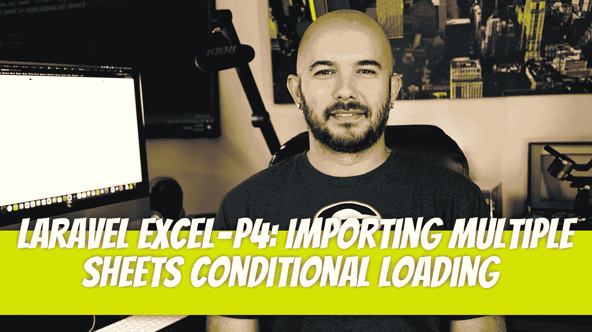

# laravel-Excel-P4:导入多张工作表条件加载

> 原文：<https://blog.devgenius.io/laravel-excel-p4-importing-multiple-sheets-conditional-loading-d70db3ae1409?source=collection_archive---------4----------------------->



使用 Laravel Excel 可以解决多个工作表导入的一些问题。如果创建者改变了格式，你当然就没那么幸运了，你必须修改你的代码。然而，还有一些事情可能有助于理解，比如:

*   创建特定的导入，但只使用其中的一部分
*   以及理解如何处理公式

我们将在本文中讨论有条件的工作表加载，在下一篇文章中讨论处理公式。

[](/laravel-excel-p3-importing-multiple-sheets-and-handling-unknown-defined-sheets-749dbc1ec089) [## P3:导入多个工作表并处理未知的已定义工作表

### 理想情况下，您会收到格式正确的 Excel 表格，这对于创建您的导入来说是小菜一碟…

blog.devgenius.io](/laravel-excel-p3-importing-multiple-sheets-and-handling-unknown-defined-sheets-749dbc1ec089) 

# 使用特定进口商

您可能有一个 excel 工作表，其中包含多个需要导入的工作表。因此，您需要花费必要的时间来编写导入每个工作表所需的代码。一切似乎都很好。但是，当数据只在一张表上发生变化时，会发生什么情况呢？您仍然想要导入所有其他工作表还是只导入那张工作表？这能做到吗？是的，它可以。

首先，让我们回顾一下定义所有表的导入的导入器。

该进口商希望装载三种不同的纸张，`user_data_1`、`user_data_2`和`user_data_3`。

如果只在`user_data_1`上有变化，我们可以指定只使用那个。我们的代码需要做一些修改。首先，我们需要在我们的进口商中使用`WithConditionalSheets`特征。接下来，我们需要用所需的`conditionalSheets()`方法替换我们的`sheets()`方法。

让我们创建我们的路由，并将方法添加到我们的`UserController`中，以便调用进口商。

如果您一直在关注前面的文章，您会注意到`Excel::import`方法的第一个参数有所不同。我们需要指定我们这次只使用特定的表。在这个例子中，我们声明我们只希望传递`user_data_1`工作表，但是我们也可以像这样指定多个工作表:`->onlySheets('user_data_1', 'user_data_2')`。

此外，您可以像这样编写以下示例:

```
$import = new MultiSheetSelectSpecificSheet();
$import->onlySheets('user_data_1');Excel::import($import, 'mock_data/MOCK_DATA_3.xlsx');
```

我这边一切顺利。希望你的电脑也一切正常。

[](https://github.com/dinocajic/package-laravel-excel) [## GitHub-dinocajic/package-Laravel-Excel:显示了 Laravel Excel 的示例功能

### Laravel 是一个 web 应用程序框架，具有丰富、优雅的语法。我们相信发展必须是令人愉快的…

github.com](https://github.com/dinocajic/package-laravel-excel) 

迪诺·卡伊奇目前是 [LSBio(生命周期生物科学公司)](https://www.lsbio.com/)、[绝对抗体](https://absoluteantibody.com/)、 [Kerafast](https://www.kerafast.com/) 、[珠穆朗玛生物](https://everestbiotech.com/)、[北欧 MUbio](https://www.nordicmubio.com/) 和 [Exalpha](https://www.exalpha.com/) 的 IT 主管。他还担任我的自动系统的首席执行官。他有十多年的软件工程经验。他拥有计算机科学学士学位，辅修生物学。他的背景包括创建企业级电子商务应用程序、执行基于研究的软件开发，以及通过写作促进知识的传播。

你可以在 [LinkedIn](https://www.linkedin.com/in/dinocajic/) 上联系他，在 [Instagram](https://instagram.com/think.dino) 上关注他，或者[订阅他的媒体出版物](https://dinocajic.medium.com/subscribe)。

[*阅读迪诺·卡吉克(以及媒体上成千上万其他作家)的每一个故事。你的会员费直接支持迪诺·卡吉克和你阅读的其他作家。你也可以在媒体上看到所有的故事。*](https://dinocajic.medium.com/membership)