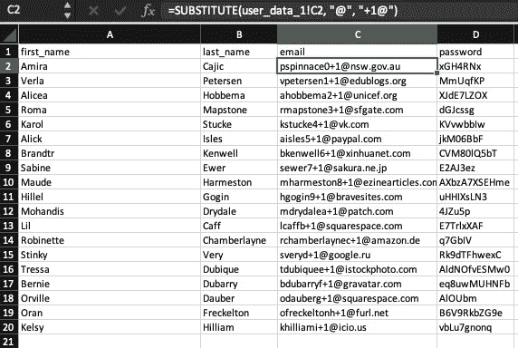
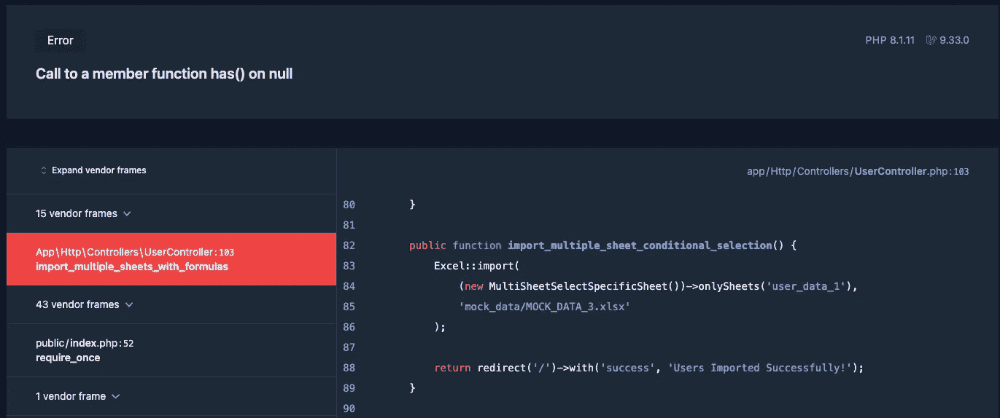

# Laravel-Excel — P5:导入带有公式的工作表

> 原文：<https://blog.devgenius.io/laravel-excel-p5-importing-sheets-with-formulas-4016dcc68862?source=collection_archive---------3----------------------->


关于导入 excel 表格，最后要注意的一点是，公式的行为通常不符合您的预期。如果您开始收到错误，请查看 excel 表格本身，并找出其中是否隐藏了任何公式。

[](https://dinocajic.medium.com/laravel-excel-p4-importing-multiple-sheets-conditional-loading-d70db3ae1409) [## laravel-Excel-P4:导入多张工作表条件加载

### 使用 Laravel Excel 可以解决多个工作表导入的一些问题。如果创作者改变了…

dinocajic.medium.com](https://dinocajic.medium.com/laravel-excel-p4-importing-multiple-sheets-conditional-loading-d70db3ae1409) 

让我们来看一个例子，其中一个公式引用了正在导入的工作表中的数据。

# 进口单上的公式

我们将看到的 excel 表格包含以下几列

*   `first_name`
*   `last_name`
*   `email`
*   `password`
*   `full_name`

前四列包含静态数据，但最后一列由第一列和第二列组合生成:`=A2&” “&B2`。

让我们创建一个导入，看看这是什么样子。

我们的`User`模型需要一个名称，我们将用它来传递我们的`full_name`公式字段，而不是`$row['first_name'] . " " . $row['last_name']`。

我们还需要在我们的`UserController`中添加一个方法，并创建一个能够调用这个导入程序的路由。

如果您查看您的`users`表，您会看到类似这样的内容

```
{
    "id":1,
    "name":"=A2&\"\"&B2",
    "email":"pspinnace0@nsw.gov.au",
    "email_verified_at":null,
    "created_at":"2022-10-05T23:17:08.000000Z",
    "updated_at":"2022-10-05T23:17:08.000000Z"
}
```

该名称包含公式，而不是实际名称。那我们怎么解决呢？与`WithCalculatedFormulas`有关。

再次运行代码，您应该会得到想要的结果。

```
{
    "id":1,
    "name":"Frank Jackson",
    "email":"pspinnace0@nsw.gov.au",
    "email_verified_at":null,
    "created_at":"2022-10-05T23:22:03.000000Z",
    "updated_at":"2022-10-05T23:22:03.000000Z"
}
```

当您导入多个工作表，而公式来自另一个工作表时，会发生什么情况？让我们看看我们是否能让它工作。

# 另一张纸上的公式

对于这个例子，我们将有一个包含两个工作表的 excel 文档。它们都有相同的标题:

*   `first_name`
*   `last_name`
*   `email`
*   `password`


用户数据 1

我们的第二个工作表`user_data_2`，将是`user_data_1`的一个副本，但是将为所有电子邮件添加一个+1，使它们变得独一无二。即`dino@gmail.com`现在将是`dino+1@gmail.com`。我们将在`user_data_2`的 Excel 文档中使用的公式是`=SUBSTITUTE(user_data_1!C3, “@”, “+1@”)`。



*我为什么选择这个公式？因为我不想创建另一个表，这似乎是用我们已经定义的 users 表来说明导入的最快方法。继续前进。*

我们需要首先创建我们的多表导入器，它可以导入每一张表。

接下来，我们来看看`FirstSheetWithNoFormulaImporter`长什么样。记住，这个导入器将导入`user_data_1`，它不包含任何公式。然而，其他工作表引用了它，所以我们需要添加一个`HasReferencesToOtherSheets`关注点来明确地向 Laravel Excel 声明其他工作表将引用它。

我们的第二个进口商，`SecondSheetWithFormulaImporter`，在`user_data_2`有一个新的 email 字段的公式。我们只需要实现`WithCalculatedFormulas`关注点，Laravel Excel 将知道如何处理其余的。

剩下的就是在我们的`UserController`和路线中创建我们的方法，然后我们就可以准备测试了。

我们得到的结果是:

```
{
    "id":39,
    "name":"Frank Jackson",
    "email":"pspinnace0@nsw.gov.au",
    "email_verified_at":null,
    "created_at":"2022-10-05T23:52:27.000000Z",
    "updated_at":"2022-10-05T23:52:27.000000Z"
},...,{
    "id":58,
    "name":"Frank Jackson",
    "email":"pspinnace0+1@nsw.gov.au",
    "email_verified_at":null,
    "created_at":"2022-10-05T23:52:28.000000Z",
    "updated_at":"2022-10-05T23:52:28.000000Z"
},...
```

我们期待的结果！如果我们忘记实现`HasReferenceToOtherSheets`关注点怎么办？嗯，它坏了。



幸运的是，我们知道为了避免这个问题我们必须实现什么。

我想我已经正式结束了对多工作表工作簿中各种不同情况的讨论。让我们在下一篇文章中继续讨论 Laravel Excel 中其他一些令人兴奋的特性。


迪诺·卡希奇目前是 [LSBio(寿命生物科学公司)](https://www.lsbio.com/)、[绝对抗体](https://absoluteantibody.com/)、 [Kerafast](https://www.kerafast.com/) 、[珠穆朗玛生物科技](https://everestbiotech.com/)、[北欧 MUbio](https://www.nordicmubio.com/) 和[艾阿尔法](https://www.exalpha.com/)的 IT 主管。他还担任我的自动系统的首席执行官。他有十多年的软件工程经验。他拥有计算机科学学士学位，辅修生物学。他的背景包括创建企业级电子商务应用程序、执行基于研究的软件开发，以及通过写作促进知识的传播。

你可以在 [LinkedIn](https://www.linkedin.com/in/dinocajic/) 上联系他，在 [Instagram](https://instagram.com/think.dino) 上关注他，或者[订阅他的媒体出版物](https://dinocajic.medium.com/subscribe)。

阅读迪诺·卡吉克(以及媒体上成千上万的其他作家)的每一个故事。你的会员费直接支持迪诺·卡吉克和你阅读的其他作家。你也可以在媒体上看到所有的故事。