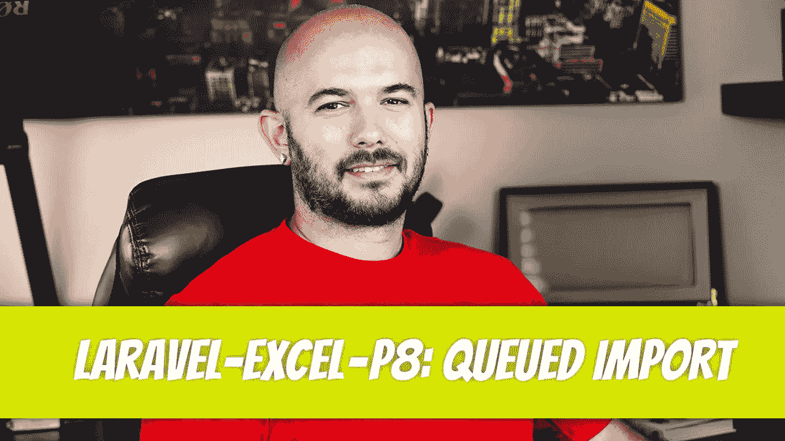

# Laravel-Excel — P8:排队导入

> 原文：<https://blog.devgenius.io/laravel-excel-p8-queued-import-7d8e6aac2e8f?source=collection_archive---------3----------------------->



是时候把这一切整合在一起了。我们在之前的文章基础上慢慢提高了速度。通过批量插入，我们可以批量插入 100 行(尽管您可以选择任意数量)。通过块读取，我们消除了将整个 excel 表加载到内存中的内存问题，取而代之的是加载 100 行数据(尽管我们可以根据需要增加或减少这个数字)。

但是还有一个问题。如果文件太大以至于 PHP 超时了怎么办？如何导入一个需要 5 分钟才能导入的文件？即使 PHP 没有超时，您希望让用户在导入运行时等待吗？当然不是。这就是排队进口的亮点。

# 如何用队列导入？

首先要注意的是，排队导入只适用于块读取。这意味着`WithChunkReading`关注点必须存在。在导入中实现了块读取之后，剩下的惟一需要实现的是`ShouldQueue`。有这么简单吗？是的。

让我们创建我们的`UserController`方法，并添加我们的路线和测试。我会稍微破坏它，它不会马上工作，除非你有一些运行。

让我们调用路线，看看会发生什么。嗯，成功了。导入成功，但它没有被发送到队列并在后台执行。到目前为止，它只是像其他东西一样输入。您可以看到，在导入完成之前，用户被锁定在屏幕上。

## 为什么队列导入不起作用？

如果它不起作用，那是因为你配置 Laravel 的方式。打开您的`.env`文件，您会注意到`QUEUE_CONNECTION`被设置为`sync`。我们需要准备 Laravel 来使用队列。让我们修改它，以便我们可以使用队列。运行以下命令:

```
php artisan queue:table
```

这将生成`jobs`迁移，其中将插入作业。

```
php artisan migrate
```

创建`jobs`表。剩下的就是将`QUEUE_CONNECTION`修改为`database`并清除配置。打开您的`.env`文件，将`QUEUE_CONNECTION`从`sync`更改为`database`。

```
QUEUE_CONNECTION=database
```

最后清除配置缓存。

```
php artisan config:clear
```

让我们再次尝试我们的例子。你觉得这会有用吗？

嗯，这次快得像闪电一样。看起来好像创造了工作，但什么也没发生。进口在哪里？最后一步。我们需要确保我们的队列在工作。

```
php artisan queue:work
```

酷！当每个数据块完成时，我们甚至可以看到一个很棒的数据块消息显示，以及队列导入它花了多长时间。

```
2022-10-08 18:10:58 Maatwebsite\Excel\Jobs\QueueImport ....................... 39.51ms DONE2022-10-08 18:10:58 Maatwebsite\Excel\Jobs\ReadChunk ....................... 989.82ms DONE2022-10-08 18:10:59 Maatwebsite\Excel\Jobs\ReadChunk ....................... 916.27ms DONE2022-10-08 18:11:00 Maatwebsite\Excel\Jobs\ReadChunk ....................... 920.93ms DONE2022-10-08 18:11:01 Maatwebsite\Excel\Jobs\ReadChunk ....................... 920.62ms DONE2022-10-08 18:11:02 Maatwebsite\Excel\Jobs\ReadChunk ....................... 914.32ms DONE2022-10-08 18:11:03 Maatwebsite\Excel\Jobs\AfterImportJob ....................... 4.14ms DONE
```

# 显式声明队列导入

当在实现了`ShouldQueue`关注的情况下调用`Excel::import`时，队列被隐式调用。如果你想表达清楚，你可以用`Excel::queueImport()`。无论哪种方式，总是需要`ShouldQueue`关注。

# 修改排队导入

如果您尝试修改排队导入类内部的细节，您会注意到这些更改并没有反映出来。每次修改导入时，您都需要重新启动队列。


Dino Cajic 目前是 [Absolute Biotech](https://www.absolutebiotech.com/) 的 IT 主管，该公司是 [LSBio(寿命生物科学公司)](https://www.lsbio.com/)、 [Absolute 抗体](https://absoluteantibody.com/)、 [Kerafast](https://www.kerafast.com/) 、 [Everest BioTech](https://everestbiotech.com/) 、 [Nordic MUbio](https://www.nordicmubio.com/) 和 [Exalpha](https://www.exalpha.com/) 的母公司。他还担任我的自动系统的首席执行官。他有十多年的软件工程经验。他拥有计算机科学学士学位，辅修生物学。他的背景包括创建企业级电子商务应用程序、执行基于研究的软件开发，以及通过写作促进知识的传播。

你可以在 [LinkedIn](https://www.linkedin.com/in/dinocajic/) 上联系他，在 [Instagram](https://instagram.com/think.dino) 上关注他，或者[订阅他的媒体出版物](https://dinocajic.medium.com/subscribe)。

阅读 Dino Cajic(以及 Medium 上成千上万的其他作家)的每一个故事。你的会员费直接支持迪诺·卡吉克和你阅读的其他作家。你也可以在媒体上看到所有的故事。