# Windows 10 上的 Laravel 家园

> 原文：<https://blog.devgenius.io/laravel-homestead-on-windows-10-348062f07848?source=collection_archive---------0----------------------->

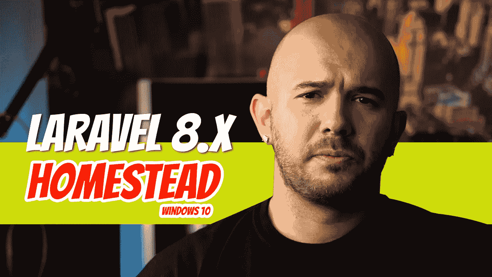

有时会感觉文档在这里或那里跳过了一些步骤。其他时候，文档可能会让人感到不知所措。让我们来揭开这个过程的神秘面纱。

要实现的目标:

*   家园介绍
*   在 Windows 10 上为您的所有网站设置家园
*   创建一个 Laravel 8 应用程序
*   SSH 进入 Homestead 并创建一个数据库
*   迁移数据库表
*   验证一切正常:能够在*域中输入。在我们的浏览器中测试*。

## 家园介绍

当然，第一步是查阅 Laravel 文档。我们将在本文中始终遵循它，这样，如果将来文档中有什么变化，您可以发现它并适应它。另外，如果你注意到了变化，请告诉我，我会相应地更新内容。

 [## 拉勒维尔家园

### Laravel 努力使整个 PHP 开发体验令人愉快，包括您的本地开发环境…

laravel.com](https://laravel.com/docs/8.x/homestead) 

在第二段中，文档声明“Laravel Homestead 是一个官方的、预打包的流浪者盒子，它为您提供了一个极好的开发环境，而不需要您在本地机器上安装 PHP、web 服务器和任何其他服务器软件。”

好酷。什么是流浪？

流浪者只是一个帮助开发者为你的应用创建可预测的开发环境的工具。如果你熟悉 Docker，和那个差不多。Docker 使用容器，而 vagger 使用虚拟机。虚拟机模拟整个操作系统，而容器依赖于主机操作系统。

**简而言之，游民是一个帮助创建和维护虚拟机的工具。作为一名软件开发人员，你需要维护一个浮动文件。*嗯，在家园你不是，因为家园为你管理流浪档案。*一旦必要的属性被设置到了 travel 文件中，你就可以使用*travel up*命令来启动带有 travel 属性的虚拟机。**

好了，现在我们明白了什么是流浪，让我们继续家园。当文件说家园只是一个“预先包装好的流浪者盒子”时，现在应该更有意义了。预包装的流浪者盒子带有:

*   Nginx 网络服务器
*   服务器端编程语言（Professional Hypertext Preprocessor 的缩写）
*   关系型数据库
*   设计者
*   节点/国家预防机制

这意味着你不需要像 XAMPP 或 WAMP 这样的软件就能拥有一个带有 PHP/MySQL 的网络服务器；您可以从您的虚拟机完成这一切。您甚至可以在虚拟机中创建新的 Laravel 项目，并将它们同步到本地机器上。很酷的东西，我们稍后会探讨。

在文档中，这里列出了所有已安装的软件和一些可以安装的可选软件。

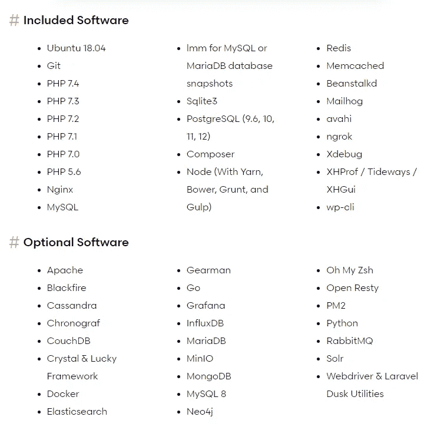

## 现有项目的设置

既然你已经有了介绍，让我们进入实际的设置过程。

1.下载并安装最新版本的 [VirtualBox](https://www.virtualbox.org/wiki/Downloads) 。在 VirtualBox 6.1.xx 平台软件包下，单击 Windows 主机开始下载。运行默认设置，然后可以进入下一步。

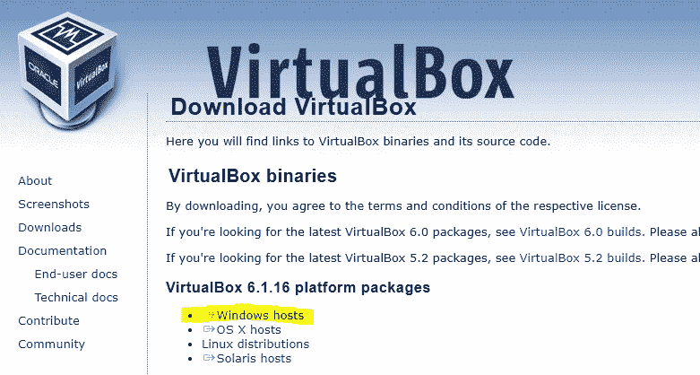

2.安装[游动阀](https://www.vagrantup.com/downloads.html)。该页面应该会自动选择您的操作系统，因此单击下载按钮，按照提示运行，并且应该会安装 travang。

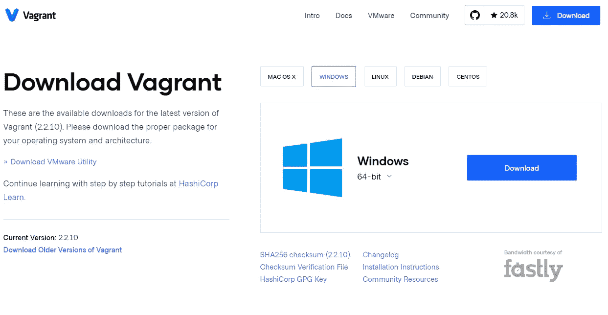

3.通过打开 CMD 或 Git Bash 并键入以下命令来验证是否安装了 vagger:

```
vagrant --version
```

如果你拿回了一个版本号，那就说明流浪者已经安装成功了。

4.既然您已经验证了 VirtualBox 和 vagger 都已安装，那么是时候“将 laravel/homestead 框添加到您的 vagger 安装中了。”

```
vagrant box add laravel/homestead
```

5.是时候安装家园了。您可以通过将 Homestead 克隆到您的主目录中来做到这一点。您可以将它添加到任何地方，但是 Laravel 建议您将它添加到您的主目录(C:/users/your-user-name ),因为它可以作为所有 Laravel 项目的中心位置。为此，请使用 Git Bash，因为它会自动将~/Homestead 转换到您的主目录。如果你没有使用过 Git Bash，它允许你在你的 Windows 机器上发出 Linux 命令:比如 ***ls*** 来查看你的目录中的文件/文件夹。

```
git clone https://github.com/laravel/homestead.git ~/Homestead
```

6.导航到新安装的 Homestead 文件夹:

```
*cd C:/Users/your-user-name/Homestead*
```

或者用 Git 痛击:`*cd ~/Homestead*`

7.文档说明您应该检查最新版本，因为*主*分支可能不总是稳定的。

```
cd ~/Homestead

git checkout release
```

8.是时候创建 *Homestead.yaml* 文件了，您将使用该文件将本地文件映射到虚拟机。在 Homestead 目录中，使用 Git Bash 运行:

```
bash init.sh
```

如果你跟着文档走，你可能已经注意到，对于 Windows，你应该运行`init.bat`；因为我们使用 Git Bash，它模拟 Linux 终端，所以您需要运行 Bash 命令。对于 CMD，运行`./init.bat`。

9.用 IDE(比如 VS 代码)打开 *Homestead.yaml* 文件。

最上面，为你的家园流浪箱设置了 *IP 地址*。如果你碰巧运行在同一个网络上，你总是可以改变它。*内存分配*表示你想让你的流浪者盒子使用多少内存，而 *CPU 的*表示应该分配的 CPU 数量。

因为我们使用的是 virtualbox，所以应该将*提供者*设置为 *virtualbox* 。

接下来，列出*授权*和*键*部分。这些是访问该虚拟机的 SSH 密钥。它们可以被注释掉，或者我们可以生成它们并将它们添加到指定的文件夹(~/)。ssh)。

10.这一步是可选的，但我们还是要做。要创建 ssh 密钥，在 Git Bash 中运行以下命令:

```
ssh-keygen -t rsa -C "you@homestead"
```

它将提示您指定生成密钥的位置。只需按下*回车*将他们添加到您的主目录(C:/Users/your-user-name/)中。ssh)。密码短语也是如此。只需按下*回车*将其留空即可。

11.沿着 *Homestead.yaml* 文件往下，下一节指定了映射。我们将把系统中的代码映射到家园环境中的代码。

假设您在 Documents 文件夹中创建了所有的项目。为了这个例子，我在我的*C:\ Users \ dinoc \ Documents*文件夹中有一个名为 *laravel-excel* 的 Laravel 项目。

我将把 Homestead 文件修改为*map:C:\ Users \ dinoc \ Documents*到我希望它出现在我的 Homestead 环境中的位置。属性“ ***”到“*** 显示了代码应该住在哪里。所以，我将它修改为指向*/home/vagger/laravel-excel*。Homestead 环境中的 laravel-excel 文件夹只是我现在定义的一个文件夹。你想怎么叫都行；我通常坚持将其命名为我的项目名称。您的文件夹需要映射到您的家园环境中的*/home/vagger*文件夹。

12.现在映射已经完成，Homestead 知道如何在本地机器上访问您的代码，是时候创建一个测试域了。这是您能够进入浏览器并让它运行您的应用程序的域。你再也不用做`php artisan serve`和访问 *localhost:8080* 了。

因此，我们将再次做一些映射。在我的例子中，我将把 *laravel-excel.test* 映射到我的代码中的 public 文件夹。这个 *laravel-excel* 项目位于我的家园环境中的*/home/vagger/laravel-excel*目录下。包含*index.php*文件的公共文件夹，就是那个文件夹的子目录。记住，在上一步中，我们将本地文件夹映射到 Homestead 环境目录。从技术上讲，Homestead 环境包含该项目的所有文件和文件夹。它包含的一个文件夹是 */public* ， *laravel-excel/public* 文件夹包含*index.php*。

我不认为这应该是令人困惑的，但如果是，这里有更多的解释。如果你曾经在你的机器上运行过 WAMP 或 XAMPP，并且你想在你的浏览器中访问你的 Laravel 应用程序，你可以做两件不同的事情:你可以使用`php artisan serve`启动一个 PHP 服务器，并且访问 *localhost: 8080* ，或者你可以通过进入公共文件夹 http://*localhost/Laravel-excel/public*来访问它。技术上来说这就是你在这里做的。

我们已经完成了 Homestead.yaml 文件。

13.我们刚刚创建的域 *laravel-excel.test* 必须添加到您的 Windows 机器上的 *hosts* 文件中。以管理员身份打开记事本(右键单击记事本，然后单击“以管理员身份运行”)。

打开主机文件:C:\ Windows \ System32 \ drivers \ etc \ hosts

如果你之前没有修改过，应该是这样的:

添加新行并添加您的域。第一部分是 IP 地址，列在 Homestead.yaml 文件(192.168.10.10)的顶部，第二部分是您刚刚指定的域名， *laravel-excel.test.*

保存并退出记事本。

14.确保您的 *Homestead.yaml* 文件已保存。现在应该是这样的:

验证您仍然在 Git Bash 的 *~/Homestead* 目录中。是时候启动虚拟机了。从 *~/Homestead* 目录中，运行:

```
vagrant up
```

15.一旦 Homestead 完成了它的工作，您就可以通过键入以下内容来访问虚拟机:

```
vagrant ssh
```

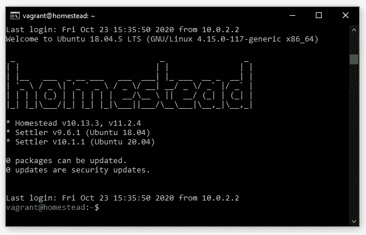

如果你看到上面的屏幕，你就在一个好地方。输入 *pwd* 你会看到你在*/家/流浪*。这就是为什么我们必须将本地 *laravel-excel* 文件夹映射到*/home/vagger/laravel-excel*文件夹。

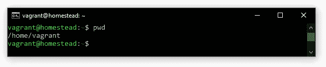

laravel-excel 项目应该可以在你的虚拟机中访问。键入`ls`查看您的所有项目。你应该看到你的`laravel-excel`文件夹。

16.您现在可以验证安装的所有东西，比如 PHP、MySQL、Node、npm、composer 等。

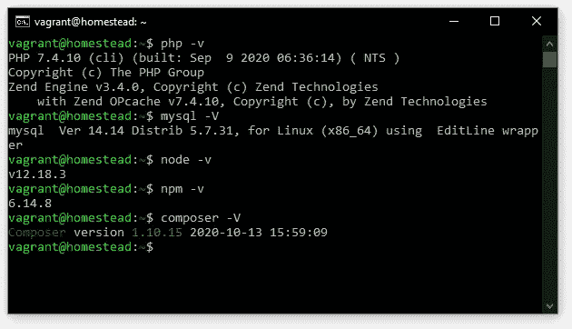

17.让我们再做几件事来确保您已经准备好在浏览器中看到您的应用程序。在 IDE 中打开项目。是时候编辑一下*了。env* 文件。由于 Homestead 正在 *192.168.10.10* 上运行，您必须将 *DB_HOST* 设置为 *192.168.10.10* 。将您的数据库命名为您想要的任何名称；我将我的名字命名为 *laravel_excel* 。 *DB_USERNAME* 是 *homestead* 而 *DB_PASSWORD* 是 *secret* 。

保存文件。在 Git Bash 中导航回您的虚拟盒子。如果您关闭了它，请重新打开它:`vagrant ssh`。记住，从现在开始，你只能从 *~/Homestead* 目录中执行流浪命令。

输入:`mysql`

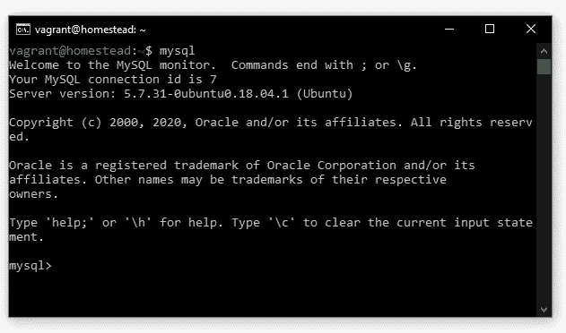

让我们创建刚才指定的数据库:

```
mysql> **create database laravel_excel**;
```

验证数据库是否存在:

```
mysql> **show databases**;
+-----------------------+
| Database              |
+-----------------------+
| information_schema    |
| homestead             |
| **laravel_excel **        |
| #mysql50#lost+found   |
| mysql                 |
| performance_schema    |
| sys                   |
+-----------------------+
7 rows in set (0.00 sec)
```

你现在可以退出 MySQL 了。

```
mysql>exit;
```

要运行迁移，在您的虚拟环境中，运行您的标准 artisan 命令:`php artisan migrate`。您需要先将 CD 放入您的项目文件夹。

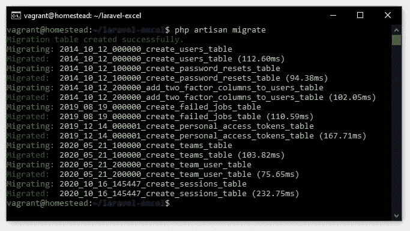

如果您不信任这些消息，可以回到 mysql 来验证这些表是否真的存在。

```
$ mysql
mysql> use laravel_excel;
mysql> show tables;
```

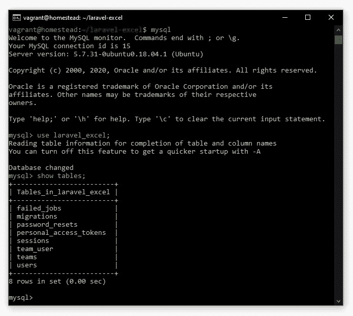

您也可以从 Homestead 运行 npm 命令。退出 mysql 并运行 *npm install* ，然后运行 *npm run dev* 。

```
mysql> exit;
:$ npm install
:$ npm run dev
```

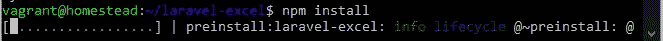

如果遇到问题，删除您的 *node_modules* 目录并再次运行:`npm install && npm run dev`。

18.最后，验证您的项目已经启动并正在运行。在你的浏览器中访问 *laravel-excel.test* ，你应该会看到你的页面。

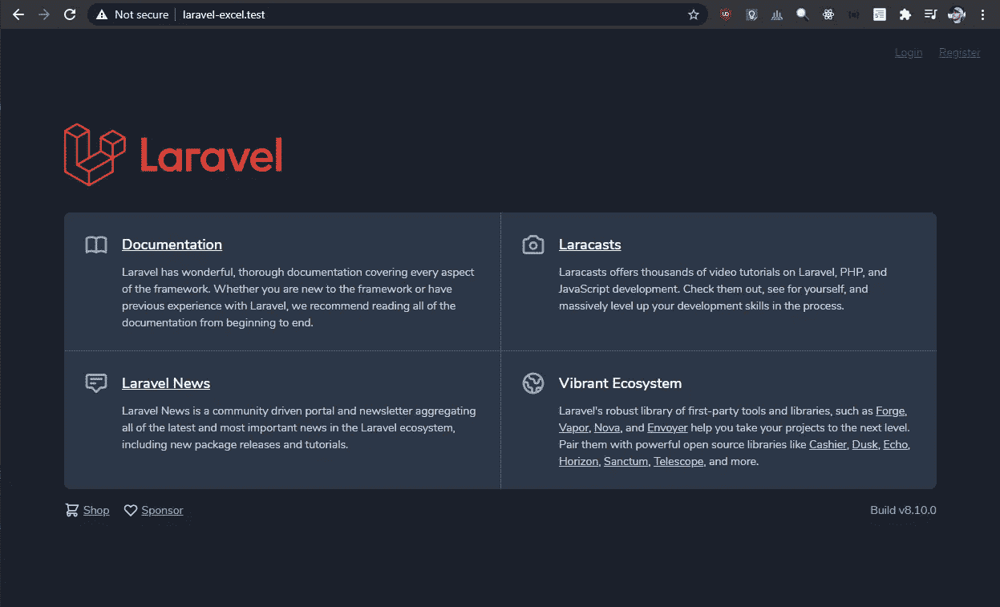

恭喜你，你的项目在 Homestead 上运行了。

19.要停止虚拟机，首先输入`exit;`退出流浪框。接下来，从您的 *~/Homestead* 目录中，键入`vagrant halt`。这将停止流浪。然后你可以试着去 *laravel-excel.test* 也不行。

## 创建新项目

在前面的步骤中，我们使用了一个现有的项目。这意味着在某个时候，我在我的 Windows 10 机器上安装了 *laravel* 安装程序。这一次，让我们从家园内部创建一个新项目。

1.在编辑器中打开 *Homestead.yaml* 文件。如果你一直跟着做，它应该在你的目录下。

2.在上面的步骤中，我们将一个本地项目映射到一个流浪者目录。我们应该有一个地方来存放我们系统上的 Laravel 项目。在我们的系统中，假设它在:

`C:/Users/your-user-name/Documents/Laravel_Projects`

如果您的本地计算机上没有创建该目录，请创建它。将该路径添加到您的 *Homestead.yaml* 文件中的文件夹映射中。

3.我们将要创建的新网站叫做*博客*。我知道，原创。首先，我们需要将它添加到我们的*站点*映射中。

*博客*项目将位于我们的*/home/vagger/****laravel-projects***目录中，因为这是我们在 *Homestead.yaml* 文件的文件夹部分中映射的文件夹(参见步骤 2)。 *blog* 项目将包含一个 *public* 目录，因此为了访问它，我们必须将 *blog.test* 域指向 *blog/public* 。你的 *Homestead.yaml* 文件现在应该是这样的:

4.将 *blog.test* 域添加到 Windows hosts 文件中。再次以管理员身份打开记事本(右键单击记事本，然后单击“以管理员身份运行”)。

打开主机文件:`*C:\Windows\System32\drivers\etc\hosts*`

在文件底部添加新域。

是的，IP 地址保持不变，因为这是我们家园环境的 IP 地址。保存文件并关闭它。

5.如果你有你的家园环境运行，把它弄下来。从您的 *~/Homestead* 目录中，运行`vagrant halt`。

```
vagrant@homestead:~/laravel-excel$ **exit;**
logout
Connection to 127.0.0.1 closed.C:\Users\dinoc\Homestead>**vagrant halt**
==> homestead: Attempting graceful shutdown of VM...
```

是时候重新运行它，让新的更改生效了。为了使新的更改生效，您必须将 *provision* 标志传递给它:

```
C:\Users\dinoc\Homestead>**vagrant up --provision**
```

6.SSH 进入 Homestead 环境，cd 进入您的 *laravel-projects* 目录:`vagrant ssh`。

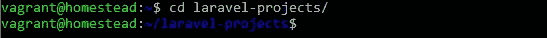

7.是时候使用 *laravel* 安装程序创建一个新项目了。只需运行:

```
laravel new blog
```

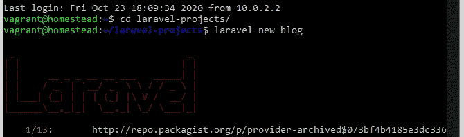

8.在您的本地机器上，导航到您的 *laravel-projects* 目录:

```
*C:\Users\dinoc\Documents\laravel-projects*
```

你会在那里看到*博客*项目。

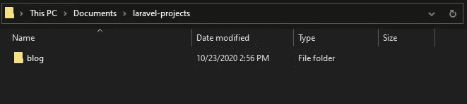

就是这样。您现在可以继续您的项目了。您可以在 IDE 中对其进行更改；您可以使用您的 Homestead 环境来运行迁移，使用 *composer* 请求依赖项，运行 *npm* 命令，等等。

## 最后润色

如果你遵循上面的步骤，最不方便的步骤是打开你的终端，导航到 *~/Homestead* 目录，以便运行*流浪者*命令。还有，是宅基地。运行 *homestead* 命令不是很好吗？嗯，有一种方法，它列在文档中。

创建一个 *homestead.bat* 文件，并将以下内容粘贴到其中:

```
@echo off

set cwd=%cd%
set homesteadVagrant=**C:\Users\dinoc\Homestead**cd /d %homesteadVagrant% && vagrant %*
cd /d %cwd%

set cwd=
set homesteadVagrant=
```

确保修改 Homestead 目录的位置以列出您的用户名。为了方便起见，我将文件保存在我的~/ *Homestead* 目录中:

```
C:\Users\dinoc\Homestead\homestead.bat
```

是时候将 *homestead.bat* 文件添加到环境路径变量中了。

在本地机器上搜索环境变量。

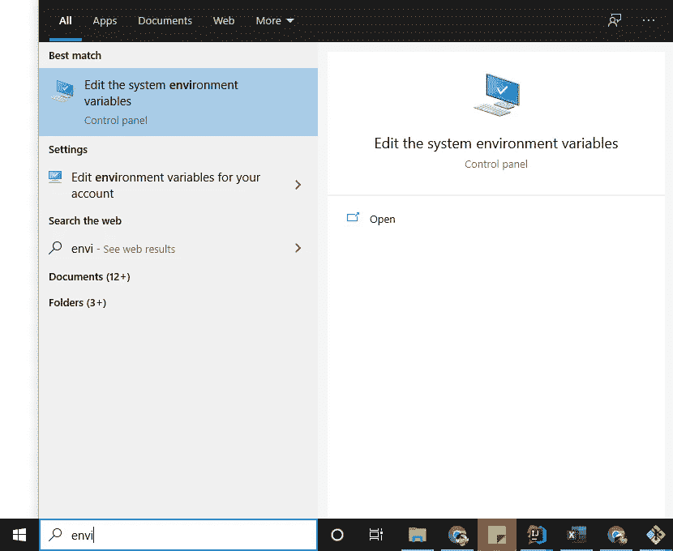

点击*编辑系统环境变量*结果，然后点击*环境变量…*

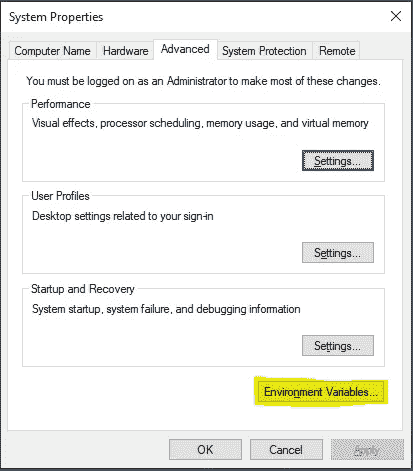

选择*路径*变量，点击*编辑…*

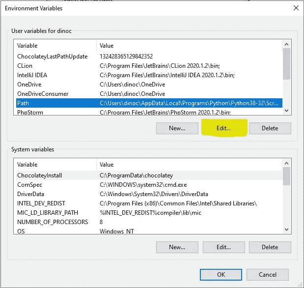

点击 Browse，导航到您的*C:\ Users \ your-user-name \ Homestead*目录。选择它并按下*确定*。您将在列表中看到家园目录。

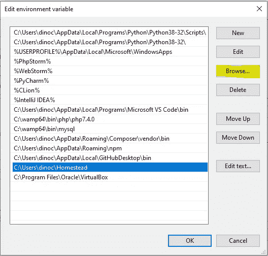

再次单击 OK，转到终端的新实例(CMD)。它在 Git Bash 中不起作用。您现在可以用 *homestead* 替换您正在运行的任何*流浪者*命令，并且您不必 CD 进入 *~/Homestead* 目录。

```
C:\> homestead up
C:\> homestead ssh
C:\> homestead halt
```

## 指定 PHP 版本

我知道你在想什么:“但是如果我正在运行一个需要旧版本 PHP 的旧项目呢？”

您可以为每个项目指定 PHP 版本。

```
sites:
    - map: blog.test
      to: /home/vagrant/blog/public
      php: "7.1"
```

## 更多高级功能

如果您理解我们刚刚所做的，那么我建议您阅读 Laravel 文档，如果您有任何关于更高级特性的其他问题。这也是回顾我们刚刚所做的一切的一个很好的来源。如果你以前有问题，你应该会发现从这一点上家园文件相当容易。

 [## 拉勒维尔家园

### Laravel 努力使整个 PHP 开发体验令人愉快，包括您的本地开发环境…

laravel.com](https://laravel.com/docs/8.x/homestead) 

Dino Cajic 目前是 [LSBio(寿命生物科学公司)](https://www.lsbio.com/)、[绝对抗体](https://absoluteantibody.com/)、 [Kerafast](https://www.kerafast.com/) 、[珠穆朗玛生物科技](https://everestbiotech.com/)、[北欧 MUbio](https://www.nordicmubio.com/) 和 [Exalpha](https://www.exalpha.com/) 的 IT 主管。他还担任我的自动系统的首席执行官。他有十多年的软件工程经验。他拥有计算机科学学士学位，辅修生物学。他的背景包括创建企业级电子商务应用程序、执行基于研究的软件开发，以及通过写作促进知识的传播。

你可以在 [LinkedIn](https://www.linkedin.com/in/dinocajic/) 上联系他，在 [Instagram](https://instagram.com/think.dino) 上关注他，或者[订阅他的媒体刊物](https://dinocajic.medium.com/subscribe)。

阅读 Dino Cajic(以及 Medium 上成千上万的其他作家)的每一个故事。你的会员费直接支持迪诺·卡吉克和你阅读的其他作家。你也可以在媒体上看到所有的故事。