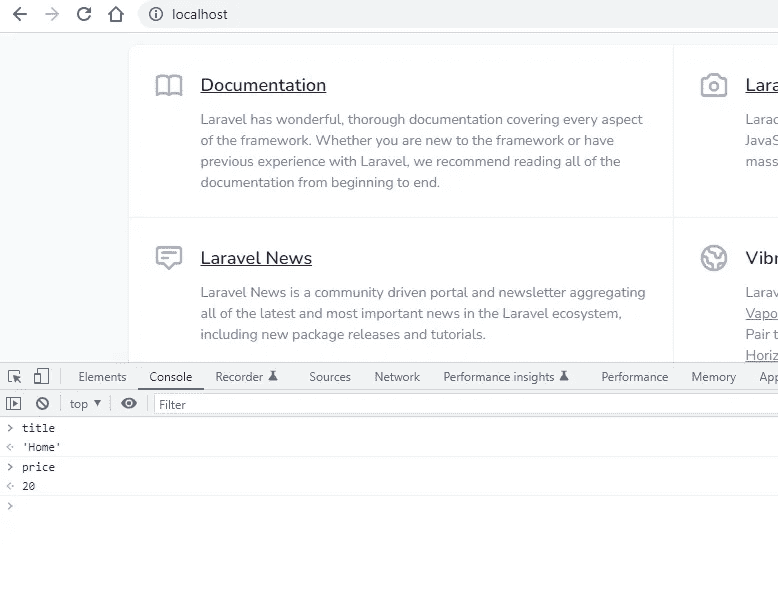

# 如何将一个 PHP 变量传递给 JavaScript

> 原文：<https://blog.devgenius.io/laravel-how-to-pass-a-php-variable-to-javascript-ee7b17265b6d?source=collection_archive---------1----------------------->

## 将 PHP 变量转换为 JavaScript


由 [KOBU 机构](https://unsplash.com/@kobuagency?utm_source=medium&utm_medium=referral)在 [Unsplash](https://unsplash.com?utm_source=medium&utm_medium=referral) 上拍摄的照片

在 Laravel 中，我们使用`view`助手将数据传递给刀片视图。

## 将数据传递给视图

在应用程序路由中，第二个参数用于将数据传递给视图。

```
Route::get('/', function () {
    return view('welcome', ['name' => 'James']);
});
```

在控制器中，视图助手也用于传递数据。

“点”符号可用于引用嵌套视图。以下权限，数据将在`resources/views/admin/permission/show.blade.php`呈现

```
public function show(Permission $permission)
{
    return view('admin.permission.show', compact('permission'));
}
```

[](/dont-do-this-mistake-in-the-laravel-collection-8abdd519f01b) [## 不要在 Laravel 系列中犯这个错误

### 避免在 Laravel 集合中使用 empty 函数

blog.devgenius.io](/dont-do-this-mistake-in-the-laravel-collection-8abdd519f01b) 

## 将 PHP 变量传递给 JavaScript

但是在某些情况下，您希望将一些服务器端的 var 传递给 JavaScript。例如，需要一些分析值。我们可以通过使用[Transform PHP Vars to JavaScript](https://github.com/laracasts/PHP-Vars-To-Js-Transformer)包来传递变量。此外，我们可以不使用这个软件包。

*   1.使用 JSON 呈现
*   2.使用将 PHP 变量转换为 JavaScript 包

## 1.不带包:使用 JSON 渲染

在 Laravel [中，渲染 JSON](https://laravel.com/docs/9.x/blade#rendering-json) 将用于初始化一个 JavaScript 变量。

```
<script>
    var app = {{ Js::from($array) }};
</script>
```

## 例子

现在，在应用程序路由中添加数组数据。我们需要将这个 page_data 数组用作 JavaScript。

```
Route::get('/', function () {
    return view('welcome', ['page_data' => [
        'title' => 'Home',
        'price' => 20
    ]]);
});
```

在欢迎视图中添加下面的 Js::from

`resources/views/welcome.blade.php`

```
<script>
    var page_data = {{ Js::from($page_data) }};
</script>
```

打开浏览器并在控制台中检查 page_data。

[](/stop-using-datetime-in-php-66df3d731875) [## 停止在 PHP 中使用日期时间

### PHP 中为什么需要使用不可变的 DateTime？

blog.devgenius.io](/stop-using-datetime-in-php-66df3d731875) 

## 2.使用将 PHP 变量转换为 JavaScript 包

通过 Composer 安装软件包

```
composer require laracasts/utilities
```

将包添加到提供程序

`config/app.php`

```
'providers' => [
    '...',
    Laracasts\Utilities\JavaScript\JavaScriptServiceProvider::class,
];
```

创建 HomeController 并调用欢迎视图

`app/Http/Controllers/HomeController.php`

```
<?phpnamespace App\Http\Controllers;use App\Http\Controllers\Controller;
use JavaScript;class HomeController extends Controller
{
    public function index()
    {
        JavaScript::put([
            'title' => 'Home',
            'price' => 20
        ]); return view('welcome');
    }
}
```

此外，更新 routes/web.php 以调用 HomeController

```
Route::get('/', [HomeController::class, 'index']);
```

默认情况下，这个包将您的 JavaScript 变量绑定到一个“页脚”视图。因此，创建空的页脚刀片文件，并将其包含在欢迎视图中

`resources/views/footer.blade.php`

您可以通过发布默认配置来更改页脚视图。然后更新`config/javascript.php`文件上的‘bind _ js _ vars _ to _ this _ view’配置值。

```
php artisan vendor:publish --provider="Laracasts\Utilities\JavaScript\JavaScriptServiceProvider"
```

`resources/views/welcome.blade.php`

```
<body class="antialiased">@include ('footer') // <-- Variables prepended to this view
</body>
```



现在标题和价格在窗口对象上是可用的。


## 结论

如果大多数页面上的 JavaScript 都需要 PHP 变量，则使用[Transform PHP Vars to JavaScript](https://github.com/laracasts/PHP-Vars-To-Js-Transformer)包。如果你需要一两个页面，使用 Laravel [渲染 JSON](https://laravel.com/docs/9.x/blade#rendering-json) 方法。

如果你知道任何其他替代方法，请在评论中分享。

感谢您的阅读。

敬请关注更多内容！

【balajidharma.medium.com】跟我来[](https://balajidharma.medium.com/)*。*