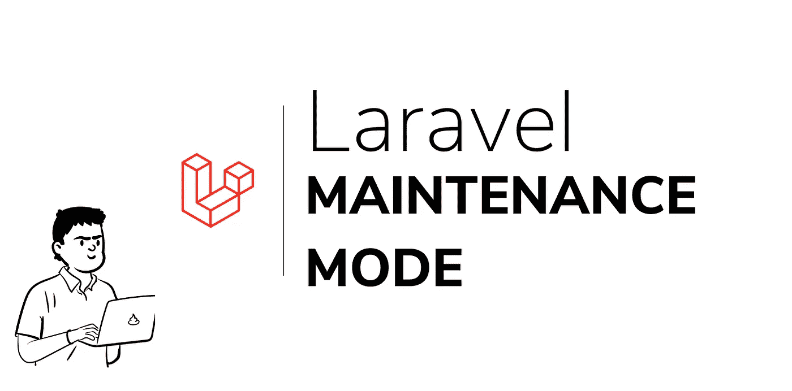
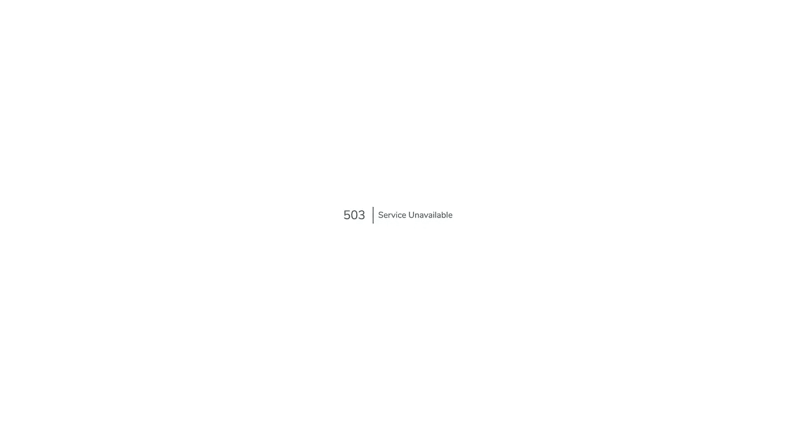
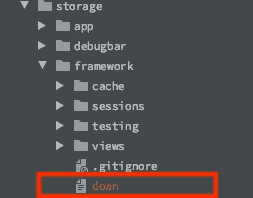
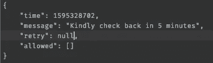

# Laravel 维护模式

> 原文：<https://blog.devgenius.io/laravel-maintenance-mode-a2875028977d?source=collection_archive---------0----------------------->



Laravel 维护模式

在构建应用程序时，我们的目标是保持我们的服务正常运行时间处于较高的百分比象限，但是我们迟早会面临需要我们进入维护模式的情况。

这种停机可能有很多原因，包括但不限于:

*   虫子。
*   数据库错误。
*   迁移到另一台服务器。
*   服务器升级。
*   解耦到新架构。
*   SSL 错误等。

laravel 框架提供了一种平稳、无压力的方式将您的应用程序置于维护模式，这可以通过 artisan 命令访问:

> php 工匠下来了
> 
> **维护模式:****维护模式**允许您在网站**维护**期间向您的用户显示一个用户友好的通知，而不是一个损坏的站点。它还允许您安全地执行任何维护任务，同时确保需要访问网站的人能够访问。
> 
> 节选自:[wpbeginner.com](https://www.wpbeginner.com/plugins/how-to-put-your-wordpress-site-in-maintenance-mode)

该命令有 3 个可选标志:

*   —消息—这用于自定义要在维护页面上显示的消息。
*   —重试—请求可以重试的秒数
*   — allow —在维护模式下允许访问应用程序的 IP 或网络(这可能是您的开发服务器或项目开发人员的 IP 地址)

当您的应用程序处于维护模式时，会向应用程序的用户显示一个可定制的页面，通知他们您正在维护中。



维护页面

# 这是怎么发生的？

Laravel 使用四个组件来优雅地将您的应用程序置于维护中，并管理维护模式。

*   存储在*存储/框架*文件夹中的“关闭”文件，仅在应用程序关闭时生成。
*   中间件类—在 app/Http/Middleware/***CheckForMaintenanceMode.php***文件和*vendor/laravel/framework/src/Illuminate/Foundation/Http/Middleware/****CheckForMaintenanceMode.php****文件中找到*
*   *异常类—在*供应商/laravel/framework/src/Illuminate/Foundation/Exceptions/****MaintenanceModeException.php***中找到*
*   *命令类—在*供应商/laravel/framework/src/Illuminate/Foundation/Console/****DownCommand.php****文件和*供应商/laravel/framework/src/Illuminate/Foundation/Console/**UpCommand.php**文件中找到***

# ***每个组件的功能。***

## ***down 命令类***

***我们将从 *down* 命令类开始，因为这是将应用程序置于维护模式的入口点。***

**向下命令类**

**与其他 artisan 命令一样，handle 方法在命令被调用时被调用，框架收集以下有效负载:**

*   **当前时间。**
*   **可自定义的消息(如果在调用命令时提供)。**
*   **重试时间。**
*   **和允许的 IP 地址。**

**获得这些信息后，它会创建一个文件，并以 JSON 格式将其存储在*存储/框架*文件夹中。**

****

**存储/框架文件夹中的向下文件**

****

**下行文件的内容**

**创建 down 文件后，向终端输出“应用程序现在处于维护模式”。**

**如果未能创建文件，则会引发异常并输出“未能进入维护模式”带有异常消息的转储**

**这就是 Down 命令类所做的全部工作。**

## **中间件**

**中间件层是一个安全层，对应用程序的每个请求在被 laravel 应用程序处理之前都必须经过它，laravel 框架中默认提供的中间件之一是*checkformmainancemode*类。**

**用于维护模式的中间件类位于 app/Http/Middleware/*CheckForMaintenanceMode.php*和扩展了*vendor/laravel/framework/src/Illuminate/Foundation/Http/Middleware/****CheckForMaintenanceMode.php***文件，后者包含了我们将要讨论的大部分逻辑。****

**CheckForMaintenanceMode 类**

**这个中间件为我们的应用程序收到的每个请求运行，并注册在内核类的＄middleware 数组中，可以在 *app/Http/Kernel.php* 中找到**

```
***/**
 * The application's global HTTP middleware stack.
 *
 * These middleware are run during every request to your application.
 *
 ** ***@var*** *array
 */* protected $middleware = [
    // \App\Http\Middleware\TrustHosts::class,
    \App\Http\Middleware\TrustProxies::class,
    \Fruitcake\Cors\HandleCors::class,
    **\App\Http\Middleware\CheckForMaintenanceMode::class,**
    \Illuminate\Foundation\Http\Middleware\ValidatePostSize::class,
    \App\Http\Middleware\TrimStrings::class,
    \Illuminate\Foundation\Http\Middleware\ConvertEmptyStringsToNull::class,
];**
```

**首先，当中间件被调用时，它的句柄方法被调用。**

**此方法检查应用程序是否处于维护模式:**

```
**public function handle($request, Closure $next)
{
    if ($this->app->isDownForMaintenance()) {
          ...
    return $next($request);
}**
```

***$ this->app->isdownformainment()*方法可以在*vendor/laravel/framework/src/Illuminate/Foundation/****Application.php***文件中找到:**

```
***/**
 * Determine if the application is currently down for maintenance.
 *
 ** ***@return*** *bool
 */* public function isDownForMaintenance()
{
    return file_exists($this->storagePath().'/framework/down');
}**
```

**该方法检查由***PHP artisan down****命令创建的“down”文件，该文件仅在应用程序进入维护模式时可用。***

***如果方法返回 false，应用程序将正常处理请求，这意味着应用程序不处于维护模式。***

***当您的应用程序处于维护模式时，中间件检索“down”文件的内容，并将其赋给一个变量。它检查请求的 IP 是否允许在维护模式下访问应用程序，然后检查请求尝试接受的路由是否在 excepts 数组中——excepts 数组包含在应用程序处于维护模式时仍可访问的路由。***

***当发出请求的 IP 地址不是允许的 IP 地址或者 excepts 数组中没有提供路由时，它会抛出一个异常。***

```
***throw new MaintenanceModeException($data['time'], $data['retry'], $data['message']);***
```

***这个异常由应用程序处理，并显示一个优雅的维护视图。***

***在维护您的应用程序之后，您希望使它处于活动状态，这可以使用另一个 artisan 命令来实现:***

> ***php artisan up***

***此命令没有任何标志。***

***UpCommand 类***

***它通过测试 down 文件是否存在于“*storage/framework/down”*文件夹中来检查应用程序是否关闭。***

**如果文件存在，那么它会删除并输出“应用程序现在是活动的”在终端上，如果文件不存在，它会输出“应用程序已经启动”并且存在。**

**如果由于任何原因，文件不能被删除，它抛出一个异常。**

**这就完成了 laravel 的维护工作流程。**

## **好的部分**

**如果您的应用程序运行一个状态页，或者您想通知一群人您的应用程序的状态，您可以扩展默认的 UpCommmand 和 DownCommand 类，并在其中添加您的自定义逻辑。**

**要创建新的类，请运行:**

> **php artisan make:命令 up 命令**
> 
> **php artisan make:命令向下命令**

**您可以对其进行自定义，以匹配下面的代码示例**

```
**<?php

namespace App\Console\Commands;

use \Illuminate\Foundation\Console\UpCommand as Command;

class UpCommand extends *Command* {

    */**
     * Execute the console command.
     *
     ** ***@return*** *int
     */* public function handle()
    {
        try {
            if (! file_exists(storage_path('framework/down'))) {
                $this->comment('Application is already up.');

                return true;
            }

            **$this->notifyPeopleOfUpStatusAndUpdateStatusPage();**

            unlink(storage_path('framework/down'));

            $this->info('Application is now live.');
        } catch (Exception $e) {
            $this->error('Failed to disable maintenance mode.');

            $this->error($e->getMessage());

            return 1;
        }
    }

    private function notifyPeopleOfUpStatusAndUpdateStatusPage()
    {
        //add logic here

    }

}**
```

```
**<?php

namespace App\Console\Commands;

use Illuminate\Foundation\Console\DownCommand as Command;

class DownCommand extends *Command* {
    */**
     * Execute the console command.
     *
     ** ***@return*** *int
     */* public function handle()
    {
        try {
            file_put_contents(storage_path('framework/down'),
                json_encode($this->getDownFilePayload(),
                    *JSON_PRETTY_PRINT*));

           ** $this->notifyPeopleOfDownStatusAndUpdateStatsPage();**

            $this->comment('Application is now in maintenance mode.');
        } catch (Exception $e) {
            $this->error('Failed to enter maintenance mode.');

            $this->error($e->getMessage());

            return 1;
        }
    }

    private function notifyPeopleOfDownStatusAndUpdateStatsPage()
    {
        //add logic here
    }

}**
```

**喜欢吗？拍手分享。**

**推特:【https://twitter.com/drumzminister **