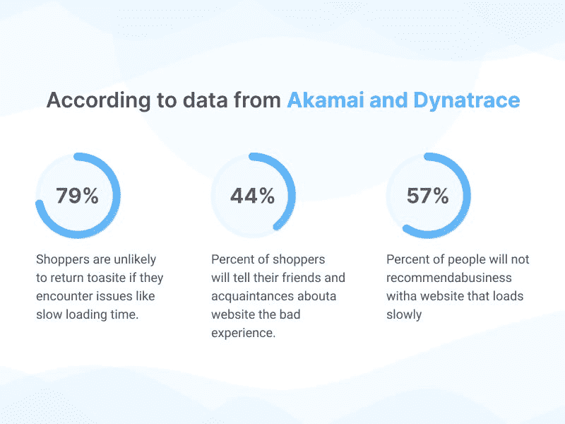
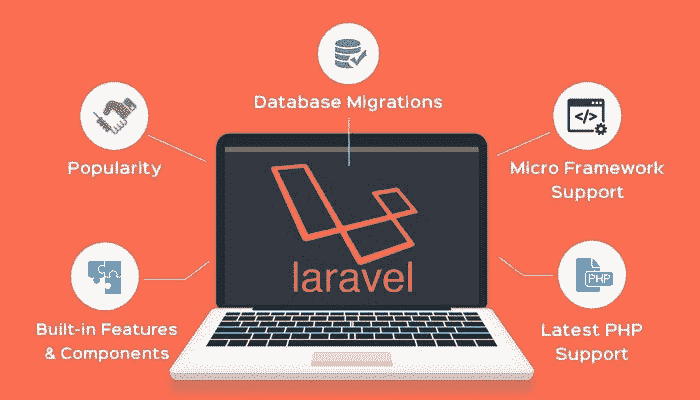
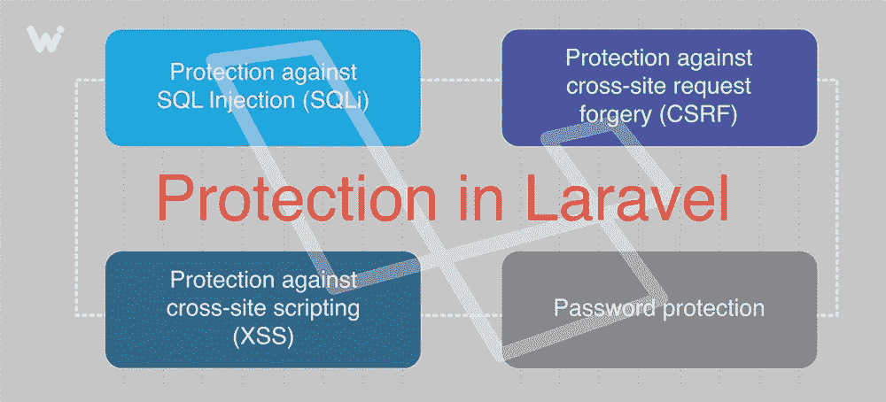

# Laravel 性能优化指南:加速您的网站

> 原文：<https://blog.devgenius.io/laravel-performance-optimization-guide-speed-up-your-website-4f7defae1264?source=collection_archive---------2----------------------->

性能优化可能是软件开发过程中最难掌握的部分之一。从复杂的数据库查询到资源密集型计算，您的应用程序的性能可能会受到许多因素的影响，尤其是如果您不熟悉 web 应用程序开发的技术方面。

优化你的 Laravel 网站可能会很棘手。与此同时，创建一个性能良好的应用程序并随着用户群的增长而不断扩展也是至关重要的。

本指南将带您从头到尾了解如何优化您的应用程序，以确保它快速流畅地运行。从优化您的开发环境到优化您的部署流程，该博客将帮助您保持 Laravel 应用程序的最佳性能。

首先让我们谈谈网站速度！

# 网站速度的重要性是什么？

没有什么比页面加载时间更能影响你的转化率了。根据 Akamai 的一项研究，如果你的网站加载时间超过 3 秒，你将失去 79%的潜在客户。如果花了 10 秒或更长时间，你将有 99%的机会失去他们。

网站速度很重要，原因有几个。首先，它对用户体验有直接影响。如果你的网站加载时间太长，用户可能会放弃，转到其他地方。

其次，网站速度现在是谷歌的一个排名因素。这意味着如果你的网站运行缓慢，你在搜索结果中的排名可能会降低，这会影响你的流量水平。

再次，网站速度对你的转化率有间接影响。如果用户要等很长时间才能加载你的网站，他们很可能在有机会转化之前就离开了。

最后，快速网站往往更稳定，跳出率更低。所有这些因素结合起来使得网站速度成为一个重要的跟踪指标。

***必读:***[***Laravel 综合指南:著名 PHP 框架***](https://www.valuecoders.com/blog/technology-and-apps/laravel-open-source-php-framework/?utm_source=laravel_guide&utm_medium=devgenius&utm_campaign=Guest_Blog&utm_id=NKY)

# 针对您的应用的顶级性能优化技巧

图片来源:三态科技

有几种方法可以提高你的网站速度。下面，查看 Laravel 性能优化技巧，帮助您提高 Laravel 应用程序的性能。

## 1.路线缓存

如果 Laravel 网站创建了许多路线，您可以缓存它们以提高性能。缓存路由是人们不会想到的事情之一，但它会对您的性能产生巨大影响。

当你注册一条路线时，默认情况下会自动缓存 60 分钟。如果您的应用程序有 1000 个路由，它将节省大约 600 个对 route()的调用。

最好的部分是缓存路由很容易。你只需要在 AppServiceProvider 的 boot()方法中添加 Route::cache(60)或者调用 Route::cache('all ')。

这样，您所有注册的路线将被缓存 60 分钟。您还可以根据需要将 60 分钟更改为任何其他值。如果需要清除缓存，那么只需使用 Route::clearCache()。

## 2.正确使用 Artisan 命令

Laravel 为你提供了很多有用的命令。其中一些可以生成您的应用程序需要的一些文件。但是，如果您正确使用它们，它会提高性能。

例如，如果您需要创建一个迁移文件，而不是运行 PHP artisan make:migration create _ users _ table 命令，只需运行 PHP artisan migrate:make create _ users _ table。

这样，Laravel 将只执行一个命令，而不是两个命令。所以它会提高一点性能。此外，****雇佣的高级开发人员是开发有影响力的应用程序的最佳选择。****

## ****3.使用部署工具****

****Laravel 有一个内置的部署工具。因此您可以在服务器上部署您的应用程序。如果您使用 Capistrano 进行部署，在服务器上部署您的应用程序将需要一些时间。但是如果你用的是 Laravel 的部署工具，会非常快，因为 Laravel 已经安装在那个服务器上了。****

****因此，在部署应用程序之前，您不需要在服务器上安装任何依赖项或设置任何东西。你只需要运行一个命令，一切都会自动完成。****

## ****4.利用 JIT 编译器****

****Laravel 有一个内置的操作码缓存。所以您可以通过在您的。环境文件。它会将所有应用程序的编译代码缓存到共享内存中，这意味着每次执行一段代码时，它都会从内存中加载，而不是再次编译。****

****只要您运行的是 PHP 7 或更高版本，这将为您的应用程序带来显著的性能提升。****

****强烈建议您在生产服务器上运行 Laravel 网站或应用程序时利用 PHP 的 OPcache 扩展。****

## ****5.压缩图片****

****如果你有一个 1MB 大小的图像，可以压缩到 300KB。这将减少您的页面加载时间。您应该在将图像上传到服务器之前对其进行压缩。如果你正在使用 Laravel 代客，它会自动压缩你所有的图片。****

****但是，如果你不使用代客，那么有许多在线工具可以帮助你压缩图像。使用这些工具将确保您的网站的性能不会受到加载大量照片的影响。****

## ****6.类别图改进****

****如果你使用的是 classmap，那么它会很慢，因为它不是一种有效的自动加载类的方式。所以，你应该使用真正的自动加载，而不是使用 classmap。****

****例如，如果您有一个名为 AppServiceProvider.php 的文件，那么您可以通过添加如下所示的公共函数 register()方法，在您的 app/Providers/appserviceprovider . PHP 文件中注册它:****

****public function register(){ $ this-> App-> instance(' user _ service '，' App \ Services \ user service ')；}****

****这样，每当 Laravel 需要加载 user_service 类时，它就会自动加载 App\Services 文件夹中的所有文件。这比使用 classmap 方法要快得多。****

## ****7.资产缩减****

****如果你正在使用 Laravel 5.4，它会自动缩小你的资产。但是，如果您使用的是 Laravel 的旧版本，可以通过运行 PHP artisan asset:publish 命令来手动缩小资源。它将在您的公共文件夹中创建一个名为 bootstrap/cache/assets-minified . JSON 文件的文件，该文件将包含您所有已被缩小的资产。****

****因此，当 Laravel 试图加载这些文件时，它将使用这些已经缩小的文件，而不是从头开始重新编译它们，这导致了巨大的 Laravel 应用程序性能。****

****如果您在增强 Laravel 应用程序性能时遇到任何问题， [**聘请开发人员**](https://www.valuecoders.com/hire-developers?utm_source=hire_deve&utm_medium=devgenius&utm_campaign=Guest_Blog&utm_id=NKY)**。这样做，你将能够节省时间和金钱。******

*********也读:*** [***为什么 Laravel 是 2022 年最好的 PHP 框架？***](https://www.valuecoders.com/blog/technology-and-apps/laravel-best-php-framework-2017/?utm_source=laravel_framework&utm_medium=devgenius&utm_campaign=Guest_Blog&utm_id=NKY)******

# ****你如何保证你的网站的安全？****

********

****图片来源:WishDesk****

****安全性是那些过度设计比设计不足更好的事情之一。如果你在做一个处理敏感数据的网站，比如信用卡号码或电子邮件地址，你应该采取措施尽可能保证它们的安全。****

****每个网站所有者都希望他们的网站是安全的，但并不是每个人都知道如何以一种健壮、可伸缩和高性能的方式做到这一点。****

****即使你不是密码学或网络工程方面的专家，也有很多方法可以确保你的安全。以下是确保您的 Laravel 网站安全而不牺牲速度或易用性的重要提示…****

# ****选择安全的服务器进行托管****

****当你想托管你的 Laravel 网站时，选择一个安全的托管服务器是至关重要的。最常见的方法是选择 VPS 或专用服务器。你可以在我们的 Laravel 资源页面的主机部分获得更多关于这些选项的详细信息。****

****出于安全目的，我们建议在您的服务器上使用 Let's Encrypt SSL 证书，以便您的用户和您的网站之间的所有流量都被加密。这是一个简单的过程，不需要您成为密码学或网络工程方面的专家。****

# ****用最新版本更新您的网站****

****确保您运行的是 Laravel 的最新版本非常重要。这是因为在旧版本中经常会发现错误，因此尽快修补这些错误至关重要。****

****如果你使用的是托管服务提供商，他们应该会自动为你定期更新，但如果不是，那就需要你自己来做了。****

****每周至少检查一次更新也是一个好主意，以确保自上次更新以来没有发现任何重大的安全漏洞。****

# ****更新模块、包和插件****

****同样重要的是，要确保你运行的是你正在使用的第三方模块或软件包的最新版本。这些通常会定期更新，以修复错误或添加新功能。****

****如果你不定期更新它们，你可能会暴露在新版本中修补的安全漏洞下。确保你的插件是最新的也很重要，因为它们也可能包含安全漏洞。****

# ****利用 HTTPS****

****如果你不使用 HTTPS，你就将自己暴露在中间人攻击之下。在这种类型的攻击中，攻击者会拦截您与服务器的通信，并可以看到你们之间发送的任何数据。****

****如果您正在使用 HTTP，有人可以做一些被称为中间人攻击的事情，他们将自己插入到您与服务器的通信中。这意味着他们可以查看在你们之间传递的任何数据，并在不知情的情况下窃取或更改这些数据。****

****为了防止这类攻击，请确保在您的网站上使用 SSL 证书对所有流量进行加密。****

# ****使用内置的安全措施****

****Laravel 内置了几项安全措施。例如，它有 CSRF 保护来防止跨站点请求伪造攻击。它还内置了密码强度检查，因此鼓励用户使用强密码。****

****它还使用加盐和哈希来保护密码，然后再将它们存储在您的数据库中，这使得攻击者在访问您的数据库时更难访问它们。****

*******也读:***[***2022 年顶级拉腊维尔开发公司聘请专家***](https://www.valuecoders.com/blog/technology-and-apps/top-laravel-development-companies-to-hire-experts/?utm_source=laravel_comp&utm_medium=devgenius&utm_campaign=Guest_Blog&utm_id=NKY)****

# ****结论****

****Laravel 是一个流行的框架，但是必须理解没有一个网站是完全优化的。总会有变慢的风险，但通过采取适当的预防措施，你可以将这些风险降至最低，并加快你的 Laravel 网站。****

****Als，您可以**从 [**Laravel 开发公司**](https://www.valuecoders.com/top-laravel-development-services-company-india?utm_source=laravel_comp&utm_medium=devgenius&utm_campaign=Guest_Blog&utm_id=NKY) 聘请 Laravel 开发人员**，为您的企业获得最佳的 Laravel 解决方案。它不仅能节省你的时间，还能节省金钱。****

**我们希望这本 Laravel 性能优化指南对您有所帮助。如果您有任何疑问或建议，欢迎在下面评论！感谢阅读！**