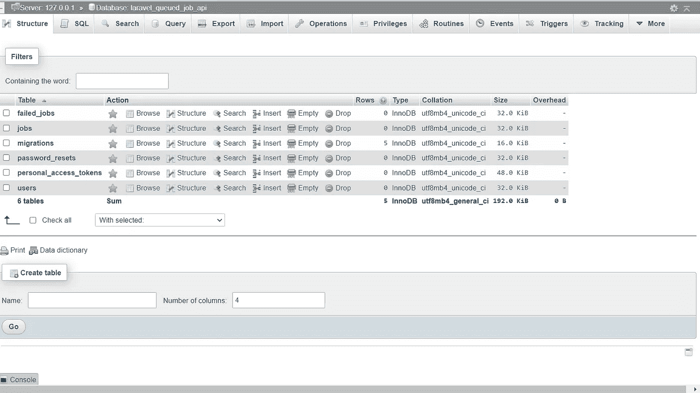
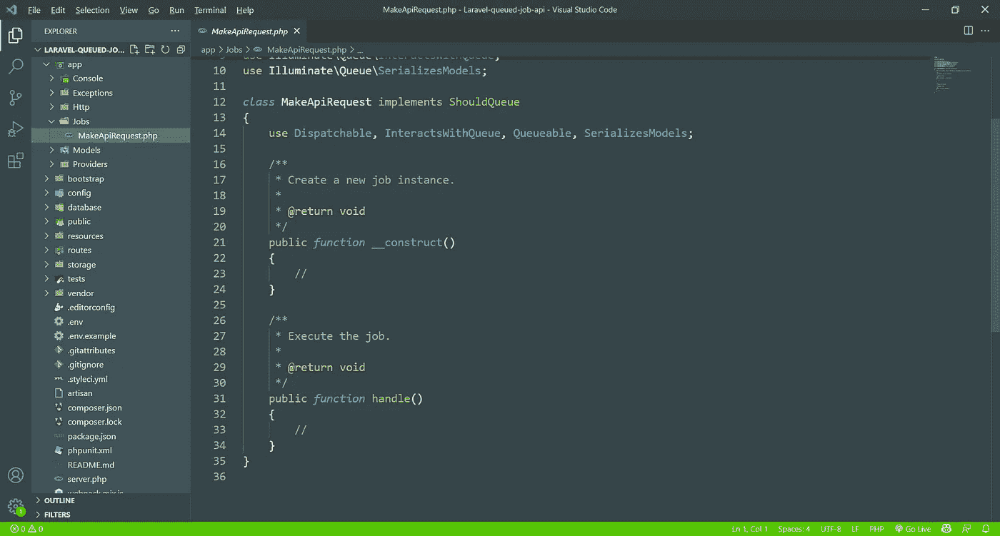
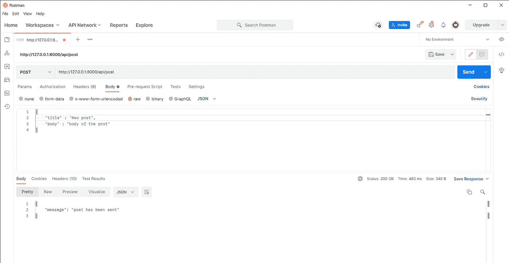
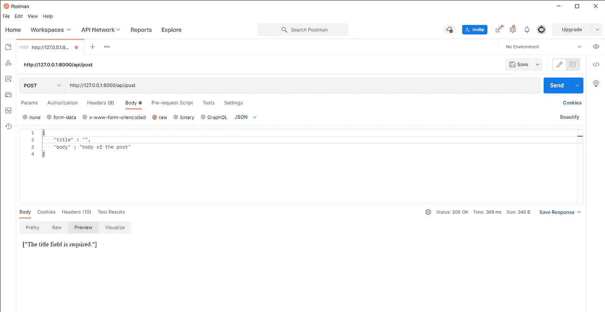
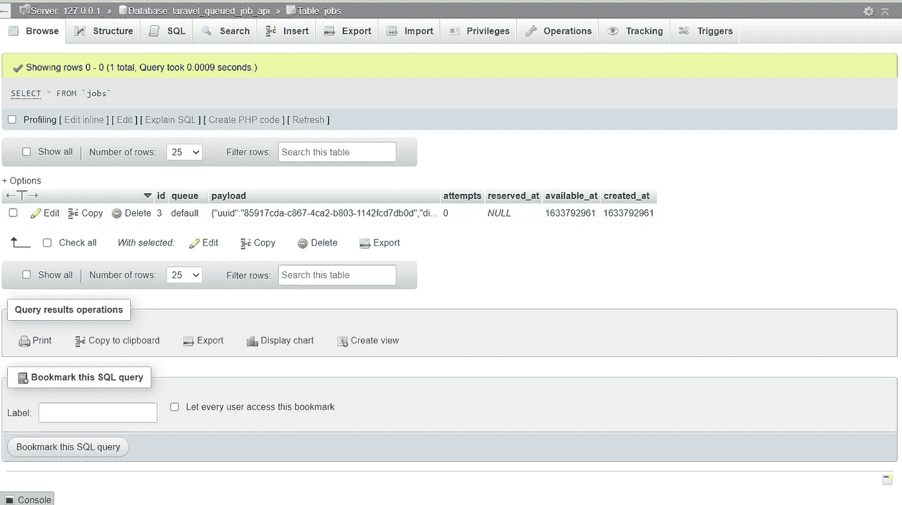
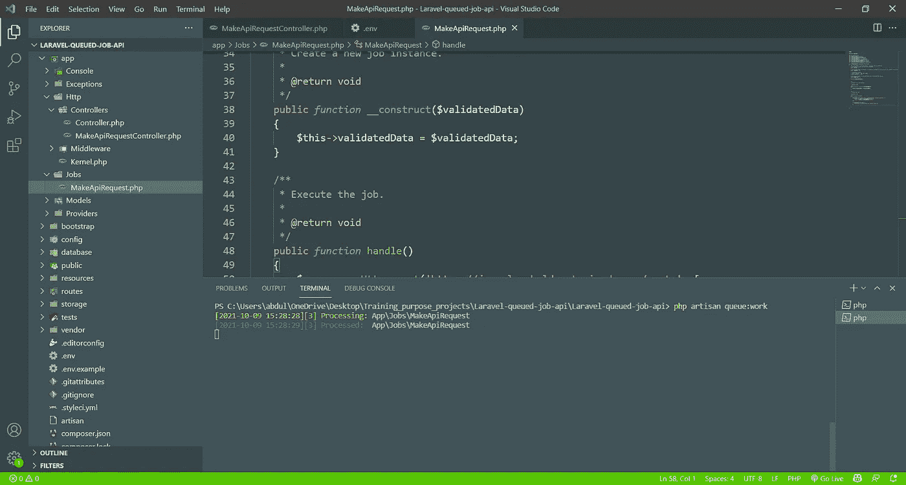
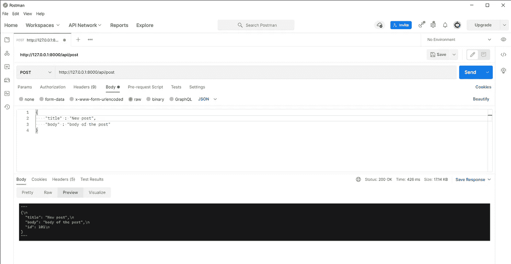

# Laravel 排队作业，带 API。

> 原文：<https://blog.devgenius.io/laravel-queued-job-with-api-d9f01ee7235a?source=collection_archive---------0----------------------->


约翰·施诺布里奇在 [Unsplash](https://unsplash.com?utm_source=medium&utm_medium=referral) 上的照片

**Laravel jobs :** 要理解为什么要在 Laravel 中创建一个 job，一个简单的例子是，当一个新用户在 webapp 中创建(注册)时，我们想要向新用户发送一封欢迎电子邮件，所以在这种情况下，注册之后，新用户需要等待几秒钟才能将 emil 发送给他，然后将他重定向到他的 Dashbord， 但这可能是无聊的等待，当新用户注册时，立即发送他到 dashbord，并在后台发送电子邮件。

Laravel 允许您轻松创建可以在后台处理的队列作业。通过将时间密集型任务移动到队列中，您的应用程序可以以极快的速度响应 web 请求，并为您的客户提供更好的用户体验。

T 何从本文目标:

了解我们如何在 Laravel 应用程序队列作业中发送 http api 请求(post request ),换句话说，以异步方式发送请求，其中主应用程序继续正常工作，对于一个实际的示例，您可能想要发送第三方 api 的发票，而无需让您的应用程序等待。

对于这个例子(为了简单起见)，我将使用[](https://jsonplaceholder.typicode.com/)**来发送一个带有标题和文章正文的新文章，已经有 100 篇文章了，所以当你发送新文章时，它将是 101，并在[](https://jsonplaceholder.typicode.com/posts)**中获得 id = 101 的文章****

*   ******如何在 Laravel 中排队作业******

****假设你已经有一些初始化 Laravel 应用程序的经验，并将其连接到数据库。****

****在**中你必须做的一件重要的事情。env** 文件，是要修改的:****

****队列连接=同步****

****变成:****

****QUEUE _ CONNECTION =数据库****

****这样就可以将队列连接到数据库。****

****我会立即跳转到 artisan 命令来执行排队的任务，我们把这个任务叫做 **MakeApiRequest** ，但是你可以随便叫它什么。****

```
**php artisan make:job MakeApiRequest** 
```

****为数据库中的排队作业制作表格:****

```
**php artisan queue:table** 
```

****现在进行迁移，这样您就可以迁移您的 Laravel 应用程序表，包括新的作业表****

```
**php artisan migrate**
```

********

****你可以在上面的照片中看到，除了新的 Laravel 应用程序中已经存在的默认表之外，还有一个名为 **job** 的新表。****

****您可以在 Laravel 应用程序的代码中看到，有一个名为 jobs 的新文件夹，其中包含新的 MakeApiRequest 作业文件(或者您为其选择的任何名称)****

********

****app/jobs/MakeApiRequest.php****

****现在制作一个控制器，我们在其中控制请求的行为。****

```
**php artisan make:controller MakeApiRequestController**
```

****在控制器中，我们将验证要发送给 JSONplaceholder(或第三方 API)的数据，并将这个经过验证的数据作为 job 类中的参数进行调度。****

*   ****在这个控制器中，我们将对想要发送的数据进行验证，这将发生在一个存储函数中****

****app/HTTP/controllers/makeapirequestcontroller . PHP****

****您可以看到，我们在控制器中导入了 job 类，并将 validatedData 作为参数发送到其中。****

*   ****在我们忘记之前，让我们为 api 文件中的 post 创建一个路径****

****添加以下代码，不要忘记导入控制器。****

****routes/api.php****

****让我们回到我们的作业类来添加一些代码****

****现在创建一个受保护的变量$validatedData，并在 job 类的构造器中传递它，然后使用来自 validatedData 的合适的必需数据创建 http post 请求，或者我们可以说在验证数据之后。****

****app/jobs/MakeApiRequest.php****

*   ****检查工作的时间到了，我们将在邮递员中完成。****

****首先请不要忘记运行服务器:****

```
**php artisan serve**
```

****所以在 postman 中进行 POST 请求并添加链接:[http://127 . 0 . 0 . 1:8000/API/POST](http://127.0.0.1:8000/api/post)****

****在标题中添加:****

****Key: Content-Typ，带有值:application/json****

****在正文中，检查行选择，并添加文章标题和正文，如下图所示:****

********

****您可以看到有一个带有消息的响应:“post 已被发送”。****

****如果我们想检查验证是否有效，我们可能会遗漏主体中的某些内容，如下所示:****

********

****所以要知道，当发送 post http 请求时，您只得到所需的响应，如果您查看数据库，您会在 job 表中看到一个带有 uuid 的新项目:****

********

****这意味着您的任务仍然是 stak，我们需要午餐队列工作来完成它，所以在一个新的终端中发出命令:****

```
**php artisan queue:work
or   
php artisan queue:listen**
```

****您可以在终端中看到该作业正在处理，并且正在处理。****

********

****现在你可以说你已经成功地完成了你的队列任务。****

****如果您检查数据库，您将再次发现作业表为空，除非如果有什么错误，那么这个作业将对 failed_jobs 执行，并显示一条消息解释它失败的原因。****

*   ******见派工流程:******

****例如，如果您想要检查作业类中发生了什么，或者您可能想要查看作业类中的响应本身，则更改:****

****MakeApiRequest::dispatch($ validatedData)；****

****进入:调度同步****

****MakeApiRequest::**dispatch sync**($ validatedData)；****

****并生成 dd($response)或者更好地生成****

```
**dd($response->getBody()->getContents())**
```

****然后你可以检查你的邮递员:****

********

*   *****作为旁注:*****

```
**- you can send http request with token or any other type of headers - there is many configuration you can do it in the job class , like $tries, $timeout, $maxTries, and many others, I have already add some of it in the job class with some simple explaintion, but you can read more in the documention of Laravel queue.**
```

****感谢阅读。****

****如果你有兴趣阅读更多关于不同主题的文章，请访问我的博客:[https://aalhommada.com/blog](https://aalhommada.com/blog)****