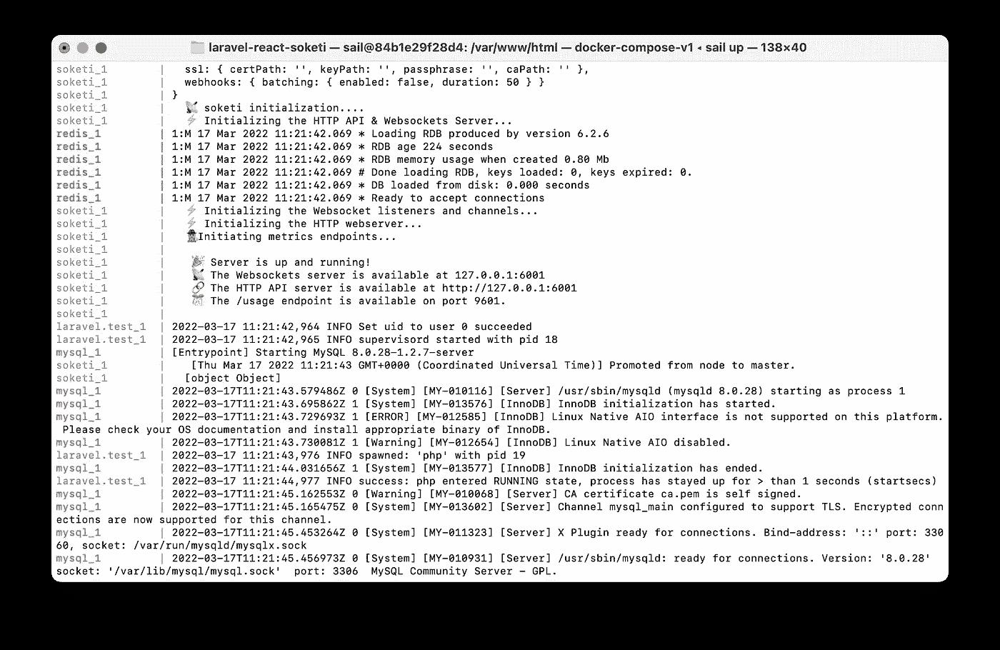
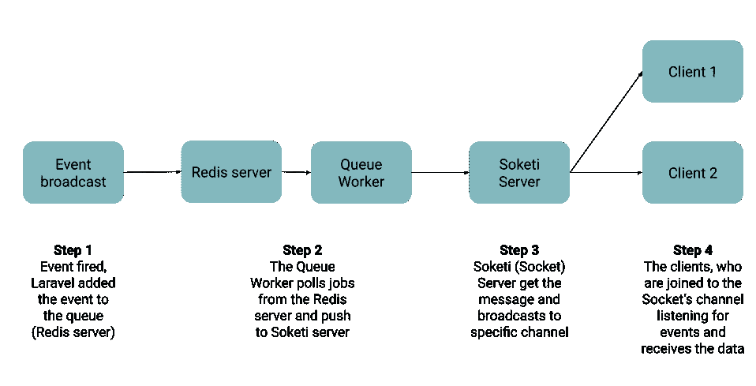

# Laravel，ReactJs，Soketi triumvirates:构建实时 WebApp 的逐步指南—第 1 部分

> 原文：<https://blog.devgenius.io/laravel-reactjs-soketi-triumvirates-step-by-step-guide-to-build-a-real-time-webapp-part-1-21fd0c5f01cf?source=collection_archive---------5----------------------->

## 设置您的环境

WebSocket 是客户端和服务器之间进行全双工通信的协议。Soketi 是一个很棒的 socket 服务器实现，我们可以在 Laravel 第 9 版的官方文档中找到它。使用这些工具，您可以构建实时 web 应用程序。Laravel 提供广播不同事件的解决方案。本系列是关于如何使用 ReactJS 和 Soketi 制作一个简单的聊天 web 应用程序。在这一章中，我们将关注如何安装需求和设置环境。


# 这个想法

我们将构建一个简单的聊天应用程序，登录用户可以在其中相互发送消息。为了环保，我们将重新使用一个旧的项目，其中包括:

*   带有 ReactJS 预置的 Laravel 项目
*   证明
*   登录页面

这是成为零浪费的一小步:)(或者我们只是懒)

# 设置项目

如果你正在使用 docker(如果你没有，你应该这样做)，你可以使用 Sail 启动这个项目:

```
docker run --rm \
-u "$(id -u):$(id -g)" \
-v $(pwd):/opt \
-w /opt \
laravelsail/php80-composer:latest \
composer install --ignore-platform-reqs
```

## 缺少服务要求

注意，最初的项目没有默认的 Redis 服务，但是在后面的部分我们会需要它。不要担心，您可以很容易地将它添加到项目中。当你向上航行后，你应该进入壳牌:

```
./vendor/bin/sail shell
```

*补充说明:当我们在 cli 中运行命令时，哪些命令取决于项目的环境(artisan 等…)我们总是假设在将来我们会进入 shell。*

在这里，您可以运行以下命令

```
php artisan sail:install
```

该命令会给你列出一些安装选项，我们应该选择 mysql 和 redis:

```
/var/www/html$ php artisan sail:installWhich services would you like to install? [mysql]:
[0] mysql
[1] pgsql
[2] mariadb
[3] redis
[4] memcached
[5] meilisearch
[6] minio
[7] mailhog
[8] selenium
> 0,3
```

如您所见，我们可以通过在选项编号之间添加“，”来安装多个服务。

现在，我们应该停止并移除卷，然后再次启动 docker:

```
./vendor/bin/sail down -v && ./vendor/bin/sail up
```

# 安装需求

## 索凯蒂

Soketi 是一个基于 Pusher 协议 v7 的 WebSocket 服务器。这个工具将帮助我们在客户端和服务器端之间传递消息。

有多种方法来安装 Soketi -你可以在他们的文档中阅读更多的-但是我们将使用 Laravel Sail 来安装。在 docker-compose.yml 中，您应该添加下面一行

```
# For more information: [https://laravel.com/docs/sail](https://laravel.com/docs/sail)
services:
    # REST ... soketi:
        image: 'quay.io/soketi/soketi:latest-16-alpine'
        environment:
            DEBUG: '1'
            METRICS_SERVER_PORT: '9601'
        ports:
            - '${SOKETI_PORT:-6001}:6001'
            - '${SOKETI_METRICS_SERVER_PORT:-9601}:9601'
        networks:
            - sail
```

因为我们使用 Soketi 作为 pusher 的替代品，所以我们应该在项目中配置 Pusher 的变量。环境:

```
PUSHER_HOST=soketi
PUSHER_APP_ID=app-id
PUSHER_APP_KEY=app-key
PUSHER_APP_SECRET=app-secret
PUSHER_APP_CLUSTER=mt1
PUSHER_PORT=6001

MIX_PUSHER_APP_KEY="${PUSHER_APP_KEY}"
MIX_PUSHER_APP_CLUSTER="${PUSHER_APP_CLUSTER}"
MIX_PUSHER_HOST="localhost"
MIX_PUSHER_PORT="${PUSHER_PORT}"
```

重启 sail 后，您的 Soketi 就可以使用了，您可以访问以下页面进行检查: [127.0.0.1:6001](http://127.0.0.1:6001)

是的，你在浏览器上只能看到一个“OK”消息，UI 非常简单，但是在终端上你可以看到更多信息:



## 安装推动器

正如我之前提到的，Soketi 基于 Pusher Potrocoll，这是一种“Pusher 替代”，这就是为什么我们应该安装 Pusher SDK:

```
composer require pusher/pusher-php-server
```

确保你的广播驱动程序正在推进。包封/包围（动词 envelop 的简写）

```
BROADCAST_DRIVER=pusher
```

## 拉勒韦尔回声报

我们将使用 Laravel Echo libary 来订阅频道，监听客户端的事件。它很容易使用，在 Laravel 的官方文档中有很好的指南。首先，我们应该安装它:

```
npm install --save-dev laravel-echo pusher-js
```

安装完成后，我们创建一个新的 Echo 实例，打开 *bootstrap.js* 并添加以下代码:

```
import Echo from 'laravel-echo';

*window*.Pusher = *require*('pusher-js');

*window*.Echo = new Echo({
    broadcaster: 'pusher',
    key: *process*.env.MIX_PUSHER_APP_KEY,
    wsHost: *process*.env.MIX_PUSHER_HOST,
    wsPort: *process*.env.MIX_PUSHER_PORT,
    wssPort: *process*.env.MIX_PUSHER_PORT,
    forceTLS: false,
    encrypted: true,
    disableStats: true,
    enabledTransports: ['ws', 'wss'],
});
```

如你所见，我们将实例定义为*窗口。Echo* ，这就是我们如何从代码中访问任何地方。

## 添加提供者

我们应该将 BrodcastServiceProvider 添加到我们的应用程序中，为此，打开 *config/app.php* ，并将这一新行插入到 *providers* 部分:

```
'providers' => [
    #THE REST OF THE CODE
    App\Providers\BroadcastServiceProvider::**class**,
];
```

不要惊讶，如果它是一个新安装的 Laravel 应用程序或者您使用了我之前提到的项目，您应该只注释掉那一行。

## 使用 Redis 的队列工作器

在这篇文章的前一部分，我们讨论了如何用 Laravel Sail 安装 Redis。为了避免阻塞正在运行的 PHP 代码，Laravel 使用队列来广播事件。在。以下项目的环境:

```
QUEUE_CONNECTION=redis
```

现在转到 shell 中的项目，运行以下命令:

```
php artisan queue:work --queue=high,default
```

从现在开始你就什么都看不到了，没事的:)

## …一切正常吗？

如你所见，我们应该有一堆东西来实现这个魔法。这是一个需要仔细检查的列表:

**应配置👷🏽**
-广播 _ 驱动正在推进中。env
- QUEUE_CONNECTION 是 redis in。环境
-推动器变量输入。env(用于 Soketi)
-在 *config/app.php* 中添加了 BroadcastServiceProvider

**应运行🏃🏼** - Redis(乘帆)
- Soketi(乘帆)
-排队工(码头)

# 但是它是如何工作的呢？

在我们深入研究编码之前，我想总结一下正在发生的事情，以便更好地理解。

WebSocket 是(正如我之前提到的)全双工通信协议，这意味着，我们始终与后端保持连接，这就是为什么我们不需要每次都提出新的请求来拉数据。利用这一点，我们可以制作实时网络应用程序。我们开始编写一个聊天应用程序，因为这是 WebSocket 基本概念的最好例子:每个用户(在浏览器中打开我们的网站)都加入客户端的一个频道。当后端发送消息(广播)时，频道中的每个人都会收到。

这是后面发生的流程图:



广播流

这就是关于如何配置您的 Laravel 项目来启动广播通信的全部内容。在下一章中，我们将创建一个聊天应用程序来测试它！在这里阅读:

Laravel、ReactJs、Soketi 三巨头:构建实时 WebApp 的逐步指南—第 2 部分⏭

⭐️，你想支持我的工作吗？还是你只是一个了不起的人？嗯，如果你是，你可以 [*请我喝杯咖啡*](https://www.buymeacoffee.com/tthdvd) *！*

*照片由* [*弗拉多*](https://unsplash.com/@vlado?utm_source=unsplash&utm_medium=referral&utm_content=creditCopyText) *上*[*Unsplash*](https://unsplash.com/s/photos/matrix?utm_source=unsplash&utm_medium=referral&utm_content=creditCopyText)