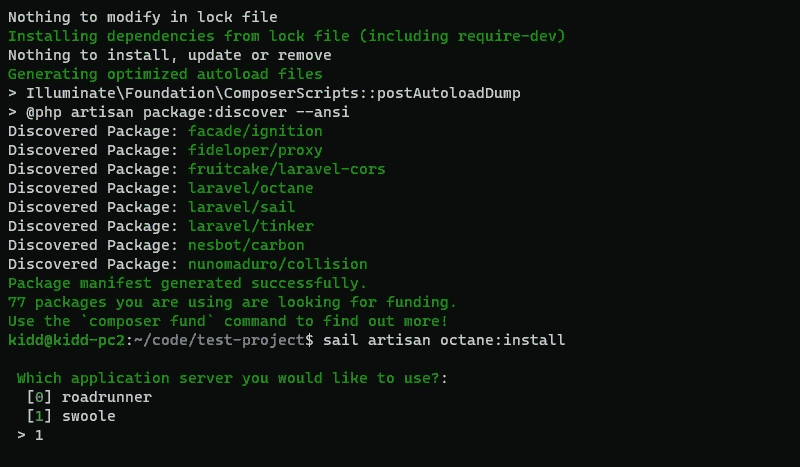
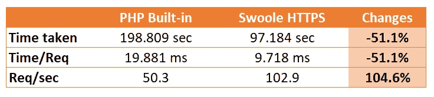

# 拉勒维尔和 HTTPS·斯沃勒一起航行

> 原文：<https://blog.devgenius.io/laravel-sail-with-https-swoole-ddab7f5303ec?source=collection_archive---------1----------------------->

大多数 PHP 应用程序都托管在 **LAMP** 或 **LEMP** 栈中， **Nginx+PHP-FPM** 组合速度快，易于配置，现在很流行。然而，PHP 的游戏规则改变者已经出现了。它为 PHP 带来了异步能力、真正的多线程和卓越的并发性能！

> [Victor Gazotti](https://medium.com/@victorgazotti/how-did-we-increased-our-php-app-performance-by-80-with-laravel-and-swoole-6b53d1092cab)&[Eldad a . Fux](https://eldadfux.medium.com/moving-from-nginx-fpm-to-swoole-has-increased-our-php-api-performance-by-91-40f62e51a064)用 **80% ~ 91%的性能增益**进行了测试！这听起来就像是打了类固醇的 PHP！

📝如果你是新人，请随意阅读[使用 Laravel Sail](https://medium.com/p/30276265e588)Kickstart 你的 Laravel 网络应用。

官方 [Laravel 文档](https://laravel.com/docs/8.x/octane)没有提供在 HTTPS 模式下设置 **Swoole 的方法(*目前还不支持*)。**


以下步骤将指导您使用 Swoole 服务器和 HTTPS 来设置辛烷🚀🚀🚀！

# 0.创建您的 Laravel 项目

创建一个空白项目，你可以在这里阅读教程。

```
cd ~/codecurl -s [https://laravel.build/test-project](https://laravel.build/test-project) | bashcd test-projectsail up -d
```

# 1.安装 Laravel 辛烷

安装 Laravel 辛烷

```
sail composer require laravel/octane
```

然后

```
sail artisan octane:install
```



选择 **1** 进行旋转

使用`code .`命令打开 VS 代码。

# 1.1 辛烷配置文件

✏️ **在`config/octane.php`文件中追加/编辑**

为 HTTPS 协议设置必要的选项，SSL 证书和密钥将由`Dockerfile`中的命令生成。您可以通过更改`enable-openssl`的值来打开/关闭 HTTPS SSL 功能，然后重新启动容器。

# 2.设置环境文件

✏️ **在`.env`文件中追加**

使用 Swoole 作为 Octane 服务器。标志`OCTANE_HTTPS`不是开启 SSL 功能，它只是关于 URL 前缀，你可以读[这个](https://laravel.com/docs/8.x/octane#serving-your-application-via-https)。

# 3.保持 Swoole 运行

我将使用 Laravel Octane 来替换 PHP 内置的 HTTP 服务器，我们需要始终保持 Octane 运行。

我需要通过发布配置文件来定制我们的 Sail:

```
sail artisan sail:publish
```

于是，✏️ **更新** `docker/8.0/supervisord.conf`(第 8 行)如[官方文档](https://laravel.com/docs/8.x/octane#swoole)所述。

Octane 必须重启才能应用您的文件更改，所以我也打开了上面命令中的`--watch`标志。然而，确保你也安装了 [Chokidar](https://github.com/paulmillr/chokidar) 文件监视库，你可以在[官方文件](https://laravel.com/docs/8.x/octane#watching-for-file-changes)中读到更多。

```
sail npm install --save-dev chokidar
```

# 4.Docker 配置

**A.** ✏️ **追加`docker-compose.yml`文件`ports`段【第 13 行】的**

我需要将港口`8000`映射到公共地图上

为了使上面的每个配置正常工作，我需要修改`docker/8.0/Dockerfile`。

**B.** ✏️ **添加**行用于具有适当文件夹权限的 SSL 自签名证书

> 你必须更新**最新的 sail 版本** ( > v1.8.4)，其中包括`apt`中的
> `*php8.0-swoole*`包，但没有`pecl`

开船后用户创建(~第 47 行)——
`RUN useradd -ms /bin/bash — no-user-group -g $WWWGROUP -u 1337 sail`

添加这些行…

由此产生的`Dockerfile`:

# 5.重建容器

用`sail down`关闭你的容器，然后用

```
sail build --no-cache
```

# 6.测试

您的 Swoole 应该已经启动并运行，您可以检查

```
sail artisan octane:status
```

并且同样打开浏览器，输入 [https://localhost:8000](https://localhost:8000) ，应该会打开带有 https 的 Laravel 欢迎页面。

我还使用 **ab** 运行了测试，以了解性能提高了多少…

```
ab -n 10000 -c 512 -H "Accept-Encoding: gzip, deflate" [https://localhost:8000/](https://localhost:8000/)
```

结果:

```
Server Software:        swoole-http-server
Server Hostname:        localhost
Server Port:            8000
SSL/TLS Protocol:       TLSv1.2,ECDHE-RSA-AES256-GCM-SHA384,2048,256
Server Temp Key:        X25519 253 bits
TLS Server Name:        localhostDocument Path:          /
Document Length:        17503 bytesConcurrency Level:      512
Time taken for tests:   97.184 seconds
Complete requests:      10000
Failed requests:        0
Total transferred:      185930000 bytes
HTML transferred:       175030000 bytes
Requests per second:    102.90 [#/sec] (mean)
Time per request:       4975.846 [ms] (mean)
Time per request:       9.718 [ms] (mean, across all concurrent requests)
Transfer rate:          1868.33 [Kbytes/sec] receivedConnection Times (ms)
              min  mean[+/-sd] median   max
Connect:        2   30  96.9      3     633
Processing:    56 4794 2417.4   4598   19666
Waiting:       17 4791 2418.0   4586   19665
Total:         60 4824 2403.2   4613   19668Percentage of the requests served within a certain time (ms)
  50%   4613
  66%   5592
  75%   6085
  80%   6398
  90%   7509
  95%   8599
  98%  10384
  99%  12929
 100%  19668 (longest request)
```

作为基线:默认的 PHP 内置服务器

```
ab -n 10000 -c 512 -H "Accept-Encoding: gzip, deflate" [http://localhost/](https://localhost:8000/)
```

结果:

```
Server Software:
Server Hostname:        localhost
Server Port:            80Document Path:          /
Document Length:        17490 bytesConcurrency Level:      512
Time taken for tests:   198.809 seconds
Complete requests:      10000
Failed requests:        0
Total transferred:      186310000 bytes
HTML transferred:       174900000 bytes
Requests per second:    50.30 [#/sec] (mean)
Time per request:       10179.014 [ms] (mean)
Time per request:       19.881 [ms] (mean, across all concurrent requests)
Transfer rate:          915.17 [Kbytes/sec] receivedConnection Times (ms)
              min  mean[+/-sd] median   max
Connect:        0    0   1.4      0       9
Processing:    26 9913 1863.2  10041   13891
Waiting:       15 9912 1863.2  10041   13890
Total:         28 9913 1862.1  10041   13891Percentage of the requests served within a certain time (ms)
  50%  10041
  66%  10549
  75%  11006
  80%  11085
  90%  11833
  95%  12221
  98%  12640
  99%  13391
 100%  13891 (longest request)
```

# 总结结果



您可以看到每秒请求数提高了 100%以上🤩！总时间被占用，时间/请求也减半！这个 Swoole 只是采用默认设置，您可以根据您的要求进行微调，以获得更理想的结果！

# 视频演示:

# 你准备好把你的网站放在网上，每月只需 10 美元就可以无限制地托管应用程序了吗？

Cloudways 提供了大量的功能，让你可以轻松托管你的 Laravel、WordPress 或任何 PHP 网站，而不用担心网络安全的噩梦。

现在，您可以在 BFCM 2022 活动期间享受额外折扣！


链接:【www.cloudways.com/en/?id=66136 

让我们开始尝试**云道**！

如果你喜欢我的文章，请鼓掌，关注并分享我的文章(或者你可以☕ [给我买杯咖啡](https://buy.stripe.com/7sI03C9S56Upcpi8ww) ☕)。保重，再见！