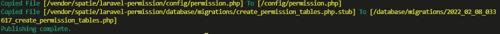

# Laravel 用户角色和权限

> 原文：<https://blog.devgenius.io/laravel-user-roles-and-permissions-6dbfd4abfcf8?source=collection_archive---------1----------------------->

## Laravel 从头开始创建管理面板——第 3 部分


在 [Unsplash](https://unsplash.com?utm_source=medium&utm_medium=referral) 上由[丹尼尔·赖斯](https://unsplash.com/@drice22?utm_source=medium&utm_medium=referral)拍摄的照片

在最后的[部分](/laravel-create-an-admin-panel-from-scratch-part-2-authentication-f0eb0bbd6139)，我们完成了管理面板的用户认证。在这一部分，我们将实现用户角色和权限。

*   第 1 部分— [安装](/laravel-create-an-admin-panel-from-scratch-part-1-installation-8c11dae7e684)
*   第 2 部分— [认证](/laravel-create-an-admin-panel-from-scratch-part-2-authentication-f0eb0bbd6139)
*   **第 3 部分—用户角色和权限**
*   第 4 部分— [权限管理的基本 Laravel CRUD 创建](/basic-laravel-admin-panel-basic-laravel-crud-creation-for-permission-management-6bd93fb0e1a2)
*   第 5 部分— [基于角色和权限的 CRUD 访问控制](/laravel-crud-access-control-based-on-role-and-permission-f190d03f1fa2)
*   第 6 部分— [带分页的基本搜索过滤器和列排序](/implements-a-basic-search-filter-and-column-sort-with-pagination-in-laravel-crud-5e3c70fb12ac)
*   第 7 部分— [为角色管理创建 UI](/create-ui-for-role-management-to-laravel-admin-panel-dce72b09d2ea)
*   第 8 部分— [Laravel 用户管理 CRUD](/basic-laravel-admin-panel-user-management-crud-45f694ef60cc)
*   第 9 部分— [创建账户更新页面](/laravel-create-an-account-update-page-for-admin-users-e123cd88f24b)
*   第 10 部分— [使用表单请求验证重构 Laravel 控制器](/restructuring-a-laravel-controller-using-form-request-validation-e546fe22c298)
*   第 11 部分— [使用服务&动作类](/restructuring-a-laravel-controller-using-services-action-classes-288b802122b5)重构 Laravel 控制器
*   第 12 部分— [在 Laravel 中创建可重用的刀片组件](/create-reusable-blade-components-in-laravel-5607d8f306a6)
*   第 13 部分— [在 Laravel CRUD](https://balajidharma.medium.com/implement-delete-confirmation-in-laravel-crud-2180f93b5a87) 中实施删除确认
*   第 14 部分— [从 Laravel Mix 迁移到 Vite](https://balajidharma.medium.com/how-to-migrating-from-laravel-mix-to-vite-fbb912237844)
*   第 15 部分— [验证电子邮件并定制电子邮件模板](/laravel-enable-user-registration-email-verification-and-customize-email-templates-b994299ab27d)
*   第 16 部分— [如何使用 Laravel Debugbar](/how-to-debug-laravel-app-using-laravel-debugbar-ec51a8587786) 调试 Laravel 应用
*   第 17 部分— [如何在现有应用程序上升级 Laravel Breeze](/how-to-upgrade-the-laravel-breeze-on-the-existing-application-8f742b48b632)
*   第 18 部分— [使用 Laravel Dusk 进行浏览器测试](/browser-testing-with-laravel-dusk-aeef2e8b30f8)
*   第 19 部分— [如何创建自己的 Laravel 包](/how-to-create-your-own-laravel-packages-2b68da22506a)
*   第 20 部分— [如何在 Packagist 上发布自己的 Laravel 包](/how-to-publish-your-own-laravel-package-on-packagist-ac9a084502ab)

多用户角色和权限控制是管理面板的必备功能。

# 斯帕蒂·拉勒维尔许可套餐

Spatie[Laravel-permission](https://github.com/spatie/laravel-permission)是管理数据库中用户权限和角色的最佳包。在这一部分，我们为我们的管理面板安装和使用这个包。

以下步骤涉及到为我们的 Laravel 管理面板设置角色和权限。

*   1.安装 Spatie Laravel-权限包
*   2.发布配置和迁移文件
*   3.运行迁移

## 1.安装 Spatie Laravel-权限包

使用 composer 命令安装软件包

```
sail composer require spatie/laravel-permission
```

## 2.发布配置和迁移文件

`vendor:publish` artisan 命令用于将包配置发布到 config 文件夹。此外，将迁移文件复制到迁移文件夹。

```
sail artisan vendor:publish --provider="Spatie\Permission\PermissionServiceProvider"
```



`Laravel artisan vendor:publish`

## 3.运行迁移

使用`artisan migrate`运行迁移

```
sail artisan migrate
```

现在我们成功地将 Spatie Laravel-permission 包安装到我们的管理面板中。软件包没有附带 UI。

在接下来的部分中，我们将在 Laravel 创建我们的第一个 CRUD。

# 将管理面板升级到 Laravel 9

Laravel 9 已经发布。我们将把我们的管理面板升级到 Laravel 9。

[Laravel 文档](https://laravel.com/docs/9.x/upgrade)中提供的所有升级信息

打开`composer.json`文件并更新以下依赖关系

*   `laravel/framework`到`^9.0`
*   `nunomaduro/collision`到`^6.1`
*   `php`至`^8.0.2`

此外，请在您的应用程序的`composer.json`文件中将`facade/ignition`替换为`"spatie/laravel-ignition": "^1.0"`。

请参考 Laravel [composer.json](https://github.com/laravel/laravel/blob/v9.0.0/composer.json) 文件

我们的最终版本`composer.json`

```
"keywords": ["framework", "laravel"],
     "license": "MIT",
     "require": {
-        "php": "^7.3|^8.0",
-        "fruitcake/laravel-cors": "^2.0",
-        "guzzlehttp/guzzle": "^7.0.1",
-        "laravel/framework": "^8.75",
-        "laravel/sanctum": "^2.11",
-        "laravel/tinker": "^2.5",
+        "php": "^8.0.2",
+        "fruitcake/laravel-cors": "^2.0.5",
+        "guzzlehttp/guzzle": "^7.2",
+        "laravel/framework": "^9.0",
+        "laravel/sanctum": "^2.14",
+        "laravel/tinker": "^2.7",
         "spatie/laravel-permission": "^5.5"
     },
     "require-dev": {
-        "facade/ignition": "^2.5",
         "fakerphp/faker": "^1.9.1",
         "laravel/breeze": "^1.7",
         "laravel/sail": "^1.0.1",
         "mockery/mockery": "^1.4.4",
-        "nunomaduro/collision": "^5.10",
-        "phpunit/phpunit": "^9.5.10"
+        "nunomaduro/collision": "^6.1",
+        "phpunit/phpunit": "^9.5.10",
+        "spatie/laravel-ignition": "^1.0"
     },
     "autoload": {
         "psr-4": {
```

文件更新后运行`composer update`

```
sail composer update
```

我们可以使用下面的命令检查 Laravel 版本

```
sail artisan --version// Laravel Framework 9.0.2
```

我们成功地将管理面板升级到了 Laravel 9

# GitHub 知识库

“基本 Laravel 管理面板”GitHub 库[https://github.com/balajidharma/basic-laravel-admin-panel](https://github.com/balajidharma/basic-laravel-admin-panel)

上一部分— 第 2 部分:[向 Laravel 应用程序添加用户认证的步骤](/laravel-create-an-admin-panel-from-scratch-part-2-authentication-f0eb0bbd6139)

下一部分—第 4 部分:[用于权限管理的 Laravel CRUD 创建](/basic-laravel-admin-panel-basic-laravel-crud-creation-for-permission-management-6bd93fb0e1a2)