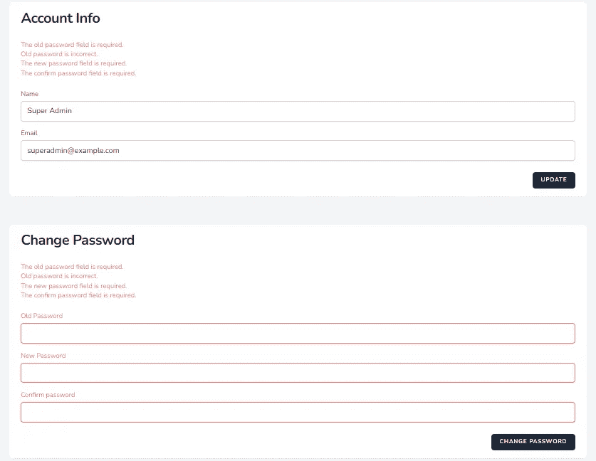
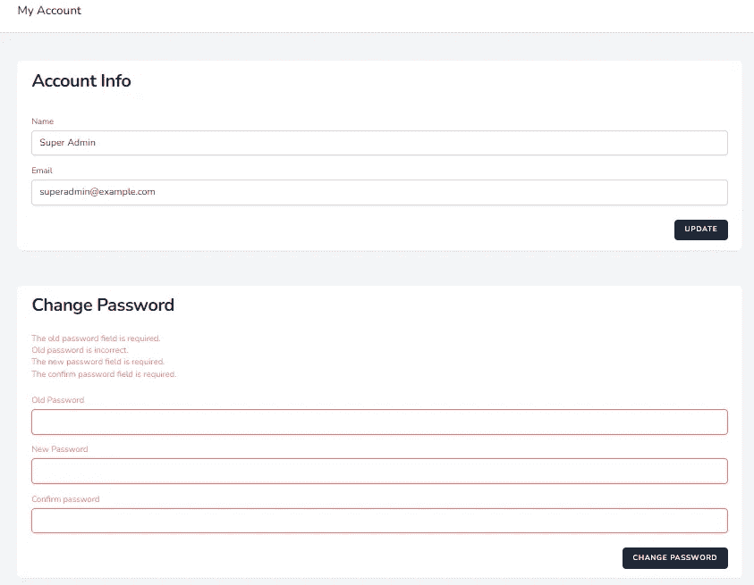

# 对同一页面上的多个表单进行验证

> 原文：<https://blog.devgenius.io/laravel-validation-for-multiple-forms-on-the-same-page-74ad420a5e6?source=collection_archive---------3----------------------->

## 在同一页面上显示多个表单的验证错误


照片由 [Max Chen](https://unsplash.com/@maxchen2k?utm_source=medium&utm_medium=referral) 在 [Unsplash](https://unsplash.com?utm_source=medium&utm_medium=referral) 上拍摄

我必须在同一个页面上实现两个表单，以便在 [Laravel 基本管理面板](https://github.com/balajidharma/basic-laravel-admin-panel)上更新配置文件。

一个表单用于基本信息，另一个用于密码更新。为了验证，在控制器中使用了`$request->validate()`方法

```
$request->validate([
    'name' => ['required', 'string', 'max:255'],
    'email' => ['required', 'string', 'email', 'max:255', 'unique:users,email,'.\Auth::user()->id],
]);
```

在视图中使用下面的代码来显示错误。

```
@if ($errors->any())
    <ul class="mt-3 list-none list-inside text-sm text-red-400">
        @foreach ($errors->all() as $error)
            <li>{{ $error }}</li>
        @endforeach
    </ul>
@endif
```

但是它在两个表单上都显示了错误，因为使用了相同的`$errors`变量来显示错误。



变量`$errors`将是`Illuminate\Support\MessageBag`的一个实例。为了解决这个问题，Laravel 采用了内置解决方案。我们可以将名字添加到 MessageBag 中。Laravel 是[命名的错误包](https://laravel.com/docs/9.x/validation#named-error-bags)

# 命名错误包

我们可以用多种方式添加命名错误。

*   1.重定向`withErrors`
*   2.`validateWithBag`方法

## 1.使用错误重定向

要向错误包添加名称，只需将名称作为第二个参数传递给`withErrors`

为帐户添加了“帐户”作为命名错误，并为密码更新表单添加了“密码”。

```
$validator = Validator::make($request->all(), [
    'name' => ['required', 'string', 'max:255'],
    'email' => ['required', 'string', 'email', 'max:255', 'unique:users,email,'.\Auth::user()->id],
]);if ($validator->fails()) {
    return redirect('admin.account.info')
                ->withErrors($validator, 'account')
                ->withInput();
}
```

更新视图错误显示的以下代码

## 如何在视图上显示命名的错误包

```
@if ($errors->account->any())
    <ul class="mt-3 list-none list-inside text-sm text-red-400">
        @foreach ($errors->account->all() as $error)
            <li>{{ $error }}</li>
        @endforeach
    </ul>
@endif
```

## 2.validateWithBag 方法

如果验证失败，我们可以使用`validateWithBag`方法将错误消息存储在一个名为[的错误包](https://laravel.com/docs/9.x/validation#named-error-bags)中:

```
\Validator::make($request->all(), [
    'name' => ['required', 'string', 'max:255'],
    'email' => ['required', 'string', 'email', 'max:255', 'unique:users,email,'.\Auth::user()->id],
])->validateWithBag('account');
```

同样，我们可以使用`$request->validateWithBag`

```
$request->validateWithBag('account', [
    'name' => ['required', 'string', 'max:255'],
    'email' => ['required', 'string', 'email', 'max:255', 'unique:users,email,'.\Auth::user()->id],
]);
```

添加以下代码以验证密码

```
$validator = \Validator::make($request->all(), [
    'old_password' => ['required'],
    'new_password' => ['required', Rules\Password::defaults()],
    'confirm_password' => ['required', 'same:new_password', Rules\Password::defaults()],
]);$validator->after(function ($validator) use ($request) {
    if ($validator->failed()) return;
    if (! Hash::check($request->input('old_password'), \Auth::user()->password)) {
        $validator->errors()->add(
            'old_password', 'Old password is incorrect.'
        );
    }
});$validator->validateWithBag('password');
```



对同一页面上的多个表单进行验证

感谢您的阅读！

如果错过了任何其他方法来显示多个表单的错误消息，请添加您的反馈和注释。