# laravel vs Ruby on Rails vs Symfony vs CodeIgniter vs CakePHP vs Yii vs Laminas(Zend)vs Django vs cubic web——利弊

> 原文：<https://blog.devgenius.io/laravel-vs-ruby-on-rails-vs-symfony-vs-codeigniter-vs-cakephp-vs-yii-vs-laminas-zend-vs-django-96726376b9a3?source=collection_archive---------3----------------------->

照片由来自[佩克斯](https://www.pexels.com/photo/blur-close-up-code-computer-546819/?utm_content=attributionCopyText&utm_medium=referral&utm_source=pexels)的[路易斯·戈麦斯](https://www.pexels.com/@luis-gomes-166706?utm_content=attributionCopyText&utm_medium=referral&utm_source=pexels)拍摄

建立一个有很多功能和创造性设计的复杂网站需要时间。如果你试图用 PHP 之类的 web 编程语言开发一个功能丰富的动态网站，你需要花费大量的时间。

使用 web 开发框架可以解决这个问题。现在有很多网站开发框架，比如 Laravel、Ruby on Rails、Symphony、CodeIgniter、CakePHP、Yii、Laminas、Django 和 CubicWeb。这样的例子不胜枚举。

这些框架不仅能节省您的时间，还能提供由专家编写的高质量代码，这意味着您用这些工具构建的网站将具有很高的质量。简而言之，web 框架允许您快速创建出色的 web 应用程序。

有这么多的 web 开发框架。你应该选择哪一个？

这篇博文比较了最流行的 web 开发框架。阅读每种技术的优缺点，决定哪种技术最适合您的项目。

# 拉勒韦尔

Laravel 于 2011 年 6 月发布，是一个用于 web 应用程序开发的流行 PHP 框架。由 Taylor Otwell 开发的这个工具可以让你快速创建动态网站。如果您想开发一个强大、复杂的 web 应用程序，连接到数据库，从数据库中获取数据，并操作它们，Laravel 将是您的绝佳选择。

Tempest House 建立了一个基于 Laravel 的框架，称为 Tempest Tools，可以节省您的时间。Tempest 工具的列表可以在[这里](https://www.tempest.house/tempest-tools)看到。

看一下官网详细了解一下。GitHub 页面有源代码和许多有用的信息。

官网:[https://laravel.com/](https://laravel.com/)

GitHub:[https://github.com/laravel/laravel](https://github.com/laravel/laravel)

**Laravel 工具:**

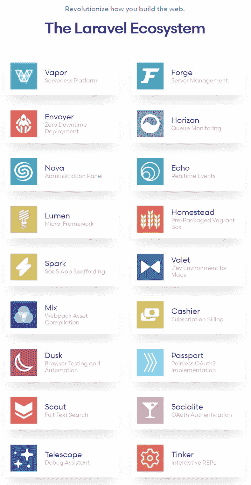

【[图片来源:Laravel 官网](https://laravel.com/)

上面截图中显示的 Laravel 工具可以帮助您在使用该框架构建 web 应用程序时轻松处理复杂的任务。

# 长期利息

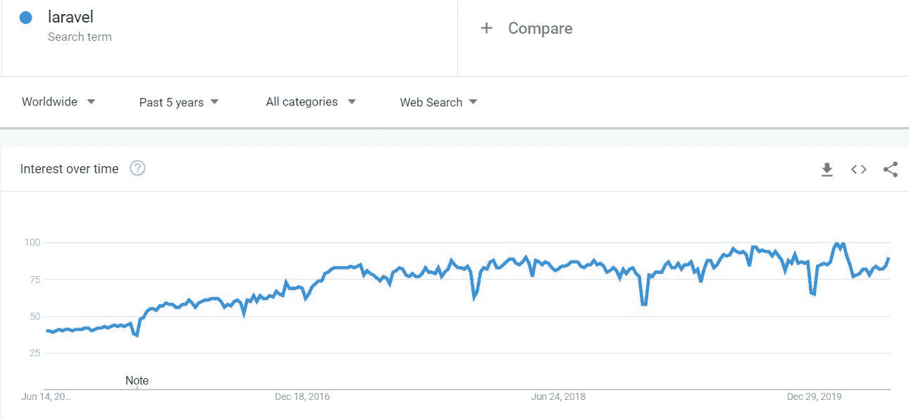

[ [图片来源:谷歌趋势](https://trends.google.com/trends/explore?date=today%205-y&q=laravel)

从上面的谷歌趋势图可以看出，全球对 Laravel 的兴趣相当浓厚。

# 按地区划分的利息

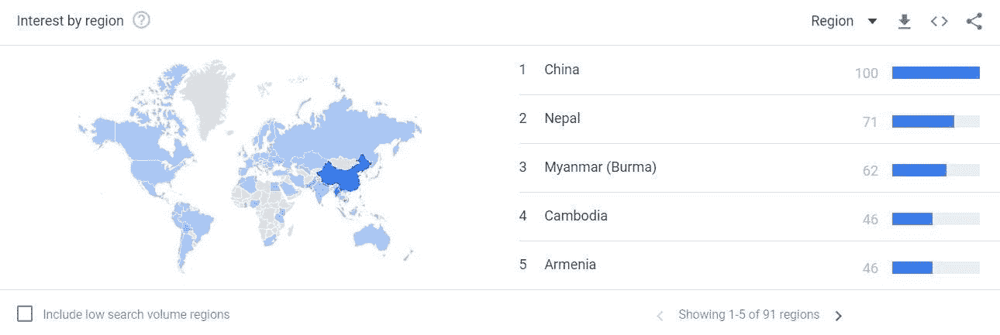

[ [图片来源:谷歌趋势](https://trends.google.com/trends/explore?date=today%205-y&q=laravel)

上图显示，这个框架在中国、尼泊尔、缅甸、柬埔寨、亚美尼亚等地非常流行。

# 用 Laravel 建立的网站

Laravel 支持许多流行网站，如 YourCountdown。To，Pizza Piraat，Eyeshot，FinTech Alliance，Roast My Site，Laravents，Htmlstream，Lightweight Hiker，LaravelPlay，Coliving.com，Clipr，Advensure，Neighborhood Lender，Laravel Tricks，MyRank，World Walking，Laravel Snippets，Mack Hankins，Larasocial，LaravelIO，Cachet 等等。

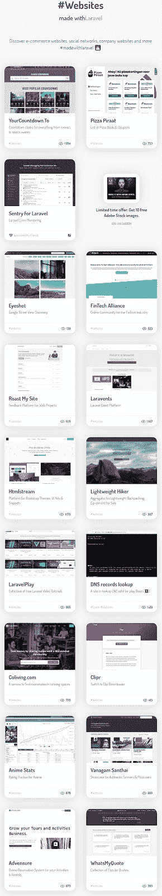

【【madewithlaravel.com】图片来源:T4

现在我们来讨论一下使用 Laravel 的好处和坏处。

# Laravel 的优点

Laravel 为您提供了数百种有趣的好处和有用的功能。下面只解释最重要的优点。

**惊人的学习资源:** Laravel 为你提供了优秀的、易于理解的官方学习资源。

一些重要的资源包括:

*   [Laravel 文档](https://laravel.com/docs/7.x)
*   [Laracasts](https://laracasts.com/) ，带截屏的课程
*   [Laravel 博客](https://blog.laravel.com/)
*   [拉勒维尔新闻](https://laravel-news.com/)
*   [Laravel 认证](https://certification.laravel.com/)
*   [论坛](https://laracasts.com/discuss)
*   拉拉康

除了官方教程和博客帖子，还有许多其他有用的课程和学习材料，例如:

*   [Laravel tutorial point 上的教程](https://www.tutorialspoint.com/laravel/index.htm)
*   Udemy 上的 Laravel 课程
*   Lynda 的 Laravel 课程
*   [关于 Zeolearn 的 Laravel 培训](https://www.zeolearn.com/php-development-with-the-laravel-framework-training)

你还会在 YouTube 上找到许多有用的免费视频教程。

**你可以用 PHP 编码:**如果你是一个 PHP 爱好者，或者有这么多用 PHP 编码的经验，这对你来说是个好消息。由于 Laravel 是一个 PHP 框架，你可以用这种语言编写代码。这对 PHP 爱好者来说是最好的好处之一。

Tempest House 的开发者喜欢 Laravel。事实上，这是这家 web 开发公司的首选 PHP 框架。

**MVC 结构:**MVC 结构让你以一种非常有组织和系统的方式编写代码。因此，您不再需要将所有的 HTML 和 PHP 代码保存在一个文件中。您可以按照 MVC 架构模式编写代码。

# 拉勒维尔的缺点

没有太多的内置支持: Laravel 没有提供太多的内置支持。换句话说，与 Ruby on Rails 和 Django 等其他框架相比，它没有足够的内置特性。因此，您需要使用第三方工具来解决这个问题，但是添加第三方工具会使开发过程变得复杂。

**没有那么强的社区支持:**社区支持不是很大。在撰写本文时，Laravel 的 GitHub 页面只有 527 个贡献者，而 Ruby on Rails 和 Symfony 等框架拥有大量的社区成员。

# Ruby on Rails

发布于 2004 年的 Ruby on Rails 是另一个优秀的 web 开发框架。这个 Ruby 框架是服务器端 web 应用程序开发的理想选择。这个工具是很多年前发明的。这是一个非常成熟的软件开发工具，由 David Heinemeier 创建。

写这篇文章时，它的最新版本是 Rails 6.0.3.1，于 2020 年 5 月 18 日发布。

官方网站:[https://rubyonrails.org/](https://rubyonrails.org/)

GitHub 页面:[https://github.com/rails/rails](https://github.com/rails/rails)

# 长期利息

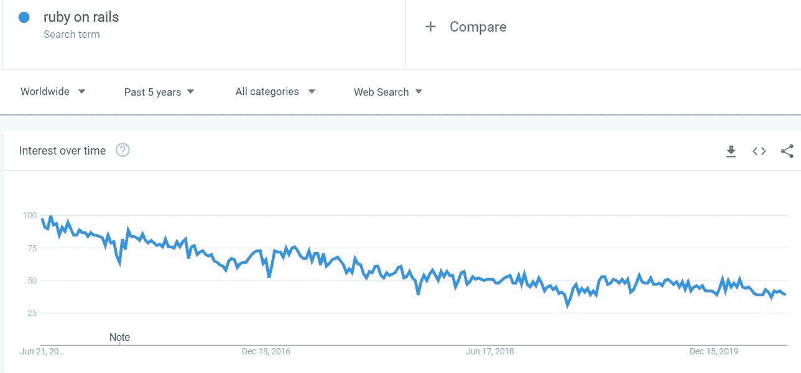

[ [图片来源:谷歌趋势](https://trends.google.com/trends/explore?date=today%205-y&q=ruby%20on%20rails) ]

这个图表显示 Ruby on Rails 的受欢迎程度在过去 5 年中略有下降。

# 按地区划分的利息

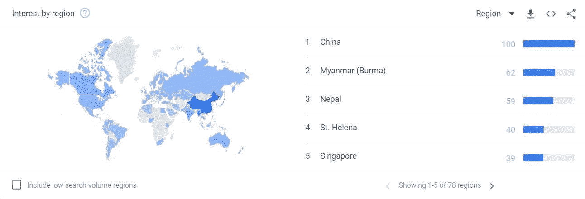

[ [图片来源:谷歌趋势](https://trends.google.com/trends/explore?date=today%205-y&q=ruby%20on%20rails)

如上图所示，Ruby on Rails 在新加坡、尼泊尔、圣赫勒拿岛、缅甸和中国等地区非常受欢迎。

# 用 Ruby on Rails 制作的网站

用 Rails 构建的一些最受欢迎的应用程序有 GitHub、Airbnb、Basecamp、Shopify、Twitch、SoundCloud、Square、Cookpad、Zendesk 和 Hulu。有成千上万的其他应用程序是用这个框架构建的。这些只是最著名的。

用这个框架制作的其他一些网站有 Twitter、互联网黄页、SlideShare、Urban Dictionary、Groupon 等等。

# Ruby on Rails 的优点

快速网站开发:这个框架最令人印象深刻的一个事实是，它可以让你非常快速地建立网站。您可以使用 Rails 库快速创建非常复杂的 web 应用程序，例如 [better_errors](https://github.com/charliesome/better_errors) 、[design](https://github.com/plataformatec/devise)、 [cancancan](https://github.com/CanCanCommunity/cancancan) 、 [delayed_job](https://github.com/collectiveidea/delayed_job) 、 [letter_opener](https://github.com/ryanb/letter_opener) 、 [mina](https://github.com/mina-deploy/mina) 、 [paperclip](https://github.com/thoughtbot/paperclip) 、 [simple_form](https://github.com/plataformatec/simple_form) 、 [rspec-rails](https://github.com/rspec/rspec-rails) 、 [factory_girl_rails](https://github.com/thoughtbot/factory_girl_rails) 、【16】

**通俗易懂的文档:**Ruby on Rails 的官方文档真的很棒。非常容易理解和完成。没有必要从其他资源学习，但是你总是可以选择尝试其他的学习材料，比如视频教程。

你可以在这里找到官方文档。

出色的社区支持:社区对 Ruby on Rails 的支持简直令人惊叹。经验丰富的贡献者正在努力使这个框架变得更好。你也可以为它做出贡献，因为它是一个开源工具。

超过 5000 人对这个项目做出了贡献。

你可以在诸如 [Ruby on Rails 讨论](https://discuss.rubyonrails.org/)、 [RailsConf](http://railsconf.com/) 和 [StackOverflow](http://stackoverflow.com/questions/tagged/ruby-on-rails) 等页面上看到这个社区。

你可以在这个页面的[上看到一长串 Rails 贡献者的名单。](https://contributors.rubyonrails.org/)

# Ruby on Rails 的缺点

**性能问题:**关于 Rails，提到最多的一个问题是它没有很好的性能。但你可以看到许多应用程序，如 GitHub 和 Basecamp，性能很好，没有可伸缩性问题。它可能有问题，但通过一些优化，你可以提高你的网络应用程序的速度。

**不太受欢迎的库的文档:**有许多不太受欢迎的 Rails 库。你在网上找不到太多关于他们的有用信息。所以学习如何使用它们可能有点困难。

**启动速度慢:**启动速度不好，对一个开发人员的生产力有负面影响。

# Symfony

Symfony 是另一个流行的 PHP 框架，用于构建快速 web 应用程序、web 服务、API 和微服务。用 PHP 编写，它是一个可重用的 PHP 组件的集合，可以节省您大量的时间。

这个 web 开发工具于 2005 年 10 月 22 日发布。它是由杨奇煜·波登西尔创造的。

官方网站:[https://symfony.com/](https://symfony.com/)

GitHub 页面:[https://github.com/symfony/symfony](https://github.com/symfony/symfony)

# 长期利息

[ [图片来源:谷歌趋势](https://trends.google.com/trends/explore?date=today%205-y&q=symfony) ]

# 按地区划分的利息

图片来源:谷歌趋势

如上图所示，这个工具在古巴和马达加斯加最受欢迎。它在突尼斯、立陶宛和塞内加尔等地区也很受欢迎。

# 使用 Symfony 的热门项目

一些最著名的 Symfony 支持的网站有 BlaBlaCar、DocPlanner、GoldenLine、eMAG、Spotify 等。

用 Symfony 构建的其他流行的 web 应用有 Dailymotion、Course Hero 等等。

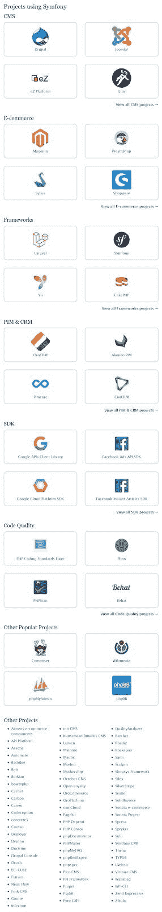

[ [图片来源:官方网站](https://symfony.com/projects) ]

# Symfony 的优点

**使用捆绑包和组件快速开发:** Symfony 为您提供了一系列高质量的捆绑包和组件，大大加快了您的开发工作。这些元素还为您的开发任务提供了极大的灵活性。

捆绑包类似于插件，降低了开发成本。组件允许您实现通用功能来简化应用程序开发过程。你也可以在框架中使用 Symfony 组件，比如 Laravel，也可以在普通的 PHP 项目中使用。

**易于维护和测试:**由于 Symfony 允许您使用模块、包和组件以系统的方式构建项目，因此 Symfony 项目易于维护。这个框架自动化了功能测试，节省了你大量的时间，PHPUnit 独立库使得单元测试更加容易。

**一个大型的、乐于助人的社区:** Symfony 有一个由乐于助人的开发人员组成的社区，他们积极参与改进 Symfony 项目，并在人们面临问题时提供帮助。所以这个框架越来越好。这对您来说是一个很大的优势，因为它会定期更新新特性，使您更容易完成开发任务。

这个框架的 GitHub 页面显示它有 23.6k 个明星和 2142 个贡献者，而官方网站报告 Symfony 有超过 600，000 个社区成员。

# Symfony 的缺点

**性能问题:**Symfony 讨论最多的一个问题就是它的性能问题。但是这个问题可以通过迁移到 PHP 的最新版本并遵循性能方面的编程最佳实践在一定程度上得到解决。

学习这个框架并不容易:与 Laravel 和 Yii 等其他框架相比，Symfony 更难学习。

# 表达

Express 是 Node.js 的一个强大的 web 开发框架。该框架允许您创建丰富的 web 和移动应用程序。这是互联网上最新的 web 开发技术之一。

基于 Express 搭建了很多框架，比如 Feathers、Poet、北海巨妖、LoopBack、KeystoneJS、ItemsAPI、NestJs、Expressive Tea、Kites、火车头，不胜枚举。

# 长期利息

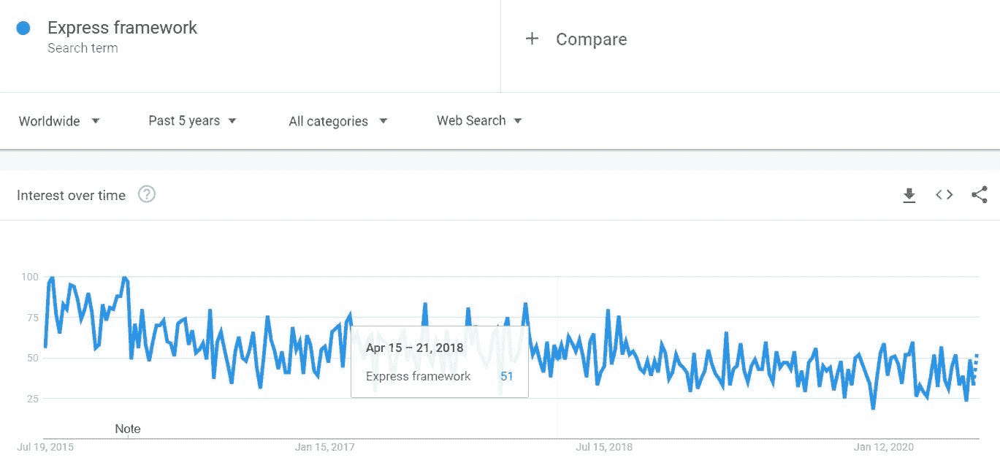

[ [来源:谷歌趋势](https://trends.google.com/trends/explore?date=today%205-y&q=Express%20framework)

# 按地区划分的利息

[ [来源:谷歌趋势](https://trends.google.com/trends/explore?date=today%205-y&q=Express%20framework)

# 用 Express 构建的网站

使用 Express 开发的一些著名网站有 MySpace、LearnBoost、Storify、Klout、Countly、Segment、Yummly、Koding、Cozy、Ghost、StudyNotes、Apiary、Glip、SimpleSet 等等。

# 快递的优点

最小和灵活:这个框架非常小和灵活。所以使用这个工具很容易。这个工具的有用特性使得应用程序开发变得更加容易。

**创建 API 轻而易举:**中间件和 HTTP 工具方法使得创建 API 几乎毫不费力。

**惊人的性能:**这个框架中的 web 应用程序开发特性的薄层让您可以构建高性能的 web 应用程序。

# 快递欺诈

据某[实际快递用户](https://www.quora.com/What-are-the-pros-and-cons-of-learning-ExpressJS)，

*   Express 显示的错误消息没有多大帮助。

# 代码点火器

发布于 2006 年 2 月 28 日的 CodeIgniter 是一个 PHP 开发框架，具有令人惊叹的特性。这是一个适合 web 应用程序开发的全栈框架。

官方网站:[https://codeigniter.com/](https://codeigniter.com/)

GitHub:[https://github.com/codeigniter4/CodeIgniter4](https://github.com/codeigniter4/CodeIgniter4)

这个框架最初是由 [EllisLab](https://www.ellislab.com/) 开发的，得到了 [BCIT](http://www.bcit.ca/cas/computing/) 的支持，目前是 CodeIgniter 基金会维护的一个项目。

# 长期利息

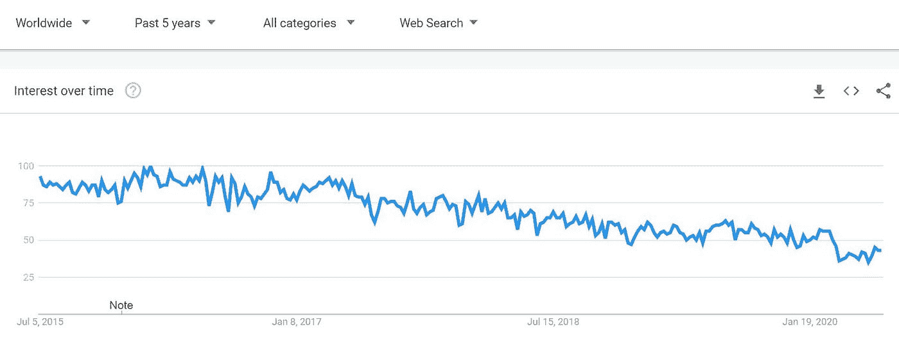

[ [来源:谷歌趋势](https://trends.google.com/trends/explore?date=today%205-y&q=%2Fm%2F02qgdkj)

该图表显示，随着时间的推移，CodeIgniter 的受欢迎程度略有下降。

# 按地区划分的利息

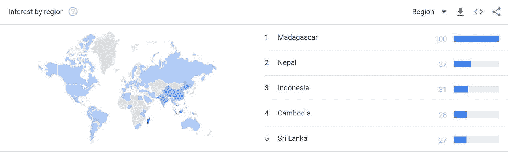

[ [来源:谷歌趋势](https://trends.google.com/trends/explore?date=today%205-y&q=%2Fm%2F02qgdkj)

如上图所示，CodeIgniter 在马达加斯加、尼泊尔、印度尼西亚、柬埔寨和斯里兰卡最受欢迎。

# CodeIgniter 应用

用这款应用开发工具搭建的热门网站和应用有卡西欧电脑的网站，Feedcump，The Mail & Guardian 的网站，Buffer，Nissan，Creditflux，McClatchy 的网站，Bonfire 等等。

你可以在这里看到一个更长的列表。

# CodeIgniter 的优点

这个框架占用空间很小: CodeIgniter 4 除了它的用户指南之外只有 1.2 MB。用户指南的大小为 6 MB。

**开发灵活性:**您可以使用 MVC 构建 CodeIgniter 应用程序，但也可以选择不使用 MVC。因此，它给你一些灵活性。您几乎可以毫不费力地配置这个框架。

**极大的安全性:** CodeIgniter 提供了内置的保护，可以抵御 XSS 攻击和 CSRF。CodeIgniter 4 为您提供了上下文敏感的 CSP 和转义。

# CodeIgniter 的缺点

一些 CodeIgniter 用户报告了以下问题。([来源](https://www.trustradius.com/products/codeigniter/reviews?qs=pros-and-cons)

*   CodeIgniter 缺乏现代的名称空间和自动加载器的使用。
*   会话管理存在一些问题。如果使用核心会话库，这个问题就解决了。
*   不适合非常大的项目。

# CakePHP

CakePHP 发布于 2005 年 4 月，是一个 PHP 框架，允许你用更少的代码快速构建 web 应用程序。这个网络开发工具是由 Cake 软件基金会开发和维护的。你可以在这里遇到团队[。](https://cakephp.org/pages/team)

官网:[https://cakephp.org/](https://cakephp.org/)

GitHub:[https://github.com/cakephp/cakephp](https://github.com/cakephp/cakephp)

# 长期利息

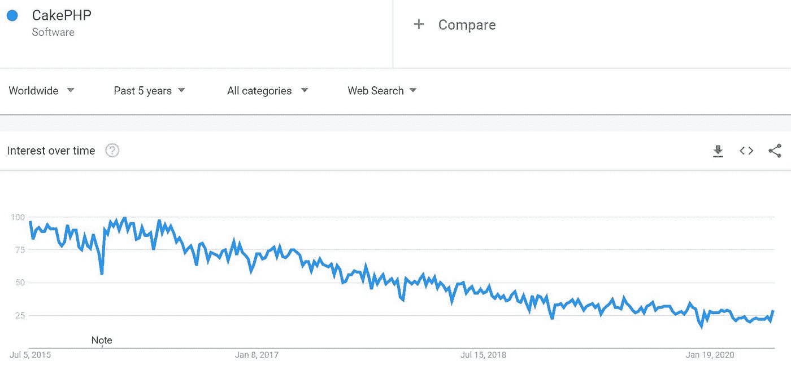

[ [来源:谷歌趋势](https://trends.google.com/trends/explore?date=today%205-y&q=%2Fm%2F09t3sp)

如上图所示，CakePHP 的受欢迎程度随着时间的推移而下降。

# 按地区划分的利息

[ [来源:谷歌趋势](https://trends.google.com/trends/explore?date=today%205-y&q=%2Fm%2F09t3sp)

如上图所示，这种框架在缅甸、日本、孟加拉国、突尼斯和塞浦路斯最为流行。

# 顶级 CakePHP 用户

像 Blendtec，Debtor Daddy，Sainsbury's Bank，Internet Marketing Ninjas，Axia Technologies 和 Printivo.com 这样的大公司都使用过 CakePHP。

# CakePHP 的优点

**快速开发:**搭建和代码生成特性支持快速应用开发。您可以用最少的努力来配置这个框架。翻译、身份验证、缓存、验证和数据库访问等内置功能大大加快了应用程序的开发过程。

强大的安全性: CakePHP 为您的 web 应用程序提供了强大的安全性。SQL 注入预防、CSRF 保护、表单篡改保护和数据验证是它的一些重要的安全特性。

**出色的帮助和支持:**你从社区获得惊人的免费支持，从 CakeDC 获得[付费支持](http://www.cakedc.com/)。你可以在 [StackOverflow](https://stackoverflow.com/tags/cakephp) 、 [Slack](https://cakesf.herokuapp.com/) 、 [IRC](https://kiwiirc.com/client/irc.freenode.net#cakephp) 和[论坛](http://discourse.cakephp.org/)上获得大力支持。

# CakePHP 的缺点

一些 CakePHP 用户报告了以下问题。([来源](https://www.trustradius.com/products/cakephp/reviews))

*   模型中的关系有点难以使用。
*   缩放问题
*   与 Laravel 等其他框架相比，CakePHP 更加复杂。所以学习这个工具需要相对更多的时间。

# Yii

Yii 是一个用于 web 应用程序开发的强大 PHP 框架。它的 alpha 版本于 2006 年 10 月发布，而 Yii 1.00 于 2008 年 12 月发布。

官方网站:[https://www.yiiframework.com/](https://www.yiiframework.com/)

GitHub:[https://github.com/yiisoft/yii2](https://github.com/yiisoft/yii2)

# 长期利息

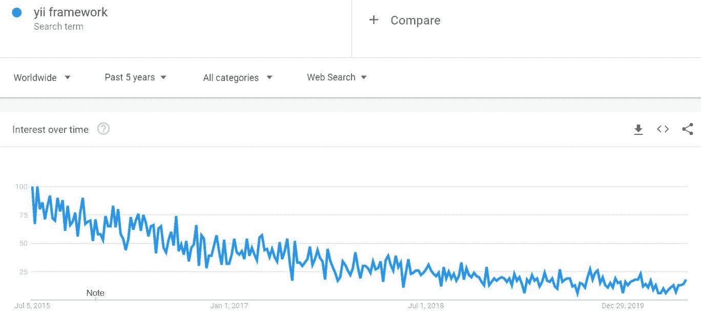

[ [来源:谷歌趋势](https://trends.google.com/trends/explore?date=today%205-y&q=yii%20framework)

Yii 的受欢迎程度在过去 5 年里有所下降。

# 按地区划分的利息

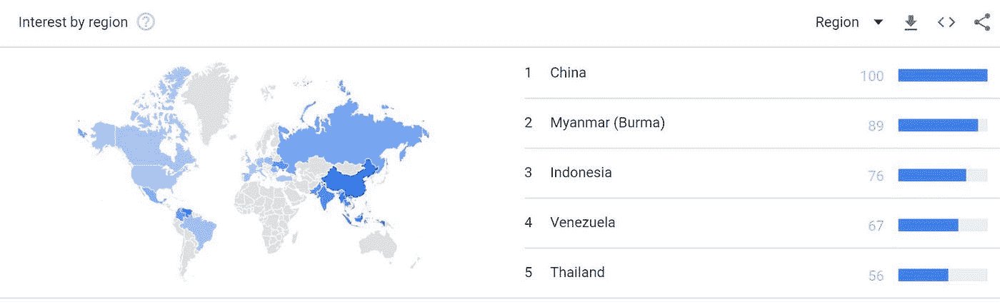

来源:谷歌趋势

Yii 在中国、缅甸、印度尼西亚等地最受欢迎。

# 用 Yii 构建的 Web 应用程序

使用 Yii 框架开发的一些 web 应用有 Codermap、Luya CMS、Spinitron v2、Craft CMS、HumHub、Curtos.pt、Barakatalan 等等。

Yii 支持的网络应用列表可以在[这里](https://yiipowered.com/en)找到。

# Yii 的优点

**快速应用开发:**快速应用开发是 Yii 最令人兴奋的特性之一。它给你所有的工具和功能来快速完成一个 web 开发项目。使用代码生成和 API，您可以高效地编写代码。

**惊人的安全性:** Yii 通过为你提供内置的工具和默认值，让你编写安全的代码。

**强大的官方支持:**这个框架有大量的官方学习资料，可以让你轻松地学习这个工具。在官方网站上，你会找到有用的书籍、文档和其他学习资料，帮助你掌握这个框架。他们的网站上还有一个[实时聊天](https://www.yiiframework.com/chat)功能，这样你就可以消除任何疑问。

# Yii 的缺点

根据一些[实际 Yii 用户](https://www.trustradius.com/products/yii-framework/reviews#:~:text=main%20backend%20technology.-,Pros%20and%20Cons,read%20documentation%20and%20implement%20it.)，这里有几个缺点:

*   Yii 的视图模板引擎非常简单。如果再精致一点就更好了。
*   扩展主题化功能应该更容易。
*   缺少预建的 REST API 集成工具。

# 叶片

Laminas 项目，以前被称为 Zend framework，是一个非常棒的开源 web 开发工具，得到了广大开发人员的支持。

Zend 于 2006 年 3 月 3 日发布，由 Zend Technologies 开发。

Zend 框架现在已经变成了具有许多令人兴奋的新特性的 lamps 项目，经过了惊人的改进。

**官网:**[https://getlaminas.org/](https://getlaminas.org/)

**GitHub:**[https://github.com/laminas](https://github.com/laminas)

# 海带的优点

**内置组件:** Laminas 为您提供了一套丰富的预制组件来满足您所有的 web 开发需求。这些组件将大大加快你的开发工作，完成你的网络项目将变得更加容易。

**高质量的文档:**Laminas 的官方网站提供易于理解的文档和教程，便于快速学习。

# 薄片的缺点

*   海带是一个比较新的项目。虽然它有很棒的官方文档，但你不会在网上找到足够的教程。
*   由于它不像 Laravel 和 Rails 那样受欢迎，从社区中寻找支持可能会很困难。例如，如果你在某个地方遇到困难，你不会在网上找到很多人来帮助你。
*   没有足够的插件来解决你的开发问题，你可能不得不选择昂贵的插件来扩展这个框架的功能。

# 姜戈

Django 于 2005 年 7 月 21 日发布，是现代 web 应用程序开发的流行 Python 框架。这个框架是由 Adrian Holovaty 和 Simon Willison 开发的。

官方网站:[https://www.djangoproject.com/](https://www.djangoproject.com/)

GitHub:[https://github.com/django/django](https://github.com/django/django)

# 长期利息

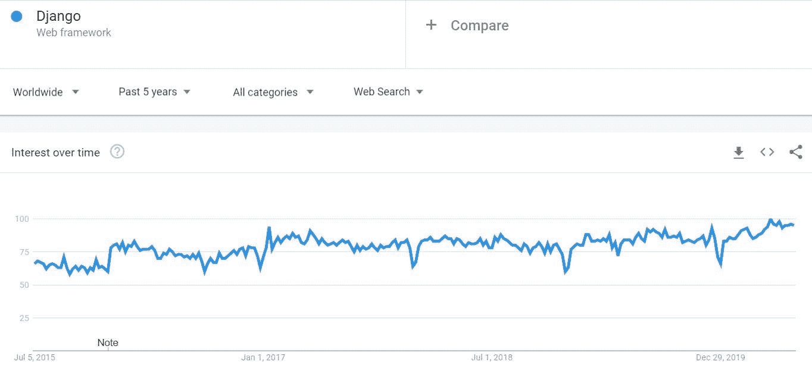

[ [来源:谷歌趋势](https://trends.google.com/trends/explore?date=today%205-y&q=%2Fm%2F06y_qx)

随着时间的推移，Django 的受欢迎程度略有上升。

# 按地区划分的利息

[ [来源:谷歌趋势](https://trends.google.com/trends/explore?date=today%205-y&q=%2Fm%2F06y_qx)

上面的世界地图显示了 Django 在不同地区的受欢迎程度。

# 使用这个框架的网站

像 Discus、Mozilla、Pinterest、Instagram、Open Knowledge Foundation、Knight Foundation、Spotify、YouTube、Washington Post、DropBox、Eventbrite 和 BitBucket 这样的大网站都在使用 Django。

# 姜戈的优点

**极速发展:**选择 Django 的最好理由之一就是快速发展。由于 Django 处理站点地图、用户认证、RSS 提要和内容管理，您可以快速完成您的 web 项目。无论您需要构建一个内容管理系统、一个社交网站还是一个计算平台，使用 Django 都可以非常快速地完成。

高度可伸缩性:这个框架可以让你构建高度可伸缩的 web 应用。用这个工具构建的顶级站点没有可伸缩性问题，即使它们拥有数百万用户。Django 的“无共享”架构允许您在任何级别非常灵活地添加硬件。

强大的安全性: Django 为您的网站增加了极大的安全性。它保护您免受 SQL 注入、点击劫持、跨站脚本等攻击。它为您提供了一个安全的用户认证系统。

# 姜戈的缺点

*   **性能问题:** Python 显然不是最快的语言，Django 的架构也不能保证很好的性能，尽管你可以通过遵循一些优化规则来提高你的站点的速度。
*   **缺乏约定:**由于约定存在一些不足，开发者面临一些问题。与 Ruby on Rails 等开发工具相比，它缺少一些约定。
*   **不适合小型静态网站:** Django 绝对不是小型静态网站的好选择。如果你试图用这个工具建立一个静态网站，你将不得不在这个简单的任务上花费太多的时间。

# 立方体网络

用 Python 编写的 CubicWeb 是一个非常棒的 Web 应用程序开发框架，允许你快速建立网站。它允许您重用称为立方体的组件来快速开发应用程序。

这个框架发布于 2001 年，由 Logilab 创建。

官方网站:[https://www.cubicweb.org/](https://www.cubicweb.org/)

# 长期利息

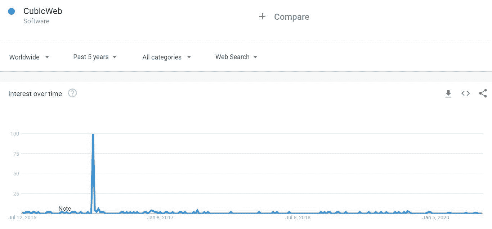

[ [来源:谷歌趋势](https://trends.google.com/trends/explore?date=today%205-y&q=%2Fm%2F064p895)

# 按地区划分的利息

[ [来源:谷歌趋势](https://trends.google.com/trends/explore?date=today%205-y&q=%2Fm%2F064p895)

这张图显示了 CubicWeb 在印度、法国等地最受欢迎。

# 用 CubicWeb 建立的网站

用 CubicWeb 制作的一些网站有 CubicWeb.org、LogiLab.org、semweb.pro、zemantica.com 等等。更长的名单可以在[这里](https://www.cubicweb.org/blogentry/2089986)看到。

# 立方网的优点

可重用组件: CubicWeb 为您提供了一组可重用组件，让您可以非常快速地构建 Web 应用程序。因此，不用重新发明轮子，您可以使用预制组件快速完成您的网站项目。

**Python 的威力:** CubicWeb 让你用 Python 写代码。因此，如果您是 Python 爱好者，这对您来说是一个巨大的好处。有了这个框架，您就可以获得 Python 语言的强大功能。

**面向对象编程:**这个 web 开发工具遵循面向对象编程原则。所以，有了这个框架，你就有了面向对象的能力。

# 立方网的缺点

*   **缺乏特性:**与其他现代 web 开发工具相比，这个框架没有太多特性。
*   **缺乏社区支持:**与其他框架(如 Laravel 和 Ruby On Rails)相比，社区对该框架的支持并不是很好。
*   **缺乏学习资源:**如果一个 app 开发工具没有足够的学习资源，学习框架可能会比较困难。截至目前，如果你用谷歌搜索“CubicWeb 教程”，只会显示 18500 个结果，这一点也不令人印象深刻。

# 最后的想法

在这篇博文中，我比较了九种不同的 web 开发框架，并提到了它们的优缺点。通过阅读利弊和其他细节，您可以对这些框架有一个清晰的了解。如果您想了解某个特定框架的更多信息，只需访问其官方网站。

你需要根据你有什么样的 web 开发项目来选择一个框架。我希望，到现在为止，您已经能够选择一个 web 开发工具来有效地解决您的问题。

需要开发一个网站吗？如果您没有时间或专业知识来构建一个优秀的 web 应用程序，请随时联系我们。我们可以在您的预算范围内，使用您选择的框架为您构建一个出色的网站。