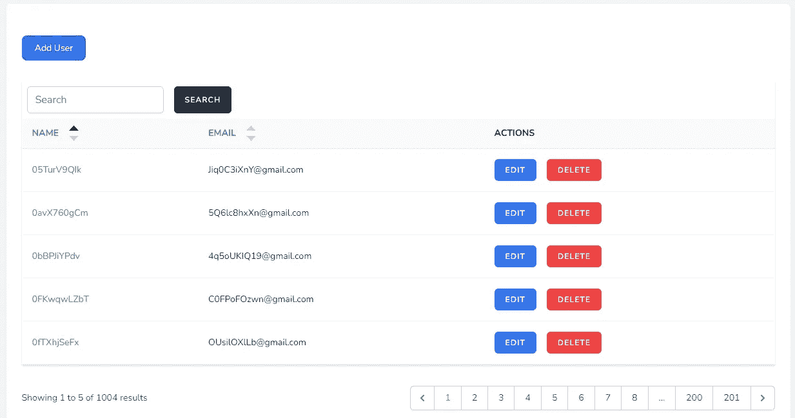
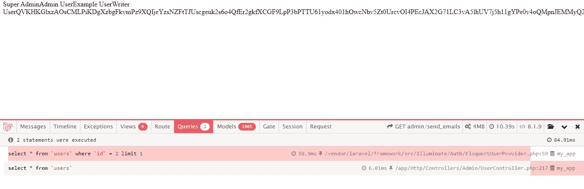
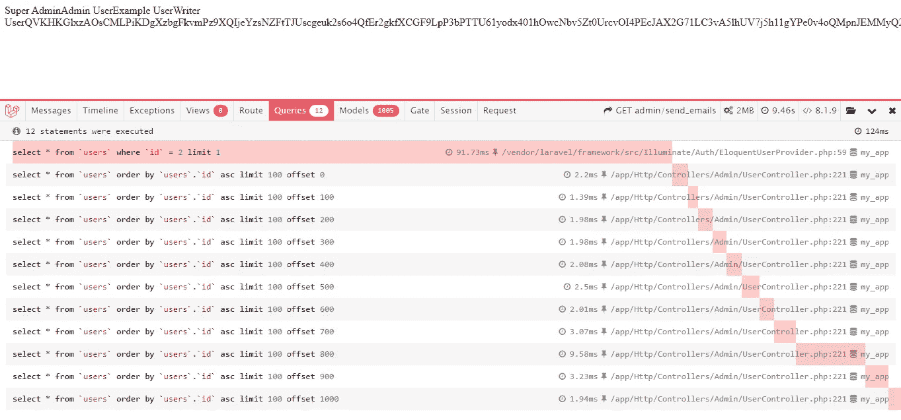
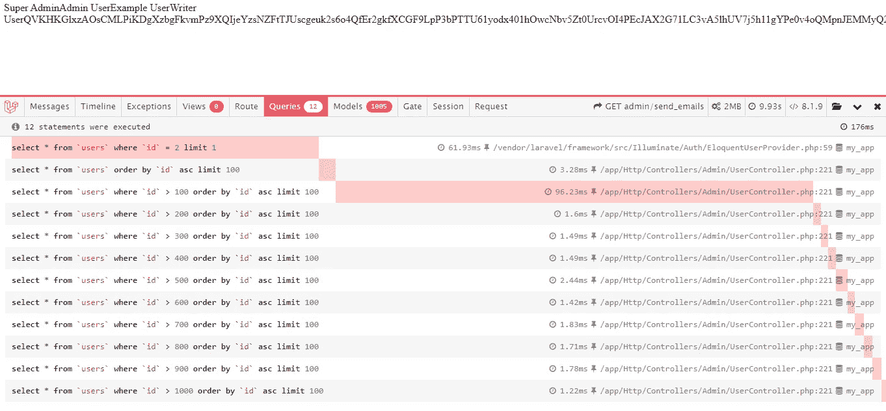

# Laravel 使用 chunk 方法处理大型数据库记录

> 原文：<https://blog.devgenius.io/laravel-works-with-large-database-records-using-the-chunk-method-9b69f41264da?source=collection_archive---------0----------------------->

## Laravel 分块数据库查询结果


[斯文·布兰德斯马](https://unsplash.com/@seffen99?utm_source=medium&utm_medium=referral)在 [Unsplash](https://unsplash.com?utm_source=medium&utm_medium=referral) 上的照片

您的应用程序数据库记录每天都会增加。作为一名开发人员，在处理大型表记录时，我们面临着性能和服务器内存问题。在这篇博客中，我们将处理大型表记录，并解释雄辩的 [chunk](https://laravel.com/docs/9.x/queries#chunking-results) 方法的重要性。

我们需要一个演示应用程序来处理大量记录。

## **1。Laravel 安装**

像往常一样，我们将在本地安装[基本的 Laravel 管理面板](https://github.com/balajidharma/basic-laravel-admin-panel)。这种基本的管理员是由具有角色和权限的用户提供的。

[基本 Laravel 管理面板](https://github.com/balajidharma/basic-laravel-admin-panel)基于 [Laravel Sail](https://github.com/laravel/sail) 。什么是帆？ [Sail](https://laravel.com/docs/8.x/sail) 是一个内置的解决方案，用于使用 [Docker](https://www.docker.com/) 运行您的 Laravel 项目。

参考[https://github . com/balajidharma/basic-laravel-admin-panel #安装](https://github.com/balajidharma/basic-laravel-admin-panel#installation)步骤，完成安装。

## 2.演示数据

对于演示记录，我们将使用 Laravel [播种器](https://laravel.com/docs/9.x/seeding#writing-seeders)在用户表上创建虚拟用户。要生成一个播种机，执行`make:seeder` [Artisan 命令](https://laravel.com/docs/9.x/artisan)。

```
./vendor/bin/sail php artisan make:seeder UserSeederINFO  Seeder [database/seeders/UserSeeder.php] created successfully.
```

打开位于`database/seeders/UserSeeder.php`上的生成的种子文件，用下面的代码更新。

```
<?phpnamespace Database\Seeders;use Illuminate\Database\Seeder;
use Illuminate\Support\Facades\DB;
use Illuminate\Support\Facades\Hash;
use Illuminate\Support\Str;class UserSeeder extends Seeder
{
    /**
     * Run the database seeds.
     *
     * @return void
     */
    public function run()
    {
        for ($i=0; $i < 1000; $i++) { 
            DB::table('users')->insert([
                'name' => Str::random(10),
                'email' => Str::random(10).'@gmail.com',
                'password' => Hash::make('password'),
            ]);
        }
    }
}
```

现在使用下面的 Artisan 命令运行播种机。完成播种需要额外的时间。

```
./vendor/bin/sail php artisan db:seed --class=UserSeeder
```



在 Artisan 命令之后，在用户列表页面[http://localhost/admin/user](http://localhost/admin/user)上验证创建的用户

## 3.处理大量记录

现在我们要处理大量的用户记录。假设我们需要向所有用户发送黑色星期五优惠通知电子邮件。通常，我们生成新的 [Artisan 命令](https://laravel.com/docs/9.x/artisan#generating-commands)并通过使用调度器任务发送电子邮件。

## 内存问题

我们将获取所有用户，并在每个循环内发送电子邮件。

```
$users = User::all();
$users->each(function ($user, $key) {
    echo $user->name;
});
```

如果您有数百万条记录，或者如果您的结果集合有许多关系数据，您的服务器将抛出**允许的内存字节数用尽**错误。

为了解决这个问题，我们将通过在数据库或缓存中保存限制来处理有限的数据。

**示例:**我们第一次获取 100 条记录，并将这 100 条记录保存在数据库表中。
下次获取 100 到 200 条记录，并将这 200 条记录保存在数据库中。所以这种方法涉及额外的获取和更新。此外，我们需要在处理完所有记录后停止作业。

Laravel 提供了雄辩块方法的内置解决方案来处理大记录

## 4.拉勒维尔雄辩组块法

Laravel 雄辩检查方法一次检索一小部分结果，并将每一部分结果送入闭包进行处理。

```
User::chunk(100, function ($users) {
    foreach ($users as $user) {
        echo $user->name;
    }
});
```

## 5.理解组块法

我将在用户控制器中创建一个函数，并详细解释检查方法。

打开 routes/admin.php 并添加以下路由

```
Route::get('send_emails', 'UserController@sendEmails');
```

现在打开 app/Http/Controllers/Admin/user controller . PHP，添加`sendEmails`方法。

**不带块:** 添加以下代码后，打开[http://localhost/admin/send _ emails](http://localhost/admin/send_emails)页面

```
public function sendEmails()
{
    $users = User::all();
    $users->each(function ($user, $key) {
        echo $user->name;
    });
}
```

打开 Laravel Debugbar 查询面板。`**select** * **from** `users``将获取所有 1000+记录。



**用组块法:** 用下面的代码替换相同的函数，在浏览器中查看页面。

```
public function sendEmails()
{
    User::chunk(100, function ($users) {
        foreach ($users as $user) {
            echo $user->name;
        }
    });
}
```

chunk 方法添加限制并处理所有记录。因此，如果使用 chunk，它当时会处理 100 个记录集合。所以没有更多的内存问题。



## 6.什么是`chunkById`？

这个`chunkById`方法将根据记录的主键自动对结果进行分页。为了理解它，再次用下面的代码更新`sendEmails`方法

```
public function sendEmails()
{
    User::chunkById(100, function ($users) {
        foreach ($users as $user) {
            echo $user->name;
        }
    });
}
```

现在用户`id`在`where`条件下加上 100 的限制。



```
// chunkById
select * from `users` where `id` > 100 order by `id` asc limit 100
select * from `users` where `id` > 200 order by `id` asc limit 100
select * from `users` where `id` > 300 order by `id` asc limit 100// chunk
select * from `users` order by `users`.`id` asc limit 100 offset 0
select * from `users` order by `users`.`id` asc limit 100 offset 100
select * from `users` order by `users`.`id` asc limit 100 offset 200
```

当更新或删除`closure`中的记录时，建议使用`chunkById`(在循环中)。

## 7.结论

当您处理大量记录时，雄辩的 [chunk](https://laravel.com/docs/9.x/queries#chunking-results) 方法是一个非常有用的方法。还有，读一下收集[检查](https://laravel.com/docs/9.x/collections#method-chunk)的方法。

感谢您的阅读。

敬请关注更多内容！

【balajidharma.medium.com】跟我来[](https://balajidharma.medium.com/)*。*