# 在定制 VPC 推出 EC2

> 原文：<https://blog.devgenius.io/launching-an-ec2-in-custom-vpc-2f55d721b89?source=collection_archive---------7----------------------->

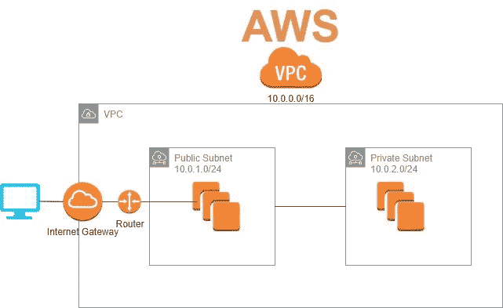

嗨，大家好，欢迎回到我的博客！这篇文章将非常简要地介绍如何在定制虚拟私有云(VPC)中启动 Ec2。本教程将教你如何从头开始设置一个 VPC。虽然 AWS 让您选择创建一个包含您需要的所有内容的组件，但我相信了解所有组件实际上是如何协同工作的基础是有好处的。在我们开始之前，让我们直接从 AWS 文档中了解一下什么是 VPC…

*   什么是 VPC？ [AWS 虚拟私有云](https://docs.aws.amazon.com/vpc/latest/userguide/what-is-amazon-vpc.html)(或简称 VPC)使您能够将 AWS 资源启动到您定义的虚拟网络中。这个虚拟网络非常类似于您在自己的数据中心运行的传统网络，具有使用 AWS 的可扩展基础架构的优势。简而言之，VPC 是你的 AWS 云的私人空间，用于启动和配置你自己的资源，同时仍然能够利用亚马逊的云，与内部数据中心相比，亚马逊的云具有高可用性、高可扩展性和高耐用性。查看上面的链接，直接从 AWS 文档中获取更多信息。

现在让我们进入今天项目的目标:

1.  使用 CIDR 10.10.0.0/16 创建一个 VPC
2.  在 VPC 用 Amazon Linux 操作系统启动一个 EC2 实例
3.  SSH 进入实例并打印 IP 地址，以验证您在 VPC CIDR

好了，现在我们知道了什么是 VPC，什么是客观的，我们可以开始了！随着我们进入每一步，将会有更多的定义…

**第一步** -创建你的 VPC

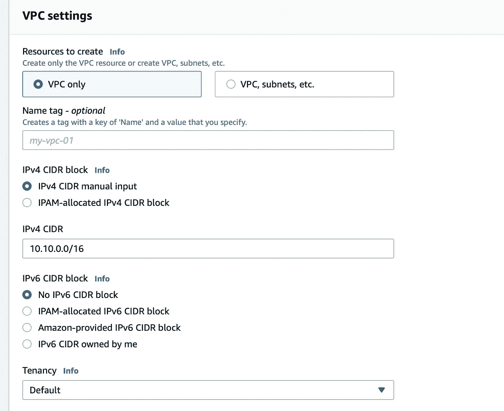

在 AWS 控制台的搜索栏中，搜索 VPC 并选择创建。有一个选项可以创建一个 VPC，让 AWS 为您配置所有的资源，但是这会让您失去学习基础知识的乐趣，所以让我们自己创建它吧！我们要做的第一件事是用标签给 VPC 命名。第二是给它一个 IPv4 CIDR 块。CIDR 代表[无类域间路由](https://www.google.com/search?q=what+is+a+CIDR+block&client=safari&rls=en&sxsrf=APq-WBuzAHmD4bI5N65GKCcM_e4PkvbgYQ%3A1647321282260&ei=wiAwYszID-2pggfSxLGACQ&ved=0ahUKEwjMsfD-rcf2AhXtlOAKHVJiDJAQ4dUDCA0&uact=5&oq=what+is+a+CIDR+block&gs_lcp=Cgdnd3Mtd2l6EAMyBQgAEIAEMgUIABCABDIGCAAQFhAeMgYIABAWEB4yBggAEBYQHjIGCAAQFhAeMgYIABAWEB4yBggAEBYQHjIGCAAQFhAeMgYIABAWEB46BwgjELADECc6BwgAEEcQsAM6BwgAELADEEM6BAgjECc6CggAEIAEEIcCEBRKBAhBGABKBAhGGABQlwNYwgpgrQxoAXAAeACAAY4BiAHRA5IBAzUuMZgBAKABAcgBCsABAQ&sclient=gws-wiz)，是一种分配 IP 地址和 IP 路由的方法。一个 [CIDR 块](https://www.techtarget.com/searchnetworking/definition/CIDR)是一组共享相同前缀并包含相同位数的地址。记住这个解释，因为我们以后需要理解它。

**第二步** -创建你的子网

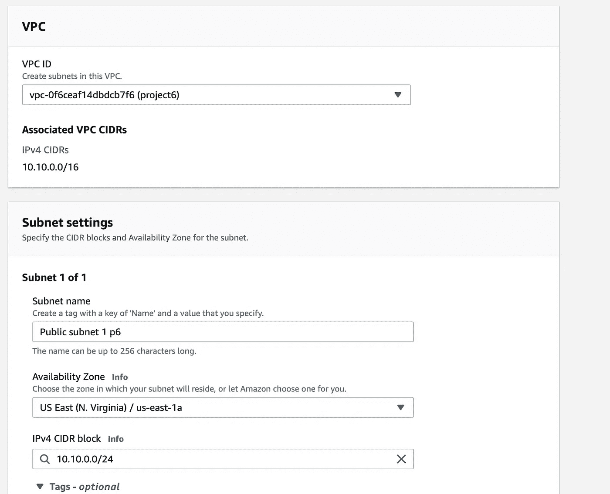

创建 VPC 后，滚动到屏幕一侧并单击子网，您将进入此屏幕。现在，您只需将您的 VPC 指定给我们刚刚创建的那个，并选择其余的选项。此外，请确保您保持在您的 IPv4 CIDR 阻止范围内！

在我们继续之前，什么是子网？一个[子网络或子网](https://en.wikipedia.org/wiki/Subnetwork)是一个 IP 网络的细分。将一个网络分成两个或多个网络的做法称为子网划分。

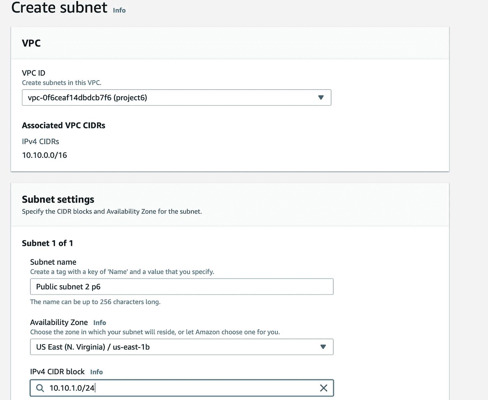

仅供参考，您通常会创建两个子网，因为您实际上是在拆分网络。如果您使用的是 bastian 主机(查看我以前的项目中的名称),这可能会发挥作用，因为它充当通往 VPC 内部更深子网的网关，出于安全原因，这些子网是不公开的。然而，这个子网将不会用于这个项目。我只是想贴出来给你看看 CIDR 街区。不是 10.10.0.0/24，是 10.10.1.0/24。

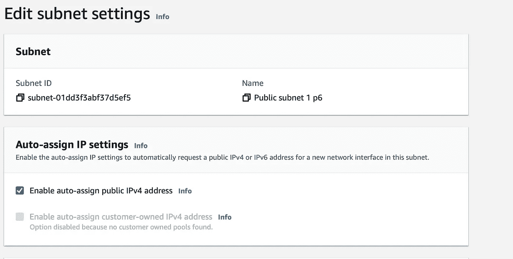

子网启动并运行后，单击子网本身，然后单击编辑子网设置。您可以在这里启用自动分配公共 IPv4 地址。例如，当您尝试 SSH 到您的 EC2 实例时，这就开始起作用了，它一直超时。原因是因为你的 EC2 没有一个公共 IP…我在我的 bastian 主机项目中经历了惨痛的教训！

**步骤 3** -创建您的路由表和互联网网关

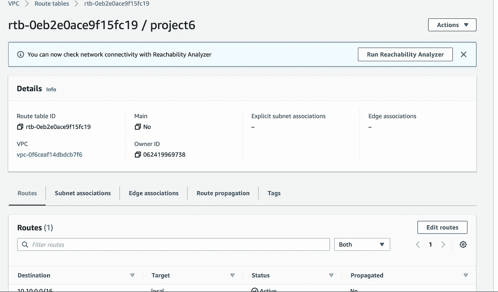

下一步是创建路由表。在左侧屏幕上，单击路由表，然后配置它们以访问您的 VPC 和您刚刚创建的子网。完成后，按 save，您将看到与我看到的相同的页面，显示您的表的配置。至于什么是[路由表](https://docs.aws.amazon.com/vpc/latest/userguide/VPC_Route_Tables.html)，它本质上是一组称为路由的规则，用于确定来自子网或网关的网络流量被定向到哪里。

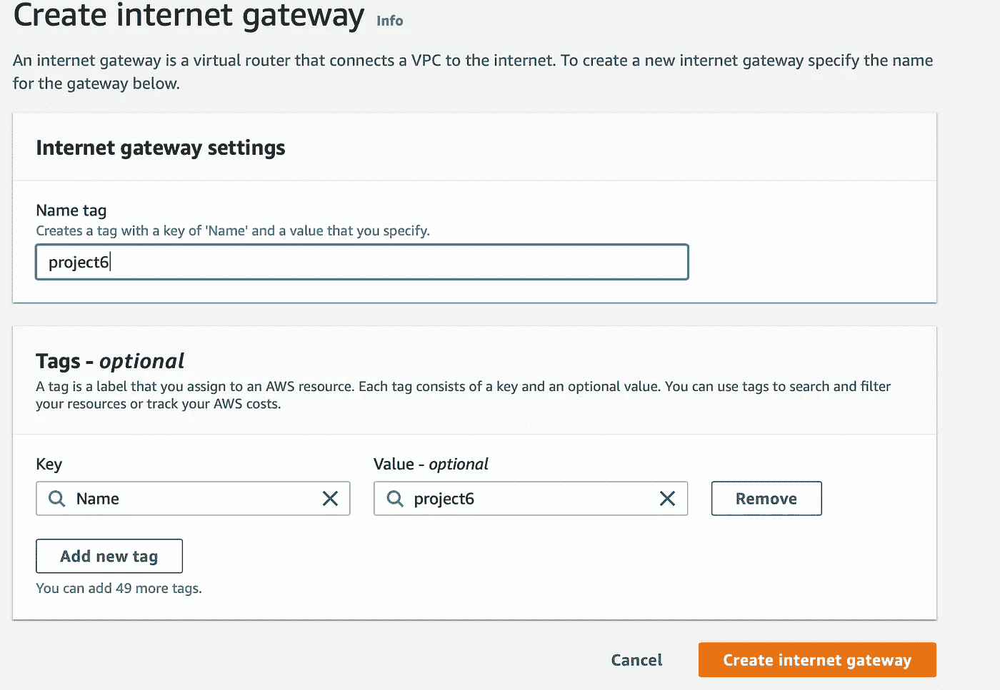

接下来我们要做的是创建一个互联网网关。在屏幕的一侧将有一个互联网网关的选项。点击它，然后将其关联到您的 VPC。我相信互联网网关的定义是不言而喻的……它就在名字里！但是这里有[文档](https://docs.aws.amazon.com/vpc/latest/userguide/VPC_Internet_Gateway.html)，以防你需要进一步了解它具体做什么。

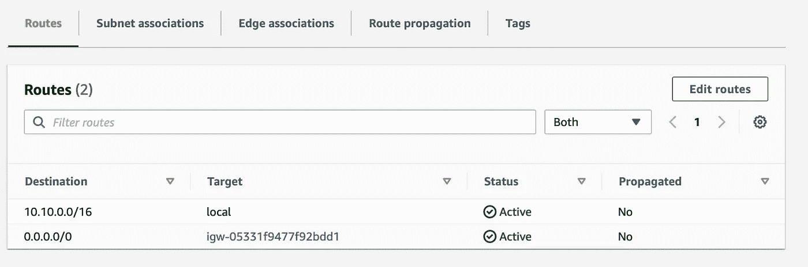

创建 Internet 网关后，返回到路由表，添加一条允许它连接到您的 Internet 网关的路由。一旦它被激活，你就可以继续了。

**步骤 4**——创建您的 EC2 实例并在其中加入 SSH

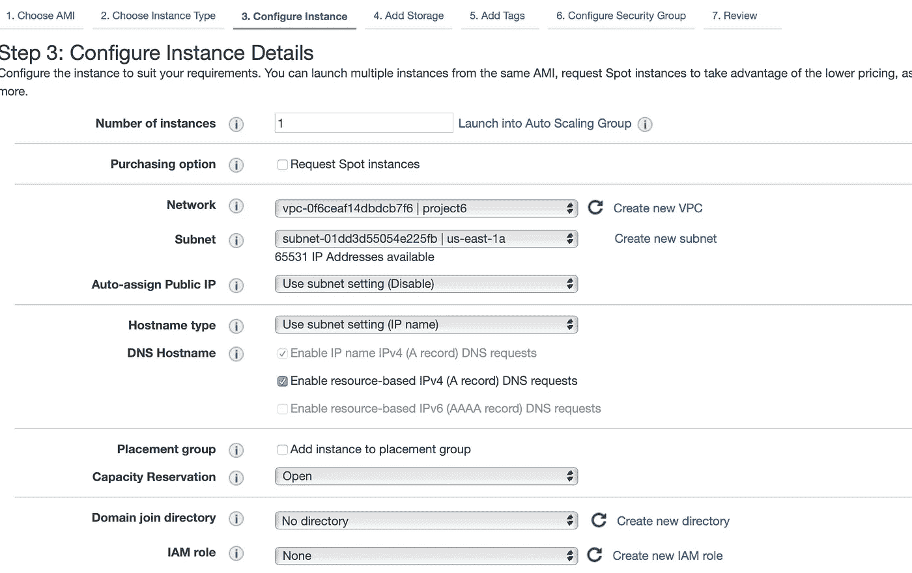

好了，现在我们到了最后一步。在 AWS 控制台顶部搜索 EC2。单击启动实例，然后选择 AMI 和实例类型。我选择 T2 留在这个项目的自由层。接下来，转到“配置实例”页面，选择您创建的 VPC 和您希望在其中启动它的公共子网，然后按“启动”。

我们都应该知道 EC2 实例现在是您在云中的 VM(虚拟机)!

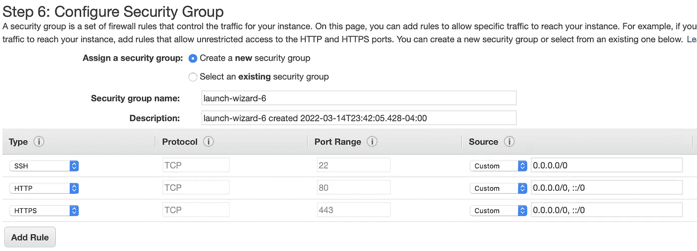

设置您的安全组至少允许 SSH 和 HTTP。如果你愿意的话，你可以通过只允许来自你的主机 IP 的 SSH 来使它更安全，但是我知道在记录了这些之后我会拆掉我的资源，所以我不介意让它打开。保存后，启动 EC2 实例并保存您的密钥(。pem 文件)保存在特定的位置，您可以从本地终端“cd”到该位置。

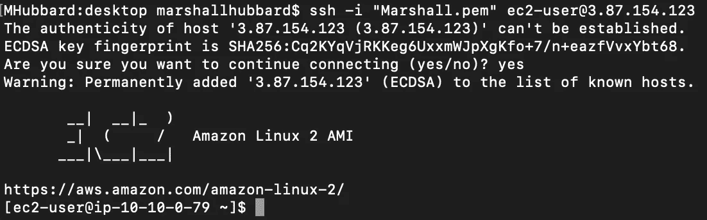

一旦 EC2 启动并运行，转到 EC2 实例连接并按照步骤 SSH 到您的实例。一旦你按照这些步骤操作，你将会看到和上面一样的终端屏幕。

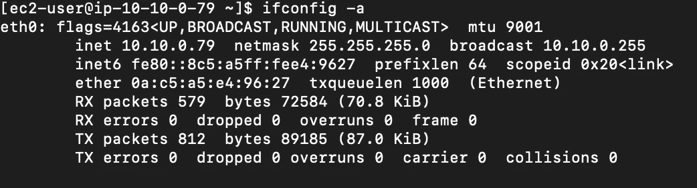

然后，您可以运行下面的命令来查看您的 inet 和广播是否在同一个 CIDR 块中。

```
ifconfig -a
```

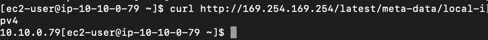

您可以在 CLI 上使用下一个命令来检查以确保您位于正确的 CIDR 块中，该命令是

```
curl http://169.254.169.254/latest/meta-data/local-ipv4 
```

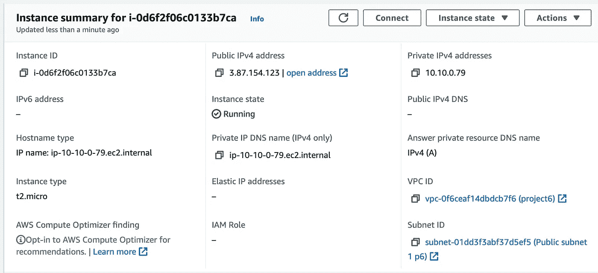

如果您更愿意走这条路线而不是 CLI，您也可以只单击实例 ID 来查看 IP，亲自检查以确保您在正确的 CIDR 块中。

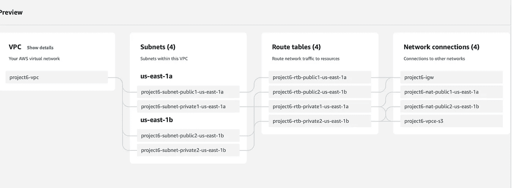

这里有一个图表，向您展示了如果您以正确的方式在不同的 AZ 中创建子网，创建 VPC 及其所有资源的实际情况。

这就是我最新的项目。感谢您的关注！