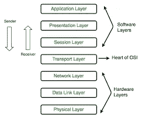

# 第 4 层负载平衡器和第 7 层负载平衡器

> 原文：<https://blog.devgenius.io/layer-4-load-balancers-and-layer-7-load-balancers-4be18abfa47b?source=collection_archive---------12----------------------->

这篇博客讨论了第 4 层负载平衡器和第 7 层负载平衡器之间的区别。在阅读本文之前，理解网络的基本概念至关重要。

> **负载平衡**指的是在一组后端服务器上有效地分配传入的网络流量，也称为*服务器群*或*服务器池*。现代高流量网站必须以快速、可靠的方式处理来自用户或客户端的数十万甚至数百万的并发请求，并返回正确的文本、图像、视频或应用程序数据。现代计算最佳实践通常需要添加更多服务器进行扩展，以经济高效地满足这些高容量需求。一个**负载平衡器**充当您的服务器前的“交通警察”,在所有服务器之间路由客户端请求，能够以最大化速度和容量利用率的方式满足这些请求，并确保没有一个服务器超负荷工作，从而降低性能。如果一台服务器出现故障，负载平衡器会将流量重定向到其余的在线服务器。当新服务器添加到服务器组时，负载平衡器会自动发送请求。

负载平衡器是反向代理的一个例子，其中实现了平衡逻辑。第 4 层是 [OSI 模型](https://www.geeksforgeeks.org/layers-of-osi-model/)中的传输层，第 7 层是应用层。

OSI 模型

## **第四层负载均衡器**

第 4 层负载平衡器与后端建立了连接，并将数据发送到特定请求的专用后端，并获得响应。正如我们从 OSI 模型中了解到的那样，第 4 层的端口、IP 地址和数据只是不应被触及的数据段。因此，这就像中间的一跳，根据路由请求所用的算法将请求发送到后端。这里的所有连接都是 TCP 连接，客户端连接到负载平衡器，负载平衡器连接到后端。

**优点** a)简单负载均衡:不查数据；只有端口和 IP 地址。因为它转发请求，没有数据查找，所以效率更高。更安全:同样，由于没有数据查找，它比第 7 层更安全。c)适用于任何协议:因为它不看内容，所以它是不可知的。也就是说，它发送数据并接收响应。

**CONS** :
a)没有智能负载平衡:没有智能负载平衡，因为我们不看数据。任何基于数据的明智决策，比方说，对具有多个 API(其中一个 API)的后端的任何请求都是非常繁重和耗时的；它不能被隔离为一个单独的后端。
b)无缓存:无数据查找，无缓存。
c)它必须是粘性的，因为它是有状态协议。当建立连接时，它被发送到一个后端服务器。通过这种连接，每个数据包都被发送到一台服务器。下一个连接将根据算法选择不同的服务器。
d)微服务架构实施变得非常困难。

## 第七层负载平衡器

在第 7 层负载平衡器的情况下，负载平衡器变成特定于协议的。当客户端连接到负载平衡器时，它会尝试理解请求。所有这些都发生在 OSI 模型的第 7 层；因此，完整的请求模块是可用的。

> **第 7 层负载平衡**在高层*应用*层运行，处理每条消息的实际内容。HTTP 是互联网上网站流量的主要第 7 层协议。第 7 层负载平衡器路由网络流量的方式比第 4 层负载平衡器复杂得多，尤其适用于基于 TCP 的流量，如 HTTP。第 7 层负载平衡器终止网络流量并读取其中的消息。它可以根据邮件内容(例如，URL 或 cookie)做出负载平衡决定。然后，它与选定的上游服务器建立新的 TCP 连接(或通过[**HTTP keepalives**](https://www.nginx.com/blog/http-keepalives-and-web-performance/)重用现有的连接)，并将请求写入服务器。

**优点** :
a)智能负载平衡:因为我们这里有最终数据，所以我们可以相应地了解负载平衡。比如我们要去/v1/posts，就去后端那个；如遇/v1/评论，去后端二；而在/v1/messages 的情况下，转到后端三。
b)缓存:由于数据可用
c)非常适合微服务
d)认证或 API 网关逻辑可以在负载平衡器中完成。

CONS :
a)贵(看数据):因为它做的工作多。又是缓冲，又是读取，又是解密，所以更多，更贵。解密并因此终止 TLS。因此，需要将 SSL 证书存储在负载平衡器上。再次，它必须共享一个 TLS 证书。d)需要了解协议。

[**举个例子:**](https://www.nginx.com/resources/glossary/layer-7-load-balancing/)我们来看一个简单的例子。用户访问高流量网站。在用户会话过程中，他们可能会请求静态内容(如图像或视频)、动态内容(如新闻提要),甚至是交易信息(如订单状态)。第 7 层负载平衡允许负载平衡器根据请求中的信息(如请求的内容类型)来路由请求。所以现在，对图像或视频的请求可以被路由到存储它的服务器，并且被高度优化以提供多媒体内容。对交易信息(比如折扣价格)的请求可以被路由到负责管理定价的应用服务器。借助第 7 层负载平衡，网络和应用架构师可以创建高度调整和优化的服务器基础设施或 [**应用交付**](https://www.nginx.com/resources/glossary/application-delivery/) 网络，该网络既可靠又可高效扩展以满足需求。

# 负载平衡算法(额外)

不同的负载平衡算法提供不同的好处；负载平衡方法的选择取决于您的需求:

*   循环调度—请求按顺序分布在服务器组中。
*   最少连接—新请求发送到当前与客户端连接最少的服务器。每台服务器的相对计算能力是决定哪台服务器连接最少的因素。
*   IP 哈希—客户端的 IP 地址用于确定哪个服务器接收请求。
*   URL 哈希—这确保对特定 URL 的客户端请求总是发送到同一个后端服务器。

为了更好地理解负载平衡器或后端，我在这里列出了一些资源:
a) [第 4 层](https://www.nginx.com/resources/glossary/layer-4-load-balancing/)
b) [第 7 层](https://www.nginx.com/resources/glossary/layer-7-load-balancing/#:~:text=Layer%207%20load%20balancing%20allows,to%20serve%20up%20multimedia%20content.)
c) [Youtube 后端工程频道](https://www.youtube.com/@hnasr)
d) [SSL 证书](https://cloud.google.com/load-balancing/docs/ssl-certificates)
e)[https://docs.nginx.com/nginx/admin-guide/load-balancer/](https://docs.nginx.com/nginx/admin-guide/load-balancer/)
f)[负载平衡器](https://medium.com/@itIsMadhavan/what-is-load-balancer-and-how-it-works-f7796a230034)
g)[nginjx 简介【T2](https://www.udemy.com/course/nginx-crash-course/)

感谢阅读；我希望它有帮助。
如有任何疑问，欢迎通过[*LinkedIn*](https://www.linkedin.com/in/manav-garg-b00963182/)/[*insta gram*](https://www.instagram.com/manav_706/)联系。