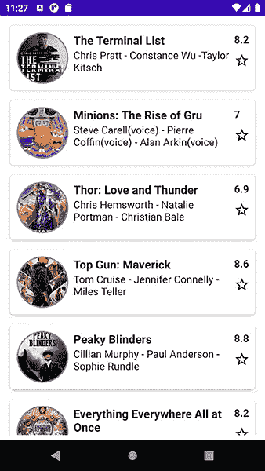
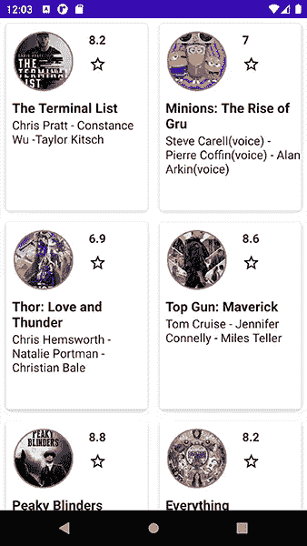

# Jetpack 中的惰性组件构成

> 原文：<https://blog.devgenius.io/lazy-component-in-jetpcak-compose-a21965e17671?source=collection_archive---------8----------------------->


与 Jetpack Compose 中的 *RecyclerView* 或 *ListView* 等效的组件是垂直列表的 **LazyColumn** 和水平列表的 **LazyRow** 。

阅读这篇文章，看看 3 种不同的设计:

我以 MovieData 类的形式提供了来自 IMDB 网站的虚假数据列表:

```
sealed class MovieData(
    val image: Int,
    val name: String,
    val imdb: String,
    val stars: String,
) {
    object Movie1 : MovieData(
        image = R.drawable.*one*,
        name = "The Terminal List",
        imdb = "8.2",
        stars = "Chris Pratt - Constance Wu -Taylor Kitsch"
    )

    object Movie2 : MovieData(
        image = R.drawable.*two*,
        name = "Minions: The Rise of Gru",
        imdb = "7",
        stars = "Steve Carell(voice) - Pierre Coffin(voice) - Alan Arkin(voice)"
    )

    object Movie3 : MovieData(
        image = R.drawable.*three*,
        name = "Thor: Love and Thunder",
        imdb = "6.9",
        stars = "Chris Hemsworth - Natalie Portman - Christian Bale"
    )

    object Movie4 : MovieData(
        image = R.drawable.*four*,
        name = "Top Gun: Maverick",
        imdb = "8.6",
        stars = "Tom Cruise - Jennifer Connelly - Miles Teller"
    )

    object Movie5 : MovieData(
        image = R.drawable.*five*,
        name = "Peaky Blinders",
        imdb = "8.8",
        stars = "Cillian Murphy - Paul Anderson - Sophie Rundle"
    )

    object Movie6 : MovieData(
        image = R.drawable.*six*,
        name = "Everything Everywhere All at Once",
        imdb = "8.2",
        stars = "Michelle Yeoh - Stephanie Hsu - Ke Huy Quan"
    )

    object Movie7 : MovieData(
        image = R.drawable.*seven*,
        name = "Better Call Saul",
        imdb = "8.8",
        stars = "Bob Odenkirk - Rhea Seehorn - Jonathan Banks"
    )

    object Movie8 : MovieData(
        image = R.drawable.*eighth*,
        name = "Breaking Bad",
        imdb = "9.5",
        stars = "Bryan Cranston - Aaron Paul - Anna Gunn"
    )
}
```

*   **首次设计:LazyColumn**



为了创建上述设计，首先您应该定义每个项目模式:

```
@Composable
fun MovieItem(movieData: MovieData){
    *Card*(elevation = 5.*dp*,
        modifier = Modifier
            .*border*(width = 3.*dp*, color = Color.White, shape = *RoundedCornerShape*(20.*dp*))
            .*padding*(top = 8.*dp*, bottom = 8.*dp*, start = 8.*dp*, end = 8.*dp*)
            .*requiredHeight*(100.*dp*)) **{** *Row*() **{** *Column*(modifier = Modifier.*padding*(top = 10.*dp*, start = 10.*dp*)) **{** *Image*(painter = *painterResource*(id = movieData.image), contentDescription = movieData.name,
                    contentScale = ContentScale.Crop,
                    modifier = Modifier
                        .*size*(80.*dp*)
                        .*clip*(*CircleShape*)
                        .*border*(width = 2.*dp*, color = Color.Gray, shape = *CircleShape*)
                        .*padding*(top = 2.*dp*))
            **}** *Column*(modifier = Modifier
                .*padding*(top = 10.*dp*, start = 8.*dp*)
                .*weight*(1.0f)) **{** *Text*(text = movieData.name, fontWeight = FontWeight.Bold, fontSize = 18.*sp*)
                *Text*(text = movieData.stars, fontSize = 16.*sp*)
            **}** *Column*(modifier = Modifier.*padding*(top = 10.*dp*, end = 8.*dp*)) **{** *Text*(text = movieData.imdb, fontWeight = FontWeight.Bold, fontSize = 16.*sp*)
                *Image*(imageVector = Icons.Outlined.*StarOutline*, contentDescription = "Star",
                    modifier = Modifier.*padding*(top = 10.*dp*))
            **}
        }
    }** }
```

现在从伪数据(MovieData 类)中确定一个电影列表，并使用 LazyColumn 在垂直列表中显示它们:

```
@Composable
fun MovieList(){
    val movieListData = *listOf*(MovieData.Movie1, MovieData.Movie2,
        MovieData.Movie3,MovieData.Movie4,
        MovieData.Movie5, MovieData.Movie6,
        MovieData.Movie7, MovieData.Movie8)

    *Box*() **{** *LazyColumn*(modifier = Modifier
            .*fillMaxSize*()
            .*padding*(8.*dp*))**{** *items*(movieListData)**{** movieItem **->** *MovieItem*(movieData = movieItem)
            **}
        }
    }** }
```

*   **第二:LazyRow:**


要实现这样的设计，首先你需要设计每个项目:

```
@Composable
fun MovieItemRow(movieData: MovieData){
    *Card*(elevation = 5.*dp*,
        modifier = Modifier
            .*border*(width = 3.*dp*, color = Color.White, shape = *RoundedCornerShape*(20.*dp*))
            .*padding*(top = 8.*dp*, bottom = 8.*dp*, start = 8.*dp*, end = 8.*dp*)
            .*requiredHeight*(250.*dp*)
            .*requiredWidth*(150.*dp*)) **{** *Column*() **{** *Row*() **{** *Column*(modifier = Modifier.*padding*(top = 10.*dp*, start = 10.*dp*)) **{** *Image*(painter = *painterResource*(id = movieData.image), contentDescription = movieData.name,
                        contentScale = ContentScale.Crop,
                        modifier = Modifier
                            .*size*(80.*dp*)
                            .*clip*(*CircleShape*)
                            .*border*(width = 2.*dp*, color = Color.Gray, shape = *CircleShape*)
                            .*padding*(top = 2.*dp*))
                **}** *Column*(modifier = Modifier.*padding*(top = 10.*dp*, start = 16.*dp*)) **{** *Text*(text = movieData.imdb, fontWeight = FontWeight.Bold, fontSize = 16.*sp*)
                    *Image*(imageVector = Icons.Outlined.*StarOutline*, contentDescription = "Star",
                        modifier = Modifier.*padding*(top = 10.*dp*))
                **}
            }** *Row*() **{** *Column*(modifier = Modifier
                    .*padding*(top = 10.*dp*, start = 8.*dp*)
                    .*weight*(1.0f)) **{** *Text*(text = movieData.name, fontWeight = FontWeight.Bold, fontSize = 18.*sp*)
                    *Text*(text = movieData.stars, fontSize = 16.*sp*)
                **}
            }
        }
    }** }
```

这是 LazyRow 代码:

```
@Composable
fun MovieListRow(){
    val movieListData = *listOf*(MovieData.Movie1, MovieData.Movie2,
        MovieData.Movie3,MovieData.Movie4,
        MovieData.Movie5, MovieData.Movie6,
        MovieData.Movie7, MovieData.Movie8)

    *Box*() **{** *LazyRow*(modifier = Modifier
            .*requiredHeight*(250.*dp*)
            .*padding*(top = 20.*dp*))**{** *items*(movieListData)**{** movieItem **->** *MovieItemRow*(movieData = movieItem)
            **}
        }
    }** }
```

*   **第三:LazyVerticalGrid:**

***LazyVerticalGrid***和***LazyHorizontalGrid***提供了在网格中显示项目的支持。

这是使用***LazyVerticalGrid***的一个例子:



```
@Composable
fun MovieListGrid(){
    val movieListData = *listOf*(MovieData.Movie1, MovieData.Movie2,
        MovieData.Movie3,MovieData.Movie4,
        MovieData.Movie5, MovieData.Movie6,
        MovieData.Movie7, MovieData.Movie8)

    *Box*() **{** *LazyVerticalGrid*(cells = GridCells.Fixed(2), content = **{** *items*(movieListData)**{** movieItem **->** *MovieItemGrid*(movieData = movieItem)
            **}
        }** )
    **}** }

@Composable
fun MovieItemGrid(movieData: MovieData){
    *Card*(elevation = 5.*dp*,
        modifier = Modifier
            .*border*(width = 3.*dp*, color = Color.White, shape = *RoundedCornerShape*(20.*dp*))
            .*padding*(top = 8.*dp*, bottom = 8.*dp*, start = 8.*dp*, end = 8.*dp*)
            .*requiredHeight*(250.*dp*)) **{** *Column*() **{** *Row*() **{** *Column*(modifier = Modifier.*padding*(top = 10.*dp*, start = 10.*dp*).*weight*(1.0f)) **{** *Image*(painter = *painterResource*(id = movieData.image), contentDescription = movieData.name,
                        contentScale = ContentScale.Crop,
                        modifier = Modifier
                            .*size*(80.*dp*)
                            .*clip*(*CircleShape*)
                            .*border*(width = 2.*dp*, color = Color.Gray, shape = *CircleShape*)
                            .*padding*(top = 2.*dp*))
                **}** *Column*(modifier = Modifier.*padding*(top = 10.*dp*, end = 8.*dp*, start = 16.*dp*).*weight*(1.0f)) **{** *Text*(text = movieData.imdb, fontWeight = FontWeight.Bold, fontSize = 16.*sp*)
                    *Image*(imageVector = Icons.Outlined.*StarOutline*, contentDescription = "Star",
                        modifier = Modifier.*padding*(top = 10.*dp*))
                **}
            }** *Row*() **{** *Column*(modifier = Modifier
                    .*padding*(top = 10.*dp*, start = 8.*dp*)
                    .*weight*(1.0f)) **{** *Text*(text = movieData.name, fontWeight = FontWeight.Bold, fontSize = 18.*sp*)
                    *Text*(text = movieData.stars, fontSize = 16.*sp*)
                **}
            }
        }
    }** }
```

祝你好运