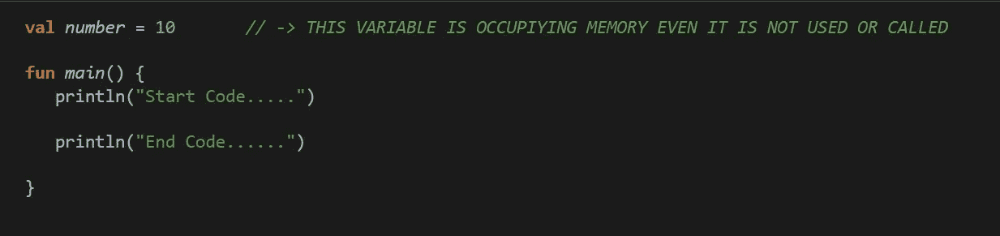
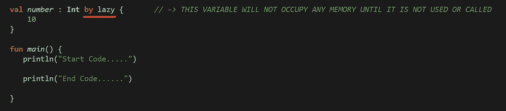
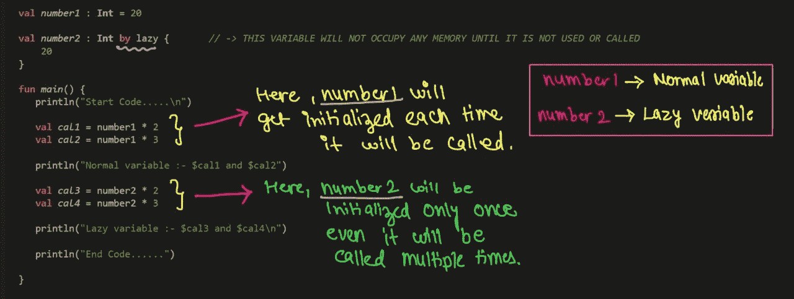

# Kotlin 中的懒惰关键字[2022]

> 原文：<https://blog.devgenius.io/lazy-keyword-in-kotlin-2022-aa18f5811900?source=collection_archive---------9----------------------->

> 让我们借助一个人的故事来理解懒惰关键字的概念

马修·法瑞斯在 [Unsplash](https://unsplash.com?utm_source=medium&utm_medium=referral) 上的照片

这个叫“ABC”的人非常懒惰，除非明确指示他做一件工作，否则他不做任何工作。

> 类似地，在 Koltin 中，任何定义了 ***lazy*** 的函数或变量都不会占用内存或做任何工作，直到它被相应的主函数专门调用。

让我们通过科特林编码来理解它:-

在这里，变量“ ***number*** ”被定义但没有在任何地方使用，但是在编译时这个变量将获得分配的内存。

**现在，假设有一个*重操作*已经定义但没有在任何地方使用，那么内存将被分配给不好的操作。所以为了解决这些问题我们有了“*懒*的概念。**

因此，我们可以通过以下方式解决上述问题

这里，变量“ ***number*** ”不会分配任何内存，因为该变量没有被使用或从任何地方调用。

> 使用*的另一个好处是它提供了 ***缓存:-****

**

*所以，以这种方式使用 LAZY 关键字是在 Kotlin 中完成的。*

*感谢阅读…..我希望你的概念清楚了。*

*快乐编码:)*