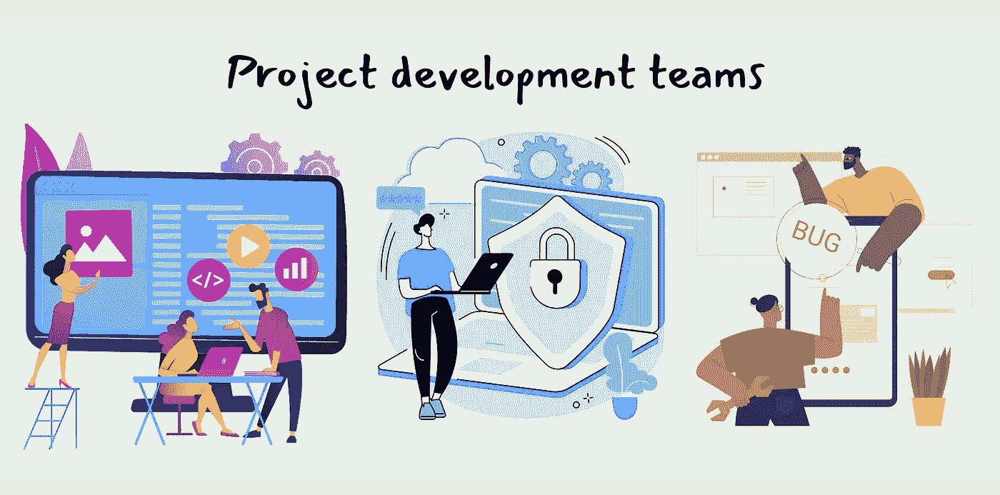
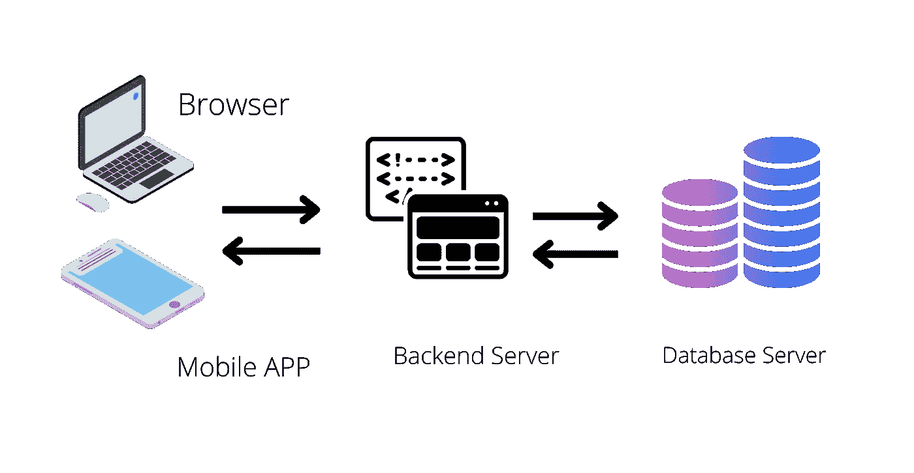
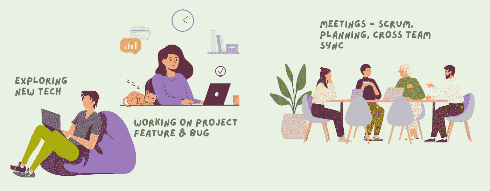
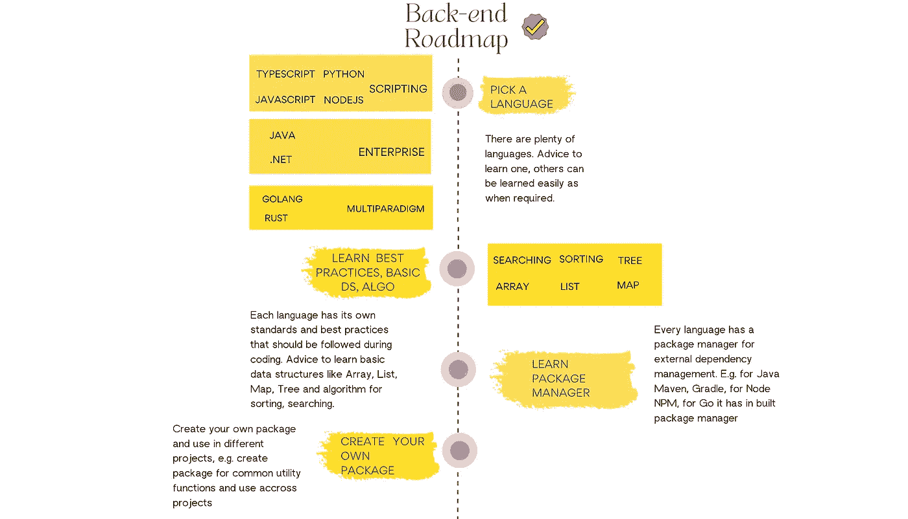
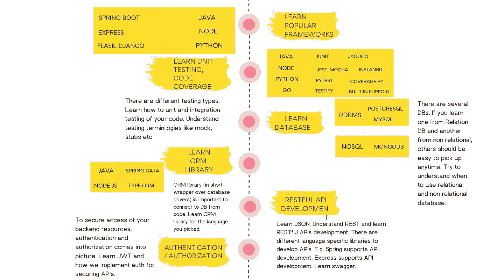
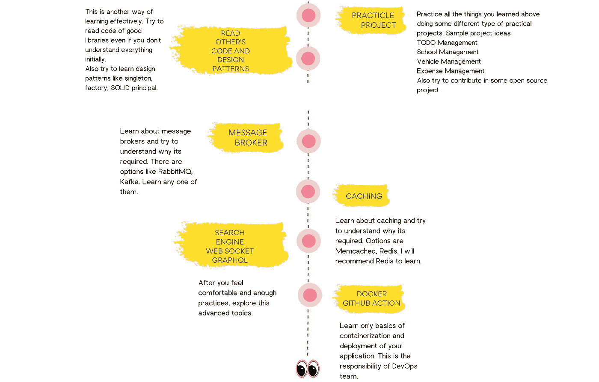

# 了解软件项目开发团队和路线图，成为后端开发人员

> 原文：<https://blog.devgenius.io/learn-about-software-project-development-teams-and-roadmap-to-become-backend-developer-7bad8b26bbfd?source=collection_archive---------11----------------------->

这个博客是为那些想了解软件项目开发所需的不同的跨职能团队的人准备的。这篇文章的目标读者是开发、招聘、项目管理、产品开发领域的新人，希望他们对软件团队有基本的了解。此外，我们将在本文中深入探讨成为后端开发人员需要做些什么。

> “生活是一个发展自己的过程。如果没有经历过生活中令人不安的时期的痛苦，我们可能会成为不同的人，也许是一个不那么优秀的人。”基尔罗伊·j·奥尔德斯特

# 探索开发团队

我们总是听到一些术语，如“前端”、“后端”、“开发运维”、“质量保证”等。这些术语足以迷惑一个软件行业的新手。

## 排名第一的后端和前端

让我们以一个我们很多人已经使用过的网站为例，比如网飞。如果我们在 chrome 之类的浏览器中打开网飞，我们会看到一个电影列表。我们看不同类别的电影，像动作片、科学摩擦片、漫画等。网飞提供了一个图形用户界面(GUI)来显示他们想要显示给用户的所有信息。我们可以浏览不同的屏幕，选择我们想看的电影。网飞也有手机应用程序，我们可以做同样的事情。

如果我们想得更深一点，它显示的信息并不是从你浏览的地方存储在你的本地计算机上，而是来自互联网上的其他地方。如果你没有联网，那么你将一无所获。因此，我们已经得到了两个部分前端，我们看到在浏览器和后端的数据和逻辑驻留。

什么是逻辑？别担心，我们马上就要谈到这一点了。假设你经常看动作片，后台的网飞会试图找出这个用户是动作片的粉丝，给他/她看更多的顶级动作片，他/她可能会看得更多。在我喜欢看科学摩擦的地方，如果他们给我带回来动作片列表，我不会看任何一部，所以后端有电影“推荐逻辑”给用户。现在你会告诉后端将如何知道我在看什么？是的，你的方向是正确的。客户端(前端)和后端(服务器)之间有多种通信方式，最常见的是通过 API 调用进行通信。前端通过后端公开的 API 向后端发送所需的数据。后端获取所有的信息，哪个用户在做什么。

什么是数据？简而言之，它的用户信息和数据存放在哪里，都在数据库服务器中。所以整个画面看起来会像下面这样

## #2 质量保证和开发运维

在前端和后端的开发中，将有单独的团队，由工程经理，领导，高级开发人员，开发人员组成。开发人员将在他们的本地系统(即计算机)中开发不同的功能。假设开发人员 D1 完成了功能 F1，开发人员 D2 完成了 F2。他们将如何合并他们的功能？现在他们需要一个公共的地方来保存他们的代码，对吗？因此，基于云的存储库出现了，我们大多数人使用 [Github](https://github.com/) 来完成这个功能，在完成功能后，开发者将他们的代码放在这个地方，这样所有的开发者都可以轻松访问。我们使用 Git(即代码版本控制系统)进行源代码管理，如拉代码、从/向远程存储库(即从 Github)推送代码、检查代码修改历史等。现在功能开发者 D1 和 D2 完成，需要推到互联网上，使我们的网站用户可以访问这些功能，这就是所谓的部署。有不同的云提供商(AWS、Google Cloud、Azure 等)来促进部署。部署后，只有您的功能将是活的，所有人都可以访问。管理基础设施和部署的团队通常被称为开发运维团队。还有另一个开发团队，他们测试开发的功能是否完美，我们称他们为 QA 团队。

# 后端开发人员在一个典型的工作日做什么？

正如我们所讲的，我们还将讨论作为后端开发人员开始需要做些什么，让我们了解后端开发人员在一个典型的工作日做些什么。我会回复的

*   50%的项目功能开发
*   30%的项目紧急错误修复
*   20%的会议

因此，作为一个后端开发人员，你将花费你的工作日做什么

*   用来自产品团队的开发新特性需求的语言编写代码
*   修复已经开发的代码中的阻塞 QA 问题(即 bug)
*   参加会议，如冲刺规划、回顾、SCRUM，与前端、开发运营、产品团队等跨团队同步(谁提出需求)

周末呢？

# 成为后端开发人员所需的技能

## #1 选择一门编程语言

我们用服务器端编程语言编写后端代码。有几十种这样的语言，你需要从它们中选择一种简单且在市场上要求高的语言(哦，不是在鱼市，是在软件行业)。

我的建议从下面选一个，学习基础，练习再练习

*   Java，框架 Spring Boot
*   JavaScript、Node Js、framework Express
*   Python，框架 Django，Flask

## #2 学习基本数据结构和算法

正如我们已经讨论过的，项目的核心逻辑存在于后端。后端开发人员用数据结构(DS)和算法在代码中实现逻辑。

所以你至少需要学习以下内容

*   DS —数组、列表、映射、堆栈、队列、树
*   算法—排序、搜索

## #3 学习数据库

正如你所知，用户数据将被存储在数据库(数据库)，所以后端开发人员应该有知识来保存，提取数据到数据库。我们为此编写数据库查询。还有很多像语言这样的数据库，明智的做法是你需要选择一个简单但受欢迎的。

所以这是我的建议，从每个类别学习一个 DB

*   我的 SQL(关系数据库管理系统)
*   MongoDB (NoSQL)

## #4 使用一些流行的框架学习 RESTFul APIs 开发

那么，现在你需要一个渠道，通过它前端可以达到你，API。学习 REST APIs 已经足够好了，可以开始了。

*   了解什么是 REST APIs，不同的 HTTP 动词
*   用#1 中提到的语言特定的流行框架实现 API
*   手动测试 Postman 编写的 API(即 REST 客户端)
*   编写单元和集成测试用例

## #5 做一些实际的项目

初学者需要的东西你差不多都学会了。现在把你的手弄脏。给初学者的一些项目想法

*   待办事项管理
*   疫苗管理
*   图书馆管理

## #6 下一步是什么

这是你可以遵循的完整路线图(显然，如果你对我有信心的话，哈哈…)，放大看看

#基础知识

#再深一点

#高级

# 参考

一些来自我个人项目的参考

*   NodeJs 快递—[https://github.com/Sofiukl/my-todos/tree/master](https://github.com/Sofiukl/my-todos/tree/master)
*   蟒蛇皮烧瓶—【https://github.com/Sofiukl/explore-python 
*   去 https://youtube.com/playlist?—[list = PLM 5 LCMV U2 ms _ i1MqMtWMyT-HBA lhtt 64 I](https://youtube.com/playlist?list=PLm5LCMVu2ms_i1MqMtWMyT-HBalhTT64i)
*   围棋训练—[https://github.com/Sofiukl/go-training](https://github.com/Sofiukl/go-training)
*   如何开发围棋项目—[https://youtu.be/EFrs0-0KWns](https://youtu.be/EFrs0-0KWns)
*   https://github.com/Sofiukl/pmt-common 的爪哇 Spring Boot

# 结论

如果你不放弃，这都是可以实现的。我会说梦想，每天学习和练习，总有一天会产生巨大的影响。

快乐学习！

在 [Medium](https://medium.com/@sofikul.m) 和 [Youtube](https://www.youtube.com/channel/UCmLwFv3wi-rEPUHbk2lbF2w) 上关注我，了解我将分享的最新文章！