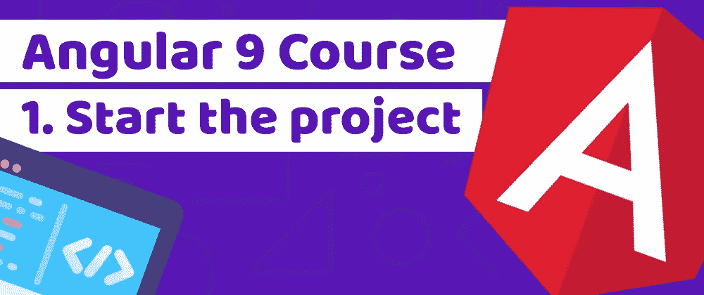
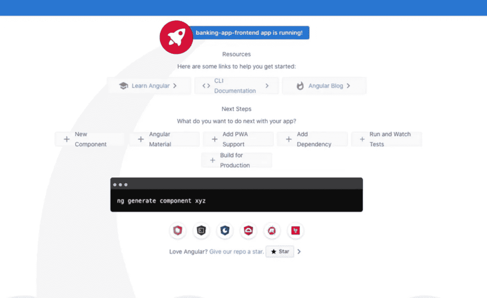
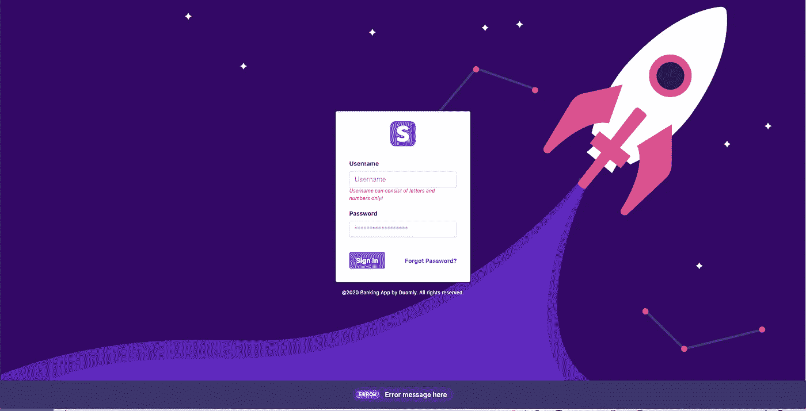

# 通过使用 Tailwind CSS-1 构建 fintech 应用程序来学习 Angular 9。开始项目

> 原文：<https://blog.devgenius.io/learn-angular-9-by-building-a-fintech-application-with-tailwind-css-1-start-the-project-e2eea35bd9d0?source=collection_archive---------2----------------------->



Duomly —编程在线课程

本文原载于[https://www . blog . duomly . com/angular-course-building-a-banking-application-with-tailwind-CSS-lesson-1-start-the-project/](https://www.blog.duomly.com/angular-course-building-a-banking-application-with-tailwind-css-lesson-1-start-the-project/)

几天前我们发布了一个 [SQL 注入教程](https://www.blog.duomly.com/sql-injection-attack-tutorial-for-beginners/)，在那里你可以黑掉我们创建的银行应用。

我们决定创建一个完整的 Angular 9 课程，在这个课程中，我们想教你如何为 fin-tech 应用程序创建前端，就像 SQL 注入例子中的那个。

我们将从使用 Angular CLI 创建一个新项目开始，为 UI 安装 Tailwind CSS，设置代理，并构建登录组件 UI。

在接下来的课程中，我们将为登录组件创建一个登录，并为我们的应用程序创建另一个功能。此外，欢迎您在评论中分享您的想法，这样我们就可以将它添加到我们的应用程序中，向您展示如何编写它们，并一起构建它。

我们还将创建两个单独的课程，其中一个在 Go Lang 中，另一个在 Node.js 中，我们将为该应用程序构建一个后端，请关注我们，了解最新动态。

和往常一样，对于那些喜欢看而不是读的人，我们有这篇文章的视频版本，所以加入我们的 Youtube 频道。

让我们撞角 9！

# 安装角度 9

让我们从创建一个新的 Angular 9 项目开始。为此，我们将使用[角度 CLI](https://cli.angular.io/) 。

如果你还没有安装它，这里有一篇[文章](https://www.blog.duomly.com/angular-tutorial/)是我们前段时间做的，所以可以随意跳到那里，检查如何做。

要创建一个新项目，我们将使用以下命令:

```
ng new banking-app-frontend
```

我们将使用 Scss 和路由，所以请确保您安装了它们。

当你的空角项目准备好了，我们来安装顺风框架。

# 2.安装顺风 CSS

为了能够使用 Tailwind CSS，我们需要安装一些额外的包，但这是值得的。为了能够给我们的构建添加顺风，我们将使用`@angular-builders/custom-webpack`。

让我们安装顺风和其他必要的软件包:

```
npm i tailwindcss postcss-import postcss-loader postcss-scss @angular-builders/custom-webpack -D
```

如果安装完成，打开 style.scss 文件并在其中添加 Tailwind 导入:

```
@import ‚tailwind/base’;
@import ‚tailwind/components’;
@import ‚tailwind/utilities’;
```

现在，我们可以使用以下命令初始化 Tailwind CSS:

`npx tailwind init`

这个命令将在我们的根文件夹中创建`tailwing.config.js`文件。在这个文件中，我们可以添加自定义设置，如附加的颜色或字体属性。

我们几乎准备好了顺风 CSS。我们需要做的最后一件事是设置一个定制的 webpack 配置，并在`angular.json`文件中做一些修改。

让我们从在根文件夹中创建 webpack.config.js 文件开始，并在其中添加以下代码:

```
module.exports = {
  module: {
    rules: [
      {
        test: /\.scss$/,
        loader: 'postcss-loader',
        options: {
          ident: 'postcss',
          syntax: 'postcss-scss',
          plugins: () => [
            require('postcss-import'),
            require('tailwindcss'),
            require('autoprefixer'),
          ]
        }
      }
    ]
  }
}
```

我们现在可以在 angular.json 文件中实现以下代码。

```
"build": {
          "builder": "@angular-builders/custom-webpack:browser",
          "options": {
            "customWebpackConfig": {
              "path": "./webpack.config.js"
            },
          }
}
"serve": {
          "builder": "@angular-builders/custom-webpack:dev-server",
          "options": {
            "customWebpackConfig": {
              "path": "./webpack.config.js"
            },
}
```

让我们使用以下命令开始我们的项目:

`ng serve`

当它准备好了，你应该会看到空的 Angular 应用程序的默认屏幕:



多角度航线

让我们清理一下 app.component.html 的文件，为工作做准备。以下是清理后文件的外观:

```
<div id="app">
  <router-outlet></router-outlet>
</div>
```

# 3.设置代理

本教程的下一步是在 Angular 中设置代理配置。这将是有用的，当我们将与后端连接，以避免 CORS。

让我们在 **src** 文件中创建一个新文件，将其命名为 proxy.conf.json，并在其中放置以下代码:

```
{
  "/login/*": {
    "target": "http://localhost:8888",
    "secure": false,
    "logLevel": "debug"
  }
}
```

请记住，如果您的后端在不同的主机或不同的端口上，您需要更改**目标**属性。

现在，让我们将此配置添加到 **angular.json** 文件中的 **serve** 命令中，因此它应该看起来像下面的代码:

```
"serve": {
          "builder": "@angular-builders/custom-webpack:dev-server",
          "options": {
            "browserTarget": "banking-app-frontend:build",
            "customWebpackConfig": {
              "path": "./webpack.config.js"
            },
            "proxyConfig": "src/proxy.conf.json"
          },
          "configurations": {
            "production": {
              "browserTarget": "banking-app-frontend:build:production"
            }
          }
        }
```

# 4.创建登录组件 UI

现在是最有趣的时候了。让我们使用`ng generate component <componentName>`来创建一个登录组件，我们将在其中构建 UI。

完成后打开`app-routing.module.ts`文件，我们将添加一条路线。

```
import { LoginComponent } from './login/login.component'; const routes: Routes = [
  {path: '', component: LoginComponent }
];
```

很好，现在我们可以显示我们的 LoginComponent 了。让我们打开`login.component.html`文件并删除现有段落。

下一步，我们将使用来自 TailwindCSS 的两个现成组件，表单和通知。让我们将它添加到我们的模板中，做一些小的修改。这里有一个现成的代码:

```
<div id="login-container" class="flex container mx-auto items-center justify-center">
  <div class="w-full max-w-xs">
    <form class="bg-white shadow-md rounded px-8 pt-6 pb-8 mb-4">
      
      <div class="mb-4">
        <label class="block text-gray-700 text-sm font-bold mb-2" for="username">
          Username
        </label>
        <input class="shadow appearance-none border rounded w-full py-2 px-3 text-gray-700 leading-tight focus:outline-none focus:shadow-outline" id="username" type="text" placeholder="Username">
        <p class="text-red-500 text-xs italic">Username can consist of letters and numbers only!</p>
      </div>
      <div class="mb-6">
        <label class="block text-gray-700 text-sm font-bold mb-2" for="password">
          Password
        </label>
        <input class="shadow appearance-none border rounded w-full py-2 px-3 text-gray-700 mb-3 leading-tight focus:outline-none focus:shadow-outline" id="password" type="password" placeholder="******************">
      </div>
      <div class="flex items-center justify-between">
        <button class="bg-blue-500 hover:bg-blue-700 text-white font-bold py-2 px-4 rounded focus:outline-none focus:shadow-outline" type="button">
          Sign In
        </button>
        <a class="inline-block align-baseline font-bold text-sm text-blue-500 hover:text-blue-800" href="#">
          Forgot Password?
        </a>
      </div>
    </form>
    <p class="text-center text-white text-xs">
      &copy;2020 Banking App by Duomly. All rights reserved.
    </p>
  </div>
  <div class="notification bg-indigo-900 text-center py-4 lg:px-4">
    <div class="p-2 bg-indigo-800 items-center text-indigo-100 leading-none lg:rounded-full flex lg:inline-flex" role="alert">
      <span class="flex rounded-full bg-indigo-500 uppercase px-2 py-1 text-xs font-bold mr-3">ERROR</span>
      <span class="font-semibold mr-2 text-left flex-auto">Error message here</span>
    </div>
  </div>
</div>
```

我们就快到了，但我们只需要一些定制的风格。首先，让我们打开`app.component.scss`文件并添加以下代码:

```
#app {
  min-height: 100vh;
  min-width: 100vw;
  background-color: #f7f7fc;
}
```

接下来，让我们向登录组件添加自定义样式。打开`login.component.scss`文件并在其中添加代码:

```
#login-container {
  min-height: 100vh;
  min-width: 100vw;
  color: white;
  position: relative;
  background-image: url('../../assets/background.png');
  background-size: cover;
  background-repeat: no-repeat;
  background-position: center;
  .logo {
    max-height: 60px;
    margin: auto;
    margin-bottom: 30px;
  }
  .notification {
    position: absolute;
    bottom: 0;
    left: 0;
    right: 0;
  }
}
```

我在 UI 中使用了两张图片，一张作为背景，一张作为 logo。你可以使用任何你喜欢的图片，或者你可以查看我们的 Github，在那里你可以找到我们正在做的代码，也可以得到图片！

这是我得到的结果。



多角度航线

在接下来的课程中，我们将为此登录组件创建一些逻辑，我们还将学习如何防止 SQL 注入，这可以在我朋友几天前发布的教程中看到。

# 结论

在本文中，我们使用 Angular 9 和 TailwindCSS 完成了构建银行应用程序的第一步。今天，我们已经为表单创建了一个简单的 UI，在本课程的下一部分，我们将为这个组件和许多其他功能编写逻辑。

如果您对某个有趣的功能有任何想法，请告诉我们，我们会实现它。让我们一起来建设这个球场吧！

同时，我们将向您展示如何用两种不同的技术，Go Lang 和 Node.js，为这样的应用程序创建一个后端。

除此之外，还会有一系列基于该应用的 web 安全教程。

请继续关注我们接下来的部分，如果您错过了一些代码，请在这里查看:

[https://github . com/Duomly/angular 9-tail wind-bank-frontend/tree/angular 9-tail wind CSS-Course-lesson 1](https://github.com/Duomly/angular9-tailwind-bank-frontend/tree/Angular9-TailwindCSS-Course-Lesson1)

感谢您的阅读，
来自 Duomly 的安娜


[Duomly——编程在线课程](https://www.duomly.com)