# 使用 GitHub 动作学习 CI/CD，以将 Nestjs 应用程序部署到 Heroku

> 原文：<https://blog.devgenius.io/learn-ci-cd-with-github-actions-to-deploy-a-nestjs-app-to-heroku-8feb715d3ce7?source=collection_archive---------1----------------------->

## 在 Nestjs 中使用 GitHub Actions 轻松部署到 Heroku。为了避免无聊的任务。:)


由[罗曼·辛克维奇](https://unsplash.com/@synkevych?utm_source=medium&utm_medium=referral)在 [Unsplash](https://unsplash.com?utm_source=medium&utm_medium=referral) 拍摄的照片

大家好，我是潘杜，我是一名软件工程师。欢迎来到我的博客，今天我们将学习如何使用 GitHub Actions 将你的应用程序(尤其是 web 应用程序、后端等)部署到 Heroku。和平常一样，我将在我的公共项目中使用 Nestjs。

如果你了解 GitHub，这里有一些有趣的东西，那就是 Github Actions。**什么是 GitHub 动作？**

# GitHub 操作

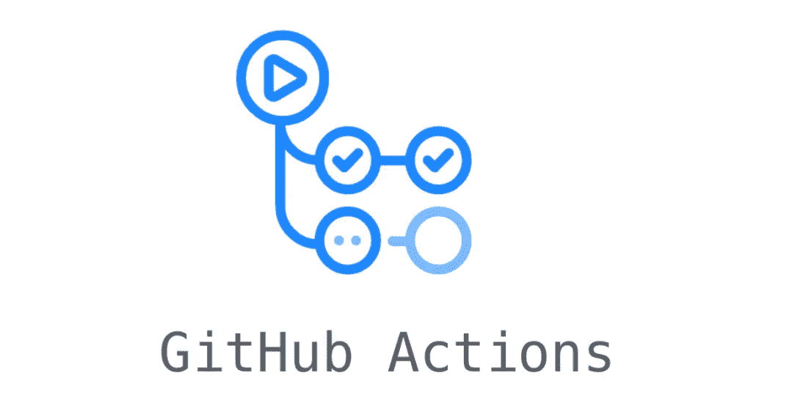

GitHub Actions 是一个持续集成和持续交付(CI/CD)平台，允许您自动化您的构建、测试和部署管道。它使你所有的软件工作流程自动化变得容易。你可以在 Github 上做任何事情，比如构建、测试、部署你的代码，你也可以分配代码审查、管理分支等等。你们可以创建工作流来构建和测试对存储库的每个拉请求，或者将合并的拉请求部署到生产中。

每个存储库中都有 Github Actions。当您查找您的存储库时，您可以看到标签`Actions`。GitHub 提供 Linux、Windows 和 macOS 虚拟机来运行您的工作流。在本文中，我将分享关于部署阶段的内容。

# 让我们开始吃吧。

# 准备

*   打开你的**文本编辑器**，我将使用 Visual Studio 代码。
*   打开你的**终端**或**命令行**
*   创建一个新的 nestjs 项目
*   在 heroku 上创建一个新的应用程序(但是如果你没有帐户，你应该先被创建)
*   创建新的 repo，将您完成的项目推进到 repo 中(包括单元测试)
*   创建**的文件。yml** ，把它的名字。我在**上给出 as **production.yml** 。github/workflows** ，然后提交并点击按钮。
*   等等。

## 打开文本编辑器

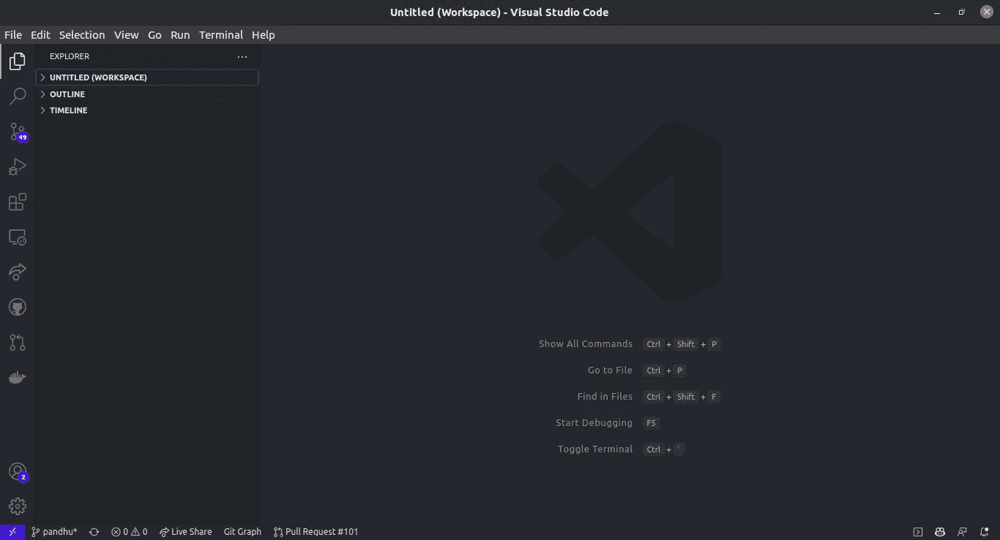

## 打开终端

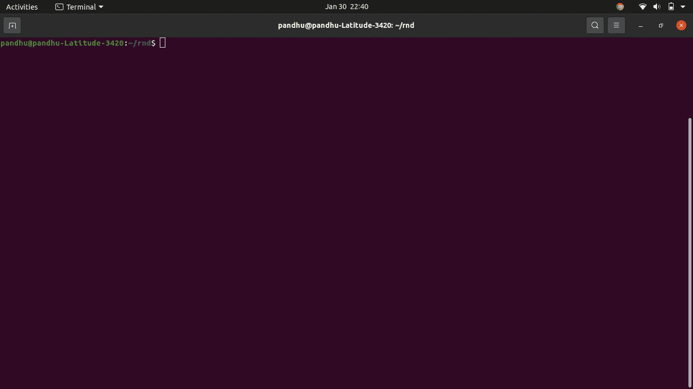

## 创建新的 Nestjs 应用程序

有两种安装 nestjs 的方法。

## 使用嵌套 CLI

```
npm i -g @nestjs/cli
nest new project-name
```

## 可供选择的事物

```
git clone https://github.com/nestjs/typescript-starter.git project
cd project
npm install
npm run start
```


## 在 Heroku 上创建新应用程序

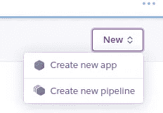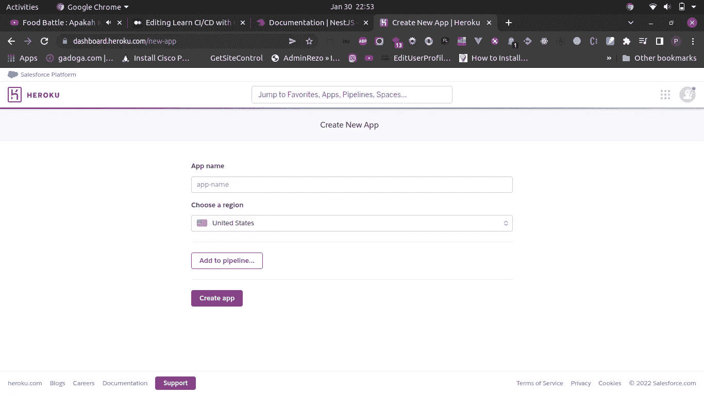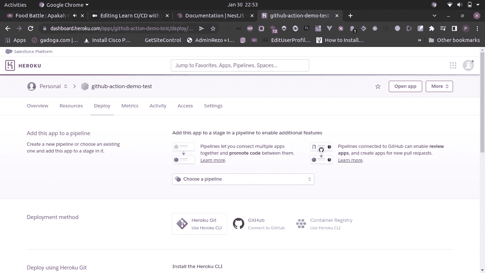

## 创建新的回购

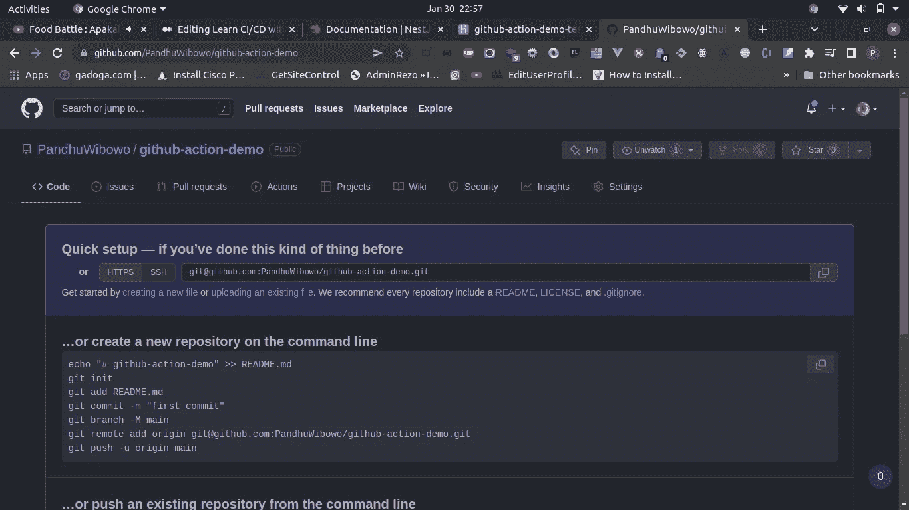

**从本地推送您的项目。**

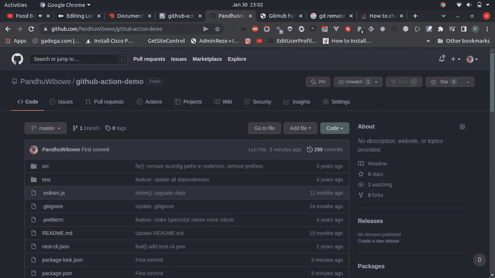

## 创建**的文件。yml** ，把它的名字。我给 as **production.yml**

*   点击**动作**选项卡。

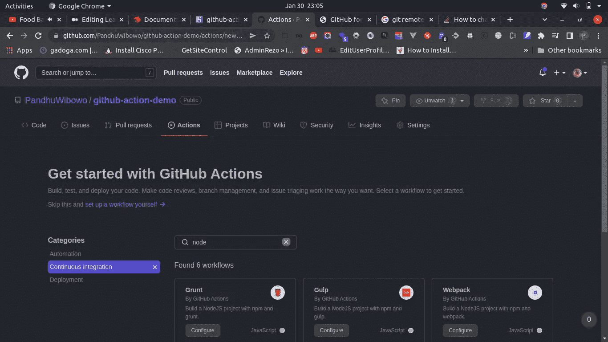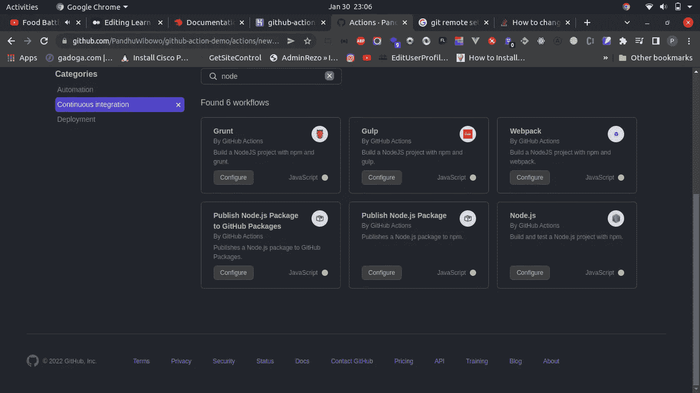

*   添加您的脚本 **production.yml**

```
# This workflow will do a clean installation of node dependencies, cache/restore them, build the source code and run tests across different versions of node# For more information see: https://help.github.com/actions/language-and-framework-guides/using-nodejs-with-github-actionsname: Node.js CIon:
  push:
    branches: [ master ]
  pull_request:
    branches: [ master ]jobs:
  build:
    runs-on: ubuntu-latest
    strategy:
      matrix:
        node-version: [12.x, 14.x, 16.x]
        # See supported Node.js release schedule at https://nodejs.org/en/about/releases/steps:
    - uses: actions/checkout@v2
    - name: Use Node.js ${{ matrix.node-version }}
    uses: actions/setup-node@v2
    with:
      node-version: ${{ matrix.node-version }}
      cache: 'npm'
    - run: npm ci
    - run: npm run build --if-present
    - run: npm test
  deploy: ## <-- this is the new stuff
    needs: build
    runs-on: ubuntu-latest
    steps:
    - uses: actions/checkout@v2
    - uses: akhileshns/heroku-deploy@v3.12.12
      with:
        heroku_api_key: ${{secrets.HEROKU_API_KEY}}
        heroku_app_name: ${{secrets.HEROKU_APP_NAME}}
        heroku_email: ${{secrets.HEROKU_EMAIL}}
        remote_branch: master
```

*   **请关注此套餐**

[https://github.com/AkhileshNS/heroku-deploy](https://github.com/AkhileshNS/heroku-deploy):akhileshns/heroku-deploy @ v 3 . 12 . 12

*   在 GitHub 上添加**秘密**，环境变量。

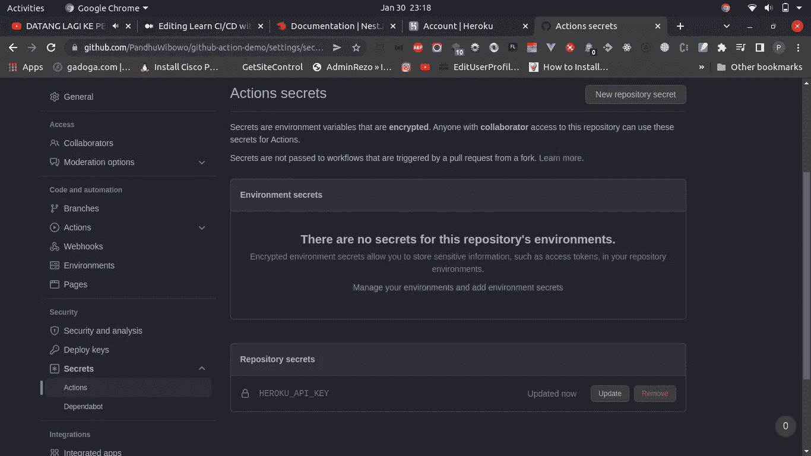

1.  HEROKU_API_KEY
2.  HEROKU_APP_NAMEHEROKU_APP_NAME
3.  HEROKU _ 电子邮件

*   将 **production.yml** 拉入本地机器。

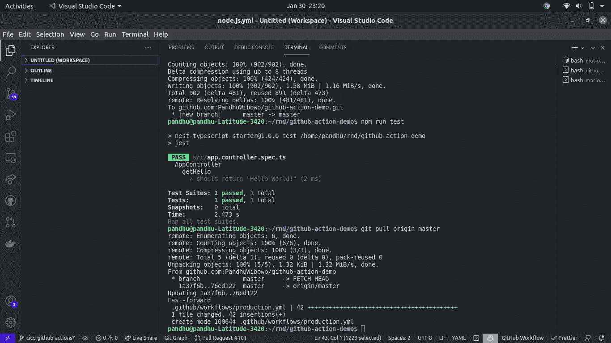

*   创建新的分支，如`demo`

```
git checkout -b demo
```

*   推送到存储库

```
git push origin demo
```

*   创建 PULL 请求到`master`，你应该在你的本地修改，并再次 push 来进行修改。

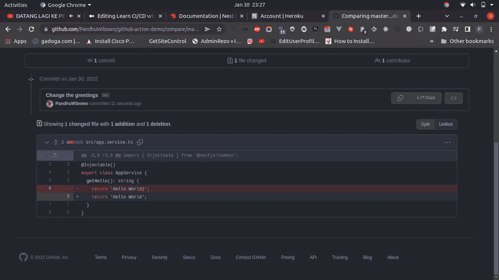

*   将处理合并请求


如果你选择一个，点击`Details`将会显示如下。

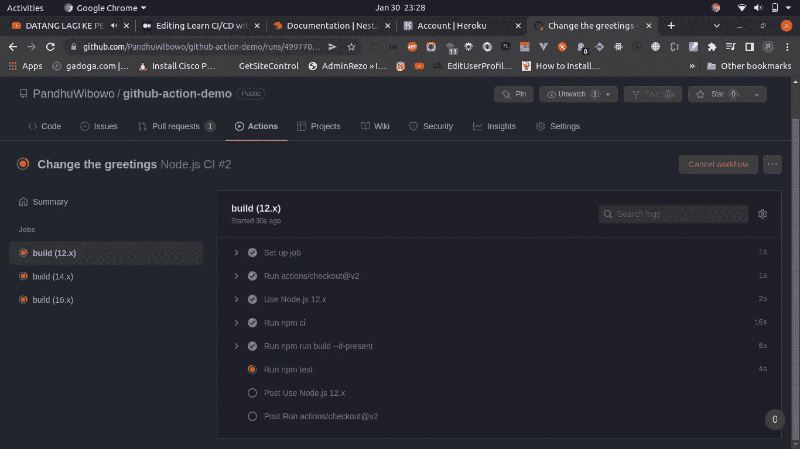

上面的过程仍然有效。

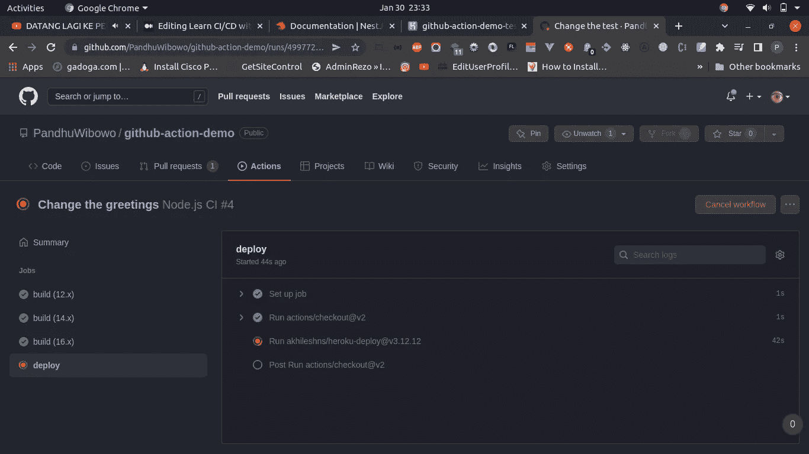

该图像显示项目正在部署。

和部署已经完成。

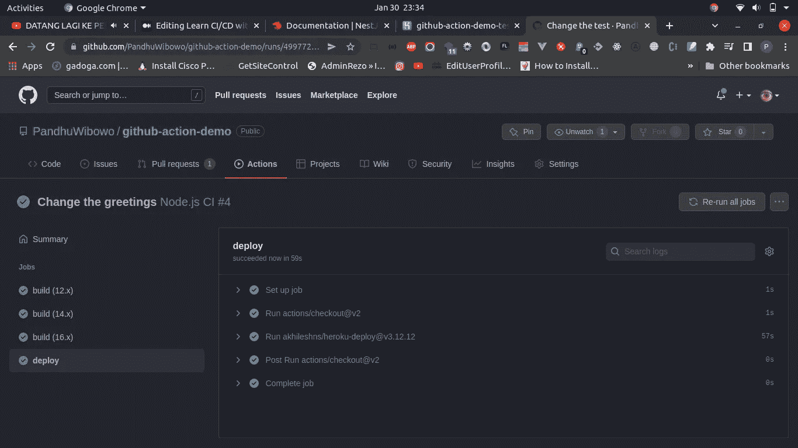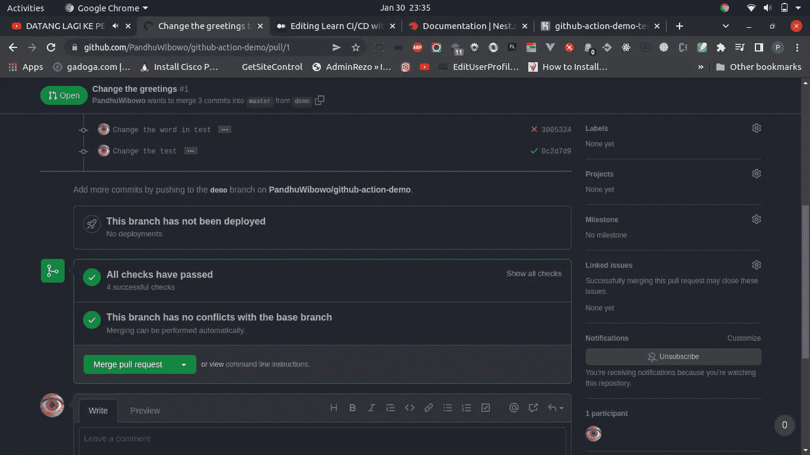

点击`Merge pull request`。

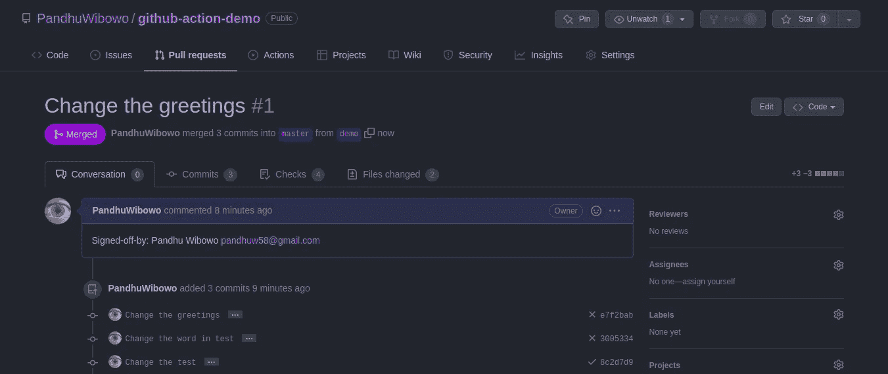

拉取请求**已被合并**。

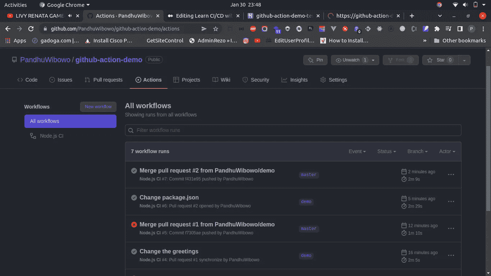

管道已成功部署。


**搞定！！**

该你试试这个了！希望能帮到你。快乐阅读，快乐编码！

[](https://github.com/PandhuWibowo/github-action-demo) [## GitHub-PandhuWibowo/GitHub-动作-演示

### 一个渐进式 Node.js 框架，用于构建高效且可伸缩的服务器端应用程序。嵌套框架类型脚本…

github.com](https://github.com/PandhuWibowo/github-action-demo) 

# 警惕！

如果你们来自印度尼西亚，想要支持我越来越多的写作，希望你们能从钱包里拿出一点来。你可以通过一些方式分享你的天赋，

## 萨韦里亚

[https://saweria.co/pandhuwibowo](https://saweria.co/pandhuwibowo)


## 特拉克特尔

[https://trakteer.id/goodpeopletogivemoney](https://trakteer.id/goodpeopletogivemoney)


# 多读我的文章

[](https://javascript.plainenglish.io/what-is-void-0-in-javascript-bdd4b3eb19a7) [## JavaScript 中的“void 0”是什么？

### 类似于未定义吗？到底该不该回避？

javascript.plainenglish.io](https://javascript.plainenglish.io/what-is-void-0-in-javascript-bdd4b3eb19a7) [](https://javascript.plainenglish.io/how-to-use-as-const-in-typescript-const-assertions-4ed34921ac51) [## 如何在 TypeScript 中使用“as const ”( const 断言)

### 我们应该什么时候使用它？

javascript.plainenglish.io](https://javascript.plainenglish.io/how-to-use-as-const-in-typescript-const-assertions-4ed34921ac51) [](/using-cloud-firestore-as-your-nosql-database-to-supports-your-business-part-1-c18347d4086a) [## 使用云 Firestore 作为您的 NoSQL 数据库来支持您的业务|第 1 部分

### 介绍 Firebase Firestore /云 Firestore

blog.devgenius.io](/using-cloud-firestore-as-your-nosql-database-to-supports-your-business-part-1-c18347d4086a) [](/sends-contact-form-via-sendgrid-marketing-campaigns-api-in-nestjs-4fa6c096e1df) [## 通过 NestJS 中的 Sendgrid 营销活动 API 发送联系人表单

### 在 Sendgrid 营销活动 API 中收集潜在客户数据

blog.devgenius.io](/sends-contact-form-via-sendgrid-marketing-campaigns-api-in-nestjs-4fa6c096e1df) [](https://javascript.plainenglish.io/deploy-a-strapi-v4-app-on-heroku-also-connected-into-google-cloud-sql-postgresql-f4c4ad8f2fa5) [## 在 Heroku 上部署一个 Strapi V4 应用程序，同时连接到 Google Cloud SQL (PostgreSQL)

### 如何在 Heroku 上部署一个连接到 Google Cloud SQL (PostgreSQL)的 Strapi V4 应用程序

javascript.plainenglish.io](https://javascript.plainenglish.io/deploy-a-strapi-v4-app-on-heroku-also-connected-into-google-cloud-sql-postgresql-f4c4ad8f2fa5) 

# 参考

[](https://betterprogramming.pub/github-actions-the-what-why-and-how-3868d5a86292) [## Github 操作——什么、为什么和如何

### 用 Github 动作自动完成枯燥的任务

better 编程. pub](https://betterprogramming.pub/github-actions-the-what-why-and-how-3868d5a86292) [](https://docs.github.com/en/actions/learn-github-actions/understanding-github-actions) [## 了解 GitHub 操作- GitHub 文档

### GitHub Actions 是一个持续集成和持续交付(CI/CD)平台，允许您自动化您的…

docs.github.com](https://docs.github.com/en/actions/learn-github-actions/understanding-github-actions)