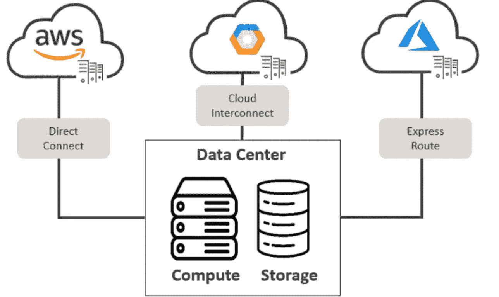
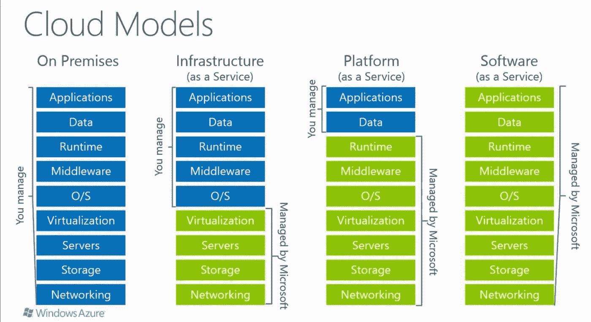
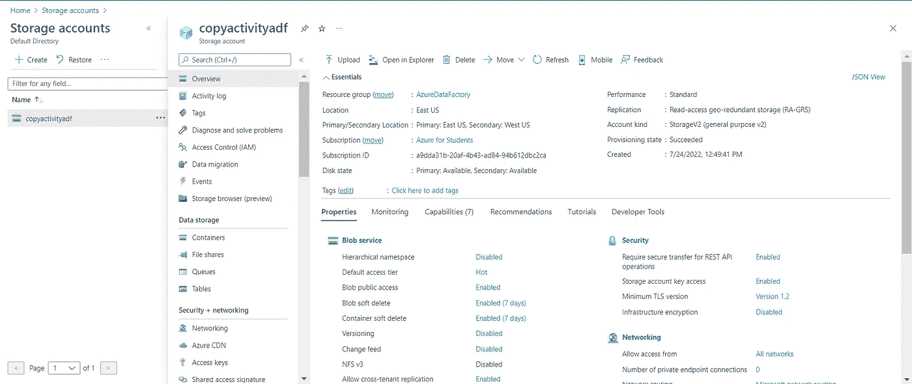
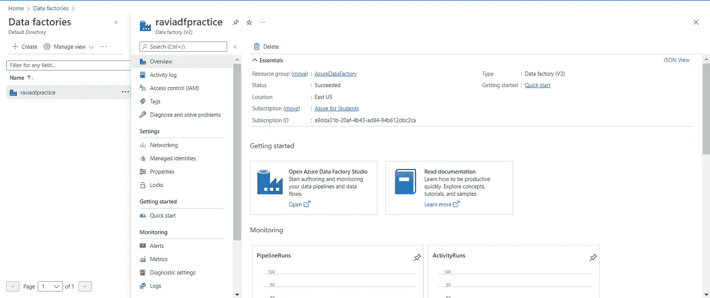
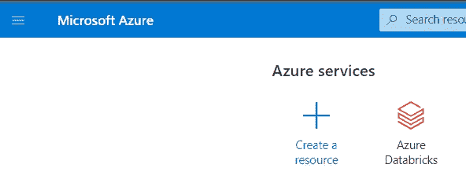
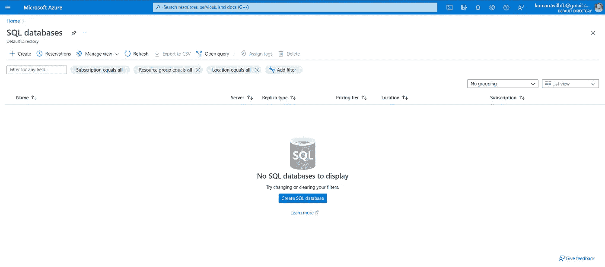

# 使用 Azure ☁学习云计算？

> 原文：<https://blog.devgenius.io/learn-cloud-computing-using-azure-5be6b271163b?source=collection_archive---------5----------------------->

在本文中，我们将详细讨论云计算及其用例。

在 [Unsplash](https://unsplash.com?utm_source=medium&utm_medium=referral) 上由 [C Dustin](https://unsplash.com/@dianamia?utm_source=medium&utm_medium=referral) 拍摄的照片

> 云计算是一种通过互联网访问各种计算资源的技术。你所需要做的就是用你的电脑或者移动设备通过互联网连接到你的云服务提供商。一旦连接，您就可以访问计算资源，其中可能包括无服务器计算、虚拟机、存储和各种其他东西。

云计算架构

**云计算可以用于各种目的**:机器学习、数据分析、存储和备份、流媒体内容等等。

## 云计算为什么重要？

让我们举一个例子，你计划创建并发布一个应用程序来帮助客户进行网上购物。然而，在互联网上发布一个应用程序并不像看起来那么容易。

为此，您将需要各种组件，如服务器、存储设备、开发人员、专用网络和应用程序安全性，以确保您的解决方案按预期方式运行。购买和维护单个组件既昂贵又有风险。

这就出现了云服务的使用，比如(著名的) :

云服务提供商

*   微软的 Azure
*   亚马逊的 AWS
*   谷歌云平台(GCP)来自谷歌

## 收入方面的云基础架构服务市场

在本文中，我们将只关注 Azure，Azure 是一个云计算平台和在线门户，允许您访问和管理微软提供的云服务和资源。这些服务和资源包括存储数据和转换数据，具体取决于您的需求。要访问这些资源和服务，你只需要一个活跃的互联网连接和连接到 Azure 门户的能力。

## 什么是 Azure？

Azure 云平台拥有 200 多种产品和云服务，旨在帮助并为生活带来新的解决方案，以解决今天的挑战并创造未来。使用您选择的工具和框架，在内部和边缘跨多个云构建、运行和管理应用。

## 一些关于 Azure 的有趣事实-

*   它于 2010 年 2 月 1 日推出，明显晚于其主要竞争对手 AWS。
*   它开始是免费的，并遵循按使用付费的模式，这意味着你只需为你选择的服务付费。
*   有趣的是，80%的财富 500 强公司使用 Azure 服务来满足他们的云计算需求。
*   Azure 支持多种编程语言，包括 Java、Node Js 和 C#。
*   Azure 的另一个好处是它在世界各地拥有的数据中心的数量。有 42 个 Azure 数据中心分布在全球各地，这是所有云平台中数据中心数量最多的。此外，Azure 正计划增加 12 个数据中心，这将很快使数据中心的数量增加到 54 个。

## 各种 Azure 服务是什么，Azure 是如何工作的？

Azure 提供 200 多种服务，分为 18 类。这些类别包括计算、网络、存储、物联网、迁移、移动、分析、容器、人工智能和其他机器学习、集成、管理工具、开发人员工具、安全、数据库、DevOps、媒体身份和 web 服务。

先说一些著名的常用服务——

*   **存储账户** -

这项服务经过优化，可以存储海量的非结构化数据，包括文本甚至二进制数据(著名的是 Blob 存储)。

*   **蔚蓝数据工厂-**

该服务用于通过定义多个管道和数据流来自动执行任务，从而编排数据。

*   **蔚蓝数据公司-**

该服务用于处理大量数据工作负载，也有助于数据工程、数据探索以及使用机器学习可视化数据。

*   **SQL 数据库-**

该服务允许您创建自己的 SQL 数据库来存储和检索数据。

我们将在接下来的博客中详细讨论每一个问题。

## 为什么要用 Azure？

现在我们对 Azure 及其提供的服务有了更多的了解，探索它的各种用例可能会很有趣:

*   **应用开发**:你可以在 Azure 中创建任何 web 应用。
*   **测试**:在平台上开发成功一个应用后，就可以进行测试了。
*   **应用托管**:一旦测试完成，Azure 可以帮你托管应用。
*   **创建虚拟机**:在 Azure 的帮助下，你可以创建任何配置的虚拟机。
*   **集成和同步特性** : Azure 让你集成和同步虚拟设备和目录。
*   收集和存储指标 : Azure 让你收集和存储指标，这可以帮助你找到有用的东西。
*   **虚拟硬盘**:这些是虚拟机的扩展；它们提供了大量的数据存储。

> 如果这篇文章对你有所帮助，别忘了关注、喜欢并分享给你的朋友👍快乐学习！！