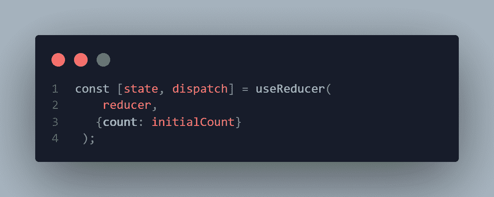
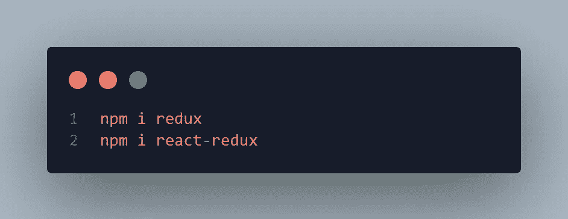
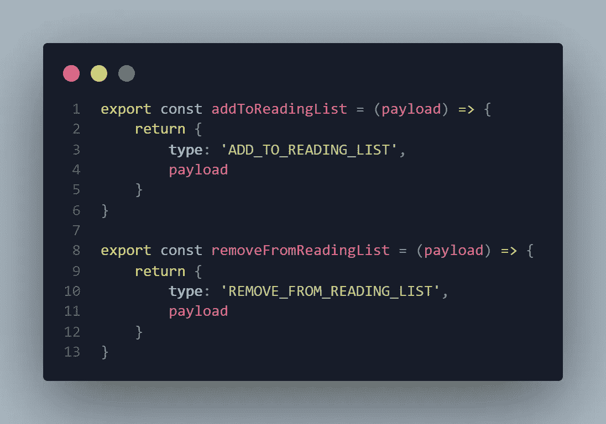
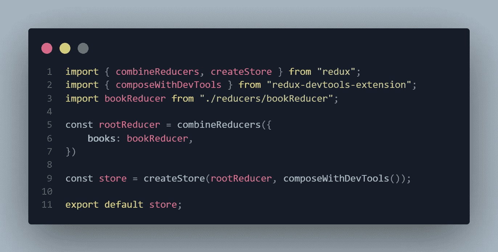
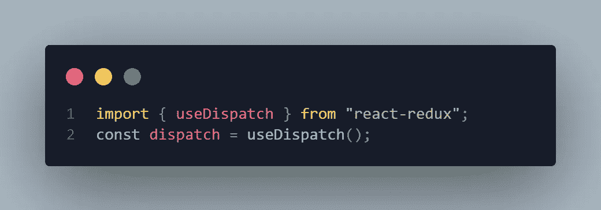
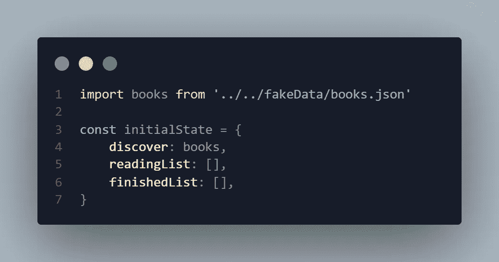
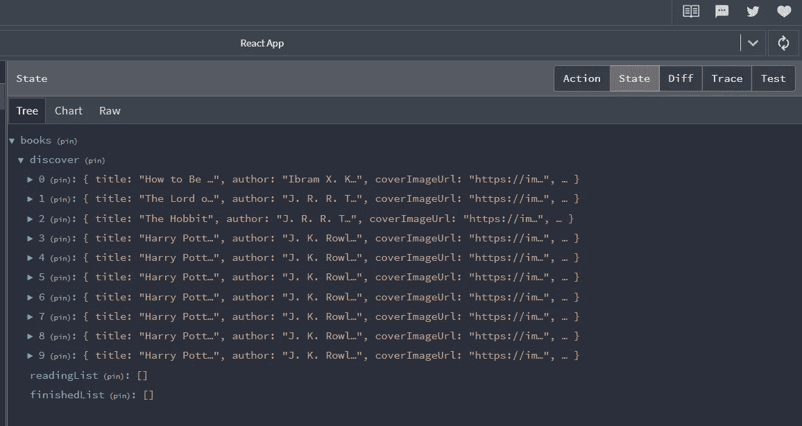

# 学习 core Redux——这是你能想到的最简单的方法

> 原文：<https://blog.devgenius.io/learn-core-redux-the-easiest-way-you-can-imagine-e051d7eaa893?source=collection_archive---------3----------------------->

redux 最简单的定义是，它是一种帮助您管理应用程序及其数据流的简单方法。当我们处理大规模应用程序时，管理数据的状态可能会很棘手。Redux 通过其高效的状态管理系统减轻了痛苦。Redux 可以用于任何 Javascript 库或框架。在这个博客中，我们将学习 redux 以及如何用 redux 拥有的一些有用的技巧和工具来实现它。但首先，让我描述一下为什么以及何时应该使用 redux？

当我开始学习 redux 时，这个问题一直在我脑海中闪现。在可以通过组件使用上下文 API 甚至道具处理方法的情况下，为什么我还要使用 redux？需要记住的一点是，Redux 需要在一个非常复杂的系统中引入，在这个系统中，通过上下文 API 或 props 处理方法来管理状态可能会非常繁忙。有人说 redux 让复杂的项目变得简单，让简单的项目变得复杂。Redux 需要在状态变化可以预测的站点上实现。

此外，redux 的一些好处是，它最大限度地减少了不必要的 API 请求，同时您可以从 redux 存储中获取数据，而无需额外的 API 来发送和查询数据库。最简单的例子是，假设您的数据库中存储了一些图书数据。当用户访问图书页面时，您发送一个 API 请求从您的服务器获取所有数据，并获取您的图书页面上的所有图书。

现在，如果用户想在点击按钮时看到某本书，该怎么办呢？最简单的 Node 或 Express JS 解决方案可能是，通过单击那个按钮，您获取 _id 并点击另一个 API 请求来查询您的数据库并找到特定的图书，然后在用户转到相应的图书内页并找到结果时发送回响应，对吗？

但是，就因为这样，您遇到了另一个 API 请求，有没有什么可行的解决方案可以让您检索存储在系统后端某个地方的图书数据呢？Redux 正是在这里发挥了它的作用！第一次发送 API 请求将所有图书数据放入客户端时，我们可以将数据存储到 Redux store 中，下一次，我们可以从 Redux Store 中检索数据并显示给客户端，而不是发送另一个 API 请求来查看单个图书信息。而且，这比发送不必要的 API 请求并等待响应要快得多。这仅仅是 Redux 如何使网站更高效并提供良好用户体验的众多用例中的一个例子。

Redux 的想法来自 react 的 useReducer()钩子。任何知道这个钩子或者使用过这个钩子的人都会感觉很舒服。这个钩子也是 react 的 useState()钩子的替代物。只是去掉了这个钩子的一个简单的编码结构，这样单词后面的概念对我们来说就更有意义了:

useReducer()挂钩编码结构

现在让我们回顾一下，Redux 主要是给我们一个对象，同时在一个位置保存整个应用程序的状态。这绝对可以证明这个工具有多厉害。我们将在这个博客的后面看到一些例子，但是让我们深入到 Redux 的核心部分。它运行我的四个核心概念，即存储、动作、减少和订阅。我不想用它们自己有据可查的强硬定义来单独描述它们，让我们举一个非常简单的例子来定义它们。

假设你去了一家“商店”，在那家商店里卖东西的人被称为售货员。在 redux 中，我们称这个推销员为“Reducers”，他倾听你的需求，或者我们可以说你的“行动”并据此行动。你必须告诉售货员你到底想从商店里得到什么，告诉他你正在“分派”你的行动，否则售货员什么也不会做。作为顾客，你也可以成为那家商店的“订户”。

现在有意义了吧？Redux 是完全相同的，这里我们有一个保存数据或状态的公共存储，一个根据一些动作的分派或者更准确地说根据这些动作的类型来执行或更新状态的 Reducer。我的意思是你想给减速器发送什么类型的动作，以便它能相应地工作。当发送一个动作到商店时，我们分派它。更像是枪里的子弹，我们触发它。

好的，如果你仍然困惑，请记住下面的四个关键词，这足以让你开始:

客户端→动作→缩减器→存储→状态

现在让我们一个接一个地来看看文件夹的结构应该是怎样的，

首先，我们开始将 redux 安装到我们的项目中:

**动作:**你已经知道动作是做什么的了，它更像是我们需要做的工作类型，或者发送给我们的减速器，以便它可以执行该工作。在 redux 中，我们使用切换用例来定义系统中的动作类型。比方说，我们图书网站可能会发生不同类型的操作。所以在下面的代码中，这就是你如何定义动作的类型，它把一个参数作为有效载荷(我们需要改变)。这是在函数内部，所以我们可以导出并重用它。

操作> bookActions.js

**还原者:**这是指执行上述动作的人。它有两个参数(状态、动作)。对于减速器:

1.  为了让它执行一个动作，我们需要告诉 reducer 这个动作是什么类型的
2.  在执行添加之前，将对象的先前状态保存为…状态，但是如果我们想要删除，我们过滤想要删除的 id，然后更新状态
3.  然后将新的状态保存为 action.payload
4.  然后返回新状态

reducers>bookReducers.js

减速器最好使用开关箱。并将数据添加为 initialState，这样我们就可以使用这个状态，并根据需要在整个系统中修改它。现在，我们还出口了它，这样我们就可以在商场中使用这种减速器。

**Store:** 我们需要创建一个带有两个参数的 Store。一个是 reducer，另一个是名为 composeWithDevTools()的中间件，它更像是整个系统的 CC 摄像头，通过 chrome dev 工具跟踪状态变化。首先我们将安装这个包和扩展。

(请注意，该工具的旧包已被弃用，所以要小心。将最新版本放在下面)

Github 链接:【https://github.com/reduxjs/redux-devtools 

也安装这个 chrome 扩展，这样我们就可以从控制台跟踪状态:

[chrome 的 Redux 开发工具扩展](https://chrome.google.com/webstore/detail/redux-devtools/lmhkpmbekcpmknklioeibfkpmmfibljd?hl=en)

完成后，我们需要设置商店:

商店. js

我们将使用组合减压器，因此如果将来需要，我们可以在其中使用多个减压器。如果你的设置已经准备好了，我们现在需要从客户端加载数据到 Redux store。

现在您只需要记住 React-redux 的两个钩子，它们将数据加载到 store 中，并在需要时获取数据。就这么简单。这两个挂钩是:

从任何地方调用这个钩子都会将我们的数据加载到 redux store 中！编码语法如下:

useDispatch()挂钩

这将被调度并将这些数据从 bookReducer.js 加载到存储中:

一旦它被发送，我们可以从 redux chrome 开发工具检查:

Redux chrome 开发工具控制台

酷！数据已经存储好了，我们现在需要的就是去取。为此，我们将使用 react-redux 的 useSelector 钩子。

**useSelector** :这个钩子也很直接。我们只需要调用这个钩子，从存储中获取数据。这就像 javascript 的 find 方法，我们可以通过查询或筛选出带有条件的数据来展示，以获得我们的目标数据。

useSelector()挂钩

这完全是你开始使用 Redux 和它的核心概念所需要知道的一切。希望这个博客是有益的。我在这里展示的过程是实现 redux 的手动过程。一旦你习惯了，开始学习 react-toolkit，它会让你更好地重复体验。通过在其中实现 redux-thunk，我们也可以将 API 提取到 redux 存储中。

我将在另一个博客上介绍 Redux Toolkit 及其核心实现。如果你读到这个片段，非常感激，如果你发现这是有用的和信息丰富的，请鼓掌！谢谢你。

## 关注我的新博客！

> 对于前端自由职业者的工作，请通过 [Fiverr](https://www.fiverr.com/iftikharrasha) 和 [Upwork](https://www.upwork.com/freelancers/~01ff725599269ba3c2) 联系我
> 
> 查看我的[作品集](https://iftikhar-rasha.web.app/)和 [Github](https://github.com/iftikharrasha) 来看看我最近的项目
> 
> 通过 LinkedIn[联系我](https://www.linkedin.com/in/iftikharrasha/)