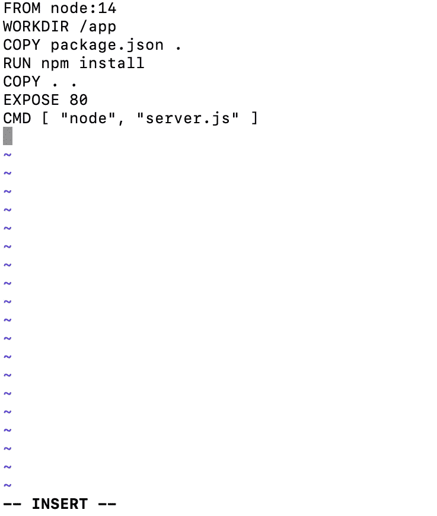

# Docker 教程—第 10 天

> 原文：<https://blog.devgenius.io/learn-docker-day-10-9ee75ddcc7ba?source=collection_archive---------7----------------------->

## Dockerfile 入门

图片由 [Agnivesh Jayadeep](https://unsplash.com/@agniveshaj)

我们之前已经看到了如何在 [Day 6](https://medium.com/@narendra.techarticles/learn-docker-day-6-f0e2608b9063) 中使用 Docker 容器构建图像。  在这一部分，我们将看看构建 Docker 映像的第二种方法:使用 Dockerfiles。

docker 文件是一个包含如何创建图像的说明的文本文档。例如，指令可以是安装程序、添加源代码或指定在容器启动后运行哪个命令。

通过从 Docker 文件中读取指令，Docker 可以自动构建映像。每条指令都会给图像添加一个新层。换句话说，指令指定了在构建映像时应该做什么。

我们可以通过创建 docker 文件来开始这个过程。注意:docker 文件不能有任何扩展名，它们的名称必须以大写字母 d 命名。

现在我们有了 docker 文件，让我们来看看它。

Docker 按顺序运行 docker 文件中的指令，第一条指令必须是*FROM*来指定我们正在构建的**基础映像**。

如您所见，我们使用 node:14 作为我们的基本映像。所以 node:14 是 FROM 指令的参数。

指令中的 ***不区分大小写，但惯例规定它们是大写的，以便更容易与参数区分开来。***

让我们继续下一条指令，即 ***WORKDIR*** 指令。此指令为其后的所有附加指令设置工作目录，包括 COPY、RUN、EXPOSE 和 CMD。它可以在同一个 Dockerfile 文件中多次使用。如果提供了相对路径，它将是上一条 WORKDIR 指令的相对路径。

接下来，我们将检查 Dockerfile 中的 ***COPY*** 命令，该命令从源文件复制文件或目录，并将它们添加到目标路径的文件系统中。

Dockerfile 中的下一个命令是 ***运行*** 。使用 RUN 指令，将在当前图像之上的新层中执行命令，并提交结果。提交的映像将用于 docker 文件的下一步。

现在我们来看看 Dockerfile 中的下一个命令: ***EXPOSE。***

Docker 的 ***EXPOSE*** 指令指示 Docker 在运行时监听指定的网络端口。默认情况下，EXPOSE 指令不公开可从主机访问的容器端口。换句话说，它只让指定的端口可用于容器间的交互。

最后，让我们继续 docker 文件中的最后一个命令，即 CMD 命令。 ***CMD*** 命令指定 Docker 容器启动时要执行的指令。在本例中， ***CMD*** 正在指示启动节点服务器。

这里有一个我们需要学习的新命令: ***docker build。—*** 该命令根据 Dockerfile 文件中的指令构建镜像。类型 ***码头工人建造。*** 入门。

所有步骤完成后，我们可以运行 ***docker images*** 来确保我们构建的新映像创建成功。

如您所见，我们刚刚构建的图像被标记为 none ，因为我们在运行 ***docker 构建时没有指定标记。*** 命令

这篇文章暂时就说到这里。下一节将在后续文章中提到。