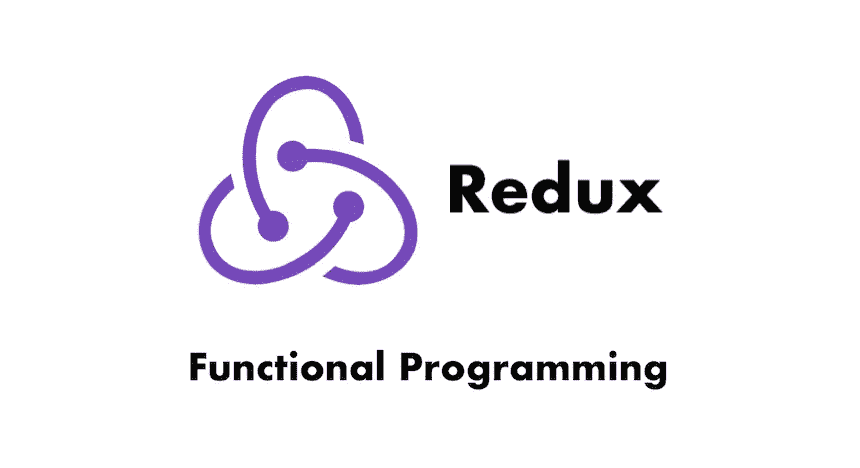
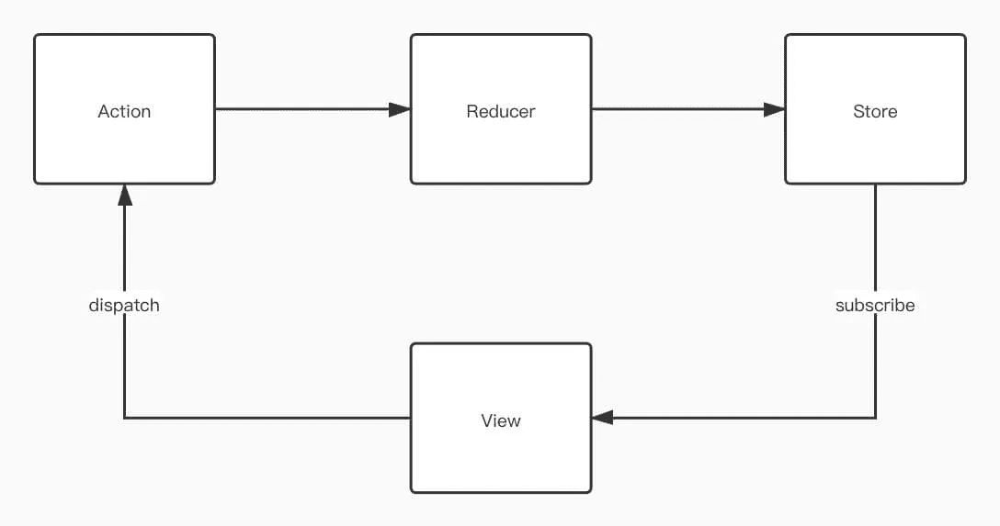
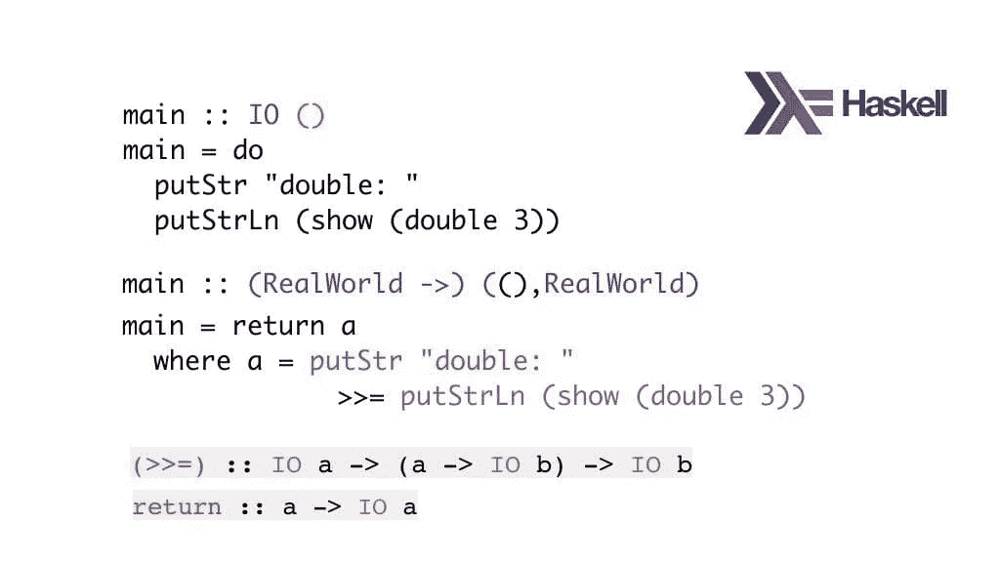
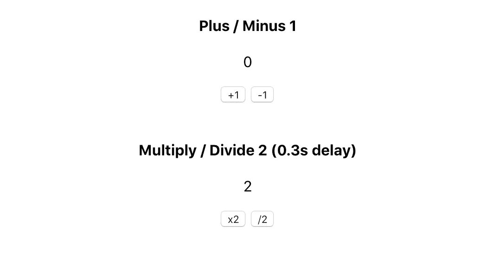

# 向 Redux 学习函数式编程设计

> 原文：<https://blog.devgenius.io/learn-fp-design-from-redux-95cc21479086?source=collection_archive---------7----------------------->



在我着眼于 Redux 源代码之前，我天真地认为 OOP 作为一种编程范式比 FP(函数式编程)优越。但这是不对的。正如我们所知，FP 致力于形成一个易于理解和清晰的工作流，没有那些模糊的抽象对象和关系。它更接近人类的程序性思维方式。

访问[Pitayan.com](https://pitayan.com/posts/redux-fp-design/?ref=medium)阅读原文。

[](https://pitayan.com/posts/redux-fp-design/?ref=medium) [## 向 Redux - Pitayan 学习 FP 设计

### 在我着眼于 Redux 源代码之前，我天真地认为 OOP 比 FP(函数式编程)更好…

pitayan.com](https://pitayan.com/posts/redux-fp-design/?ref=medium) 

现在`React`已经有钩子可以正确处理“状态”事件，而不需要[重复](https://redux.js.org/)。对 [Redux](https://redux.js.org/) 的需求可能会下降，但它的代码库仍然值得学习。尤其是对于那些想在函数式编程上有所启发的人。所以，我想从一个好的例子中学习从来都不是一个坏主意，即使它是“过时的”(一点也不)。

当我开始阅读 [Redux](https://redux.js.org/) 源代码时，我立刻感受到了我熟悉的编程语言的这种陌生用法的力量。这感觉就像用火把照亮画来探索一个古老的洞穴，发现了巨大的秘密。

为了更多地了解 Redux 从 FP 中获益，我研究了 [Redux](https://redux.js.org/) 源代码并创建了它的迷你版本。

> *永远不要害怕多此一举。*

# [回顾 Redux 的工作原理](https://pitayan.com/#recap-how-redux-works)

[Redux](https://redux.js.org/) 有 4 个基本要点:

1.  为数据创建一个存储，并让视图订阅它
2.  视图调度一个提交更改的操作
3.  缩减器根据动作类型改变状态
4.  最后返回新的状态并触发视图改变

这是解释 [Redux](https://redux.js.org/) 如何工作的经典图表:



从上图中，很容易找到关键词:`actionstorereducerviewsubscribe`和`dispatch`。其次是处理这些关键词之间的关系。

# [Redux 方法比较:FP vs OOP](https://pitayan.com/#redux-approach-comparison-fp-vs-oop)

[Redux](https://redux.js.org/) 的用法举例

```
const store = createStore(
  combineReducers({
    one: oneReducer,
    two: twoReducer
  }),
  applyMiddleware(ReduxThunk, ReduxLogger)
);
```

想象一下，如果我们在 OOP 中这样做，它可能看起来像这样:

(以下只是我的想象。不是老 [Redux](https://redux.js.org/) 表现如何)

```
const store = new Store();
store.setReducers({
  one: oneReducer,
  two: twoReducer
});
store.setMiddlewares({
  ReduxThunk,
  ReduxLogger
});
```

那么，有什么区别呢？在我看来，这两种方法都很好。

FP 在没有副作用的情况下很好地将功能组合在一起。返回值是一致的，这使得程序在执行期间或之后的返回是可预见的。

OOP 构建了一个坚实的结构，定义了数据模型应该包含的所有属性。这使得修改或配置数据模型变得很容易。

在 [Redux](https://redux.js.org/) 中，`reduers`和`middlewares`通常只定义一次。这意味着，我们不需要更新这些属性的能力，也不希望它们在运行时被改变。至于 FP 方法，它使用了`closure`技术，这种技术消除了暴露内部属性的可能性。通过一些奇妙的 FP 技术(curry、compose、pipe)，它甚至使程序比 OOP 更易于阅读。

我认为 FP 应该是最适合这种情况的。当然，我这里说的 FP 和 Haskell 这种真正的函数式编程相差甚远。但是至少在 Javascript 中使用 FP 技术的想法是可以遵循的。



# [精彩的 Redux FP 设计](https://pitayan.com/#wonderful-redux-fp-design)

在 Redux 中，根本没有类(在更早的版本中，曾经是基于`Class`)。它的所有核心 API 要么返回值，要么返回函数(函数工厂)。这正是 FP 所期望的函数行为:

> *纯无副作用。*

*   createStore:返回新的`Object` {获取状态，分派，订阅}
*   combineReducers:返回新的`Function`
*   applyMiddleware:返回新的`Function`

为了以一种简单的方式解释 Redux 设计，我只实现了上面 API 的核心部分。由于最新版本的核心理念没有太大变化，所以我是基于非常原始版本的 [Redux v1.0.1](https://github.com/reduxjs/redux/tree/v1.0.1/src) 写的源代码。因为我相信第一个相关的版本是最全面的。

让我们看一看。

## [创造商店](https://pitayan.com/#createstore)

定义了那些可以在组件中使用的 API。更像是`setter`和`getter`

*   getState
*   派遣
*   订阅

```
export default function createStore (reducer, enhancer) {
  if (enhancer) {
    return enhancer(createStore)(reducer);
  } let currentState;
  // Redux now uses a shallow copy `nextListeners` via `ensureCanMutateNextListeners()`
  // to prevent bugs in the middle of `dispatch`
  let currentListeners = []; function getState () {
    return currentState;
  } // Register callbacks to execute after changes
  function subscribe (listener) {
    currentListeners.push(listener); return () => {
      // empty listeners
      const index = currentListeners.indexOf(listener);
      currentListeners.splice(index, 1);
    };
  } function dispatch (action) {
    currentState = reducer(currentState, action);
    // state changes, notify to invoke callbacks
    currentListeners.forEach(listener => listener());
  } // Initialize Redux by calling a virtual reducer
  dispatch({ type: "MY-MINI-REDUX" }); return {
    getState,
    dispatch,
    subscribe
  };
}
```

## [联合收割机减速器](https://pitayan.com/#combinereducers)

返回一个可以返回新状态的新函数。不能再纯洁了。

```
// This is just a helper function to map through the Object
function mapValues(obj, fn) {
  return Object.keys(obj).reduce((result, key) => {
    result[key] = fn(obj[key], key);
    return result;
  }, {});
}export default function combineReducers (reducers) {
  return function combination (state = {}, action) {
    // Official Redux uses `pick` on filtering reducers.
    // Let's trust reducers are functions here
    return mapValues(reducers, (reducer, key) => reducer(state[key], action))
  };
}
```

## [应用中间件](https://pitayan.com/#applymiddleware)

我个人认为`applyMiddleware` API 是 Redux 最神奇的部分。它提供了应用第三方插件的最佳解决方案。

源代码中的 FP `compose`在我的理解中对应的是 Math 的[结合律](https://en.wikipedia.org/wiki/Associative_property)。

> *(*x*∫(*y*∫*z*)=*x*∫*y*∫*z

`applyMiddleware`的用法实际上是一种`pipe`的形式，它允许我们注入返回 store 对象的增强函数。这与最典型的例子是注释/装饰器的`Aspect Oriented Programming`非常相似。

```
// Combine the functions
// a(b(c())) => compose(a, b, c)
function compose(...funcs) {
  return funcs.reduceRight((composed, f) => f(composed));
}export default function applyMiddleware(...middlewares) {
  return next => (reducer, initialState) => {
    const store = next(reducer, initialState);
    let dispatch = store.dispatch;
    const middlewareAPI = {
      getState: store.getState,
      dispatch: action => dispatch(action)
    };
    const chain = middlewares.map(middleware => middleware(middlewareAPI)); // Enhance the `dispatchers` by applying middlewares to each of them
    dispatch = compose(...chain, store.dispatch); return {
      ...store,
      dispatch
    };
  };
}
```

# [Redux 中间件](https://pitayan.com/#redux-middlewares)

[Redux](https://redux.js.org/) 有一些著名的中间件，比如 [redux-thunk](https://github.com/reduxjs/redux-thunk) 和【Redux-logger([https://github.com/LogRocket/redux-logger](https://github.com/LogRocket/redux-logger))。这些是使用`applyMiddleware` API 增强功能的好例子。此外，他们的代码库小得惊人。核心部分只有几行代码。

所有的中间件都是`curry`函数。

> *funcA =>funcB =>funcC*
> 
> *funcB = funcA()*
> 
> *funcC = funcB()*

当我需要在代码块中使用其他上下文时，这非常有用。作为例子，很容易发现`next`和`action`被作为上下文传递，以帮助处理一些复杂的情况。

## [Redux Thunk](https://pitayan.com/#redux-thunk)

`redux-thunk`允许使用函数作为`dispatch`参数，这样我就可以在“分派”之前做正确的事情。

```
// without redux-thunk
dispatch({ type: 'action', payload: 'value' })// with redux-thunk
// the dispatch is wrapped up by a new function
dispatch(function (dispatch, getState) {
  console.log('redux-thunk')
  dispatch({ type: 'action', payload: 'value' })
})
```

这里是核心:

```
// Allow passing function to dispatch
export default function thunk({ dispatch, getState }) {
  return next => action => {
    if (typeof action === "function") {
      return action(dispatch, getState);
    } return next(action);
  };
}
```

## [Redux 记录器](https://pitayan.com/#redux-logger)

很容易猜到这个中间件是做什么的。它只是输出状态变化。

```
// Output the previous and current state in console
export default function logger({ getState }) {
  return next => action => {
    console.log("======== Redux Logger ========");
    console.log("Action Type: ", action.type);
    const prevState = getState();
    console.log("Prev: ", prevState); const returnValue = next(action); const nextState = getState();
    console.log("Next: ", nextState);
    console.log("==============================");
    return returnValue;
  };
}
```

# [一款演示应用](https://pitayan.com/#a-demo-app)

我实现了 redux 的迷你版本和一个小的计数器应用程序来演示这些功能。该应用程序将做四个算术运算:加，减，乘，除。单击操作按钮后，数字会发生变化。同时，`multiply`和`divide`将有 300 毫秒的延迟，这是由一个定制的中间件(一个迷你 redux-thunk)实现的。

**“mini-redux”的存储库链接:**

[https://github.com/daiyanze/mini-redux](https://github.com/daiyanze/mini-redux)

**演示 App 链接:**

[https://daiyanze.com/mini-redux/build/index.html](https://daiyanze.com/mini-redux/build/index.html)



该应用程序有一个子组件:`MiniReduxComp`。在我的 mini-redux 中，我没有创建上下文提供者来触发更新。相反，我订阅组件中的存储更改，并使用`forceUpdate`对更改做出反应。

我还应用了自定义中间件`redux-thunk`和`redux-logger`来丰富功能。

```
import React, { Component } from 'react';
import store from '../store'export default class MiniReduxComp extends Component { componentDidMount() {
    this.unsubscribe = store.subscribe(() => this.forceUpdate());
  } componentWillUnmount() {
    this.unsubscribe && this.unsubscribe();
  } plus = () => store.dispatch({ type: "PLUS" }) minus = () => store.dispatch({ type: 'MINUS' }) multiply = () => store.dispatch((dispatch, getState) => {
    setTimeout(() => {
      dispatch({ type: 'MULTIPLY' })
    }, 300)
  }) divide = () => store.dispatch((dispatch, getState) => {
    setTimeout(() => {
      dispatch({ type: 'DIVIDE' })
    }, 300)
  }) render() {
    return (
      <div>
        <h4>Plus / Minus 1</h4> <p>{store.getState().count}</p> <button onClick={this.plus}>+1</button>
        <button onClick={this.minus}>-1</button> <br />
        <br /> <h4>Multiply / Divide 2 (0.3s delay)</h4>
        <p>{store.getState().double}</p> <button onClick={this.multiply}>x2</button>
        <button onClick={this.divide}>/2</button>
      </div>
    );
  }
}
```

# [结论](https://pitayan.com/#conclusion)

我认为在现代 web 开发中，OOP 仍然是主流。然而，我们可以看到，有一些开源项目混合了编程范式，并交付了非常合格的框架(例如 [nest.js](https://nestjs.com/) )。感谢`React`社区，计划生育现在是发展必需品的一部分。

好了，Redux 向下钻取到此为止。希望你也能很好地理解 [Redux](https://redux.js.org/) 中的 FP 设计。如果你觉得这篇文章很棒，请分享到社交网络上。

感谢阅读！

# [参考文献](https://pitayan.com/#references)

*   [https://redux.js.org](https://redux.js.org/)
*   [https://github.com/reduxjs/redux](https://github.com/reduxjs/redux)
*   【https://en.wikipedia.org/wiki/Distributive_property 号
*   【https://en.wikipedia.org/wiki/Associative_property 
*   [https://medium . com/JavaScript-scene/10-tips-for-better-redux-architecture-69250425 af 44](https://medium.com/javascript-scene/10-tips-for-better-redux-architecture-69250425af44)
*   [https://code-卡通. com/a-卡通-intro-to-redux-3afb775501a6？source=search_post - 3](https://code-cartoons.com/a-cartoon-intro-to-redux-3afb775501a6?source=search_post---------3)

原本在[Pitayan.com](https://pitayan.com/?ref=medium)

[https://pitayan.com/posts/redux-fp-design/](https://pitayan.com/posts/redux-fp-design/?ref=medium)

[](https://pitayan.com/posts/redux-fp-design/?ref=medium) [## 向 Redux - Pitayan 学习 FP 设计

### 在我着眼于 Redux 源代码之前，我天真地认为 OOP 比 FP(函数式编程)更好…

pitayan.com](https://pitayan.com/posts/redux-fp-design/?ref=medium)