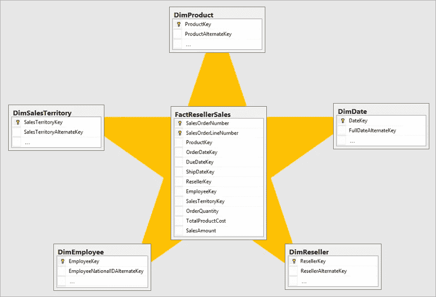

# 向硅谷的数据工程师学习:维度数据建模已死

> 原文：<https://blog.devgenius.io/learn-from-googles-data-engineers-dimensional-data-modeling-is-dead-68f6c2cb3fb0?source=collection_archive---------0----------------------->

我在硅谷的第一天是在 2019 年，我最大的惊喜之一是我没有找到任何维度的数据集市。我习惯于将事实与维度联系起来，能够快速说出标准形式，并宣扬数据建模的最佳实践。我认为自己是渐变维度以及如何应用它们的专家。Ralph Kimball 在其 1996 年的著作中推广了多维数据建模，这是一种在数据仓库中组织数据的方法。虽然宣传了许多好处，但我认为它的存在有三个主要原因；优化计算、按主题组织数据以及优化存储。这些推动维度建模出现的基本目的已经随着时间的推移而演变。让我们利用这一历史时刻来重温一下维度建模为什么存在，以及它的根源如何满足我们今天的需求。

资料来源:unsplash.com

在计算的早期，存储成本很高；1985 年高达 9 万美元。在这种情况下，数据需要以这样一种方式进行组织，即最大限度地减少存储相同值的次数。为此，以数据库键的形式使用指针，将唯一标识符指向许多相同值的记录。数据库标准化是为了描述数据库的重复数据消除和存储优化程度。每次表中存在一个维度时，我们可以只存储一次描述，并将其连接到要描述的记录，而不是存储一个很长的描述值。

1985 年，最快的计算机以高达 3200 万美元的价格提供了 1.9 千兆次的计算能力，计算优化也同样重要。作为参考，今天一些最快的计算机可以进行超过 400 petaflops 的计算，或者超过 20，000 倍的 flops。在数据库的早期，减少操作的数量和每个操作的平均复杂性可以为公司节省数百万美元。例如，不需要分析长的复杂字符串值来关联记录，我们可以将单个整数分配给唯一的实例，并关联这些整数而不是字符串。

为了实现这些优化，数据被组织到面向主题的数据模型中。一种常见的面向主题的模型是星型模式。

这个模型的好处是恒星的中心。事实表包含物理索引和易于检索的值。检索成本较高的值存储在维度表中，可以有选择地进行检索，从而节省处理成本。

如果出现与事实相关的新维度，则必须放置新的维度表，需要加强关键关系，并保持标准化合规性的过程。在成功的维度建模中，源数据表被拆开，分布在许多表中，如果操作正确，可以在必要时重新组装回源表。

# 为什么维度建模正在消失？

## 1.存储几乎免费了

数据库规范化已经过时了。每月 1gb AWS 云存储的成本[仅为 2 美分](https://aws.amazon.com/s3/pricing/)。将长表和/或宽表分解成星型或雪花型模式的回报很低。虽然存储所需的总空间可能会减少 95%,但如果以每年几便士的价格计算，这一成本并不是一个考虑因素。这适用于几乎所有规模的桌子，以及所有规模的公司。

## 2.计算机不贵

虽然在过去，将数据模型的计算成本减少 10 倍可以节省数十万甚至数百万美元，但这些节省不再是合理的。速度也是一个需要考虑的因素，但是执行所有必要的操作和返回结果集所需的时间微乎其微。随着云架构的出现，计算很容易扩展，请求额外的资源来应用于长时间运行的查询变得很容易。

## 3.维度模型对于普通用户来说很难理解

对于我们普通的数据消费者来说，比如根据这些模型中的数据得出的结论进行运营的企业，数据模型并不直观。作为数据工程师，我们可能会查看数据模型并直观地理解它们，但最终从我们维护的数据系统中受益的用户几乎普遍喜欢以他们熟悉的格式查看数据；像电子表格这样的表格。根据我的经验，讲授简单的“SELECT”、“FROM”、“WHERE”比描述维度模型、它们为什么存在以及如何连接表来检索值要容易得多。

## 4.维度模型的维护成本很高

添加到源系统中的新列不消耗任何集成资源来维护，而将新列或源系统集成到数据模型中则相对耗时。虽然近年来新的数据建模工具使集成变得更加容易，但是如果每次向源表中添加新列时都不调整数据模型，那么新列通常不能被最终用户使用。

# 数据设计的下一步是什么？

维度数据建模的好处正在显现。正如立方体成名并很快从流行中消失一样，星型模式也有成为焦点的一天。在未来几年，数据湖和数据湖屋将成为焦点。数据湖提供了更好的最终用户体验，维护成本低廉，并且不需要额外的工程资源来构建。

数据湖的主要好处是对业务的可用性。数据摄取机器的中间层；分析师或商业智能工程师曾经需要解释复杂的数据模型来为业务提供价值，现在数据可以直接从源连接到最终用户。分析师和商业智能工程师现在可以专注于解决更有价值的问题，例如构建预测管道的工程特性。数据湖最近的成功表明，计算和存储资源不再受益于边际减少，可用性的提高被重新发现为数据生态系统的一个重大整体提升。与维度模型相关的维护成本可以转而致力于为企业创造快速价值。

维度建模呢？维度建模在历史上有它的时代，就像立方体一样，我相信它会逐渐变得模糊。现在有很多公司都致力于维度建模，所以我不相信这项技术会在很多年内消失。随着新团队开始评估数据湖和维度模型的成本，将会出现越来越少的维度模型。