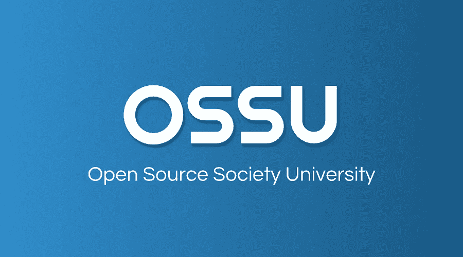

# 哈佛和麻省理工的免费教育:任何人都可以向他们学习

> 原文：<https://blog.devgenius.io/learn-from-harvard-and-mit-how-the-whole-world-can-2c2e9b76fd38?source=collection_archive---------11----------------------->

## 来自世界最好大学的免费 CS 教育。按照你自己的速度和时间。

埃文·马赫在 [Unsplash](https://unsplash.com?utm_source=medium&utm_medium=referral) 上的照片

我是这个世界上每个人平等教育机会的倡导者，这是一项基本人权！写博客或分享有价值的东西时，我从来没有像写这篇文章时这么兴奋过。

我相信这个开源大学对你来说是物有所值的，如果不是，你的圈子里一定有人需要这个宝藏，请帮助他们。

> **给一个人一条鱼，你可以喂他一天；教一个人钓鱼，你可以喂他一辈子。**
> 
> ——[**迈蒙尼德**](https://www.brainyquote.com/authors/maimonides-quotes)

今天获得大学学位的问题是，你欠下了 6 位数的债务。统计数据说明了一切。

Viacheslav Bublyk 在 [Unsplash](https://unsplash.com?utm_source=medium&utm_medium=referral) 上拍摄的照片

学费从每年 10000 美元到 50000 美元不等。美国每年的平均学费是 34200 美元。大多数本科学位持续四年，这导致学生毕业时除了额外的生活费用外，还背负着价值 136，800 美元的债务。虽然有财政援助，但并不是所有人都能受益。

## 谁能从这种免费资源中获利？

1.  如果你是一个自学成才的开发人员，或者参加了除了大学学位以外的教育资源(如新兵训练营)，你可能会比有 CS 背景的人处于劣势，原因是大学学位致力于开发核心 CS 概念。你不会从新兵训练营或 Udemy 课程中得到这些。
2.  如果你是一个完成了计算机科学学位的人，并且想要更新你的理解。
3.  如果你属于非 CS 背景，想学习 CS 相关的课题，那么这个资源对你来说是必须的。

***最好的部分，一切免费，双赢。***

布鲁斯·马斯在 [Unsplash](https://unsplash.com?utm_source=medium&utm_medium=referral) 上的照片

女士们先生们向你们展示革命性的…

# 开源社会大学

来自 github.com

## OSSU 的快速总结

OSSU 课程是使用在线材料的计算机科学的完整教育。这不仅仅是为了学习编码和获得专业培训，而是为了开发核心 CS 概念

它的设计和组织良好，满足了完成本科计算机科学学位(不包括普通教育)的要求。

该计划分为 4 个部分:

*   CS 简介:让学生尝试 CS，看看它是否适合他们
*   *核心 CS* :大致相当于计算机科学课程的前三年，选修所有专业都要求选修的课程
*   *高级计算机科学*:大约相当于计算机科学课程的最后一年，根据学生的兴趣选修
*   期末项目:这是一个让学生验证、巩固和展示他们知识的项目，由世界各地的同龄人进行评估

这个开源大学可以作为 GitHub 资源库获得。链接在下面。我没有添加截图或导航指南，因为这会让这篇文章变得冗长。

[OSSU](https://github.com/ossu/computer-science)

Clark Tibbs 在 [Unsplash](https://unsplash.com?utm_source=medium&utm_medium=referral) 上拍摄的照片

我尊重和钦佩成员们的辛勤工作，他们创造了如此惊人的资源集合。学习材料类似于大学学位的所有内容，除了普通教育。

此外，这些课程不是来自一些不知名的大学，而是来自像普林斯顿、哈佛、麻省理工和许多其他顶级学院这样的知名机构。

不仅如此，你还可以找到一群从这所大学毕业的人，他们现在是了不起的开发者，你可以和他们聊天，如果你在任何地方遇到困难，可以向他们寻求帮助。天哪，这多神奇啊！

朋友们，发生在我身上的最好的事情之一就是发现了这个宝藏，想象一下有多少人可以免费从这个顶尖的教育中受益。

## 最后…

照片由 [Aaron Burden](https://unsplash.com/@aaronburden?utm_source=medium&utm_medium=referral) 在 [Unsplash](https://unsplash.com?utm_source=medium&utm_medium=referral) 上拍摄

我相信这样的倡议是革命性的，它们可以通过用教育之光取代黑暗，让这个世界变得更加美好。不是每个人都能负担得起麻省理工或哈佛这样的大学的学费，更不用说常青藤联盟了，上一所普通的大学就像打仗一样困难。

我感谢 OSSU 的创始人和乐于助人的成员，感谢他们的辛勤工作和奉献，为我们提供了如此令人惊叹的课程库。

我自己也上过 OSSU 的课程，它们绝对是一流的。如果你没有 CS 背景，我绝对推荐这个资源。一定要试试！

更多阅读内容…

 [## Youtube vs 面向开发者的书籍:为什么你需要更多地阅读书籍！

### “书籍是最安静和最忠实的朋友；他们是最容易接近和最明智的顾问，和…

medium.com](https://medium.com/@ali10haider/youtube-vs-books-for-developers-why-you-need-to-read-books-more-6099716a9dbd)  [## 理解 JS 中的对象

### 主对象来立即改进您的编码。

codeburst.io](https://codeburst.io/understand-objects-in-js-ff39e5b5e1dc)