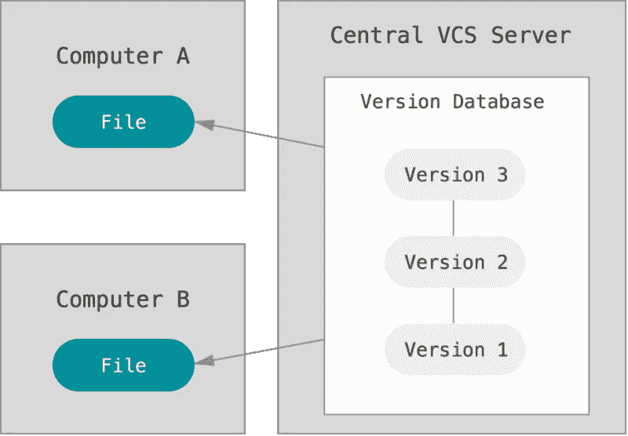
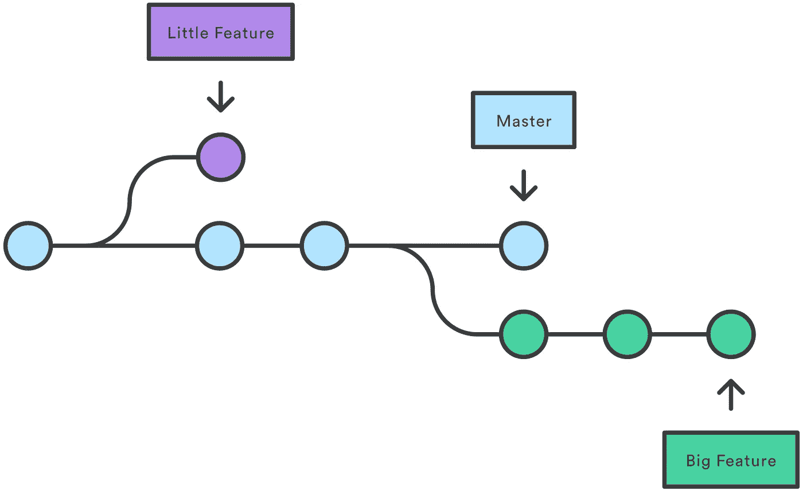
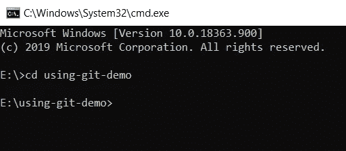
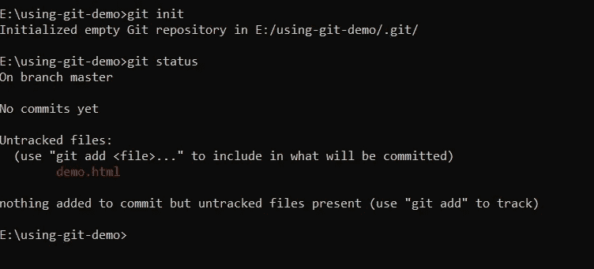
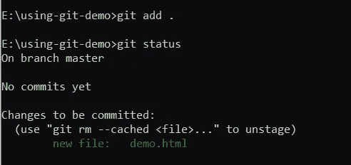
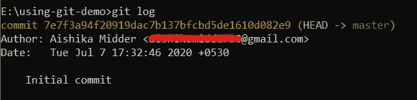
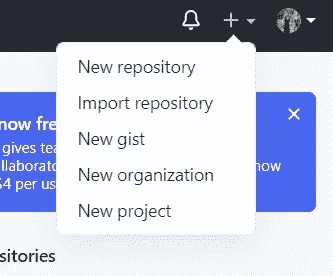
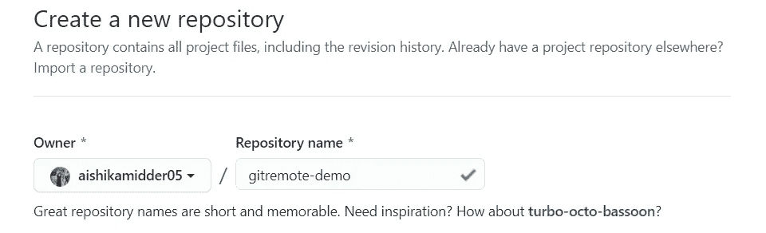
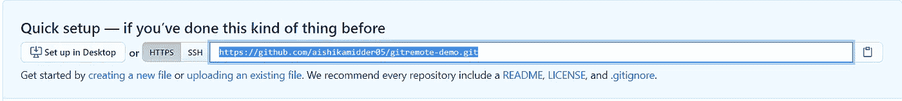
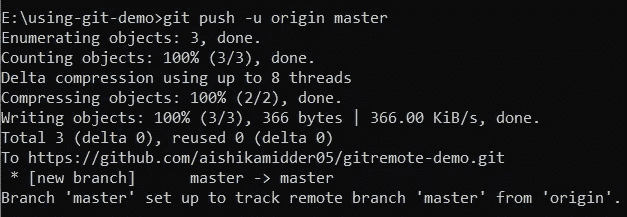

# 5 分钟学会 Git 基础知识

> 原文：<https://blog.devgenius.io/learn-git-basics-in-10-minutes-a85dc0ee9779?source=collection_archive---------14----------------------->


> 在大学里，我经常发现有人在谷歌上搜索如何使用 Git 完成**的基本任务，尽管他们已经使用它很长时间了。我写这篇博客的主要目的是帮助任何人**学习基本和有用的 git 命令**。如果他们想不起任何特定的命令，这篇文章也可以作为**参考**。**

> 什么是 Git，我们为什么需要它？

Git 是一个开源的分布式版本控制系统。意思是，Git 是一个内容追踪器。如果存储在存储库中的代码随着更多代码的添加而不断变化，那么可以使用 Git 来维护和查看发生变化的历史。



当你在一个项目中工作时，随着新技术的发展，需求经常会发生变化。因此，使用像 git 这样的版本控制系统，您可以非常容易地恢复到以前的更改。此外，通常在组织中，许多人在一个特定的项目上一起工作，所以 Git 本质上有助于避免合并冲突。

Git 使用了分支的概念，这本质上是一个独立的开发路线。当您处理新功能或错误修复时，分支将您的工作与处理同一项目的其他团队成员的工作隔离开来。



# **让我们从在你的电脑上安装 git 开始**

下面是根据您使用的操作系统在您的计算机上安装 git 的链接。我将在这个博客上使用 Windows 操作系统。

[](https://git-scm.com/downloads) [## 下载

### Git 带有内置的 GUI 工具(git-gui，gitk ),但是有几个第三方工具供用户寻找一个…

git-scm.com](https://git-scm.com/downloads) 

下载完成后，进入您的终端或命令行，验证 git 是否安装成功。

```
git --version
```

接下来，在你的电脑上创建一个文件夹，你想怎么命名就怎么命名，我将使用-git-demo 把我的命名为

**现在，使用命令提示符打开文件夹中的终端行**

```
cd using-git-demo
```

****

****创建本地 Git 存储库****

**使用以下命令将本地 Git 存储库添加到项目中:**

```
git init
```

**`git init`命令将当前文件夹初始化为 git 存储库。**

**然后为了演示，使用-git-demo 文件夹在**中添加一个**demo.html**文件。****

****未跟踪和已跟踪文件的状态****

```
git status
```

**使用上述命令，您可以查看文件夹中未跟踪文件的当前状态。它给出了关于哪些文件被修改以及有哪些文件的信息。**

****

****集结地的代码****

**暂存区用于跟踪所有要提交的文件。在进行修改或添加新文件后，任何未添加到临时区域的文件都不会被提交。**

**使用命令`git add demo.html`暂存文件。**

**使用下面的命令实际上是将文件夹中的所有文件添加到临时区域中。**

```
git add .
```

**之后，再次使用`git status`命令查看更改。**

****

**会出现这样的东西**

****提交文件****

**使用以下命令提交对 git 存储库的更改。**

```
git commit -m "Initial commit"
```

**“初始提交”是消息，并且总是尝试添加有意义的消息来跟踪您的更改。**

****Git 日志****

**命令`git log`用于查看提交的简要日志。它显示每次提交的作者、日期和消息。**

****

****创建远程存储库****

**打开您的 Github 帐户并创建一个新的存储库。**

****

**创建一个不同于本地存储库名称的新存储库。我给了这个名字`gitremote-demo`。**

****

**单击 Create repository 按钮，您的新存储库将被创建，当您打开存储库时，将会打开一个类似这样的页面。**

****

**存储库 URL 是突出显示的部分。复制此 url。**

**为了让您的本地存储库指向您的远程存储库，请在命令行中使用以下命令**

```
git remote add origin [your repository url] 
```

****Git 推送****

**为了将所有代码从本地存储库推送到远程存储库，使用以下命令:**

```
git push -u origin master
```

****

****奖励:****

****Git Pull****

**`git pull` 用于将最新的变更从远程存储库拉入本地存储库。如果很多人在同一个项目上工作，那么远程存储库将会经常更新。**

```
git pull origin master
```

****Git 克隆****

**此命令用于将现有的远程存储库克隆到您的计算机中。该命令如下所示:**

```
git clone [repository url]
```

**如果你已经读到这里，那么我想感谢你花时间阅读这篇文章。希望你今天学到了一些有价值的东西！**

**可以查看我的 [github 链接](https://github.com/aishikamidder05)。**

**我将很快发表另一篇文章，介绍 Git 的其他高级命令。既然现在您已经知道了使用 git 的基本知识，那就继续探索吧！**

**如果你喜欢这个故事，请点击👏按钮并分享，帮助其他人找到它！欢迎在下方留言评论。**

**再见！**