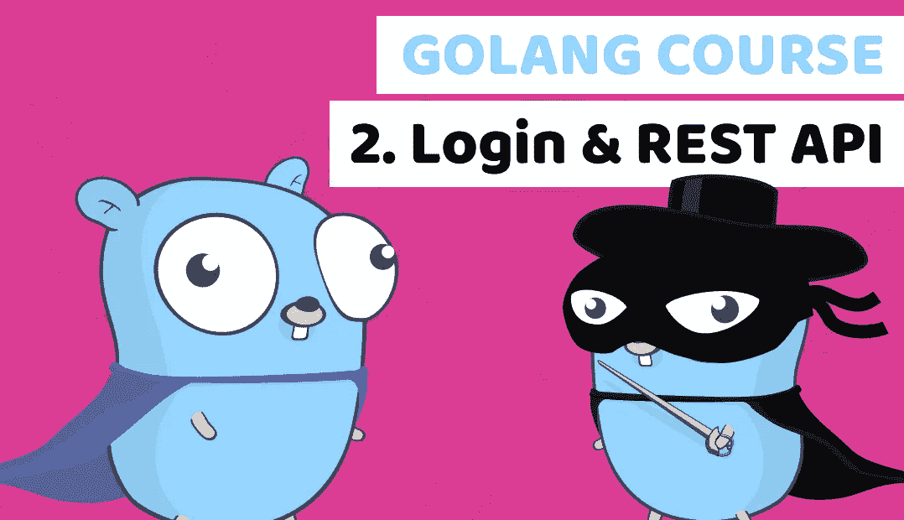

# 通过构建金融科技银行应用程序学习 Golang 第 2 课:登录和 REST API

> 原文：<https://blog.devgenius.io/learn-golang-by-building-a-fintech-banking-app-lesson2-login-and-rest-api-5bfa2a27eec2?source=collection_archive---------1----------------------->



[在线编程课程](https://www.duomly.com)

本帖原载:
[https://www . blog . duomly . com/golang-course-with-building-a-fin tech-banking-app-lesson-2-log in-and-rest-API](https://www.blog.duomly.com/golang-course-with-building-a-fintech-banking-app-lesson-2-login-and-rest-api)

# 介绍

在 Golang 课程的最后一集，我们做了一个项目设置和第一次数据库迁移。

下面是网址:
[https://www . blog . duomly . com/golang-course-with-building-a-fintech-banking-app-lesson-1-start-the-project](https://www.blog.duomly.com/golang-course-with-building-a-fintech-banking-app-lesson-1-start-the-project)

在《通过构建 fin tech 银行 app 学习 Angular 9 用 Tailwind CSS》的最后一集里，我的朋友 Anna 创建了项目设置和第一次登录 UI，你可以用它来连接我们的后端，构建完整的金融科技应用。

下面是网址:
[https://www . blog . duomly . com/angular-course-building-a-banking-application-with-tailwind-CSS-lesson-1-start-the-project/](https://www.blog.duomly.com/angular-course-building-a-banking-application-with-tailwind-css-lesson-1-start-the-project/)

在今天的这一集里，你将学习到 how Golang 课程的第二部分，我们将重点介绍用户认证。我将教你如何构建登录功能以及如何创建 REST API 的第一个端点。

我们将对旧代码进行一点重构，使其更加简洁。

我们开始吧！

顺便说一句，如果你更喜欢视频，这里有 youtube 版本:

Golang 课程第 2 课:登录和 REST API

# 重构接口

我们需要做的第一步是重构我们在前一集创建的接口。为此，我们需要创建名为“interfaces”的目录，并在该目录下创建名为“interfaces.go”的文件。

```
package interfacesimport "github.com/jinzhu/gorm"type User struct {
    gorm.Model
  Username string
    Email string
    Password string
}type Account struct {
    gorm.Model
  Type string
    Name string
    Balance uint
    UserID uint
}type ResponseAccount struct {
    ID uint
    Name string
    Balance int
}type ResponseUser struct {
    ID uint
    Username string
    Email string
    Accounts []ResponseAccount
}
```

接下来，我们需要使用 interfaces.go 文件中的结构，而不是 migrations.go 中的结构。

您的 migrations.go 文件应该如下例所示。

```
package migrationsimport (
    "duomly.com/go-bank-backend/helpers"
    "duomly.com/go-bank-backend/interfaces"
    _ "github.com/jinzhu/gorm/dialects/postgres"
)func connectDB() *gorm.DB {
    db, err := gorm.Open("postgres", "host=127.0.0.1 port=5432 user=postgres dbname=bankapp password=postgres sslmode=disable")
    HandleErr(err)
    return db
}func createAccounts() {
    db := connectDB() users := &[2]interfaces.User{
        {Username: "Martin", Email: "martin@martin.com"},
        {Username: "Michael", Email: "michael@michael.com"},
    } for i := 0; i < len(users); i++ {
        // Correct one way
        generatedPassword := helpers.HashAndSalt([]byte(users[i].Username))
        user := &interfaces.User{Username: users[i].Username, Email: users[i].Email, Password: generatedPassword}
        db.Create(&user) account := &interfaces.Account{Type: "Daily Account", Name: string(users[i].Username + "'s" + " account"), Balance: uint(10000 * int(i+1)), UserID: user.ID}
        db.Create(&account)
    }
    defer db.Close()
} func Migrate() {
    User := &interfaces.User{}
    Account := &interfaces.Account{}
    db := connectDB()
    db.AutoMigrate(&User, &Account)
    defer db.Close() createAccounts()
}
```

# 重构 ConnectDB 到助手

下一步还将涉及 migrations.go 文件和 helpers.go.

我们需要将“connectDB”函数移动到 helpers.go.
接下来，我们需要通过命名为“ConnectDB”来导出它。

最后一步是在 migrations.go 中重用它，但以导入的形式。你的 helpers.go 应该看起来像下面的例子:

```
package helpersimport (
    "github.com/jinzhu/gorm"
    _ "github.com/lib/pq"
    "golang.org/x/crypto/bcrypt"
) func HandleErr(err error) {
    if err != nil {
        panic(err.Error())
    }
}func HashAndSalt(pass []byte) string {
    hashed, err := bcrypt.GenerateFromPassword(pass, bcrypt.MinCost)
    HandleErr(err) return string(hashed)
}func ConnectDB() *gorm.DB {
    db, err := gorm.Open("postgres", "host=127.0.0.1 port=5432 user=postgres dbname=bankapp password=postgres sslmode=disable")
    HandleErr(err)
    return db
}
```

您的 migrations.go 应该类似于下面的示例:

```
package migrationsimport (
    "duomly.com/go-bank-backend/helpers"
    "duomly.com/go-bank-backend/interfaces"
    _ "github.com/jinzhu/gorm/dialects/postgres"
)func createAccounts() {
    db := helpers.ConnectDB() users := &[2]interfaces.User{
        {Username: "Martin", Email: "martin@martin.com"},
        {Username: "Michael", Email: "michael@michael.com"},
    } for i := 0; i < len(users); i++ {
        // Correct one way
        generatedPassword := helpers.HashAndSalt([]byte(users[i].Username))
        user := &interfaces.User{Username: users[i].Username, Email: users[i].Email, Password: generatedPassword}
        db.Create(&user) account := &interfaces.Account{Type: "Daily Account", Name: string(users[i].Username + "'s" + " account"), Balance: uint(10000 * int(i+1)), UserID: user.ID}
        db.Create(&account)
    }
    defer db.Close()
} func Migrate() {
    User := &interfaces.User{}
    Account := &interfaces.Account{}
    db := helpers.ConnectDB()
    db.AutoMigrate(&User, &Account)
    defer db.Close() createAccounts()
}
```

# 创建登录功能

现在我们可以进入登录逻辑。

我们要做的第一件事是创建一个名为“users”的目录和一个名为“users.go”的文件。

在“users.go”中我们应该创建一个名为“users”的包，以及一个名为“Login”的空函数。

函数“登录”要以“用户名”和“通行证”为字符串。我们应该能够返回一个“任何”类型的键的地图。你也应该导入一些 dep，但是你可以从下面的例子中复制它们。

```
package usersimport (
    "time" "duomly.com/go-bank-backend/helpers"
    "duomly.com/go-bank-backend/interfaces"
    "github.com/dgrijalva/jwt-go"
    "golang.org/x/crypto/bcrypt"
)func Login(username string, pass string) map[string]interface{} {}
```

在登录名
中连接数据库我们要做的下一件重要的事情是创建数据库连接，并从函数 params 中查找具有用户名的用户。

我们需要记住带有 RecordNotFound 函数的“if”语句，如果用户处于“未找到”状态，该函数会通知我们。

```
db := helpers.ConnectDB()
user := &interfaces.User{}
if db.Where("username = ? ", username).First(&user).RecordNotFound() {
    return map[string]interface{}{"message": "User not found"}
}
```

# 验证密码

当我们有一个用户时，我们应该验证我们发送的密码是否正确。

在同一个名为“Login”的函数中，我们需要使用一个方法“bcrypt”来创建简单的密码验证。CompareHashAndPassword”。

接下来，我们需要创建 if 语句，在这里我们将检查我们的密码是否不匹配，是否没有错误。

如果是，应该返回“密码错误”的消息。

```
passErr := bcrypt.CompareHashAndPassword([]byte(user.Password), []byte(pass))if passErr == bcrypt.ErrMismatchedHashAndPassword && passErr != nil {
    return map[string]interface{}{"message": "Wrong password"}
}
```

# 为用户查找帐户

现在我们有了用户、密码，所有的都已经验证过了，但是我们的用户还不完整。

我们需要一个用户对象的银行账户。

为了达到这个目的，我们应该用 ResponseAccount 类型定义 var 账户。
我们将从该数组内的数据库中分配数据。

接下来，我们需要请求数据库返回“帐户”表中所有记录的“id”、“name”和“balance”字段，其中“user_id”等于我们的用户 id。

```
accounts := []interfaces.ResponseAccount{}
db.Table("accounts").Select("id, name, balance").Where("user_id = ? ", user.ID).Scan(&accounts)
```

# 设置响应用户

下一步，我们应该设置 responseUser 的结构，并为键赋值。

在 responseUser 结构之后，我们可以关闭数据库连接。

```
responseUser := &interfaces.ResponseUser{
    ID: user.ID,
    Username: user.Username,
    Email: user.Email,
    Accounts: accounts,
}defer db.Close()
```

# 签名令牌

“登录”功能的最后也是最关键的部分之一是我们应该设置和签名的 JWT 令牌。

为此，我们将使用 JWT 方案。

看看在下面的例子中应该如何做。

```
tokenContent := jwt.MapClaims{
    "user_id": user.ID,
    "expiry": time.Now().Add(time.Minute * 60).Unix(),
}
jwtToken := jwt.NewWithClaims(jwt.GetSigningMethod("HS256"), tokenContent)
token, err := jwtToken.SignedString([]byte("TokenPassword"))
helpers.HandleErr(err)
```

# 准备响应

终于！“登录”功能的最后一部分是我们将返回到 API 中的响应。

我们应该设置一个消息“一切正常”，我们的令牌传递给“jwt”键，responseUser 传递给“data”参数。

```
var response = map[string]interface{}{"message": "all is fine"}
response["jwt"] = token
response["data"] = responseUserreturn response
```

# 创建一个 API 包

现在，我们可以进入 API。
我们应该完成的第一步是一个名为“api”的新目录，接下来创建一个具有相同名称和“go”扩展名的文件。

在这个文件中，我们应该声明一个名为“api”的包，并导入一些依赖项。

```
package apiimport (
    "encoding/json"
    "fmt"
    "io/ioutil"
    "log"
    "net/http" "duomly.com/go-bank-backend/helpers"
    "duomly.com/go-bank-backend/users" "github.com/gorilla/mux"
)
```

# 在 API 中创建结构

第二步是结构声明。

我们应该创建两个结构体，第一个结构体名为“Login ”,其中“Username”是一个字符串,“Password”也是一个字符串。

最后一个结构应声明为“ErrResponse ”,并将“Message”声明为字符串。

```
type Login struct {
    Username string
    Password string
} type ErrResponse struct {
    Message string
}
```

# 在 API 中创建一个登录函数

在这一步，我们将为我们的 API 创建第一个函数。

应该命名为“login”，取“w http。ResponseWriter”和“r *http。请求”作为参数。

```
func login(w http.ResponseWriter, r *http.Request) {}
```

# 读取 API 调用的主体

“login”函数中的第一个逻辑是读取 API 请求主体的代码。我们应该指定“body”和“err”变量，并将“ioutil”赋值。ReadAll”，请求的正文在里面。
接下来，我们需要通过使用“helpers”包中的“HandleErr”并在内部传递“Err”来验证是否一切正常。

```
body, err := ioutil.ReadAll(r.Body)
helpers.HandleErr(err)
```

# 处理登录

该功能最重要的部分是正确登录。

我们需要定义一个类型为“Login”的变量，并在那里分配解组的请求体。

接下来，我们应该将格式化的用户名和密码传递给“users”。登录”。

我们应该将该逻辑分配给名为“login”的变量。

```
var formattedBody Login
err = json.Unmarshal(body, &formattedBody)
helpers.HandleErr(err)
login := users.Login(formattedBody.Username, formattedBody.Password)
```

# 准备 API 调用的响应

调用登录后，要检查登录消息是否等于“一切正常”。

如果是，我们应该声明一个名为“resp”的变量，并将登录名赋给它。

接下来，我们应该使用“json。NewEncoder”并编码我们的 resp。

```
if login["message"] == "all is fine" {
    resp := login
    json.NewEncoder(w).Encode(resp)
} else {}
```

# 处理 else 中的错误

现在，当我们处理“如果”语句时，我们也应该处理“错误”。

为此，我们应该创建一个“else”语句，并在其中格式化一个响应。

我们需要返回一个字符串为“用户名或密码错误”的“消息”，作为一个值。

这种反应应与阳性情况一样进行编码。

```
if login["message"] == "all is fine" {
    resp := login
    json.NewEncoder(w).Encode(resp)
} else {
    resp := ErrResponse{Message: "Wrong username or password"}
    json.NewEncoder(w).Encode(resp)
}
```

# 创建 startApi 函数

在 API 逻辑的最后一步，我们应该创建一个合适的路由器，并处理我们的 API 端点。

我们将使用 gorilla mux 创建一个路由器，首先，我们将定义接受“POST”方法的“/login”端点。

接下来，我们应该在 8888 端口上设置一个 HTTP 侦听器。

```
func StartApi() {
    router := mux.NewRouter()
    router.HandleFunc("/login", login).Methods("POST")
    fmt.Println("App is working on port :8888")
    log.Fatal(http.ListenAndServe(":8888", router))}
```

# 在主函数中实现 API

API 准备好了！
要让它工作，我们应该在“main.go”文件的“main”函数中实现 API。

检查下面的例子。

```
package mainimport "duomly.com/go-bank-backend/api"func main() {
    // migrations.Migrate()
    api.StartApi()
}
```

# 运行 API

呜哇！
现在你可以运行你的应用并开始测试了。
打开项目目录中的终端，键入:

```
go run main.go
```

结论
恭喜你，你的项目有了登录和第一个 rest API。

你可以从课程开始连接它与前端:

[通过搭建 fintech 银行 app](https://www.blog.duomly.com/angular-course-building-a-banking-application-with-tailwind-css-lesson-1-start-the-project/)

用 Tailwind CSS 学习 Angular 9 如果你想把代码和我做的做个对比这里是网址:

[https://github.com/Duomly/go-bank-backend](https://github.com/Duomly/go-bank-backend%C2%A0)

这节课的分支名为“Golang-course-Lesson-2”。

下节课我们将构建用户注册时再见。


[编程课程在线](https://www.duomly.com)

感谢您的阅读，来自 Duomly 的 Radek