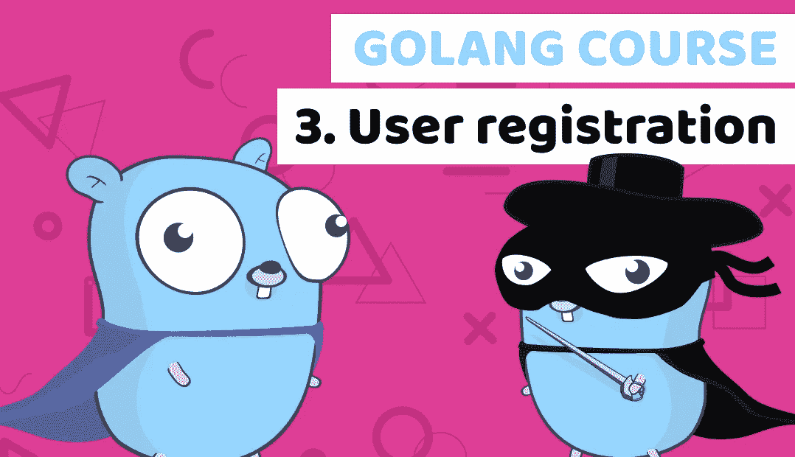

# 通过构建金融科技银行应用了解 Golang 第 3 课:用户注册

> 原文：<https://blog.devgenius.io/learn-golang-by-building-a-fintech-banking-app-lesson3-user-registration-2c2dd0621228?source=collection_archive---------25----------------------->



[Golang 球场](https://www.blog.duomly.com/golang-course-with-building-a-fintech-banking-app-lesson-3-user-registration)

本文原载:[https://www . blog . duomly . com/golang-course-with-building-a-fin tech-banking-app-lesson-3-user-registration](https://www.blog.duomly.com/golang-course-with-building-a-fintech-banking-app-lesson-3-user-registration)

# 介绍

在 Golang 课程的第三课中，我将向您展示如何在 Golang 中创建用户注册。

在 Golang 课程的上一课中，我们学习了如何在 Golang 中创建 REST API 以及如何创建用户登录。

**网址:**
[Golang 课程，构建金融科技银行应用——第二课:登录和休息 API](https://www.blog.duomly.com/golang-course-with-building-a-fintech-banking-app-lesson-2-login-and-rest-api/%E2%80%A8)

在 Angular 课程中，我的朋友 Anna 向您展示了如何在 angular 9 中构建登录。

**此处 URL:**
[Angular Course 用 Tailwind CSS 构建银行应用—第二课:登录表单](https://www.blog.duomly.com/angular-course-building-a-banking-application-with-tailwind-css-lesson-2-login-form/)

因此，在今天的课程中，我们可以进入下一步。
那是用户注册，但不是唯一。

我们的项目越来越大，所以我们也需要一些重构。
我们需要确保通过我们的 API 发送的数据是正确的，所以我们需要创建一个验证功能。

开始吧！

如果你喜欢视频，这是 youtube 的版本:

Golang 课程第 3 课

# 重构 prepareToken

我们需要做的第一步是一些重构。
第一步，我们将切断所有与 token 相关的逻辑，并为此创建新的函数。

从 users/users.go 文件中的函数 Login 获取与令牌相关的逻辑。
并把它放在同一个文件中名为“prepareToken”的新函数中。

```
func prepareToken(user *interfaces.User) string {
    tokenContent := jwt.MapClaims{
        "user_id": user.ID,
        "expiry": time.Now().Add(time.Minute * 60).Unix(),
    }
    jwtToken := jwt.NewWithClaims(jwt.GetSigningMethod("HS256"), tokenContent)
    token, err := jwtToken.SignedString([]byte("TokenPassword"))
    helpers.HandleErr(err) return token
}
```

# 重构 prepareResponse

下一步和上一步类似。
但是在第二步中，我们应该从登录中获取所有与响应相关的逻辑。

对于这种逻辑，我们应该创建一个名为“prepareResponse”的函数。
让我们将所有登录转移到“prepareResponse”函数中。

```
func prepareResponse(user *interfaces.User, accounts []interfaces.ResponseAccount) map[string]interface{} {
    responseUser := &interfaces.ResponseUser{
        ID: user.ID,
        Username: user.Username,
        Email: user.Email,
        Accounts: accounts,
    } var token = prepareToken(user);
    var response = map[string]interface{}{"message": "all is fine"}
    response["jwt"] = token
    response["data"] = responseUser return response
}
```

# 重构登录

我们的登录现在已被清除，但缺少变量。

我们应该修复它，并将之前创建的函数赋给名为“response”的变量。

接下来，我们需要将变量“user”和“accounts”作为该函数的参数进行传递。

让我们看看下面的例子。

```
func Login(username string, pass string) map[string]interface{} {
    // Connect DB
    db := helpers.ConnectDB()
    user := &interfaces.User{}
    if db.Where("username = ? ", username).First(&user).RecordNotFound() {
        return map[string]interface{}{"message": "User not found"}
    }
    // Verify password
    passErr := bcrypt.CompareHashAndPassword([]byte(user.Password), []byte(pass)) if passErr == bcrypt.ErrMismatchedHashAndPassword && passErr != nil {
        return map[string]interface{}{"message": "Wrong password"}
    }
    // Find accounts for the user
    accounts := []interfaces.ResponseAccount{}
    db.Table("accounts").Select("id, name, balance").Where("user_id = ? ", user.ID).Scan(&accounts) defer db.Close() var response = prepareResponse(user, accounts); return response
}
```

# 创建一个注册函数

太好了，重构完成了！

现在我们可以进入注册功能。

在同一个文件中，我们应该创建一个名为“Register”的函数。

该函数应该将用户名、电子邮件和 pass 作为参数，所有参数都是“string”类型。

函数“Register”应该返回与“Login”函数相同类型的响应。

```
func Register(username string, email string, pass string) map[string]interface{} {}
```

# 创建验证界面

在我们继续寄存器的逻辑之前，我们应该创建验证。这将确保我们发送的所有变量都是我们计划好的。

验证的第一步是为此创建一个接口。

让我们进入接口/接口。开始。

接下来，让我们用两个属性创建一个名为“Validation”的结构。

第一个是“值”，第二个是“有效”，都是字符串。

```
type Validation struct {
    Value string
    Valid string
}
```

# 创建验证逻辑

现在，我们可以创建一些验证逻辑。

我们应该做的第一步是创建两个正则表达式来验证我们的变量是否正确。

第一个应该验证我们是否只传递字母或数字。

第二个应该验证我们的变量是否符合电子邮件模式。

接下来，我们需要创建一个 switch-case 语句，并验证用户名和电子邮件是否通过了 regexp。

最后一步是验证我们的密码是否至少有 5 个字符长。

```
func Validation(values []interfaces.Validation) bool{
    username := regexp.MustCompile(`^([A-Za-z0-9]{5,})+$`)
    email := regexp.MustCompile(`^[A-Za-z0-9]+[@]+[A-Za-z0-9]+[.]+[A-Za-z]+$`) for i := 0; i < len(values); i++ {
        switch values[i].Valid {
            case "username":
                if !username.MatchString(values[i].Value) {
                    return false
                }
            case "email":
                if !email.MatchString(values[i].Value) {
                    return false
                }
            case "password":
                if len(values[i].Value) < 5 {
                    return false
                }
        }
    }
    return true
}
```

# 向登录添加验证

完成验证后，我们可以将该逻辑添加到登录中。

在“Valid”函数中，我们应该传递所有需要检查的变量。

不要忘记“有效”密钥的名称。

我们应该添加一个 if-else 语句，并在 if-else 通过时放置“Login”的逻辑。
如果不是，我们应该返回一个状态为“无效值
”的消息。

```
func Login(username string, pass string) map[string]interface{} {
    // Add validation to login
    valid := helpers.Validation(
        []interfaces.Validation{
            {Value: username, Valid: "username"},
            {Value: pass, Valid: "password"},
        })
    if valid {
        // Connect DB
        db := helpers.ConnectDB()
        user := &interfaces.User{}
        if db.Where("username = ? ", username).First(&user).RecordNotFound() {
            return map[string]interface{}{"message": "User not found"}
        }
        // Verify password
        passErr := bcrypt.CompareHashAndPassword([]byte(user.Password), []byte(pass)) if passErr == bcrypt.ErrMismatchedHashAndPassword && passErr != nil {
            return map[string]interface{}{"message": "Wrong password"}
        }
        // Find accounts for the user
        accounts := []interfaces.ResponseAccount{}
        db.Table("accounts").Select("id, name, balance").Where("user_id = ? ", user.ID).Scan(&accounts) defer db.Close() var response = prepareResponse(user, accounts); return response
    } else {
        return map[string]interface{}{"message": "not valid values"}
    }
}
```

# 向注册添加验证

这一步和上一步很像。

如果一切正常，我们可以开始寄存器逻辑。如果没有，返回与“登录”中相同的消息。

一个小小的区别就是多加了一个变量“email”。

```
func Register(username string, email string, pass string) map[string]interface{} {
    // Add validation to registration
    valid := helpers.Validation(
        []interfaces.Validation{
            {Value: username, Valid: "username"},
            {Value: email, Valid: "email"},
            {Value: pass, Valid: "password"},
        })
    if valid { } else {
        return map[string]interface{}{"message": "not valid values"}
    }}
```

# 寄存器的数据库连接

现在我们可以进入数据库连接。

我们之前已经做过几次了，所以你可以复制/粘贴这段代码。

```
db := helpers.ConnectDB()
```

# 创建用户和帐户

我们也创造了这个功能。

您可以查看迁移/迁移。进入创建帐户。

您可以复制该代码或从头开始编写。

如果您复制代码，您将需要更改一些值。

让我们看看下面的例子。

```
generatedPassword := helpers.HashAndSalt([]byte(pass))
user := &interfaces.User{Username: username, Email: email, Password: generatedPassword}
db.Create(&user)account := &interfaces.Account{Type: "Daily Account", Name: string(username + "'s" + " account"), Balance: 0, UserID: user.ID}
db.Create(&account)defer db.Close()
```

# 准备响应和令牌

响应和令牌将非常类似于来自“登录”的逻辑。

你只需要将“prepareResponse”函数添加到名为“Response”的变量中。

接下来，“response”应该在 if 的末尾，在“Register”函数中。

```
accounts := []interfaces.ResponseAccount{}
respAccount := interfaces.ResponseAccount{ID: account.ID, Name: account.Name, Balance: int(account.Balance)}
accounts = append(accounts, respAccount)
var response = prepareResponse(user, accounts)return response
```

# 创建注册接口

恭喜你！

“寄存器”功能的逻辑准备就绪。现在您可以进入 API 的逻辑了。

我们需要进入“api/api.go”文件。

接下来，我们应该创建一个名为“注册”的界面，并在那里定义“用户名”、“电子邮件”和“密码”。
我们应该把所有的道具都定义为“串”。

```
type Register struct {
    Username string
    Email string
    Password string
}
```

# 在 API 中创建一个注册函数

在创建 API 的下一步，我们应该创建一个名为“register”的函数。

该函数应该采用与函数“逻辑”相同的参数。
你可以复制名为“逻辑”的整个功能，只需修改几个地方。

会有同样的读本。

接下来，该函数应该从用户那里调用“注册”。

作为最后一步，我们的“注册”逻辑应该准备响应并处理错误。

让我们看看下面的例子。

```
func register(w http.ResponseWriter, r *http.Request) {
    // Read body
    body, err := ioutil.ReadAll(r.Body)
    helpers.HandleErr(err)
    // Handle registration
    var formattedBody Register
    err = json.Unmarshal(body, &formattedBody)
    helpers.HandleErr(err)
    register := users.Register(formattedBody.Username, formattedBody.Email, formattedBody.Password)
    // Prepare response
    if register["message"] == "all is fine" {
        resp := register
        json.NewEncoder(w).Encode(resp)
        // Handle error in else
    } else {
        resp := ErrResponse{Message: "Wrong username or password"}
        json.NewEncoder(w).Encode(resp)
    }
}
```

# 创建 API 端点

太好了！

现在是最后一步。

现在我们只需要创建一行代码来处理“/register”端点。

在名为“StartApi”的函数中为该路由添加带有“HandleFunc”的行。

你可以用“/login”看看我们是怎么做到的。

```
func StartApi() {
    router := mux.NewRouter()
    router.HandleFunc("/login", login).Methods("POST")
    router.HandleFunc("/register", register).Methods("POST")
    fmt.Println("App is working on port :8888")
    log.Fatal(http.ListenAndServe(":8888", router))}
```

# 结论

祝贺您，您的项目现在已经用户注册和验证！

你可以从课程开始连接它与前端:

通过构建 fintech 银行 app

学习 Angular 9 与 Tailwind CSS 如果你想将代码与我所做的进行比较这里是 URL:

[https://github . com/Duomly/go-bank-back end/tree/Golang-course-Lesson-3](https://github.com/Duomly/go-bank-backend/tree/Golang-course-Lesson-3)

本课的分支名为“Golang-course-Lesson-3”。

下节课再见，我们将重点关注用户资料，并开始构建资金转账。


[在线编程课程](https://www.duomly.com)

感谢阅读，
来自 Duomly 的 Radek