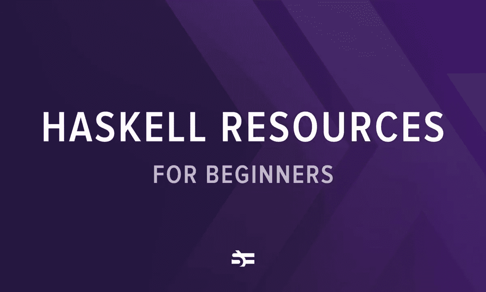

# 用这 15 个资源在 2022 年学习 Haskell

> 原文：<https://blog.devgenius.io/learn-haskell-in-2022-with-these-15-resources-c3550cb471a5?source=collection_archive---------18----------------------->

## 学习 Haskell 不一定很难。

在主流编程语言中，对于初学者来说，可能没有什么比 Haskell 更可怕的了。几年前，这是有原因的。

2017 年第一次尝试学习 Haskell，惨败。有几个原因:我对编程不是很有经验，缺乏适合我学习风格的材料，以及混乱的 Haskell 生态系统。

但是我可以高兴地说，由于社区在改进学习资源和生态系统方面所做的持续工作，学习 Haskell 现在变得容易多了。

如果你想学习 Haskell，并最终理解人们在所有那些黑客新闻评论中所说的单子是什么意思，这是可能的。为了帮助你，我整理了一份 Haskell 初学者的最佳资源列表以及对它们的简短描述。

# **🤔为什么是哈斯克尔？**

> *“一门不影响你思考编程方式的语言不值得了解。”—艾伦·珀利斯*

学习 Haskell 有很多好处。它是一种不错的通用语言，在一些领域，比如区块链和 fintech，经常使用 Haskell 和其他类型化的 FP 语言。

与此同时，你必须明白，Haskell 在就业市场上既不是非常受欢迎，也不是广泛需求。尤其是对于 Haskell 的大三学生来说，很难找到一个编写 Haskell 的职位。

因此，我认为学习像 Haskell 这样的语言最大的好处是你会扩展你的视野，成为一名更好的程序员。您在 Haskell 中学到的概念将帮助您用其他编程语言编写更好的代码，甚至是用 JavaScript、Python 或 Ruby 等传统语言。

# **🗺️如何学习 Haskell？**

第一步:关闭 monad 教程。🙃

我会这么做:

*   首先，观看本文[课程部分](https://serokell.io/blog/how-to-learn-haskell-in-10-minutes?nocache=#%F0%9F%91%A8%E2%80%8D%F0%9F%8F%AB-haskell-courses)中列出的一门课程，感受一下这门语言。
*   之后，你可以使用我列出的[书中的一本](https://serokell.io/blog/how-to-learn-haskell-in-10-minutes?nocache=#%F0%9F%93%96-haskell-books)来组织你的学习过程。
*   同时，开始构建自己的项目(CLI todo 工具、web 服务器)或在[exercisem](https://exercism.org/)或 [CodinGame](https://www.codingame.com/start) 中做练习。
*   不断增长你的知识，查找你的项目需要的东西，并构建小的应用程序来测试你学到的东西。
*   如果一切顺利，您应该能够使用 Haskell 完成基本任务。然后，你可以求助于像 [Haskell 这样的资源，或者通过阅读博客文章和与其他 Haskell 爱好者交谈来探索你感兴趣的 Haskell 领域。](https://www.manning.com/books/haskell-in-depth)

# **📖哈斯克尔图书**

对于你的第一本书，我建议从《基本原理》的 [Haskell 编程](https://haskellbook.com/)或[用 Haskell 编程](https://www.manning.com/books/get-programming-with-haskell)。如果您对自下而上地积累 Haskell 知识感兴趣，第一种方法更好。如果您想尽快开始用 Haskell 编写程序，第二种方法更好。

## **Haskell 编程从第一原理**

如果你正在寻找包含你开始编写 Haskell 所需的一切的书，那么 Christoph Allen 和 Julie Moronuki 的《Haskell 编程基本原理》就是你的选择。

它非常详尽，将从头开始构建您的 Haskell 知识，从 lambda 演算和基本 Haskell 语法开始，然后涵盖所有常见的类型类、单子(如 State 和 Reader)、单子转换器和 IO。解释对初学者非常友好，并且有大量的练习来检验你的新知识。

同时，它对我来说有点过于冗长，有时感觉更像一本词典/参考，而不是一本初学者编程书。

## **用 Haskell 编程**

这是我个人推荐的书。

与 HPFP 相反，[用 Haskell 进行编程](https://www.manning.com/books/get-programming-with-haskell)将帮助你在深入研究函子、单子等理论之前编写可用的程序。它采用了一种更实用的方法，只涵盖了基本要素，然后继续向您展示如何构建小型命令行应用程序、处理文本、IO、glitch JPEGs 和其他有趣的东西。

## **学你一个 Haskell 大有好处！**

作为一个普遍推荐的资源，[学你一个哈斯克尔](http://learnyouahaskell.com/)在这里也值得一提。

如果上面的书不适合你，而你又执意要读一本书，这可能是个不错的第三选择，但我一般会建议避免读这本书。

不幸的是，人们可以感觉到时间已经过去了。一些代码示例可能不再工作，官方网站有时会关闭。此外，它不包含任何练习。

有一些社区组织的努力，以创造更好的分叉，但没有实质性的东西。

# **👨‍🏫哈斯克尔课程**

如果你不喜欢看书，这里有一些 Haskell 课程，应该可以让你尽快写出 Haskell。这里有两个选项可供选择:像[类型类](https://typeclasses.com/)或 [learn4haskell](https://github.com/kowainik/learn4haskell) 这样的东西对于开始使用 haskell 语法和基本语言结构非常有用，而来自[埃里克·梅耶尔](https://www.edx.org/course/introduction-to-functional-programming)或[格雷厄姆·赫顿](https://www.youtube.com/c/GrahamHuttonNotts)的更侧重于大学的课程将帮助你开始像函数式程序员一样思考。

## **类型类**

[Type Classes](https://typeclasses.com/) 是朱莉·莫诺基和克里斯·马汀创建的课程集合。Julie 之前在 First Principles 中研究 Haskell 编程，我提到这本书是初学者的好选择。

我相信这些课程比书上的还要好。就我所见，该材料结构良好，通过视频和文本课程适应不同的学习风格。网站会定期添加新的课程。只有一个缺点:相当昂贵的订阅费。

但是不用担心。对初学者来说最重要的字体课程是[初学者速成班](https://typeclasses.com/beginner-crash-course)，你可以免费观看。

## **Haskell 初学者 2022 和 learn4haskell**

Dmitrii Kovanikov 发布了他的免费 Haskell 初学者课程的视频记录，你可以在他的 YouTube 频道上找到。课程简短而有趣，仅用 4 个小时就涵盖了 FP、语法、数据类型、函子和单子。

它涵盖了与 learn4haskell 或多或少相同的领域——一个基于 GitHub 的课程，通过提出 4 个拉请求来帮助你学习 Haskell 这是 Dmitrii 与 Veronika Romashkina 一起做的。

如果你的目标是尽快开始写单子，其中一个可能是最好的选择。YouTube 课程和 GitHub 课程都非常容易上手，也相当好玩。

## **函数编程简介**

如果你想采取注重基础的方法来学习 Haskell，[函数式编程简介](https://www.edx.org/course/introduction-to-functional-programming)可能是你的选择。这是一门由埃里克·梅耶尔教授的在线课程，它使用 Haskell 来教你如何思考程序，以及如何用任何函数式编程语言编写程序。

## **Haskell 中的函数式编程**

格雷厄姆·赫顿(Graham Hutton)已经在自己的 YouTube 频道上传了两套诺丁汉大学的讲座:[Haskell 中的函数式编程](https://www.youtube.com/playlist?list=PLF1Z-APd9zK7usPMx3LGMZEHrECUGodd3)和[Haskell 中的高级函数式编程](https://www.youtube.com/playlist?list=PLF1Z-APd9zK5uFc8FKr_di9bfsYv8-lbc)。

第一门课程包括函数式编程、基本的 Haskell 语法，以及如何使用类型、类型类和函数。第二个课程展示了如何用 Haskell 创建一个数独解算器，包括函子和单子。

讲课内容清晰，文笔优美，花时间看不会错。

# **📽️·哈斯克尔视频**

## **面向命令式程序员的 Haskell**

[Haskell for important Programmers](https://www.youtube.com/watch?v=Vgu82wiiZ90&list=PLe7Ei6viL6jGp1Rfu0dil1JH1SHk9bgDV)是一个精彩的短片系列，用 Haskell 教授函数式编程。

与上面列出的课程相比，主题的顺序有点随意，所以我不会仅仅通过观看这些系列来学习 Haskell。但是个人视频制作得非常好。如果你需要了解一个特定的主题，他们是一个很好的选择。

## **程序员范畴理论**

Bartosz Milewski 的《程序员的范畴理论》是一系列视频，涵盖了范畴理论的基础知识——所有可怕的 Haskell 单词，如函子、单子等都来自这里。来自——以程序员友好的方式。

如果你对这些感兴趣，这是一个很好的播放列表，它将帮助你更好地理解 Haskell 是如何工作的。同时，记住你不需要知道范畴理论来编写完美的 Haskell 程序。

# 🔥其他资源

## 练习

对于习惯用 Haskell 或他们提供的任何其他编程语言编写代码的人来说，exercisem 是一个很好的选择。Haskell track 有大量的练习让你忙上一段时间，你可以从贡献时间的优秀导师那里获得免费的代码帮助。

## **编码游戏**

[CodinGame](https://www.codingame.com/) 可能会吸引有竞争意识的程序员。它的目的与 exercisem 相似，但与 exercisem 不同的是，它的结构更像一个游戏。你可以在定时代码冲突、程序机器人中与其他玩家竞争，当然，也可以解决类似 LeetCode 的问题。

## **学习 Haskell 时我希望知道的事情**

我希望在学习 Haskell 时了解的是 Stephen Diehl 创建的大量 Haskell 资源。这不是我会从头到尾阅读的东西，但是如果你需要参考一些东西，我会先看看它是否在那里。

## 星期一早上哈斯克尔

[周一早晨 Haskell](https://mmhaskell.com/) 是一个拥有大量资源的网站，从初级 Haskell 迷你课程到高级真实世界 Haskell 教程。

## **Haskell for all**

虽然不完全是初学者资源， [Haskell for all](https://www.haskellforall.com/) 是 Gabriella Gonzalez 的一个可访问的博客，已经活跃了十年，我强烈建议在学习 Haskell 的时候去看看。

例如，阅读像[选举人投票分布是幺半群](https://www.haskellforall.com/2016/10/electoral-vote-distributions-are-monoids.html)这样的文章，同时学习 Haskell 中的幺半群可以帮助您更好地理解 typeclass 以及如何在实际代码中使用它。

## Serokell 博客

我们的博客包含了很多 Haskell 的文章，你可以通过访问我们的标签查看。如果你想了解新的文章，我建议你在 Twitter 上关注我们。

我希望这个列表能帮助你学习 Haskell。如果你有任何其他你喜欢的资源并想添加到这篇文章中，不要害怕给这篇文章留下评论。:)