# 了解如何轻松获取 Google 趋势数据(使用 Python 代码)

> 原文：<https://blog.devgenius.io/learn-how-to-easily-pull-google-trends-data-with-python-code-e52523c6ac1d?source=collection_archive---------0----------------------->

# 介绍

[**谷歌趋势**](https://trends.google.com/trends/?geo=IN) 是一个捕捉谷歌用户搜索趋势的网站。使用搜索趋势可以影响定价&营销决策，例如通过将搜索趋势与预订进行比较来确定促销的需求日期、潜在的高需求期，以及其他与收入相关的策略和想法。谷歌趋势可以用来为任何公司制定实用的商业策略。

我最近发现了 **pytrends** ，并且还在学习如何使用这个 API，但是我想我应该分享一些我的发现。在本文的帮助下，您可以使用 Python 从 Google Trends 网站获得趋势分析结果(以及更多)。使用 python，您不需要手动搜索和复制趋势分析结果，名为 **Pytrends** 的 Python API 会为您完成任务。

在开始之前，我建议查看一下 pytrends API 的官方文档: [Pytrends 文档](https://pypi.org/project/pytrends/)。

来源:[https://www . honchosearch . com/blog/SEO/using-Google-trends-for-search-insights/](https://www.honchosearch.com/blog/seo/using-google-trends-for-search-insights/)

# 目录:

pytrends 是什么？

使用 Google Trends API 可以获取哪些数据？

实施|入门

> 装置
> 
> 建筑有效载荷
> 
> 每日搜索趋势
> 
> 排行榜
> 
> 谷歌关键词建议
> 
> 相关查询

结论

# pytrends 是什么？

Pytrends 是一个非官方的 Google Trends API，它提供了不同的方法来从 Google Trends 下载趋势结果的报告。Python 包可用于不同过程的自动化，例如快速获取可用于以后更多分析的数据。

 [## pytrends

### Google Trends 的非官方 API 提供了一个简单的界面，可以自动从 Google Trends 下载报告。只有…

pypi.org](https://pypi.org/project/pytrends/) 

# 使用 Google Trends API 可以获取哪些数据？

关于您提供给 API 的特定关键字，您可以提取以下数据:

*   长期利息
*   历史每小时利息
*   按地区划分的利息
*   相关主题
*   相关查询
*   趋势搜索
*   排行榜
*   关键词建议

我们将探索 API 中提取数据的不同方法，以及每种方法的语法。

# 入门指南

## 装置

为了安装 pytrends，您需要键入给定的代码。

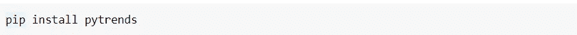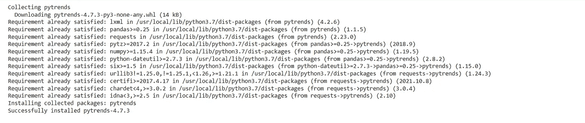

数据集(作者提供的图片)

万岁！ **Pytrends** 安装成功。

## **导入库**

从 pytrends 库导入名为 TrendReq 的方法来连接 google。导入 Pandas 库来存储和可视化数据。

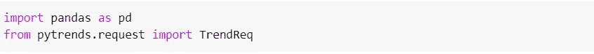

现在，用 TrendReq 创建一个对象

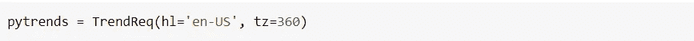

> **TrendReq 接受两个重要参数:**
> 
> hl 的意思是**访问谷歌趋势的托管语言**。在这个例子中，我们设置**英语**。
> 
> **tz** 表示**时区。**在这个例子中，我们使用的是**美国时区**(以分钟表示)，也就是 **360。**

## 建筑有效载荷

Pytrends 的 build_payload 方法用于构建您想要在 Google Trends 中搜索的关键字列表。您还可以指定收集数据的时间范围和查询数据的类别。

## **分地区利息**

让我们来看看世界各地流行的地区术语。我会选择搜索“机器学习”这个词。

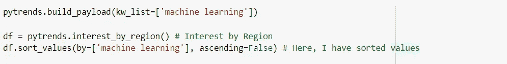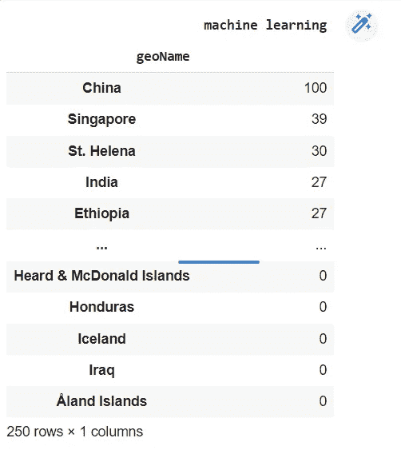

这有助于检查特定时间段内基于位置的搜索词的受欢迎程度。这里，为了方便和更好的理解，我对值进行了排序。

> **谷歌趋势价值观到底是什么意思？**
> 
> 根据 Google Trends，值是以 0 到 100 的范围计算的，其中 100 是最受欢迎的位置，作为该位置搜索总数的一部分，值 50 表示一个位置。位置不到普通的两倍。值为 0 表示该位置没有该项的足够数据。来源→ [谷歌趋势。](https://support.google.com/trends/?hl=en#topic=6248052)

为了更好地理解，还将结果绘制在**条形图**上。

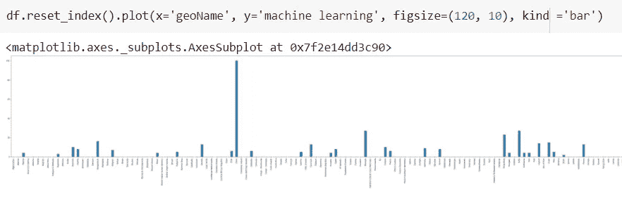

## 每日搜索趋势

现在让我们来看看世界上最热门的日常搜索趋势。为此，我们需要使用 **trending_searches** 方法。如果你想在全球范围内搜索，不要传递任何参数。

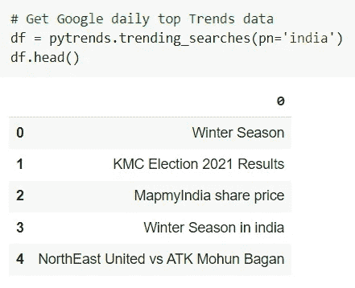

数据集(作者提供的图片)

确保输入小写的国家名称 **pn = "india"** 。另外，你可以将上述结果与 [google trend 的结果](https://trends.google.com/trends/trendingsearches/daily?geo=US)进行比较。要了解今天的热门话题，只需使用:

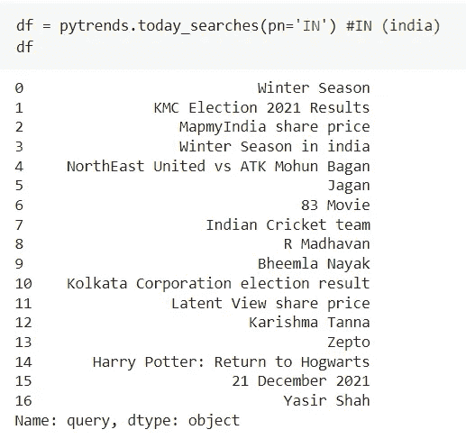

# 排行榜

在 **top_charts** 的帮助下，我们可以获得每年的热门搜索。让我们看看 2021 年的趋势是什么

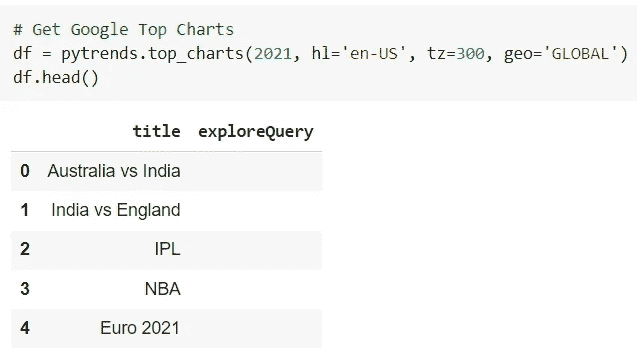

要比较结果，只需访问[谷歌趋势](https://trends.google.com/trends/yis/2021/GLOBAL/)。我们可以指定想要查看趋势搜索的年份和国家。您还可以检查全局结果。

## 关键词建议

谷歌趋势可以给你一个与你的主要关键词相关的关键词建议列表。在下面的例子中，您将发送一个请求，为名为“Spacex”的关键字寻找建议。

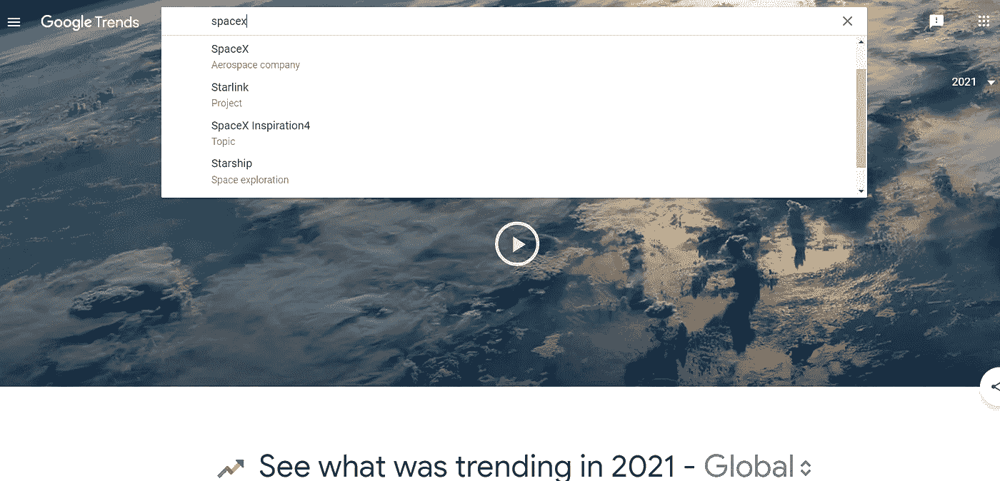

来源:https://trends.google.com/trends/yis/2021/GLOBAL/

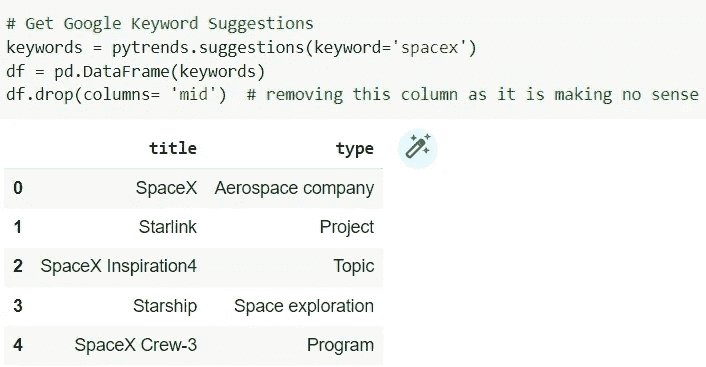

pytrends 的 suggestions 方法将从 Google Trends 获取关键字建议，并以数据帧格式返回它们。

## 相关查询

当用户搜索一个主题时，他们也会搜索一些相关的东西，这是很常见的事情。这些被称为相关查询。让我们看看主题“**工作**”的相关查询。请记住，当您想要更改主题名称时，只需使用新名称作为参数再次运行以下代码。

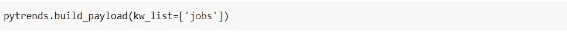

现在让我们运行方法【T4 相关查询】。它将返回一个字典，里面装满了主题 **jobs 的相关查询。**

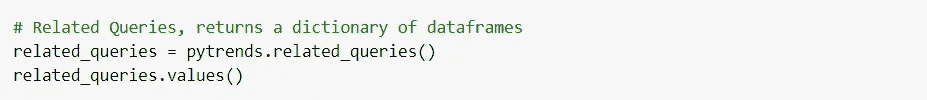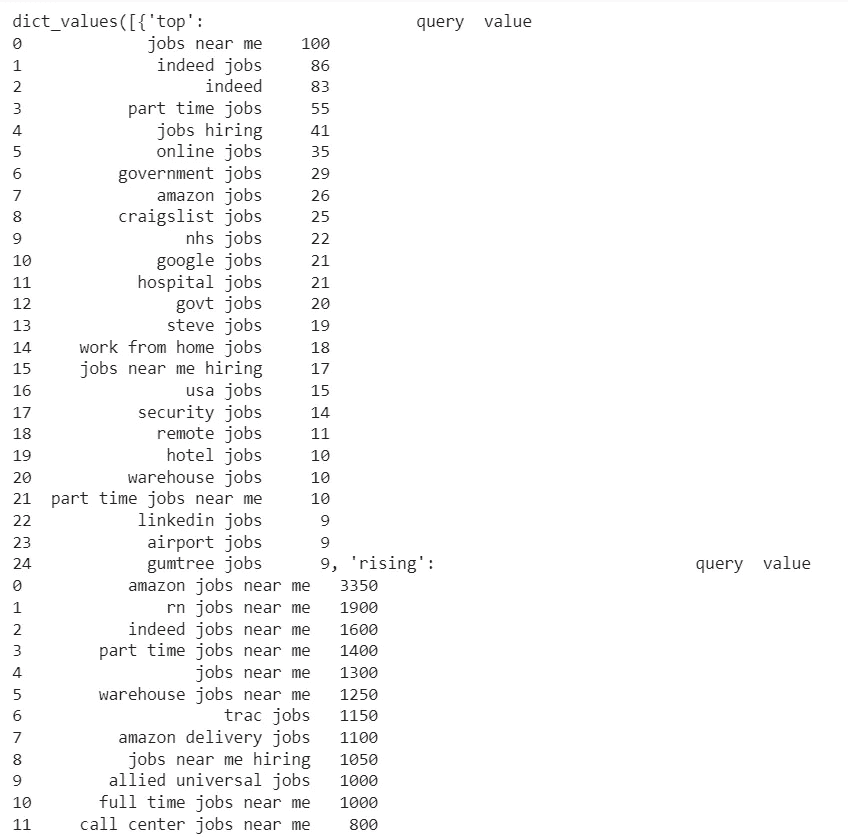

同样，您也可以轻松搜索相关主题。只需运行下面的代码。

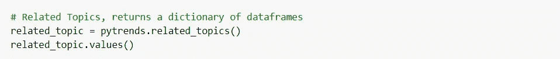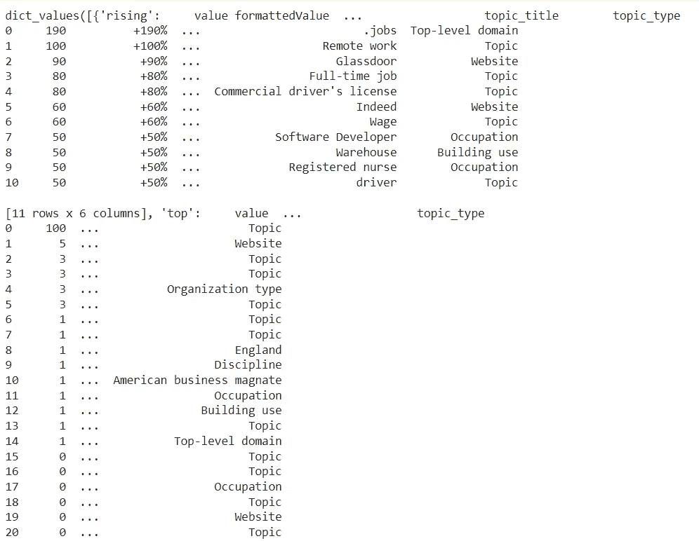

数据集(作者提供的图片)

# 结论

我希望你**了解了**关于这个话题的所有**必要的细节**。如果您有任何建议或疑问，请写在**评论区**，我很乐意为您提供帮助。

**干杯！**

**你可以在这里得到代码:**[https://github . com/AruneshTamboli/Using-Python-to-automate-Google-Trends-Data](https://github.com/AruneshTamboli/Using-Python-to-automate-Google-Trends-Data)

# **参考文献:**

谷歌趋势:[https://trends.google.com/trends/?geo=IN](https://trends.google.com/trends/?geo=IN)

[https://en.wikipedia.org/wiki/Google_Trends](https://en.wikipedia.org/wiki/Google_Trends)

[https://towards data science . com/Google-trends-API-for-python-a 84 BC 25 db 88 f](https://towardsdatascience.com/google-trends-api-for-python-a84bc25db88f)

[https://hacker noon . com/how-to-use-Google-trends-API-with-python](https://hackernoon.com/how-to-use-google-trends-api-with-python)

 [## PyTrends 的终极指南:Google Trends API(带有 Python 代码示例)

### 我将分享一些关于你可以用 Pytrends 做什么的见解，如何做基本的数据拉取，提供 Python 的片段…

lazarinastoy.com](https://lazarinastoy.com/the-ultimate-guide-to-pytrends-google-trends-api-with-python/)