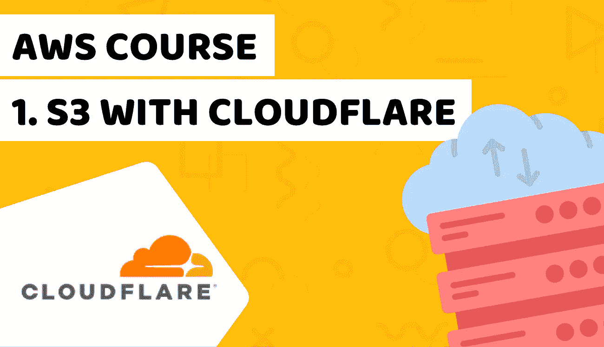

# 了解如何使用 Cloudflare 在 S3 上托管网站— AWS 课程第 1 课

> 原文：<https://blog.devgenius.io/learn-how-to-host-a-website-on-s3-with-cloudflare-aws-course-lesson-1-bf01cbe2b0c8?source=collection_archive---------30----------------------->



[了解如何使用 Cloudflare 在 S3 上托管网站— AWS 课程第 1 课](https://www.blog.duomly.com/aws-course-lesson-1-how-to-host-website-on-s3-with-cloudflare/)

本文原载:
[https://www . blog . duomly . com/AWS-course-lesson-1-how-to-host-website-on-S3-with-cloud flare/](https://www.blog.duomly.com/aws-course-lesson-1-how-to-host-website-on-s3-with-cloudflare/)

# AWS 课程简介—如何使用 Cloudflare 在 S3 上托管网站

在 AWS 课程的第一课中，我们将讨论使用 Cloudflare 在 S3 上托管一个网站。

你怎么听说过在亚马逊 S3 上建立网站的想法？

是的，这是可能的，而且这是最好的想法之一，尤其是如果我们能够将其与 Cloudflare 公司的免费 CDN 结合起来。

它非常快，因为页面是静态的，所以我们不需要等待服务器响应(几乎因为每个服务器都有一些响应时间，但这里我们只是服务器的东西，没有数据库查询等。)，并通过内容交付网络托管。

它非常安全，因为没有后端，几乎没有办法放置任何易受攻击的代码(当然，如果你不允许的话)。

它非常便宜，因为你不需要处理大量的数据，如不必要的 CMS 文件，你应该在某个地方运行，服务文件比计算能力要便宜得多。

它很容易配置，因为你不需要花很多时间配置你的服务器，安装数据库，配置 Nginx 或 apache。

在这种情况下，创建一个 bucket，将其公开，在 cname 中添加 cname 记录并上传您的页面就足够了。

你准备好进入高速静态页面世界了吗？

开始吧！

如果你喜欢视频，这里有 youtube 的一步一步教程:

了解如何使用 Cloudflare 在 S3 上托管网站— AWS 课程第 1 课

# 如何创建 S3 存储桶

当然，如果我们想使用 AWS S3 服务，我们必须创建 AWS 用户，为此配置 IAM 用户会很有用。

不管怎样，如果我们准备好了，我们可以去 S3 服务。

接下来，我们应该单击“创建存储桶”按钮。

# 如何配置 S3 存储桶

现在，我们应该看到创建 bucket 的窗口，但是在创建之前，我们应该添加一些配置。

在我们指定 bucket 名称的字段中，我们应该添加与 URL 完全相同的名称。

如果我们的 URL 应该是“training.duomly.com ”,那么我们的 bucket 应该有名称“training.duomly.com”。

如果我们决定在 URL 中包含“www ”,那么“www”应该在 bucket 的名称中。

我们应该配置的下一件重要事情是将整个存储桶设置为公共存储桶，这样用户就可以看到里面的数据。

当然，您不需要添加文件列表访问权限，也不应该添加，但是用户应该可以访问的文件应该具有公共的“读取”访问权限。

接下来，您可以确认创建存储桶。

# 如何添加 S3 存储桶策略

太好了，我们的桶创建完成了，恭喜！

现在我们可以把重点放在桶内部的配置上，但是不用担心，只有两步。

第一个是指定存储桶访问策略。

您可以编写自己的代码，也可以使用下面示例中的代码:

```
{
  "Version": "2008-10-17",
  "Id": "PolicyForPublicWebsiteContent",
  "Statement": [
    {
      "Sid": "PublicReadGetObject",
      "Effect": "Allow",
      "Principal": {
        "AWS": "*"
      },
      "Action": "s3:GetObject",
      "Resource": "arn:aws:s3:::YOURBUCKETNAME/*”
    }
  ]
}
```

# 如何设置 S3 桶作为主机

您应该执行的第二步是将 bucket 配置为虚拟主机。

为此，您需要进入 bucket 中的“Properties”选项卡。

接下来，你需要打开菜单位置“静态虚拟主机”，并打开它。

在该表中，您需要指定哪个页面将负责主页，哪个页面负责 404。

您可以在两个输入中都输入“index.html”。

指定页面后，您应该复制 bucket URL(您将需要该 URL 让 Cloudflare 指向其中的 CNAME 记录)。

# 进入域上的 Cloudflare

我们已经完成了 S3 存储桶配置，现在我们可以进入 Cloudflare。

当然，您需要为 Cloudflare 添加域并配置您的域注册商 DNS 服务器，但我认为您必须这样做。

接下来，您需要打开您的域的仪表板，并进入 DNS 标签。

# 如何在 Cloudflare 中设置 cname 记录

现在，我们可以配置 DNS 记录，将子域指向 S3 存储桶。

这是你需要 S3 桶网址的时刻，我已经推荐你在 2 个步骤之前复制。

要为 S3 配置您的域或子域，我们需要添加一个指向 S3 的 DNS 记录。

当您使用子域时，您需要选择一个选项来添加 cname 记录。

在输入“名称”时，您应该只键入您的子域名，而不是整个 URL。

在“目标”输入中，您应该添加 S3 桶的网址。

接下来，您应该单击“保存”。

如果一切顺利，您应该会在下表中看到新的 DNS 记录。

# 如何上传一个网站到 S3

您已经将 S3 配置为虚拟主机，并将 Cloudflare 子域配置为与 S3 协同工作，祝贺您！

现在，我们可以把重点放在托管中的上传网站。

非常简单快捷。

您应该进入 S3 存储桶视图，然后单击上传。

# 如何将 S3 网站设置为公共网站

在上传窗口中，您可以选择或删除文件，然后单击“下一步”。

在下一步中，您可以设置文件的访问权限。

您可以为每个人授予读取权限，然后单击确认。

当然，您需要验证是否所有文件都应该具有相同的访问权限，当然，不要给除您的用户之外的任何人写访问权限。

简单吧？

# 清除缓存

Cloudflare 有一个出色的功能，可以帮助您提高性能，有时还可以让您的网站保持在线。

这个功能就是缓存。

这很好，但是如果你做了很多更改，缓存可以长时间保存你的更改，用户不会看到区别。

在大多数情况下，缓存会检测到更改并上传页面。

如果您想确保用户将被更新，在更改后清除缓存是值得的。

为此，您需要进入 Cloudflare 并单击“Caching”选项卡。

接下来，您需要单击“配置”，在“清除缓存”部分，您应该单击“清除所有内容”按钮。

现在，您可以尝试访问该 URL 并验证是否一切正常。

我建议你用 Google PageSpeed Insights 测试一下这个页面，看看 S3 + Cloudflare 的性能有多强大。

# AWS 课程结束—如何使用 Cloudflare 托管 S3 网站

恭喜你！

在 AWS 课程的第一课中，您已经学习了如何使用 Cloudflare 在 S3 上托管网站，但这只是 it 架构良好实践的第一步。

在接下来的几集中，我将向您展示更多的 AWS 服务，我将教您一些有用的东西，比如如何将 EC2 配置为后端，如何创建无服务器应用程序，或者如何使用 Amazon RDS 处理数据库。

我们将讨论令人兴奋的事情，如如何用 AWS amplifier 构建实时应用程序，如何训练机器学习模型，如何用 CloudFront 设置 CDN，或如何用 SES 发送电子邮件，但我们不会只讨论单一服务。

我将向您展示如何为您的小型、中型和大型项目建立 IT 基础设施，您最应该注意什么，以及如何扩展您的应用程序。

您可以找到我们与 Hugo 一起构建非常快速的 AMP 静态网站的那一集，并将其托管到 AWS S3:

https://www . blog . duomly . com/how-to-build-website-with-Hugo-amp-tutorial


[多美滋促销代码](https://www.duomly.com?code=lifetime-80)

感谢您的阅读，
来自 Duomly 的 Radek