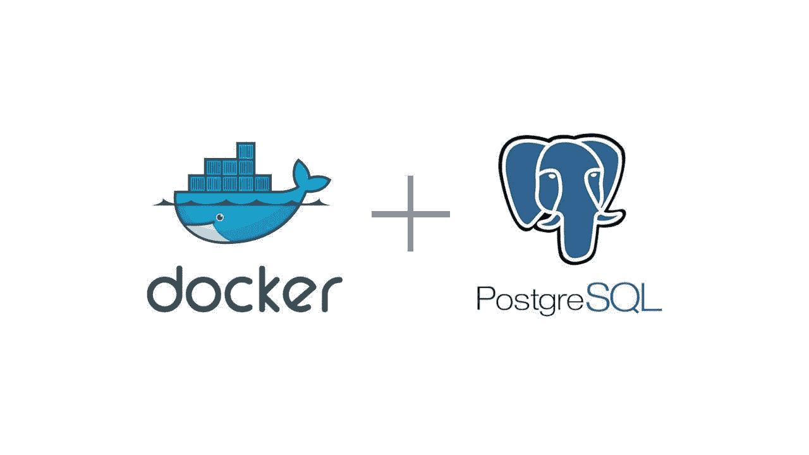

# 了解如何在本地运行 PostgreSQL

> 原文：<https://blog.devgenius.io/learn-how-to-run-postgresql-locally-c388483712e9?source=collection_archive---------8----------------------->

使用码头集装箱



Docker 和 Postgresql 可以一起工作(使用 [Docker](https://www.docker.com/) 和 [PostgreSQL](https://www.postgresql.org/) 徽标构建)

每次 IT 专业人员需要学习新东西时，他/她都需要在他们的笔记本电脑上安装几个新程序(有些软件在机器的操作系统中可能无法正常工作)。

然而，这并不是在本地运行软件的唯一方法([什么意思是“在本地运行一个软件](https://medium.com/@lgsoliveira/what-means-to-run-one-software-locally-a8b556d6f34c)？”).在我看来，最好的方法是使用 Docker 容器，因为你只需要安装 Docker，但是你可以使用很多程序。

在本文中，我将解释如何将 PostgreSQL 设置为在 Docker 容器中运行。本文基于视频[从](https://www.youtube.com/watch?v=2JM-ziJt0WI&list=PL3MmuxUbc_hJed7dXYoJw8DoCuVHhGEQb) [DataTalksClub](https://datatalks.club/) 的[数据工程 Zoomcamp](https://github.com/DataTalksClub/data-engineering-zoomcamp) 摄取纽约出租车数据到 Postgres 。

我会解释:

*   Docker 和 PostgreSQL 简介
*   在 Docker 容器中运行 PostgreSQL 需要做什么？

# 1.PostgreSQL 和 Docker 简介

# 1.1.一种数据库系统

根据官方网站的说法，“PostgreSQL 是一个强大的开源对象关系数据库系统，经过 35 年的积极开发，它在可靠性、功能健壮性和性能方面赢得了良好的声誉。”。

它最初被命名为 POSTGRES，但在 1996 年，该项目被重命名为 PostgreSQL，以反映其对 SQL 的支持。

它的特点是事务具有原子性、一致性、隔离性、持久性(ACID)属性、可自动更新的视图、物化视图、触发器、外键和存储过程。

它旨在处理一系列工作负载，从单台机器到数据仓库或有许多并发用户的 Web 服务。(来源[维基百科](https://en.m.wikipedia.org/wiki/PostgreSQL))

# 1.2.码头工人

Docker 使用操作系统级虚拟化，允许对容器中的软件进行奇妙的定制，这些容器可以轻松地与您的同事或开发环境之间共享，“并确保您共享的每个人都获得以相同方式工作的相同容器”(通过 Docker 官方网站)。

容器是相互隔离的，并且捆绑了它们自己的软件、库和配置文件。

因为所有容器共享单个操作系统内核的服务，所以它们比虚拟机使用更少的资源。(来源[维基百科](https://en.m.wikipedia.org/wiki/Docker_(software)))

# 2.在 Docker 容器上运行 PostgreSQL

为了使用 Docker 容器在本地运行 PostgreSQL，我们需要运行两个命令。

*   使用简单的 Docker 命令构建一个卷

```
docker volume create --name postgres_volume_local -d local
```

使用此命令，我们将在本地创建一个名为 postgres_volume_local 的卷。

*   构建容器的更复杂的 Docker 命令

首先，我们需要有强制命令来构建容器

```
docker run
```

然后我们插入一些要迭代的标志，添加一个名字并在退出时移除容器。

```
-it --rm --name postgresql
```

接下来，我们添加一些 PostgreSQL 环境变量

```
-e POSTPostgreSQL"user_name"-e POSTGRES_PASSWORD="a_cool_but_difficult_password"-e POSTGRES_DB="my_database"
```

然后，我们在之前创建的 Docker 卷和 PostgreSQL 设置数据的路径之间设置一个连接

```
-v postgres_volume_local:/var/lib/postgresql/data
```

我们还需要为 PostgreSQL 设置端口。

```
-p 5432:5432
```

最后，我们必须调用 PostgreSQL Docker 映像。

```
postgres:13
```

总的来说，完整的命令是这样的

```
docker run -it --rm --name postgresql \-e POSTGRES_USER="user_name" \-e POSTGRES_PASSWORD="a_cool_but_difficult_password" \-e POSTGRES_DB="my_database" \-v postgres_volume_local:/var/lib/postgresql/data \-p 5432:5432 \postgres:13
```

# 摘要

本文介绍了一种简单而有效的方法，在 Docker 容器中运行 PostgreSQL，并将数据保存在 Docker 卷中。

你喜欢这篇文章吗？关注我更多关于[媒体](https://medium.com/@lgsoliveira)的文章。