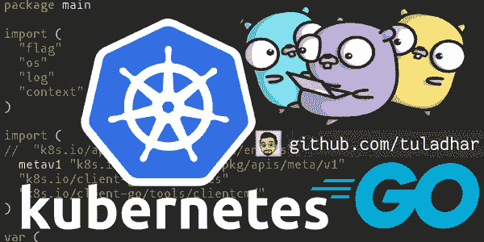
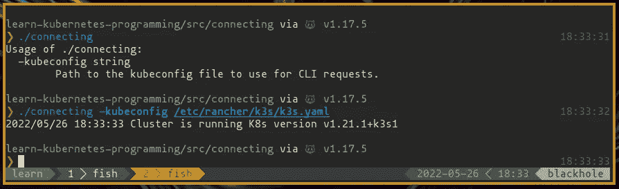

# 学习 Kubernetes 编程—第 1 部分

> 原文：<https://blog.devgenius.io/learn-kubernetes-programming-part-1-7384e5f3c481?source=collection_archive---------3----------------------->

> 学习使用官方客户端 Go 库以编程方式与 Kubernetes 集群对话。

# 介绍

在“学习 Kubernetes 编程”系列的第 1 部分中，我们将构建一个连接到 Kubernetes 集群并显示服务器版本的简单 CLI 程序。在这个过程中，你将尝到 Go 编程语言的味道，并将进入令人敬畏的 Kubernetes 编程世界。所以，系好安全带，戴上编程帽！

图:行动中的 CLI

👉**阅读更多:**[https://ptuladhar . gum road . com/l/learn-k8s-programming-part-1](https://ptuladhar.gumroad.com/l/learn-k8s-programming-part-1)