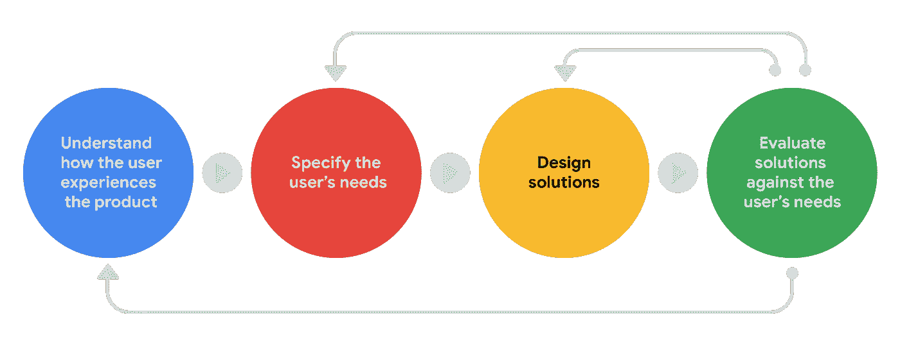
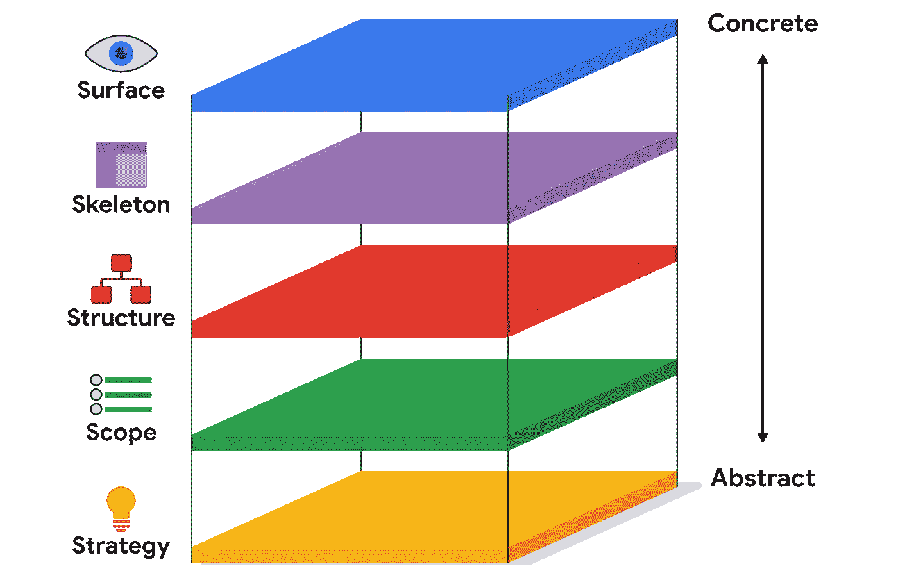
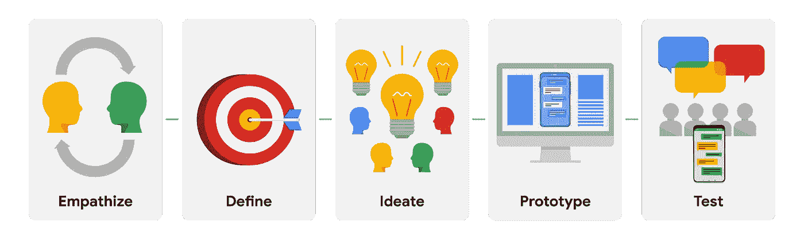
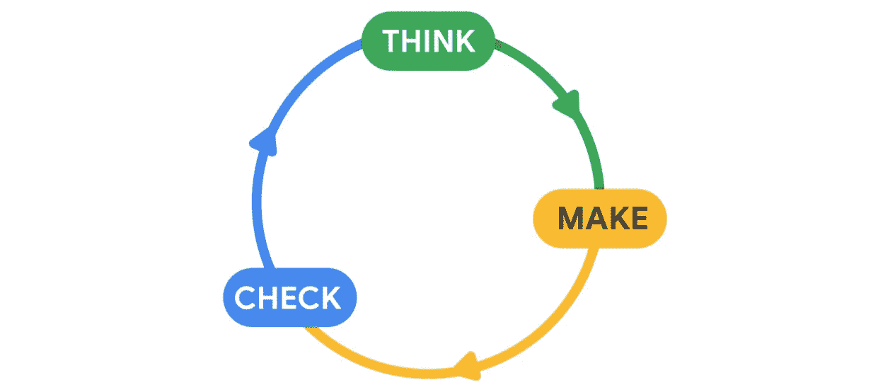
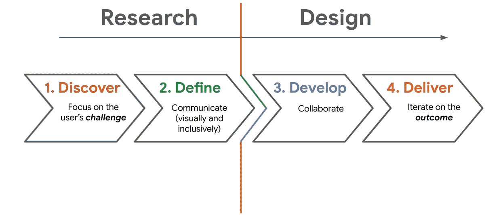

# 了解有关不同设计框架的更多信息

> 原文：<https://blog.devgenius.io/learn-more-about-different-design-frameworks-d365a544deaa?source=collection_archive---------4----------------------->

大多数 UX 设计师在处理工作时都遵循一个特定的框架或流程，从最初的想法一直到产品的最终推出。提醒一下，**框架**创建了关注和支持你试图解决的问题的基本结构，有点像一个项目的大纲。每个设计师和每个团队都是不同的，所以在开始设计之前对每个框架有一个坚实的理解是有帮助的。

# 以用户为中心的设计过程

以用户为中心的设计过程的每个阶段都以用户及其需求为中心。这是一个迭代的过程，这意味着设计师一次又一次地回到某些阶段，以完善他们的设计，为他们的目标用户创造出最好的产品。

以下是以用户为中心的设计流程中的关键步骤:

*   **了解用户如何体验产品或类似产品。**你想知道用户将如何参与你的设计，以及他们体验产品的环境或背景。理解这一点需要大量的研究，比如观察用户的行为和进行采访，我们将在后面进行更多的探讨。
*   **指定用户的需求。根据你的研究，找出哪些用户问题是最需要解决的。**
*   **为用户的困难设计解决方案。**想出许多设计点子，解决你所发现的用户难题。然后，开始实际设计这些想法！
*   **根据用户需求评估你设计的解决方案。**问问自己，“我创造的设计解决了用户的问题吗？”要回答这个问题，你应该用真人来测试你设计的产品，并收集反馈。

注意图中的箭头是如何表示圆周运动的。这说明了以用户为中心的设计过程的迭代质量。设计师回到流程的早期阶段，对他们的设计进行改进和修正。在以用户为中心的设计过程中，你总是致力于改善用户体验，解决用户面临的问题！

# UX 设计的五大要素

UX 设计的五个要素是 UX 设计师将想法转化为工作产品的步骤框架。这五个要素从下到上依次是:战略、范围、结构、骨架、表面。可以把这些看作是一组五层，每一层都依赖于它下面的一层。

*   **策略:**底层是策略，在这里你为你的设计目标打下基础。这些目标基于用户需求和产品的商业目标。
*   **范围:**下一层是范围，在这里你决定你正在构建的产品的类型。在这一点上，您将考虑您想要在产品中包含的特性和内容的种类。
*   **结构:**中间层是结构。在这里，您将了解如何组织您的设计，以及您希望用户如何与产品交互。
*   **骨架:**骨架是产品的布局。就像我们骨骼的布局塑造我们的皮肤一样，骨骼层详细描述了你的设计如何工作——就像骨骼一样，用户不会直接看到它的内部工作情况。
*   表层:顶层，表层，代表产品对用户的外观。表面表示用户查看并与之交互的界面。想一想表面，比如你穿的衣服或化的妆对外界是可见的。

想了解更多？看看这篇关于[用户体验五要素](https://medium.com/omarelgabrys-blog/ux-a-quick-glance-about-the-5-elements-of-user-experience-part-2-a0da8798cd52)的文章，它最初是由杰西·詹姆斯·加勒特提出的。或者深入探究五行，[加勒特的书](https://www.amazon.com/Elements-User-Experience-User-Centered-Design/dp/0321683684)也是一个探索的选项。

# 设计思维过程

设计思维是一种以用户为中心解决问题的方法。它帮助设计者创建解决实际用户问题的解决方案，这些解决方案既实用又实惠。在设计过程中有五个阶段:移情、定义、构思、原型和测试。

*   在**移情**阶段，目标是理解用户的需求以及用户的想法和感受。这涉及到大量的用户研究，比如进行调查、访谈和观察会议，这样你就可以清楚地了解你的用户是谁，以及他们面临的挑战。
*   在**定义**阶段，你将基于你的研究发现，创建一个清晰的困难陈述，或者你的设计将解决的用户需求的描述。这将推动你的团队朝着产品设计的明确目标前进。
*   一旦你发现了用户的困难，并确定了为什么它是一个需要解决的重要问题，就到了**构思**阶段。构思的目标是想出尽可能多的设计方案。
*   一旦你有了解决问题的想法，你就准备好进入原型阶段。原型是展示产品功能的早期模型。
*   在**测试**阶段，在产品由工程师制造出来并向公众发布之前，用户提供关于他们设计的反馈。您可以根据需要多次使用此反馈来更改和改进您的设计。

根据测试阶段的反馈，您可能需要回到设计过程的开始，为解决方案提出新的想法，或者开发新的原型。最终，像任何设计框架一样，设计思维过程的目标是实现您的设计，这意味着构建它并与世界共享。有关设计过程中五个阶段的更多细节，请查看指南 [UX 设计过程:你需要知道的一切](https://xd.adobe.com/ideas/guides/ux-design-process-steps/)来自 Adobe XD Ideas。

# 像设计师一样思考:精益 UX 和双钻石

现在你已经知道了 UX 设计师使用的三种流行框架，是时候探索另外两种了:**精益 UX** 和**双菱形**。您可能会发现自己被一个特定的框架所吸引，或者您的团队可能会根据项目的不同而使用不同的方法。每个设计师和团队都是不同的，但是在你开始设计之前，在许多不同的方法上有一个坚实的基础是很重要的。开始了。

# 精益 UX

精益 UX 流程专注于减少浪费的时间和资源，并尽快生产出可行的产品。该过程是迭代的，这意味着团队在收集用户研究和利益相关者反馈的同时，继续更新和修改产品。

精益 UX 流程分为三个步骤:

*   **认为。探索用户遇到的问题，并考虑如何用你的设计解决这些问题。这一步是收集研究资料，这样你就可以清楚地了解产品是为谁设计的，以及它将如何帮助他们。**
*   **使。**通过创建草图、线框和原型开始设计产品。您还将创建一个最小可行产品，简称 MVP，它是您的设计的一个简单原型，您可以用目标受众来测试它。当你收集反馈时，准备回去更新你的原型！
*   **检查。**了解用户对你的设计的反应，并从项目干系人那里收集反馈。对您的设计进行相应的调整，如有必要，再次重复这三个步骤。

这些步骤将根据需要重复多次，直到您的团队获得想要的最终产品。精益 UX 流程鼓励生产力和协作。精益 UX 团队通常是跨职能的，这意味着你将与工程师和 UX 研究人员等团队成员一起工作。

使用精益 UX 流程时，您应该牢记六条原则:

1.  **前进。**只关注将设计过程推向特定目标的设计元素和特征。不要被“最好拥有”分散注意力。
2.  **保持好奇。**精益 UX 是利用用户和利益相关者的反馈来修改和改进您的设计。不断寻求反馈，以了解为什么特定的设计选择可行或不可行。
3.  **在现实世界中测试想法。**精益 UX 鼓励设计师在会议室外面和潜在用户一起测试他们的想法，比如使用原型。
4.  将你的想法具体化。不要在内心争论和分析一个想法是否可行，而是在你的想法还记忆犹新的时候，把它们变成有形的、可见的、可测试的东西。通过这种方式，你可以在设计的早期阶段得到反馈，那时不同的观点和反馈是最有帮助的。
5.  **将交付成果重新定义为结果。**专注于创造用户真正想要和需要的可用的、令人愉快的产品。永远记住，你首先是为你的用户设计，而不是为项目涉众。
6.  **拥抱彻底的透明。**对团队中的每一个人都坦诚相待(并期待同样的回报)，因为你会依赖对方的见解。这样，每个人都可以就如何前进做出明智的决定，避免浪费时间和精力。

精益 UX 流程就是通过协作，对不断的反馈和修改保持开放的态度。

# 双菱形

双钻石是一种更传统的 UX 工艺，将 UX 设计分为两个主要阶段(或“钻石”):研究和设计。每个阶段有两个步骤。结合起来，这四个步骤是:

1.  **发现问题。**收集关于用户面临的潜在问题的信息。
2.  **定义问题。**过滤数据，关注你的产品旨在解决的主要问题。
3.  **制定问题的解决方案。**作为一项正在进行的工作，开始设计你的产品。这就是线框和原型发挥作用的地方。
4.  **交货。**审查和测试您的产品，为发布做准备。

像我们讨论过的许多设计框架一样，双菱形是迭代的，而不是线性的。每一次冲刺都带领团队获得新的见解，用于改进产品的设计。然后，该过程以新的迭代再次开始。

双钻石还鼓励整个组织的团队合作，因此设计团队不仅仅关注设计。要想成功，整个团队必须知道如何整合设计原则、设计方法、用户参与策略和领导原则。根据需要，准备好承担多种角色和责任。

双钻石工艺遵循四大原则:

1.  **关注用户。**在 UX 的设计中，用户始终是第一位的。
2.  **交流。**通过补充文本的图像和设计选择进行视觉传达。你还应该确保你的设计的交流是公平和可及的，这一点你将在课程的这一部分学到更多。
3.  **合作无间。**双钻流程的一个独特之处在于，它鼓励与团队成员进行创造性协作和共同创造。
4.  **迭代。**承认设计是一项正在进行的工作，不会马上完成。神奇之处在于修改。每一次迭代，你都给用户一个新的体验。

精益 UX 和双菱形框架对于入门级 UX 设计师的理解都是有用的。即使你的团队没有遵循这些过程中的任何一个，理解每一个过程是如何工作的以及为什么使用它是无价的。