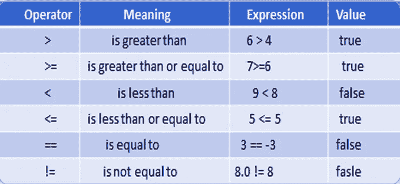

# 在一篇文章中学习编程逻辑和如何编码

> 原文：<https://blog.devgenius.io/learn-programming-logic-and-how-to-code-in-a-single-post-5fc4db979bee?source=collection_archive---------37----------------------->

在这篇文章结束的时候，你将会学到一些基本的逻辑原理，这些原理将会帮助我们解决一个连谷歌都无法回答的挑战。

需要说明的是，以下所有代码都是用 JavaScript 编写的，因为在浏览器中编写代码很简单。我贪婪地请你和我一起编码，因为没有比实用更好的学习方法了。

我建议你使用浏览器的控制台来编写代码。在 Chrome 中，你可以通过 **Ctrl + shift + J** 来访问，但如果这不起作用，你可以在谷歌上快速搜索。


[米米·蒂安](https://unsplash.com/@mimithian?utm_source=unsplash&utm_medium=referral&utm_content=creditCopyText)在 [Unsplash](https://unsplash.com/s/photos/computer-people?utm_source=unsplash&utm_medium=referral&utm_content=creditCopyText) 上的照片

# 程序设计逻辑

将编程逻辑视为更大事物的构建模块。想象一个乐高或一个拼图，这是一组几个小块，它有助于创建一个最终的对象。编程中的每一个小部分都有一个名字，我将向你们展示它们中的每一个，在文章的最后，我们将需要开发我们的代码挑战。


由[凯利·西克玛](https://unsplash.com/@kellysikkema?utm_source=unsplash&utm_medium=referral&utm_content=creditCopyText)在 [Unsplash](https://unsplash.com/s/photos/lego?utm_source=unsplash&utm_medium=referral&utm_content=creditCopyText) 上拍摄的照片

# 评论

注释是程序不执行的代码。这是一种形式，我们可以在不中断代码执行的情况下向我们人类传递信息。在 JavaScript 中，声明注释的简单方法是在每行使用“ **//** ”。例如:

```
// this is a comment// this is another comment
```

# 变量

变量帮助我们存储一些将来可能需要用到的数据。它可以是数字、文本、函数和其他几种类型的值。声明变量的最基本形式是通过使用" ***var*** "语句。另一件要注意的事情是，我们不能让变量名之间有空格，这就是为什么我们用大写字母将单词分组。例如:

```
// for texts we need to use '' or "" around the text
var myName = "Alison Cassis"var internetCostByMonth = 100 // set a value of 100 to our variable// but how much does it cost in a whole year?internetCostByMonth * 12// the console should print 1200 to you
```

# 关系运算符

它有助于检查两个值之间的关系。



# 情况

它有助于检查一个陈述是对还是错。使用最多的是" ***if"*** ，*【else】，* ，它们的范围由 ***"{"*** ， ***"}"*** 符号来划定。下面是一个使用我们刚刚看到的关系运算符的示例:

```
var myAge = 24 
var myBrotherAge = 10 
if (myAge < myBrotherAge) { 
    //  "I'm younger than my brother" 
} else { 
    //  "I'm older than my brother"
}
```

# 重复循环

它帮助你运行相同的代码 **N** 次。就像条件一样，它们的范围也是由***“{”******“}”****符号* ***所划定的。*** 循环的一个例子是*，它需要 3 个值按以下顺序工作:**一个基值，一个停止循环的条件，** **和** **下一次执行循环的新基值。***

```
*var minutesInADay = 0 
for (var hourOfTheDay = 0; hourOfTheDay < 24; hourOfTheDay = hourOfTheDay + 1) { 
  minutesInADay = minutesInADay + 60 
  //for each hour in a day we want to sum 60 in our variable
} 
minutesInADay 
// the console should print 1440 to you*
```

# *列表*

*它有助于将几个值组合成一个变量。一个特点是列表**从 0** 开始。列表中的项目保存在“ ***[*** ”和“ ***]*** ”符号中，并用逗号分隔。例如:*

```
*var monthsFromFirstSemester = ['January', 'February', 'March', 'April', 'May', 'June']monthsFromFirstSemester[0]// the console should print "January" to you*
```

# *功能*

*这是一种将你的代码分成一个块的形式，我们可以在另一个时刻执行。要声明那个函数我们应该使用"***【function()】***"语句。就像条件一样，它们的范围也是由***“{”***和***“}”****符号*划定的。当我们决定执行我们的函数时，我们应该在它的名字后面加上"* **()** *"，否则它不会被执行。比如:***

```
**var willNotBeExecuted = function () { 
  return 'some text' 
} 
var willBeExecuted = function () { 
  return 'It works' 
} 
willBeExecuted() 
// the console should print 'It works' to you
// take a look how we did not execute the first function, only the second one**
```

**现在我们已经知道了编程的基础，让我们开始我们的挑战:**

****

**照片由[卢卡斯·布拉塞克](https://unsplash.com/@goumbik?utm_source=unsplash&utm_medium=referral&utm_content=creditCopyText)在 [Unsplash](https://unsplash.com/s/photos/calendar?utm_source=unsplash&utm_medium=referral&utm_content=creditCopyText) 上拍摄**

# **2000 年至今，我们有多少个 13 号星期五？**

**我知道，这看起来很傻很简单，但我鼓励你找到一个简单的答案。在谷歌上搜索你可能会找到一些相关的链接，但没有太容易或非常可靠的。所以，我的建议是:**

# **让我们创建一个代码来回答这个问题。**

**因此，让我们从创建将要使用的函数开始我们的代码。**

```
**var calculateTotal = function () {  
  var total = 0
  var initialYear = 2000 
  var currentYear = new Date().getFullYear() // should get your current year
}**
```

**我们将对 2000 年以来的每一年执行相同的逻辑，因此我们可以为此使用一个循环。**

```
**var calculateTotal = function () {  
  var total = 0
  var initialYear = 2000 
  var currentYear = new Date().getFullYear() // should get your current year
  for (var baseYear = initialYear; baseYear <= currentYear; baseYear = baseYear + 1) {  
  //here comes our next code
  }
}**
```

**现在我们正在循环每一年，是时候检查每个月是否包含 13 号星期五了，我们可以通过另一个循环来实现，但是这次是针对每年的月份。一个特点是日期类型的数据被视为列表，如["Jan "，" Feb "，…，" Dec"]，所以这就是为什么我们需要在循环中使用 month 变量作为 0。**

```
**var calculateTotal = function () {  
  var total = 0
  var initialYear = 2000 
  var currentYear = new Date().getFullYear() // should get your current year
  for (var baseYear = initialYear; baseYear <= currentYear; baseYear = baseYear + 1) {  
    for (var month = 0; month < 12; month = month + 1) {
      // here we have access to each month in a year
    }
  }
}**
```

**当我们从一年中的每个月开始循环时，我们只需要检查第 13 天是否是星期五，为此我们将使用 **Date** 语句，它帮助我们处理日期变量的所有方面。我们可以创建一个日期，按以下顺序向**日期**传递 3 个参数，**年、**月、**日**。之后，我们可以使用 **getDay** 返回该日期值对应的星期几。看看这个:**

```
**var calculateTotal = function () {  
  var total = 0
  var initialYear = 2000 
  var currentYear = new Date().getFullYear() // should get your current year
  for (var baseYear = initialYear; baseYear <= currentYear; baseYear = baseYear + 1) {  
    for (var month = 0; month < 12; month = month + 1) {
      var dayOfTheWeek = new Date(baseYear, month, 13).getDay()
    }
  }
}**
```

**现在我们只需要检查变量 **dayOfTheWeek** 是否等于 Friday。但是这里我们有另一个特点。getDay 返回给我们一周中某一天的数字，考虑从周日开始的一周，因为它是一个从周日到周一的列表，因为它是一个列表，我们已经知道它从 0 开始。因此，如果 Sunday 等于 0，我们需要检查 getDay 的结果是否等于 5，因为这对我们来说意味着星期五，之后我们只需增加变量 **total** 并执行我们的函数。像这样:**

```
**var calculateTotal = function () {  
  var total = 0
  var initialYear = 2000 
  var currentYear = new Date().getFullYear() // should get your current year
  for (var baseYear = initialYear; baseYear <= currentYear; baseYear = baseYear + 1) {  
    for (var month = 0; month < 12; month = month + 1) {
      var dayOfTheWeek = new Date(baseYear, month, 13).getDay()
      if(dayOfTheWeek == 5) { 
        total = total + 1 
      }
    }
  }
  return total
}
calculateTotal()**
```

**就是这样！**

**你刚刚用你最近的编程技能创造了一些东西来帮助你解决一个问题。这就是编程，一个帮助我们用更少的时间完成更多事情的工具。**

**我鼓励你用其他的值来尝试代码中的 **initialYear** 变量，然后用你的结果写一个注释，我希望这篇文章对你的编程之路有所帮助。**

**下次见！**