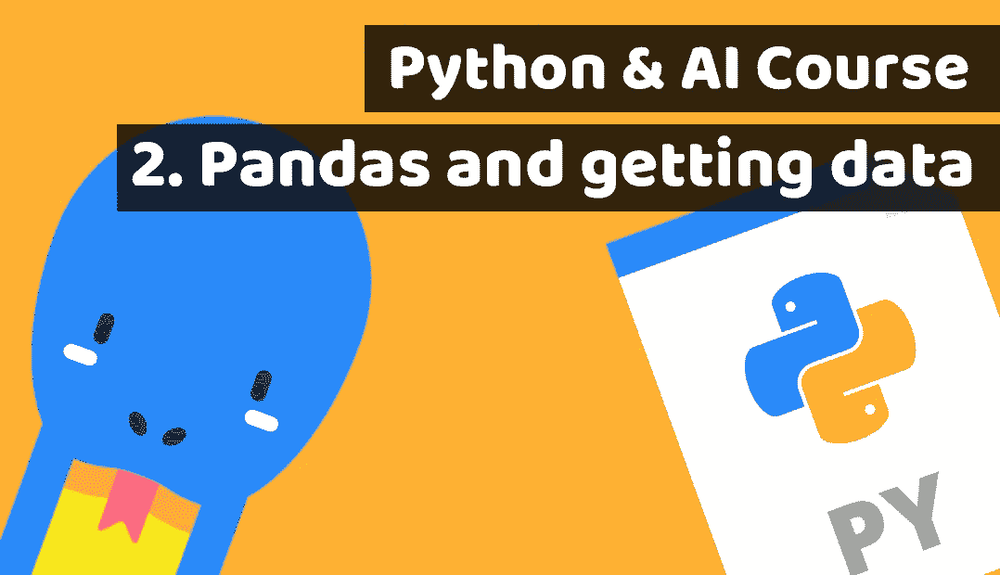

# 通过为金融科技构建投资人工智能来学习 Python 第 2 课:熊猫和获取股票价格

> 原文：<https://blog.devgenius.io/learn-python-by-building-investment-ai-for-fintech-lesson2-pandas-and-getting-stock-prices-46387b87b42e?source=collection_archive---------14----------------------->

## AI 的牛逼 Python 课程第二课！



Python 课程第 2 课:熊猫和获取数据

本文原载:
[https://www . blog . duomly . com/python-course-with-building-a-fin tech-investment-ai-lesson-2-pandas-and-get-financial-data](https://www.blog.duomly.com/python-course-with-building-a-fintech-investment-ai-lesson-2-pandas-and-getting-financial-data)

# 介绍

欢迎来到面向人工智能的精彩 Python 课程的第二课！

在上一课中，我们构建了第一个数据库迁移并完成了项目设置。

以下是网址:

[构建金融科技投资人工智能的 Python 课程——第 1 课:启动项目](https://www.blog.duomly.com/python-course-with-building-a-fintech-investment-ai-lesson-1-start-the-project/)

今天，我们将构建超级令人兴奋的东西，并将重点放在金融数据库上，我们稍后将使用它来训练我们的 AI。

我们将与熊猫，一些金融插件，并将做一点重构。

同样，我将教您如何用 Python 创建 CLI 命令。

我等不及要教你所有这些强大的技能，所以让我们尽快开始吧！

如果你喜欢视频，这是 youtube 的版本:

Python 课程第 2 课:如何使用 Pandas 并获取财务数据

# 1.迁移中的更改类型

在上一期中，我们创建了一些类型的数据库迁移和数据库模型。

今天，我们将对它们进行一些修改，以便能够使用小数点后有许多数字的价格。

为此，我们只需将变量“date”中的类型改为“db”。日期()”。

接下来，我们需要将所有整数改为“db”。Numeric()”。

看看下面的例子。

```
id = db.Column(db.Integer, primary_key=True)company = db.Column(db.String())date = db.Column(db.Date())openPrice = db.Column(db.Numeric())highPrice = db.Column(db.Numeric())lowPrice = db.Column(db.Numeric())closePrice = db.Column(db.Numeric())volume = db.Column(db.Numeric())
```

# 2.删除迁移文件夹并再次迁移

现在，我们应该保存我们的更改并用新的更改更新数据库。

我会建议从头开始 DB。

作为第一步，您需要删除“migrations”目录(如果您在上一课中创建了该目录)。

接下来，打开终端并键入:

```
flask db init
```

接下来:

```
flask db migrate
```

接下来:

```
flask db migrate
```

# 3.创建模块价格

太好了！

我们现在可以专注于接下来的功能，并进入价格模块。

让我们首先创建名为“prices”的目录。

在文件夹根目录下创建目录。

接下来，进入创建的目录，创建名为“prices.py”的文件。

## 4.安装必要的依赖项

在我们进入适当的开发之前，我们应该记住安装我们将用于构建 AI 的所有必要的依赖项。

首先，我们需要创建 yfinance，这将帮助我们连接金融 API，并下载所有必要的价格数据。

打开终端并键入:

```
pip install yfinance
```

接下来，我们需要安装熊猫:

```
pip install yfinance
```

我们需要安装的最后一个是 pandas datareader，我们将使用它来处理我们的财务数据:

```
pip install pandas_datareader
```

# 5.导入所有必要的依赖项

所以，我们已经准备好了开发所需的所有必要材料。

现在，我们可以进入 prices.py 文件，并导入所有这些依赖项。

让我们看看下面的例子:

```
from datetime import date, timedeltaimport yfinance as yfimport pandas as pdfrom pandas_datareader import data as pdrfrom app import app, dbfrom models.prices import PriceModel
```

# 6.用熊猫取代金融

接下来，我们需要用熊猫来覆盖 yfinance。

该行代码应该在 prices.py 文件中的 imports 下面。

```
yf.pdr_override()
```

# 7.设置 CLI

我们可以像在 golang 中那样，通过输入/注释函数来实现。

但是如果我们没有使用 flask 的用户友好特性，那就太可惜了。

我们可以非常非常容易地定义 CLI 命令。

使用“app”装饰器并定义应该触发命令定义下面的逻辑的命令就足够了。

让我们来看看:

```
@app.cli.command("get-prices")
```

# 8.创建函数 getPrices

在 CLI 命令下面，我们需要指定一个我们想要触发的函数。

在这种情况下，我们需要一个名为“getPrices”的函数。

我们将用它来开始获取价格。

```
@app.cli.command("get-prices")def getPrices():
```

# 9.创建一个我们需要监控的股票列表

下一步，我们应该指定我们希望获得定价的公司符号。

我们应该创建一个列表，把所有的纳斯达克符号作为字符串放在那里。

我使用了纳斯达克最重的 50 种股票，但是你可以指定任何你想得到数据的公司。

```
stockList = ['MSFT', 'AAPL', 'AMZN', 'FB', 'GOOGL', 'GOOG', 'GOOGL', 'INTC', 'NVDA', 'CSCO', 'ADBE', 'NFLX', 'PEP', 'PYP', 'CMCSA', 'TSLA', 'COST', 'GOOGL', 'AMGN', 'TMUS', 'AVGO', 'CHTR', 'TXN', 'GILD', 'QCOM', 'SBUX', 'INTU', 'MDLZ', 'VRTX', 'FISV', 'BKNG', 'ISRG', 'REGN', 'ADP', 'AMD', 'ATVI', 'CSX', 'BIIB', 'ILMN', 'MU', 'AMAT', 'JD', 'ADSK', 'MELI', 'ADI', 'LRCX', 'MNST', 'WBA', 'EXC', 'KHC', 'LULU', 'EA']
```

# 10.遍历股票列表并调用函数 getPrice

在这一步中，我们应该将所有的 NASDAQ 符号放入 for 循环中进行迭代。

对于股票的每次迭代，我们应该调用名为“getPrice”的函数，并将“stock”作为参数传递。

```
for stock in stockList: getPrice(stock)
```

# 11.创建函数 getPrice

要有使用它的可能性，我们需要创建函数“getPrice”。

将“股票”设置为函数中的参数名称。

```
def getPrice(stock):
```

# 12.设置日期

现在，我们可以开始关注我们今天感兴趣的核心功能，获取数据。

作为第一步，我们需要指定感兴趣的日期范围。

我将把今天设定为最后一天，31 天前的那一天，将是我的股票价格时间范围。

```
today = date.today()monthAgo = today - timedelta(days=31)
```

# 13.下载股票价格

下一步，我们可以开始获取数据了！

看看下面的例子。我们使用 pandas_datareader。

接下来，我设置了我想要的股票，开始日期和结束日期都是今天。

```
data = pdr.get_data_yahoo(stock, start=monthAgo, end=today)
```

# 14.熊猫重新格式化数据

为了有更好的生活和更容易的数据操作，我们需要重新格式化一点。

所以我们可以更轻松地遍历这些数据。

```
df = pd.DataFrame(data)
```

# 15.遍历所有行，并将数据传递给函数 addPrice

现在我们可以迭代 xx 公司的所有价格。

我们在这里使用“df.iterrows()”方法，因为所有的行都来自熊猫。

接下来，我们调用“addPrice ”,并传递必要的数据作为参数。

我们传递整个“行”,稍后我们将对其进行拆分，接下来我们传递 index(这里是数据),但是是格式化的。

我们通过“股票”来知道股票的价格。

```
for index, row in df.iterrows(): addPrice(row, index.strftime("%Y-%m-%d"), stock)
```

# 16.创建函数 addPrice

为了使使用“addPrice”成为可能，我们需要定义这个函数。

使用“价格”、“日期”和“库存”作为参数。

```
def addPrice(price, date, stock):
```

# 17.设置价格模型的数据

我们接近决赛了。

在这一步中，我们应该设置从财务 API 获得的数据。

我们需要将它与我们在 Python 课程第 1 课中创建的价格模型相匹配。

```
new_price = PriceModel(date=date, company=stock, openPrice=price['Open'], highPrice=price['High'], lowPrice=price['Low'], closePrice=price['Close'], volume=price[‚Volume'])
```

# 18.将价格添加到数据库

如果我们的数据准备好了，除了在数据库中创建一个新记录之外，我们没有其他事情要做。

不要忘记“db.session.commit()”，它将更新我们的数据库。

```
db.session.add(new_price)db.session.commit()
```

# 19.在 app.py 中导入 getPrices

恭喜你！

价格模块现在已经准备好了。可以在 app.py 里面导入。

将这行代码添加到“PriceModel”导入下面。

```
from prices.prices import getPrices
```

# 20.运行获取价格

您现在可以测试您的应用程序了。

在开始之前，请确保 flask app 变量配置正确(我们在第 1 课中已经这样做了)。

如果是，只需在项目中打开一个终端并键入:

```
flask get-prices
```

# 结论

恭喜你！

现在你的项目有数百条财务记录。

这些人已经准备好开始与人工智能合作，我们将建造人工智能。

更重要的是，你已经学会了在哪里寻找股票价格，如何选择它们，以及如何将它们保存到数据库中。

Python 课程第 2 课的代码库在这里:

[https://github . com/Duomly/Python-AI-investment-fin tech/tree/Python-AI-course-Lesson-2](https://github.com/Duomly/python-ai-investment-fintech/tree/Python-AI-course-Lesson-2)

在下一课中，我们将专注于为我们的算法构建第一个 AI 逻辑。

继续学习，我超级兴奋我有机会教你如何建立强大的投资人工智能，可以预测股票价格！


[编程课程在线](https://www.duomly.com)

感谢阅读，

Duomly 的 Radek