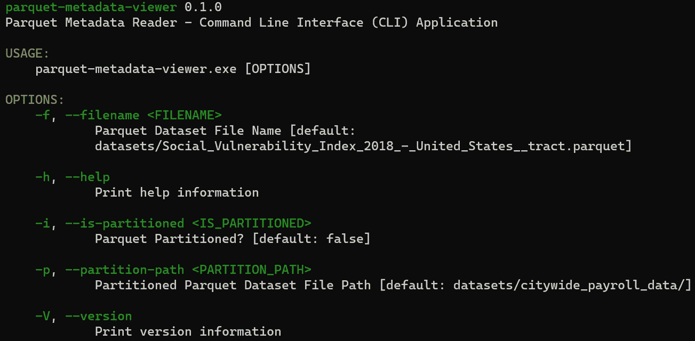

# 通过开发应用程序了解 Rust:Apache Parquet 数据集元数据查看器

> 原文：<https://blog.devgenius.io/learn-rust-by-developing-application-apache-parquet-dataset-metadata-viewer-d96f12d06ff?source=collection_archive---------4----------------------->

## 如何使用 Rust 查看 Apache Parquet 数据集元数据

我总是发现，当学习一门编程语言时，从头开始开发一个应用程序是很有帮助的，一步一步来。甚至在你完成了 Rust 编程语言的书之后，你可能会对从哪里开始感到困惑。本教程假设您在开始开发一个简单的命令行界面(CLI)应用程序来显示 Apache Parquet 数据集的元数据之前，已经浏览过这本书。

您可能会问——我们为什么需要这样的应用程序？我们需要这个应用程序有两个原因:

*   Apache Parquet 数据集嵌入了包含有用信息的元数据，比如记录的数量、数值的最小值/最大值、不同值的数量、空值的数量等。
*   我们需要快速查看多个数据集的元数据，而不需要通过编程方式打开数据集或使用一些企业级应用程序来查看数据集，这需要时间，具体取决于数据集的大小。此外，Rust 创建了一个独立的可执行文件，您可以在任何地方运行它，而不需要麻烦的运行时要求——例如 python。

请注意，我们并没有试图使用 Rust 来读取数据集中的记录，因为如果需要的话，这将在另一篇文章中讨论。不过，我不认为有这个必要。

在开始撰写文章之前，让我们先做一些内务处理，提供一个到 GitHub 资源库的链接，在那里可以找到所有源代码= >【https://github.com/sungkim11/parquet-metadata-viewer】T2。此外，我想向您展示您将使用 Rust 开发什么应用程序，如下所示。



# 技术

## 阿帕奇拼花地板

Apache Parquet 是一种开源的、面向列的数据文件格式，旨在实现高效的数据存储和检索。它提供了高效的数据压缩和编码方案，增强了批量处理复杂数据的性能。根据 [Apache Parquet 网站](https://parquet.apache.org/)，Parquet 有多种语言版本，包括 Java、C++、Python 等。

## 锈板条箱拼花地板

这个箱子包含了官方的本地 Rust 实现 [Apache Parquet](https://parquet.apache.org/) ，它是 [Apache Arrow](https://arrow.apache.org/) 项目的一部分。板条箱的文件位于[这里](https://docs.rs/parquet/latest/parquet/index.html)。

## 拼花元数据

拼花数据集的元数据位于 [parquet::file::metadata](https://docs.rs/parquet/latest/parquet/file/metadata/index.html) 下。具体来说，元数据包含在以下子模块中:

*   [**FileMetaData**](https://docs.rs/parquet/latest/parquet/file/metadata/struct.FileMetaData.html) :既包括列名，也包括列数据类型，还包括多条记录或多行数据。
*   [**RowGroupMetaData**](https://docs.rs/parquet/latest/parquet/file/metadata/struct.RowGroupMetaData.html) :包含一列的统计信息，如最小值、最大值、相异值个数、空值个数等。

我们将使用 parquet::file::metadata::file metadata 和 parquet::file::metadata::rowgroup metadata 来派生 parquet 数据集元数据，因此我们可以查看它们。

如果您想简单地打印出所有内容，[parquet::schema::printer](https://docs.rs/parquet/latest/parquet/schema/printer/index.html)提供了打印 Parquet 文件模式和列表文件元数据的方法。

# 先决条件

## Apache 拼花数据集

我们将使用以 Apache Parquet 格式保存的两个数据集。

*   **单个文件 Apache Parquet 数据集**:社会脆弱性指数— 2018(该数据集位于 GitHub 存储库中，这篇 medium.com 文章提供了该数据集的详细解释= > [使用 Apache Parquet 创建数据集](https://sungkim11.medium.com/create-dataset-using-apache-parquet-3701ec3784a9)。)
*   **分区的 Apache Parquet 数据集**:纽约市范围内的工资数据——从 2014 年到 2020 年(该数据集在 GitHub repository 上，这篇 medium.com 的文章提供了对该数据集的详细解释= > [使用 Apache Parquet 的分区数据集](https://medium.com/geekculture/partition-dataset-using-apache-parquet-64183bf571ac)。)

## 铁锈板条箱

在我们开始开发应用程序之前，我们需要添加三个 Rust 板条箱:

*   Clap:它是 Rust 的命令行参数解析器。他们的 crates.io 网址是[https://crates.io/crates/clap](https://crates.io/crates/clap)。Clap 用于开发命令行界面应用程序。
*   Glob:它支持根据 Unix shell 风格的模式匹配文件路径。他们的 crates.io 网址是[https://crates.io/crates/glob](https://crates.io/crates/glob)。Glob 用于查找分区 Apache 拼花数据集的所有拼花文件。
*   Parquet:这个板条箱包含 Apache Parquet 的官方本地 Rust 实现，它是 Apache Arrow 项目的一部分。他们的 crates.io 网址是[https://crates.io/crates/parquet](https://crates.io/crates/parquet)。拼花用于查看拼花数据集元数据。

最后，Cargo.toml 被修改为包括如下四个板条箱:

```
[package]
name = "rust-parquet"
version = "0.1.0"
edition = "2021"# See more keys and their definitions at [https://doc.rust-lang.org/cargo/reference/manifest.html](https://doc.rust-lang.org/cargo/reference/manifest.html)[dependencies]
clap = { version = "3.1.2", features = ["derive"] }
glob = "0.3.0"
parquet = "11.0.0"
```

# 课程

在本文中，我们将开发一个简单的应用程序，然后在该应用程序的基础上添加其他功能:

*   第 1 课:简单拼花数据集元数据查看器
*   第 2 课:简单分区镶木地板数据集元数据查看器

## 第 1 课:简单拼花数据集元数据查看器

我们将开发一个简单的应用程序来查看 Apache Parquet 格式的数据集的元数据。

**添加命令行界面**

Clap 有一个构建器 API，它利用 struct 上的属性来构建命令行界面。下面的结构添加了一个参数:

*   文件名

**读取拼花数据集**

在查看拼花数据集元数据之前，我们需要读取拼花数据集。我们将使用[parquet](https://docs.rs/parquet/latest/parquet/index.html):[文件](https://docs.rs/parquet/latest/parquet/file/index.html) :: [阅读器](https://docs.rs/parquet/latest/parquet/file/reader/index.html#)来读取文件。

**读取拼花数据集列**

在读取拼花数据集后，我们将遍历数据集中的所有字段，以获得以下元数据:

*   列名
*   列数据类型
*   列统计信息(最小值、最大值、不同值的数量和空值的数量)

**打印出元数据**

最后，我们打印出拼花数据集元数据。

**完成代码**

名为“parquet_metadata_viewer_2.rs”的完整代码可以在 GitHub repository([https://github.com/sungkim11/parquet-metadata-viewer](https://github.com/sungkim11/parquet-metadata-viewer))上找到。

## 第 2 课:简单分区镶木地板数据集元数据查看器

在上一课中，我们显示了由单个文件组成的拼花数据集的元数据。在本课中，我们将显示分区拼花数据集的元数据。

**扩展命令行界面(CLI)**

我们将使用 Clap，它有一个构建器 API，利用结构上的属性来构建命令行接口。下面的结构添加了三个参数:

*   文件名
*   分区路径
*   已分区

**读取分区拼花数据集**

我们将使用 glob crate 列出指定路径下的所有拼花数据集。我们将遍历所有拼花数据集来读取拼花数据集。

**读取拼花数据集列**

在读取拼花数据集后，我们将遍历数据集中的所有字段，以获得以下元数据:

*   列名
*   列数据类型
*   列统计信息(最小值、最大值、不同值的数量和空值的数量)

**打印出元数据**

最后，我们打印出拼花数据集元数据。

**完成代码**

名为“parquet_metadata_viewer_4.rs”的完整代码可以在 GitHub repository([https://github.com/sungkim11/parquet-metadata-viewer](https://github.com/sungkim11/parquet-metadata-viewer))上找到。

本课尚未完成。我们将利用 struct 来整合和聚集来自分区拼花数据集的所有统计数据，以显示所有分区拼花数据集文件的单个视图，而不是多个视图。

# 资源

撰写本文时使用了以下参考资料:

*   Collin 的注释— [有效地从 Rust](https://colinsblog.net/2021-07-27-reading-parquet-with-rust/) 中访问 Parquet 格式的数据。
*   [锈板条箱拼花地板文件](https://docs.rs/parquet/11.1.0/parquet/index.html)
*   [Apache Arrow 的正式 Rust 实现](https://github.com/apache/arrow-rs)

**我希望这篇文章对你有帮助！如果您有任何问题或意见，请在此提供。**