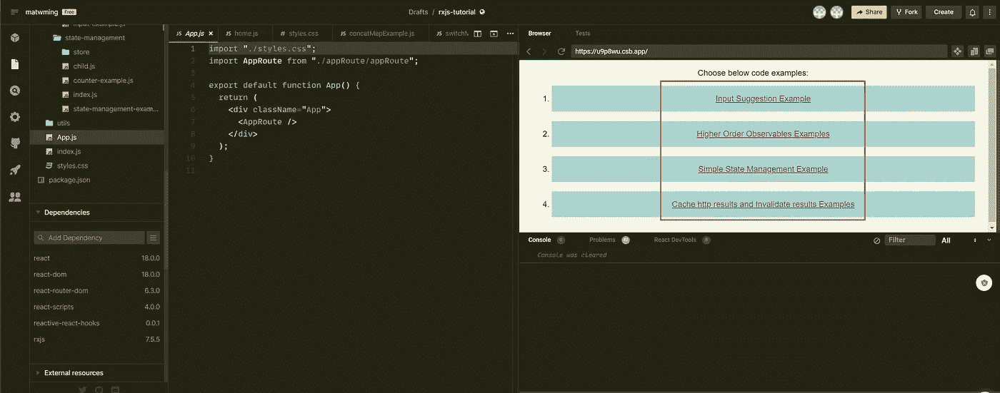
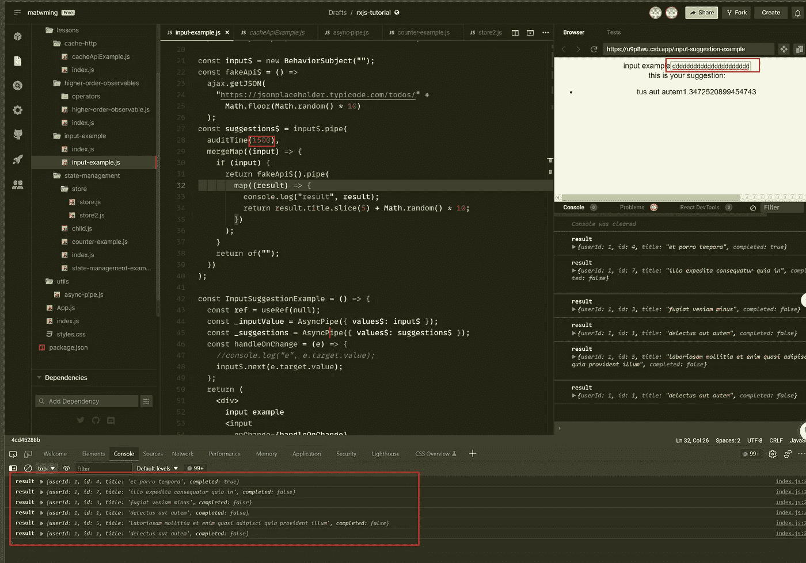
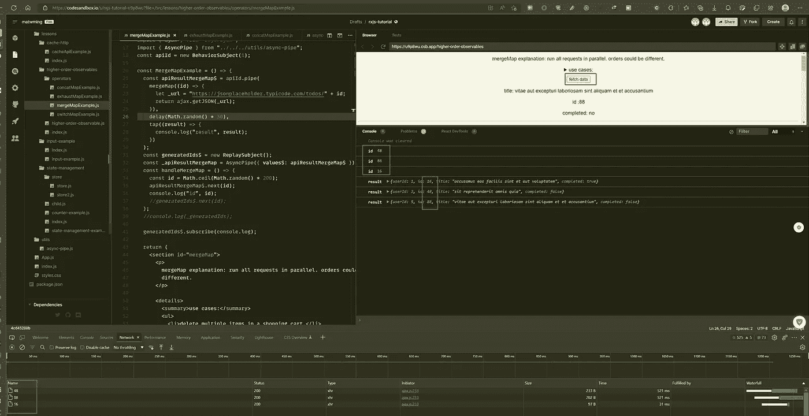
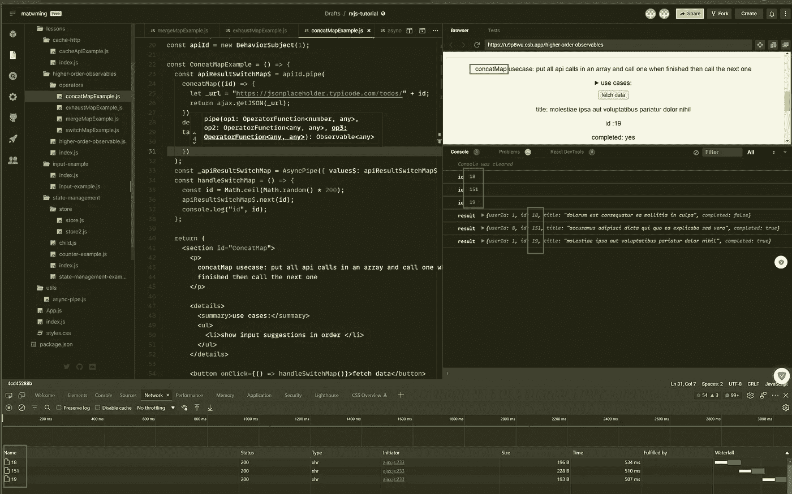
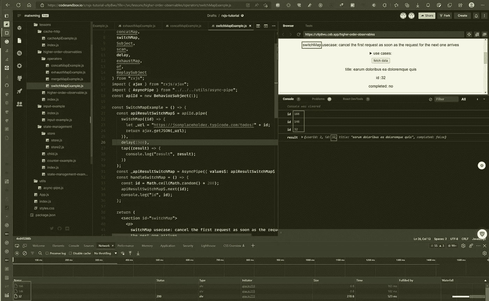
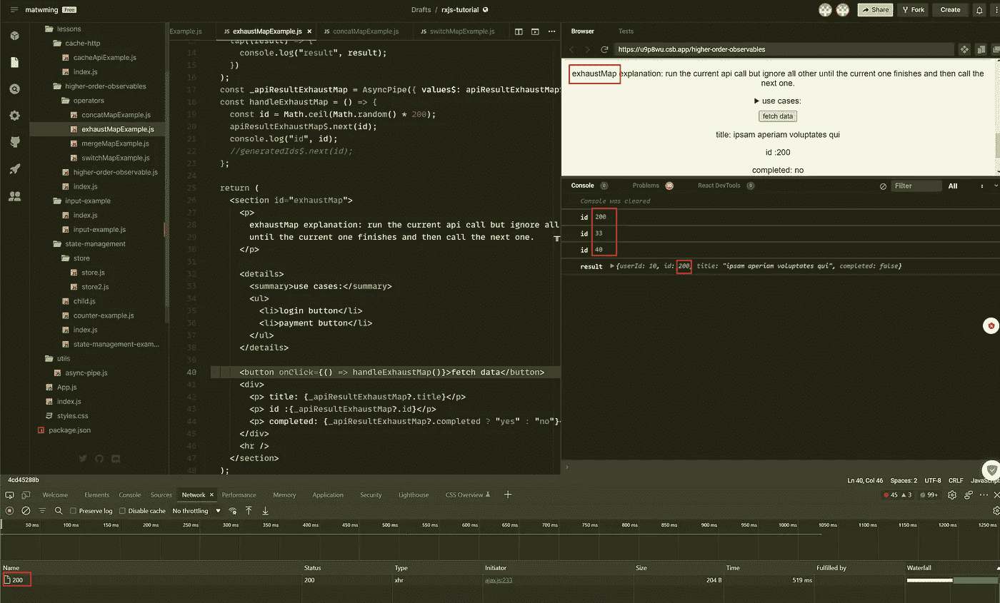
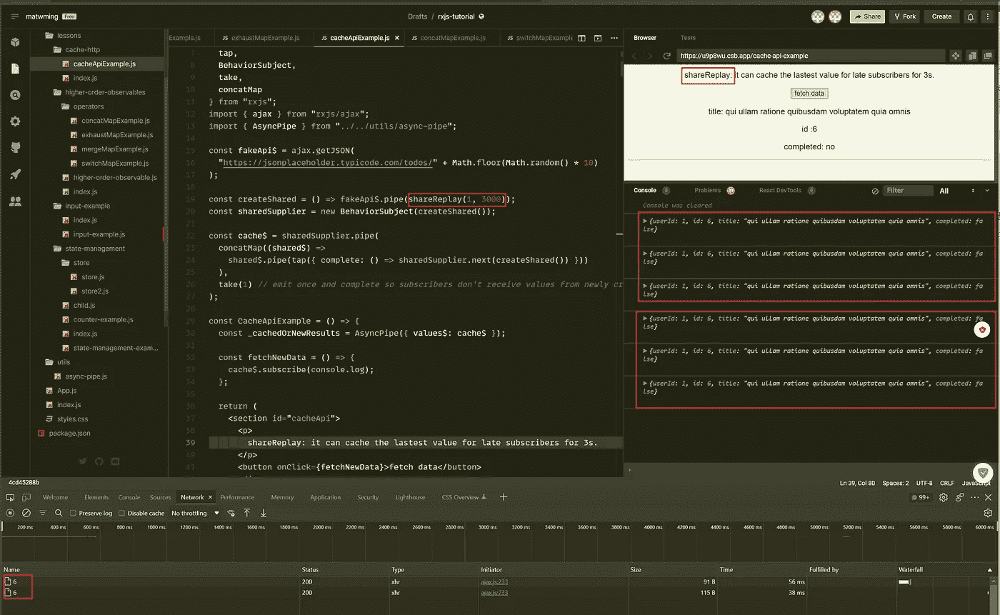
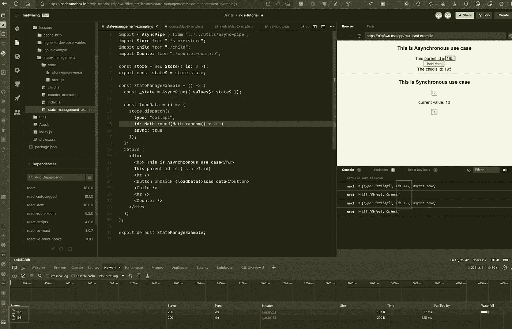
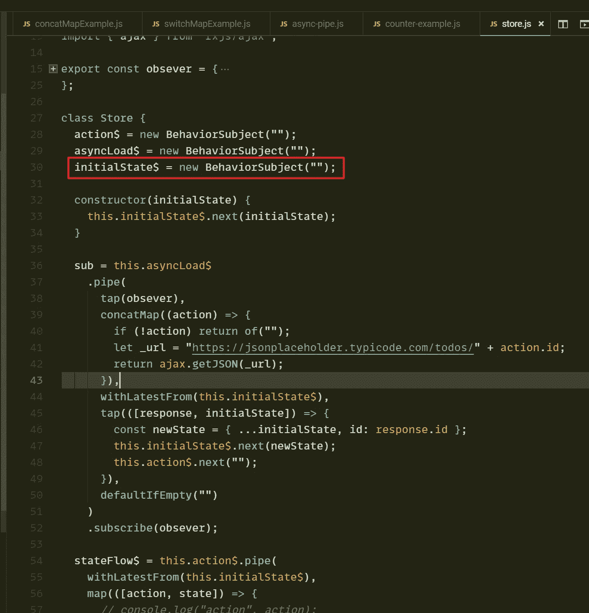
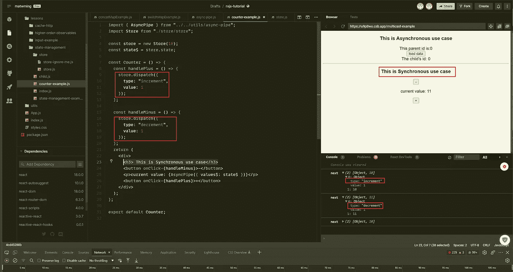

# 用简单的方法学习 rxjs

> 原文：<https://blog.devgenius.io/learn-rxjs-in-an-easy-way-8008f291ef8f?source=collection_archive---------1----------------------->

与面向对象编程(状态和行为被耦合到一个对象中)不同，反应式编程是一种不同的编程思维方式。它专注于以纯功能的方式对变化做出反应。

如果你曾经使用过 excel，你就会知道**反应**是什么意思。在 excel 中，如果一个单元格发生变化，那么与该单元格相关的其他单元格也会发生变化。

而 rxjs 只是用 JavaScript 实现的反应式编程。对于 java，有 rxjava 或者 reactor。因为。网，还有 rx.net。请参考本页了解更多关于其他语言的反应式编程实现的信息([react vex—语言](https://reactivex.io/languages.html))。

rxjs 中有两个主要概念:

1.  **观察者**:有三个键值对的对象。关键字是错误/完成/下一个，值只是一个函数
2.  可观察的(observable):在观察者和数据生产者之间充当桥梁的功能

在我们更多地谈论 rxjs 之前，我想列出一些我们每天都会遇到的常见问题，然后我将向您展示 rxjs 是如何用神奇的运算符和可观测量解决这些问题的。

**问题 1:** 如果有一个输入框，每次用户输入东西，就会触发一个 api 调用从后端获取数据。如何限制 api 调用的速率？

**问题 2:** 在同一个场景中，在我们实现了 api 速率限制之后，我们仍然可以收到大量的 api 请求。我们如何安排这些 api 调用呢？你想要

1.  并行执行这些调用，但可能会丢失 API 调用的顺序。
2.  把电话排成一列，一个一个地打，同时仍然保持原来的顺序？
3.  取消第一个 api 调用，如果它没有完成，并立即调用下一个？
4.  调用第一个，但忽略所有传入的请求，直到第一个 api 调用完成？

**问题 3:** 有一个 api 调用返回一些不经常更新的数据。如何缓存 api 结果，如何使缓存失效？

**问题 4:** 我如何在组件之间共享状态(没有 react 上下文)？

代码示例在这里:[rxjs-tutorial—code sandbox](https://codesandbox.io/s/rxjs-tutorial-u9p8wu?file=/src/App.js)

rxjs 在 angular 很受欢迎。但是这个代码示例是将 rxjs 与 react 一起使用。我只想证明 rxjs 可以很好地处理除 angular 之外的 UI 层。有四页。请点击您感兴趣的页面，或者按照这个简单的指南进行操作。

问题 1 的解决方案:

***问题一:*** *如果有一个输入框，用户每次输入东西，就会触发一个 api 调用从后端获取数据。如何限制 api 调用的速率？*

在 rxjs 中，一切都用流表示，并由操作符操作。当我们谈论限制用户打字时的通话速率时，我们通常会有这样的要求:

1.  在用户停止输入 1.5s 后，我们认为用户的输入现在是稳定的。这是调用 api 并显示建议的好机会
2.  当用户输入时(并且没有停止输入)，我们仍然希望每隔几秒钟显示一次建议，以获得更好的用户体验

rxjs 在处理时间的时候特别好。在这个场景中，我们将使用 auditTime。去抖时间只适用于第一个标准。如果用户继续输入。没有机会发出最后一个值，因为在用户停止 1.5s 之前没有最后一个值。随着用户不断发出值，auditTime 将启用和禁用其内部计时器。所以 auditTime 总能在 1.5s 内发出最后一个可用的值。

使用审计时间运算符的输入示例

下面是示例代码:[rxjs-tutorial—code sandbox](https://codesandbox.io/s/rxjs-tutorial-u9p8wu?file=/src/lessons/input-example/input-example.js)

如果你不断地在输入框中输入东西，它每隔 1.5 秒就会发出值并调用 api。

问题 2 的解决方案:

***问题二:*** *在同样的场景下，我们实现了 api 速率限制后，仍然可以收到一堆 api 请求。我们如何安排这些 api 调用呢？*

在上面的例子中，您可能已经注意到除了 auditTime 操作符之外。还使用了 concatMap 运算符。这是我们在处理多个 http 请求时可以使用的策略之一。concatMap 意味着我们按顺序调用这些 API。如果第一个完成了，我们调用下一个。

处理多个 http 调用时有四种策略。这些算符是高阶可观测量。他们返回可观的。

请在此查看代码示例:[rxjs-tutorial—code sandbox](https://codesandbox.io/s/rxjs-tutorial-u9p8wu?file=/src/lessons/higher-order-observables/higher-order-observable.js)

1.  **mergeMap:** 并行执行这些调用，但是我们可能会丢失 API 调用的顺序:

合并地图示例

在这个 mergeMap 示例中，如果在短时间内单击按钮三次，代码将尝试并行调用三个 API。这些用户 id 是 48、88 和 16。但是结果以不同的顺序返回。用户 id 16 首先返回，然后是 48 和 88。

用例可能是:

a.删除购物车中的购物项目

**2。concatMap:** 将调用放在一个队列中，一个接一个地调用，同时仍然保持原来的顺序

concatMap 示例

在这个 concatMap 示例中，如果我们快速单击按钮三次，您会发现 api 结果总是有序的。在 network 选项卡中，调用用户 id 18，并等待它完成。然后调用用户 id 151，并等待它完成。用户 id 19 是最后一个被调用的。

**3。switchMap:** 如果第一个 api 调用没有完成，就取消它，并立即调用下一个

开关图示例

在这个 switchMap 示例中，如果我们快速点击按钮三次，您将发现前两个 API 被调用，但随后被取消。只有最后一个被调用并返回结果。

**4。调用第一个，但是忽略所有传入的请求，直到第一个 api 调用完成**

穷举搜索测试

在这个 exhaustMap 示例中，如果我们快速单击按钮三次，您会发现只调用了第一个 api。其余被忽略。原因是当我们点击并触发最后两个 api 调用时，第一个 api 调用还没有完成。它选择忽略它们。

问题 3 的解决方案:

***问题 3:*** *有一个 api 调用返回一些更新不是很频繁的数据。如何缓存 api 结果，如何使缓存失效？*

shareReplay 操作符可以帮助我们缓存 http 结果，这取决于我们传递给它的配置。它在内部使用另一个操作符 ReplaySubject 来实现缓存。

shareReplay 是 share 的变体。shareReplay 接受配置。首先是我们应该缓存多少值。第二个问题是我们应该将它们缓存多长时间。

请在此查看代码示例:[rxjs-tutorial—code sandbox](https://codesandbox.io/s/rxjs-tutorial-u9p8wu?file=/src/lessons/cache-http/cacheApiExample.js)

在下面的例子中，我们想要缓存 3s 的最新值，这意味着在前 3s 中，任何 api 调用都从缓存中返回该值。3s 后，如果再调用 api，会直接调用 api，再缓存 3s。

缓存 3s 的 http 结果

在这个例子中，我点击了一次“获取”按钮，并立即在 3s 中点击了两次。3s 后，我点击按钮获取新数据，之后又点击了两次。从控制台和网络选项卡中，您应该看到只有两个 api 调用。当缓存仍然处于活动状态时，任何 api 调用都会从缓存中返回值。

问题 4 的解决方案:

***问题 4:*** *如何在组件之间共享状态(没有 react 上下文)？*

Subject observable 允许我们创建一个同时向多个侦听器传递值的 observable。它有一些变体，如 BehaviourSubject、ReplaySubject 和 AsyncSubject。根据需求，我发现 BehaviourSubject 适合帮助我们在组件之间共享状态。

使用行为主体共享状态

我们先来看看这里的异步用例:[rxjs-tutorial—code sandbox](https://codesandbox.io/s/rxjs-tutorial-u9p8wu?file=/src/lessons/state-management/state-management-example.js)。每次点击“加载按钮”时。它分派一个动作，调用一个 api，然后更新状态。父节点和子节点都订阅该状态。

当我们初始化存储的新实例时，初始状态是一个行为主体。一旦组件开始监听它，initialStates 的新更新将把值推送给订阅者。

这里是同步用例的 ame:[rxjs-tutorial—code sandbox](https://codesandbox.io/s/rxjs-tutorial-u9p8wu?file=/src/lessons/state-management/counter-example.js:405-443)

订阅状态的组件只需要分派一个动作。该操作将更新状态。

使用 rxjs 的其他优势:

1.  在 angular 中，我们可以使用 rxjs 利用 angular 的 onPush 变化检测。我们将运行更少的变化检测，从而使应用程序更快。
2.  当数据处理器将值推送到数据流时，状态和时间变量也被合并到数据流中。它不容易出错。

**安慰:**

我们讨论了:

1.  与时间相关的运算符，如 auditTime 和 debounceTime
2.  高阶可观测量:开关映射、串联映射、合并映射和穷举映射
3.  缓存操作符和可观察 like: shareReplay 和 ReplaySubject
4.  多案例观察:主体、重放主体和行为主体