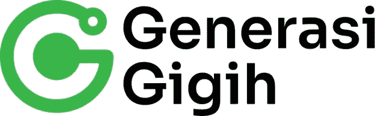
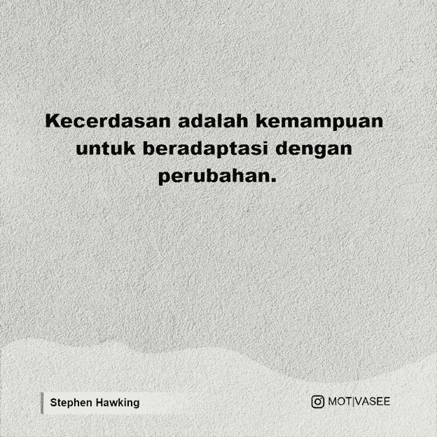
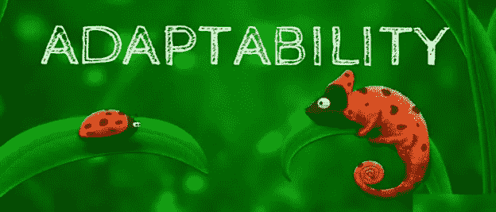

# 从校园中学习软件开发与从基于工业的

> 原文：<https://blog.devgenius.io/learn-software-development-from-campus-vs-learn-software-development-from-industrial-based-8822646f82a0?source=collection_archive---------18----------------------->

资料来源:qnp.co.id

大家好，让我自我介绍一下，我叫阿贡·普拉博沃，是新加坡卡拉旺大学信息工程专业第八学期的学生。我目前正在参加 Gigih 2.0 计划，这是一个由 Anak Bangsa Bisa 基金会发起的计划，该基金会是印度尼西亚最大的技术公司之一 Goto 的附属机构。在这篇文章中，我将告诉你一些我目前正在经历的挑战和变化。

资料来源:anakbangsabisa.org

我先说斯蒂芬·霍金的一句话，“智力是适应变化的能力。”没错，确实在这个瞬息万变的时代，我们作为人类当然要能够拥有随时代变迁而动的能力。尤其是对于我这个身处技术世界的人来说，目前技术的发展和变化非常快，甚至我们目前在校园里学习的一个领域，也可能不再用于工业世界。这就是我正在经历的。

资料来源:motivasee.com

2022 年 1 月初，我得到了一份工作邀请，成为位于 Bekasi 的一家小软件公司的全栈工程师。在那份工作中，我可以兼职工作，工作时间为 20 小时/周。我不假思索地立即同意了，并按照招聘流程进行，直到我最终被录取，起初我认为提供的工作很容易，也不太难。当时我对自己很有信心，因为碰巧在 SMK 的时候我主修软件工程，然后在大学里我也主修信息工程。然而，在第一周，我发现有很多东西我不知道，很多在工作中使用的东西我在大学期间从未做过或学过。当然，这足以让我一开始就情绪低落，我非常担心自己无法尽最大努力，也无法为公司做出重大贡献。

第一周的开始对我来说太难了，就像我在 SMK 直到上大学期间学到的东西毫无用处，不能在工作中使用。碰巧的是，我得到这份工作的地方正在进行一个 NFT 市场项目，所以正在进行的是关于 WEB3.0 到区块链的项目，这是一个新事物，最近出现在技术世界中。第一周我甚至想过辞职。但从这次经历中，我意识到一件事，我选择的工作领域是一个不断变化的工作领域，不仅在变化，而且变化得更快。

资料来源:skills-focus.org

在第一周担心完自己的能力后，接下来的一周，我开始制定计划，这样我所拥有的技能就不仅仅是这些了，而且我也可以很好地度过难关。

*   首先，我开始坚定我的心灵，相信我能经历这一切
*   然后我列出清单，计划我需要做什么，我学习，这样我就能掌握它
*   接下来的事情是，我开始习惯我的好奇心，并询问其他人或那些更好理解我的人是否有问题
*   其次是永不放弃，当然凡事总有第一次，通常我们做的第一件事结果不太好，当然我们必须习惯它，也要接受批评或意见，这样我们将来做的结果会更好。

当然，做到这一点并不容易，需要一致性。但从那以后，我意识到良好的适应性的重要性，简单地说，我学会了如何学习，我也没有因为我的教育背景是 IT 专业而满足于我目前的能力。希望这能继续让我成长得更好。

这篇文章是从我的个人经历和我如何处理变化以使我能够继续适应和继续成长的一点分享，我希望这篇文章能对别人有用。欢迎在评论区讨论这个问题。

谢谢你