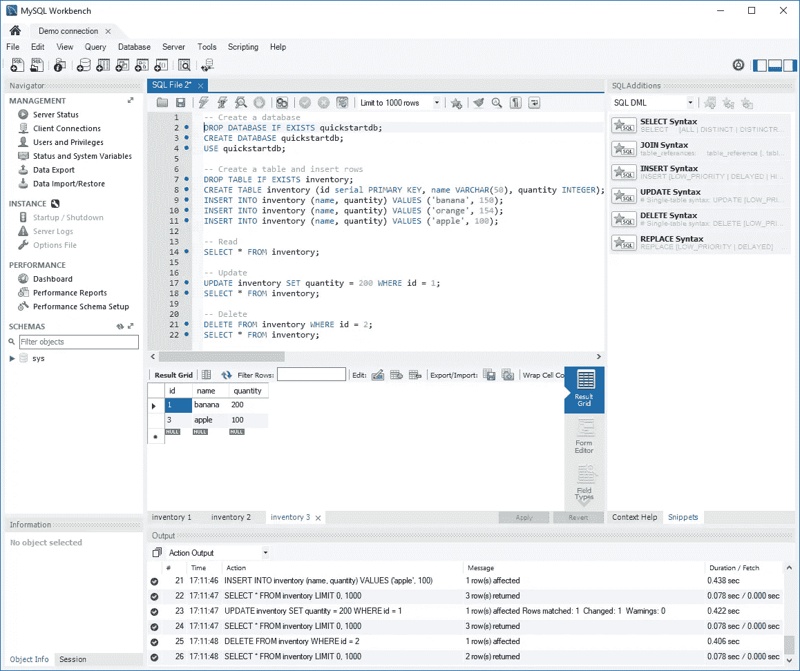
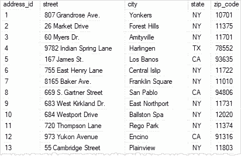
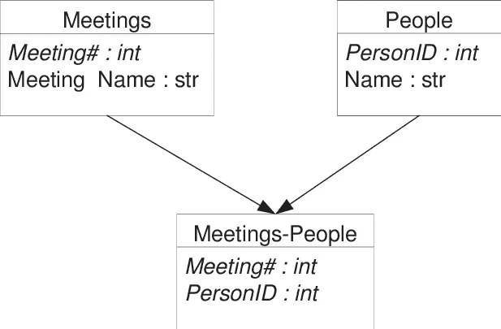

# 正确学习 SQL:基础知识

> 原文：<https://blog.devgenius.io/learn-sql-the-right-way-4aecadb8b054?source=collection_archive---------13----------------------->

# 学习成果

*   什么是 SQL
*   为什么使用 SQL
*   SQL 关键术语

# 介绍

SQL 命令易于阅读和学习。我认为学习 SQL 的正确方法不是记住 SQL 语法，而是真正理解 SQL 数据库是如何工作的。学习 SQL 语法需要时间和记忆，但学习数据库如何工作是另一个旅程。

# 什么是 SQL？

SQL 代表结构化查询语言。SQL 用于与数据库通信并执行任务，如更新数据或检索数据。

# 为什么使用 SQL？

最大的问题是我们为什么要使用 SQL？除了为数据库执行 CRUD 功能之外，SQL 数据库对于我们所说的关系数据也很有用。现在，考虑简单地相互关联的数据的关系数据。例如，我们可以有一个包含两个表的数据库，一个名为 dog owners，另一个名为 dogs。如您所见，这两个表是相互关联的。SQL 使用简单，可以与许多编程语言集成，包括你最喜欢的语言。就像我前面提到的 SQL 易于理解一样，它可以被技术人员和非技术人员使用，使数据对每个人都可读。

# SQL 关键术语

让我们以正确的方式开始学习 SQL。首先，让我们学习所有的行业术语。这有助于将来阅读不同的资源，也有助于了解 SQL 数据库是如何工作的。

## 关系型数据库管理系统

关系数据库管理系统:这基本上是一个用来可视化数据库的软件。我将在本文中使用的软件叫做 MySQL Workbench

## 关系

这只是餐桌的一种别出心裁的说法。所有表格都将包含一个我们将用来引用的名称。

## 实体

这是表格的行。每一行将包含一个不同的名称。表中的行数被称为**基数**

## 属性

这是表格的每一列。属性值将来自同一个**域，**对于那些有数学背景的人可能听说过域。对于有编程背景的人来说，可以把这看作是数据类型。域基本上是列的格式，例如一个名为电话号码的列只接受数字。

## 键

键是唯一的标识符；这些用于查找每个实体。主要的一个是主键，这是唯一标识实体的属性。例如，在学生数据库中，每个学生被分配一个学号，它们是许多不同类型的键，我将在后面的文章中介绍。

SQL 地址表示例

看着上面的例子，我们可以看到

*   该关系是一个地址表
*   基数是 13
*   总共有 5 个属性
*   address_id 是主键

## 关系模式

这基本上是表的概述。关系模式将向您显示所有属性及其属性域

## 关系

这是另一个值得在另一篇文章中讨论的话题。关系是指每个表如何相互关联。

看着上面的例子，我们可以看到

*   每个表的关系模式
*   表之间的关系

## 问题

查询是对数据库中信息的特定请求。当我们研究语法时，我们将对此进行更多的讨论。

# 摘要

*   专注于学习数据库实践，而不仅仅是学习语法
*   为什么使用 SQL
*   SQL 关键术语

暂时够了。

在第二部分中，我将详细介绍键，并看一些数据库中表的例子。

接下来:正确学习 SQL 第 2 部分:关键类型

*如果您喜欢，请点击👏所以其他人会在媒体上看到这个。欢迎任何反馈或意见。祝你今天开心！玩的开心！*

# 来源

 [## 快速入门:Connect-MySQL work bench-MySQL 的 Azure 数据库

### 适用于:Azure Database for MySQL -单服务器该快速入门演示了如何连接到 Azure 数据库…

docs.microsoft.com](https://docs.microsoft.com/en-us/azure/mysql/single-server/connect-workbench)  [## SQL Server INSERT INTO SELECT 实例

### 摘要:在本教程中，您将学习如何使用 SQL Server INSERT INTO SELECT 语句从其他数据库中添加数据

www.sqlservertutorial.net](https://www.sqlservertutorial.net/sql-server-basics/sql-server-insert-into-select/) 

[https://www . researchgate . net/figure/Portion-of-the-relational-schema-of-simple-example _ fig 24 _ 2860874](https://www.researchgate.net/figure/Portion-of-the-relational-schema-of-simple-example_fig24_2860874)