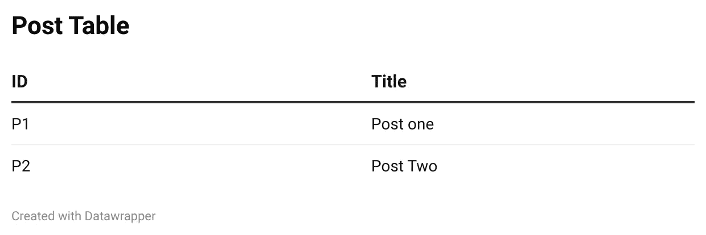
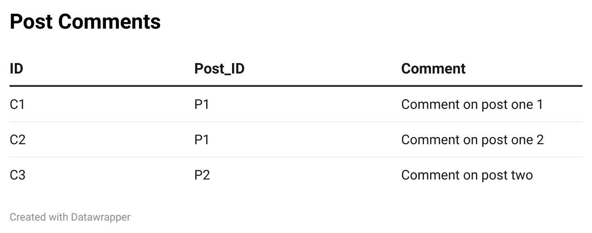
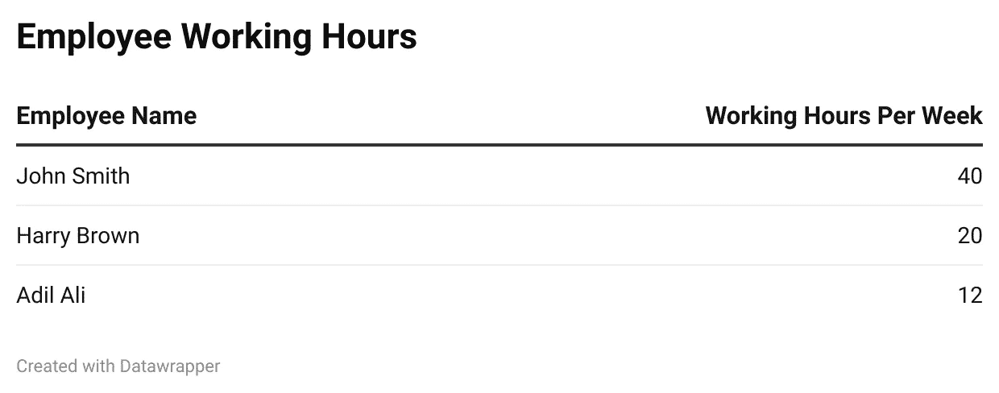
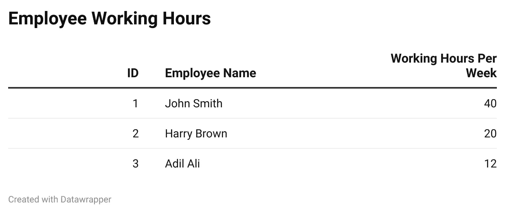

# 正确学习 SQL 第 2 部分:关键类型

> 原文：<https://blog.devgenius.io/learn-sql-the-right-way-part-2-key-types-52848fcca792?source=collection_archive---------21----------------------->

图片网址:[https://coding sight . com/WP-content/uploads/2021/02/ConfigureSQLJobs _ 878% D1 % 85700-copy-5-870 x600 . png](https://codingsight.com/wp-content/uploads/2021/02/ConfigureSQLJobs_878%D1%85700-copy-5-870x600.png)

# 学习成果

*   超级键
*   候选键
*   主键
*   备用关键字
*   复合/复合键
*   外键
*   代理键

# 键

在以正确的方式学习 SQL 的这一部分中，我们将重点关注您可以在表中找到的所有不同类型的键。我将假设你了解关于 SQL 表的基本关键术语，如果不放心，可以先检查一下第一部分**。**

# **超级键**

**超级键是指一个属性或一组属性用于唯一标识一个实体。换句话说，超级键是可以用作主键的所有可能的属性。**

**使用信息示例**

# **候选关键字**

**如果一个超级键的任何真子集是一个超级键，那么它不可能是一个候选键。那么，这意味着什么呢？**

**首先你需要明白什么是真子集，让我们先看看数学定义。**

> **注意:我推荐研究集合，因为这将有助于你的编程之旅。**

**假设我们有一组数字:**

*   **A = {1，3，5}**
*   **B = {1，3}**
*   **C = {1，2}**
*   **D = {1，3，5}**

**我们可以说 B 是 A 的真子集，这是因为 1 和 3 都在 A 中，但是 C 不是真子集，因为 2 不在 A 中，那么 D 呢？d 不是真子集；这是因为根据定义。集合的真子集不能等于集合本身。如你所见，真子集是指父集包含除一个子集之外的所有子集。**

**让我们回头看看我们的桌子**

**使用信息示例**

**让我们列出一些超级键:**

*   **{希德，里德，电子邮件}**
*   **{SID，电子邮件}**
*   **{SID}**
*   **{电子邮件}**

**如您所见，{SID，Email}是{SID，RID，Email}的真子集，因此{SID，RID，Email}不能作为候选关键字。这对于{SID，Email}也是一样的，因为{SID}是真子集。**

**因此，理论上候选键是寻找一个超级键的最小子集的过程。**

# **主关键字**

**主键是被选择用来唯一标识实体的候选键。数据库模式中只允许并定义了一个主键。主键不能为空，并且必须是唯一的，这是键的区别，而候选键可以为空，并且不必是唯一的。那么我们为什么需要主键呢？主键用于确保**实体的完整性**。实体完整性确保表中没有重复的记录，并且表中的每条记录都是唯一的。**

**使用信息示例**

**我们的候选关键字是 SID、RID 和 Email。这两个都可以用作主键，我个人会选择 RID，因为这种格式看起来更容易记忆。**

# **备用键**

**备选键是未被选为主键的候选键。这些仍然可以在技术上用于唯一地识别每个实体。在上面的例子中，如果我们选择 RID 作为主键，那么 SID 和 Email 将作为我们的备用键。**

# **外键**

**外键是放在另一个表中的主键，外键用于帮助定义表之间的关系。我将在另一篇文章中更详细地讨论关系，所以一定要点击下面的按钮。**

****

**存储所有帖子的表**

****

**存储每个帖子的所有评论的表格**

**如您所见，post_id 是外键，它引用 post 表中的主键。外键用于将评论链接到文章。使用外键意味着我们不必不断更新两个表，这有助于我们实现数据完整性；存储在数据库中的数据的准确性和一致性。**

# **复合/复合键**

**组合键相当简单，它基本上是一个包含多个属性的键，但是如果其中一个属性是外键，那么它就被称为复合键。**

**使用信息示例**

**例如，组合键可以是 SID 和 RID**

****

**存储每个帖子的所有评论的表格**

**另一方面，由于我们前面讨论过 post_id 是一个外键，所以 id 和 post_id 应该是一个复合键**

# **代理键**

**有时，您可能有一个不包含我们称之为自然主键的表**

****

**用于存储所有员工工作时间的表**

**为了解决这个问题，我们需要添加一个代理键。这时，您需要添加一个额外的属性作为主键。**

****

**用于存储所有员工工作时间的表**

# **摘要**

**让我们快速回顾一下所有不同类型的钥匙**

*   ****超级键**:当一个属性或一组属性用来唯一标识一个实体时**
*   ****候选键**:不是超级键真子集的键。**
*   ****主键**:被选中的候选键，用来唯一标识每个实体**
*   ****备用键**:未被选为主键的候选键**
*   ****组合键**:由多个属性组成的键**
*   ****复合键**:由多个属性组成的键，其中至少有一个属性是外键**
*   ****外键**:另一个表中的主键**
*   ****代理键**:添加到表中作为主键的额外属性**

**在良好的实践中，每个表都应该有一个主键。超级键和候选键用于帮助找到最佳主键。外键有助于表之间的关系。代理键总是您的最后选择。**

**暂时够了。**

**在第三部分，我将详细介绍关系，并看一些例子。**

**接下来:正确学习 SQL 第 3 部分:关系**

***如果您喜欢，请点击👏所以其他人会在媒体上看到这个。欢迎任何反馈或意见。祝你今天开心！玩的开心！***

# **来源**

** [## 主键和候选键之间的差异

### 在这篇文章中，我们将了解主键和候选键之间的区别。它用于确保…

www.tutorialspoint.com](https://www.tutorialspoint.com/difference-between-primary-and-candidate-key)  [## 真子集-来自 Wolfram MathWorld

### 集合 s 的真子集 S^'，记为 S^'子集 s，是严格包含在 s 中的子集，因此必然…

mathworld.wolfram.com](https://mathworld.wolfram.com/ProperSubset.html)**