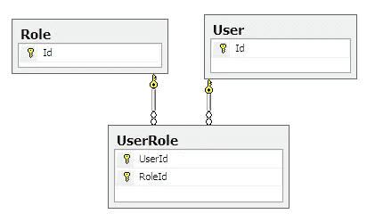
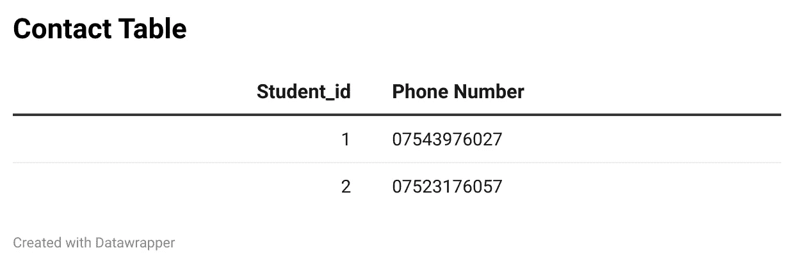
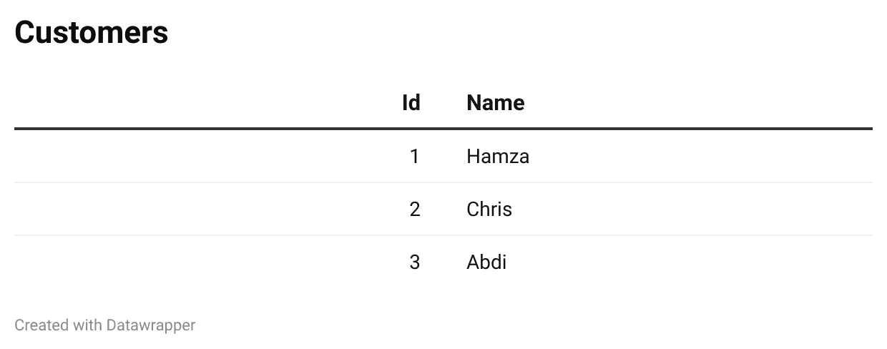
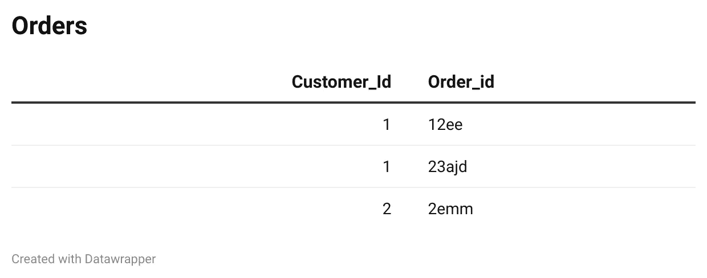
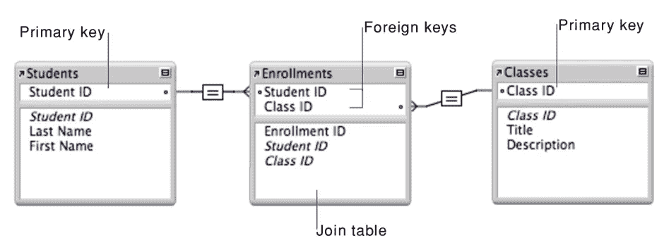
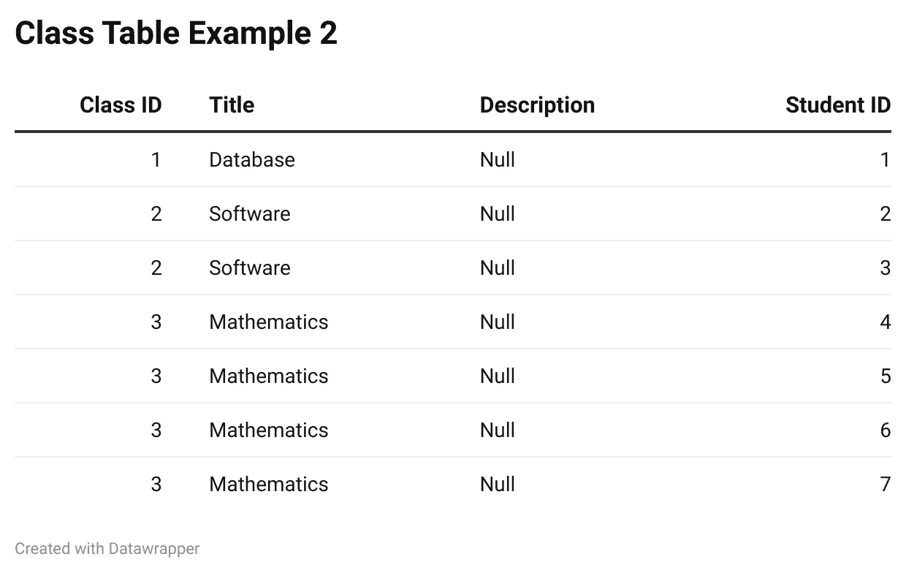
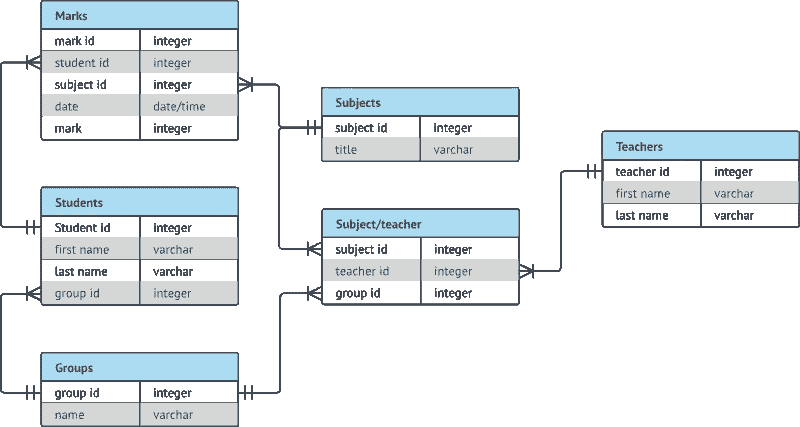
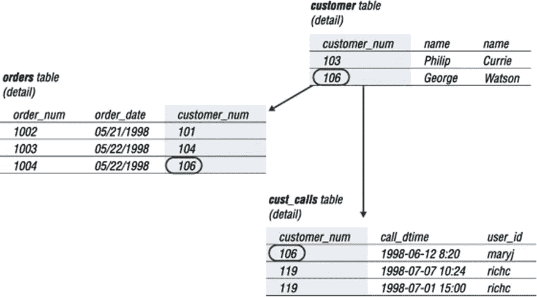

# 正确学习 SQL 第 3 部分:关系

> 原文：<https://blog.devgenius.io/learn-sql-the-right-way-part-3-relationships-c421eb2c6738?source=collection_archive---------14----------------------->

来源:[https://www . codesmithtools . com/lib/images/plinqo/user-role-many-to-many . png](https://www.codesmithtools.com/lib/images/plinqo/user-role-many-to-many.png)

# 学习成果

*   关系的类型
*   ER 图表
*   参照完整性

# 什么是关系？

关系是表之间的关联方式，可以是两个或更多的表。关系基于使用主键和外键。如果你没有听说过主键或外键，我会阅读 [**第二部分**](https://medium.com/dev-genius/learn-sql-the-right-way-part-2-key-types-52848fcca792) 。

# 关系的类型

# 一对一的

对于主表中的每个实体，在外表中有且只有一条记录

学生桌

联系表

学生和联系表有一对一的关系，这是因为每个学生只有一个联系号码。在技术术语中，我们可以看到 1 的 Id 在 contact 表中只出现一次，因此这符合我们上面的定义。

# 一对多

对于主表中的每个实体，在外表中都有一个或多个相关记录。

客户表

订单表

customers 表和 order 表是一对多关系，这是因为一个客户可以下许多订单。记住上面的定义，我们可以看到 ID 1 不止出现一次，ID 2 只出现一次，这符合我们的定义。您可能会认为定义中有一个或多个状态，那么由于 ID 3 不在表中，会发生什么呢？关系并不总是通过查看键来定义的，例如，我们知道在这个表有任何实体之前，一个客户可以下多个订单，这并不意味着一个客户必须下一个订单。所以，我们可以看到这些关系是预先定义好的。

# 多对多

对于主表中的每个实体，外表中都有许多相关记录，对于外表中的每个实体，主表中也有许多相关记录。

学生和班级是多对多的

在本例中，关系是多对多的，学生可以上许多课，而每个课将包含许多学生。如果我们查看注册表，我们可以看到学生 ID 和班级 ID 的许多实例。那么，为什么多对多关系有三个表呢？这是为了使数据更具可读性，如果我们在班级表中有那个班级的学生，我们会遇到一个逻辑噩梦。

我们可以这样做的一个方法是让更多的属性被称为 student1，student2。

包含学生 1、学生 2、学生 3 和学生 4 的班级表

这样做的主要问题是，如果一个班级有四个以上的学生，我们需要在表中增加一个额外的属性。另一种方法是让学生一遍又一遍地重复同样的课程

包含重复实体和学生 ID 列的类别表

这样做的主要问题是，如果我们要更新标题或描述，我们必须对包含我们希望更新的标题和描述的每个实体都这样做。

您会注意到，许多 RDBMS 实际上并不支持多对多关系，所以根据经验，多对多关系被拆分到三个表中，使用一对多关系。随着你练习得越来越多，这将变得相当琐碎。

# ER 图表

# 什么是 ER 图

ER 图是一个实体关系图。这是一种流程图，用于直观地显示“实体”如人、物体或概念如何相互联系。ER 图是用来规划数据库的一个很好的工具。我不会讲太多的细节，因为我可以涵盖很多符号，但我会展示一些简单的例子。我推荐去 https://www.lucidchart.com/pages/er-diagrams 了解更多关于 ER 图的知识。

ER 图布局

# 一对一的例子

员工和团队一对一的关系

这是一个一对一关系的例子；我们可以看到，线以上的数字是一对一的关系。在这个例子中，我们看不到表的属性，这很好，因为在计划的这一点上，您将决定您想要什么样的表。中间的菱形告诉我们关系的性质，因此我们可以看到一个**员工** **管理**一个**团队。这很有用，因为有时这种关系并不总是那么明显。**

# 一对多示例

客户和订单一对多关系

在这个例子中，我们可以看到 N，而不是数字 1，N 基本上意味着很多。我们使用 N 的原因是因为它可以是 1，100 甚至 1000。它遵循与上面的例子相似的布局，我们可以看到一个**客户**可以**下**许多**订单**。我们也可以把它换一下，我们称之为多对一，它的行为完全一样。让我们看一个例子。

员工和部门多对一关系

这向我们表明，许多****员工** **向** **一个** **部门报告。****

# **多对多示例**

****

**学生和班级多对多关系**

**在这个例子中，我们可以看到 M 和 N，原因是简单的代数规则，如果两者都使用字母 N，它们将是相同的数字，但我们知道在多对多中，它可能是 2 到 5 或 2000 到 10000。如果您还记得，我之前提到过，作为经验法则，多对多应该分布在三个表中。请记住，这仍然是计划的早期阶段，我们还没有添加键和属性，所以现在还可以。上例显示**多** **学生**能**报** **多**班。**

# **参照完整性**

**这是一个你可能会遇到的常见错误，简单介绍一下是非常重要的。当您试图从一个表中删除一个主键，而该主键是另一个表中的外键时，就会出现参照完整性。大多数数据库不允许你在没有删除所有外键的情况下删除主键。**

****

**如您所见，删除 customer 将导致引用完整性，因为主键在 orders 表和 cust_calls 表中。因此，为了删除主键，我们必须首先删除所有的外键。**

# **摘要**

*   **一对一-对于主表中的每个实体，在外部表中有且只有一个记录**
*   **一对多-对于主表中的每个实体，在外部表中都有一个或多个相关记录。**
*   **多对多-对于主表中的每个实体，外表中都有许多相关记录，对于外表中的每个实体，主表中也有许多相关记录。**

> **注意:多对多的经验法则分为三个表**

*   **ER 图——一种表示数据库的可视化方式**
*   **参照完整性—在删除主键之前，不要忘记删除所有外键**

**暂时够了。**

**在第四部分，我将讨论一个新的话题，叫做规范化。**

**接下来:以正确的方式学习 SQL 第 4 部分:规范化**

***如果你喜欢这个，点击*👏*在下面，所以其他人会在介质上看到它。欢迎任何反馈或意见。祝你今天开心！玩的开心！***

# **来源**

**[https://www.lucidchart.com/pages/er-diagrams#section_0](https://www.lucidchart.com/pages/er-diagrams#section_0)**

**[https://docs . Microsoft . com/en-us/office/VBA/access/concepts/structured-query-language/define-relationships-between-tables-using-access-SQL](https://docs.microsoft.com/en-us/office/vba/access/concepts/structured-query-language/define-relationships-between-tables-using-access-sql)**