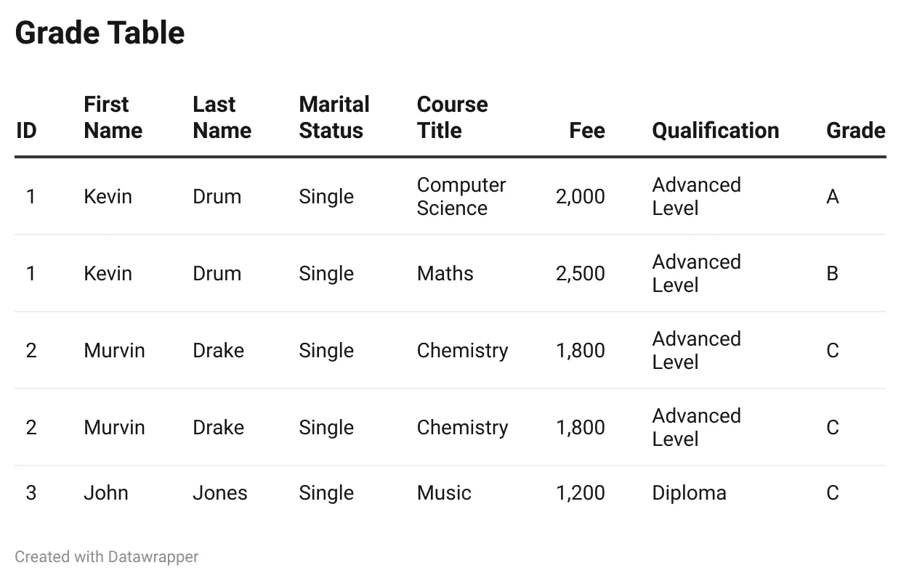

# 正确学习 SQL 第 4 部分:规范化

> 原文：<https://blog.devgenius.io/learn-sql-the-right-way-part-4-normalisation-45bda607f3bd?source=collection_archive---------17----------------------->

# 学习成果

*   第一范式
*   第二范式
*   第三范式

这是一个非常重要的话题，但很多初学者选择忽略它。标准化是一个好的数据库和一个很差的数据库之间的区别。这些规则应该应用于所有数据库。有许多形式，但将只涵盖前三种，因为它们是所有数据库的基础。

# 第一范式

当所有数据都是原子数据时，就实现了第一范式。我们所说的原子是什么意思？这是指每个属性下的所有数据都只有一个值。例如，让我们以这个带有属性“全名”的表为例。

用于跟踪学生成绩的表

在全名下，没有任何数据是原子的，因为它包含名和姓。为了使这个原子化，我们必须把全名分成两个属性，名和姓。最大的问题是为什么这会有所不同？其中一个原因是，如果你要更新姓氏，你也必须更新名字，总的来说，第一范式更容易插入、更新和读取数据。

# 第二范式

为了达到第二范式，我们必须已经达到了第一范式。第二范式是移除**部分依赖项、**并使所有功能仅依赖于主键的过程。让我们看看下表中的例子。

首先，我们需要理解“部分依赖”是什么意思。这是指非主键仅依赖于主键的一部分。

> 注意:组合键是组合了一个或多个属性的主键

第一范式中的等级表

乍一看，ID 似乎是主键，但仔细观察后，您会发现实际的主键是学生的 ID 和课程标题的组合。

正如您所看到的，名字只依赖于 ID，而 ID 是主键的一部分，这会导致部分依赖。

部分依赖的最大问题是试图更新数据。如果我们想更新 Kevin 的姓氏，我们必须更改包含不正确姓氏的每一行。为了解决这个问题，我们需要拆分这些表

学生桌

这个表现在只存储学生数据。所有数据现在都依赖于 ID。

课程表

现在，表中的数据取决于课程标题。虽然我们已经将表格分开，但我们不确定每个学生的成绩。如果你还记得回到 [**part 3**](/learn-sql-the-right-way-part-3-relationships-c421eb2c6738) ，多对多表跨三个表拆分。

等级表

这个表格现在只记录每个学生学习的课程，以及他们取得的成绩。正如您所看到的，这里的主键是 ID 和课程名称，但是分数总是取决于键的两个属性。

# 第三范式

要达到第三范式，就必须达到第一范式和第二范式。他们必须确保没有可传递的函数依赖。那么，什么是传递函数依赖呢？

让我们看另一个例子。

课程表

这在技术上是第二范式。费用和资格取决于课程名称，教师姓名取决于教师 ID，教师 ID 取决于课程名称。我们可以这样写出来，这样更简单。

费用->课程名称

资格->课程名称

教师 ID ->课程名称

教师姓名->教师 ID

如您所见，没有部分依赖关系。那么，什么是传递函数依赖呢？这是非主键间接依赖于主键的情况。

比如教师姓名->教师 Id ->课程名称。老师的名字并不直接取决于课程名称。这导致传递函数依赖。

传递性函数依赖的问题是，如果你选择为某门课程更换老师，你将需要更新老师 Id 和老师姓名，这并不理想。

请记住，您必须更改这两者，因为教师 ID 用于标识教师。为了实现第三范式，我们需要拆分表。

课程表

教师桌

现在我们已经实现了第三范式

# 摘要

正如您所看到的，这三个简单的规则对数据库布局和您的思维方式有很大的影响。它只是显示了规划数据库和花时间有多大的不同，因此以正确的方式学习 SQL 是很重要的。你还应该记住，还有第四个法线等等，但是作为一个经验法则，实现前三个应该是最少的。

*   第一范式—确保表中的所有数据都是原子的
*   第二范式—确保没有部分依赖
*   第三范式—确保没有函数依赖

暂时够了。

在最后一部分，我将介绍一些 SQL 语法，因为我们现在已经知道了所有需要的关键原则。

接下来:正确学习 SQL 第 5 部分:语法

*如果你喜欢这个，点击*👏*在下面，所以其他人会在媒体上看到这个。欢迎任何反馈或意见。祝你愉快*